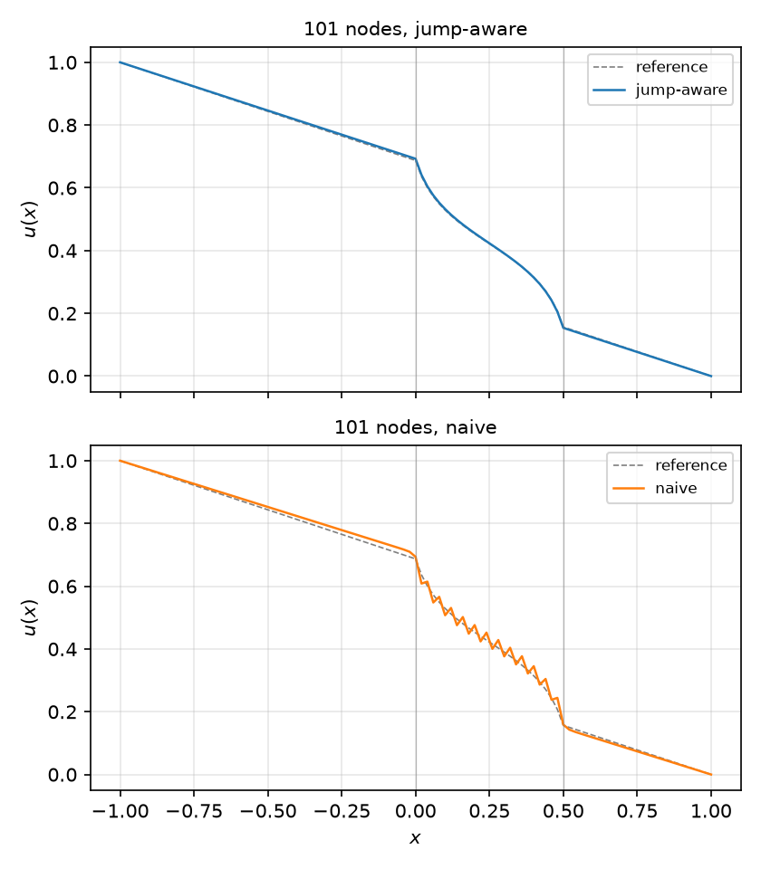
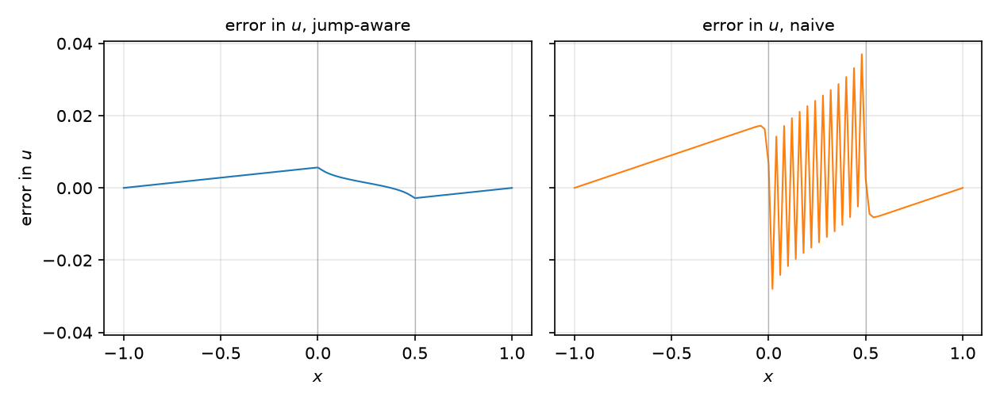
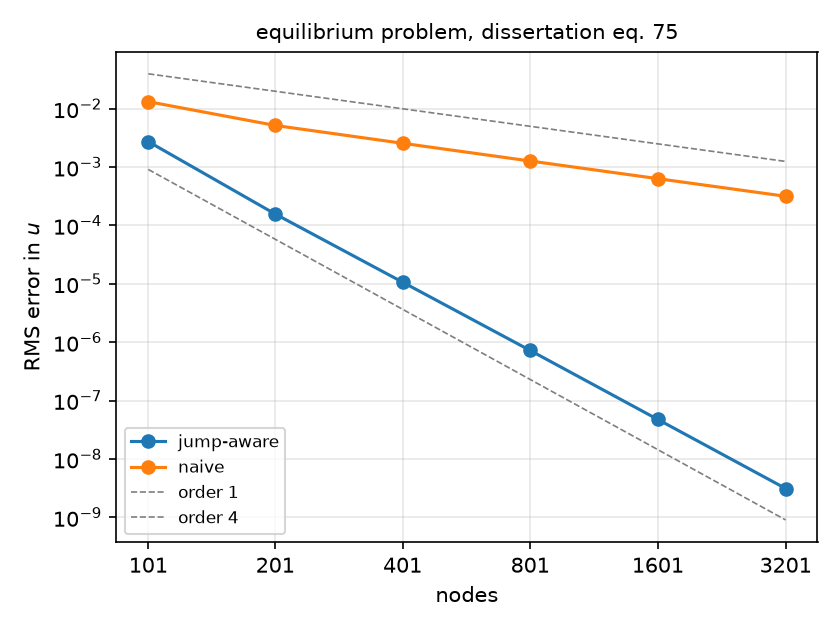
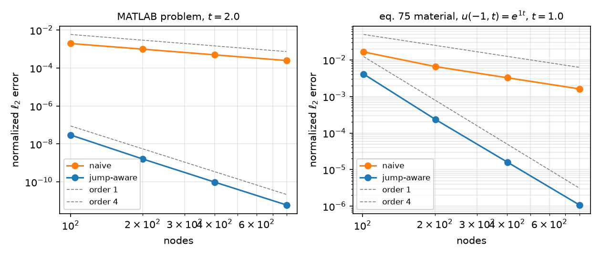
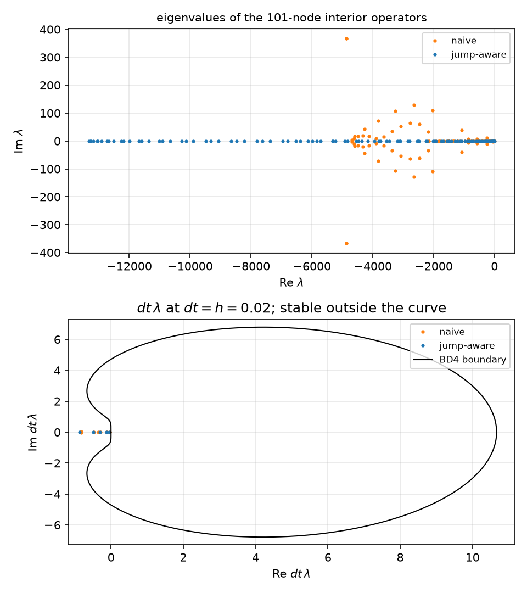
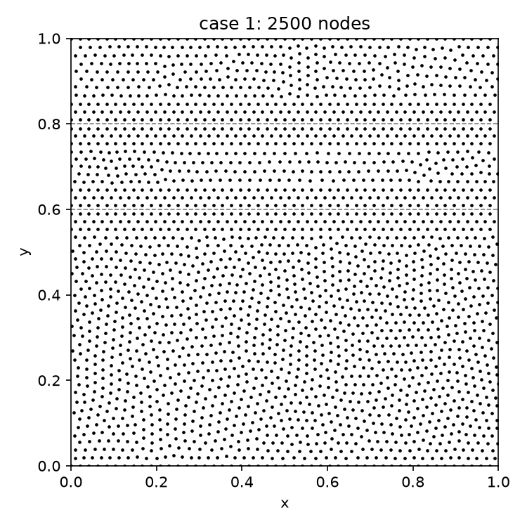
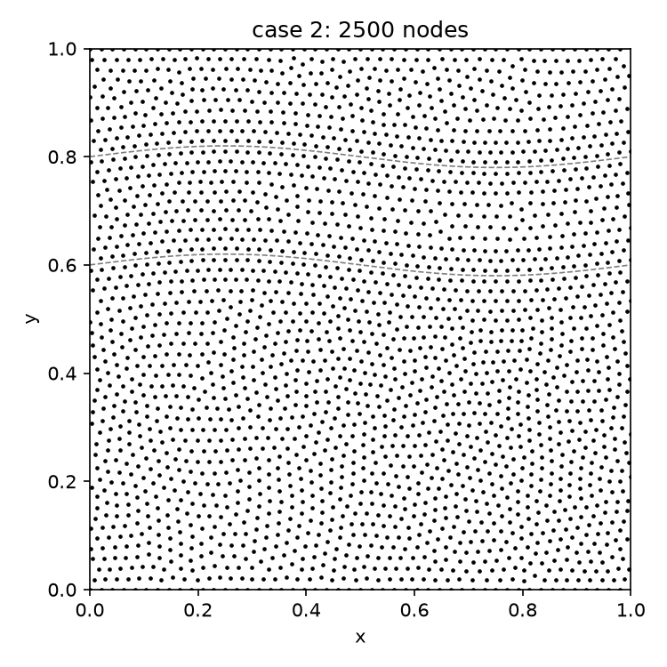
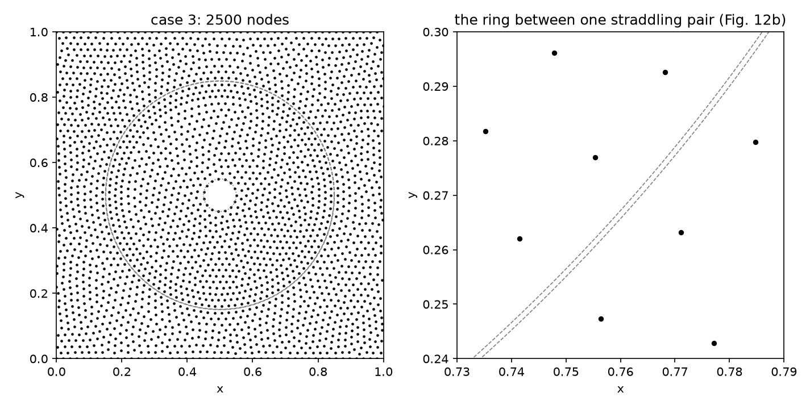

# Port notes

The reproductions of the 2016–2017 figures with the published number next to
ours, every deviation with its reason, and the decisions taken on the way
(plan D11). §1 is the 1-D port (E1, dissertation ch. 4), §2 the 2-D port
(E2, dissertation ch. 5 and Martin & Fornberg 2017), filled in as the epics
land. The figures referenced here are committed under `docs/figures/`; the
drivers regenerate them under `outputs/` (gitignored) in the times given in
§1.7. `docs/paper-index.md` says where each figure sits in the PDFs.

## 1. The 1-D heat port (E1, dissertation ch. 4)

### 1.1 The problem and the port's conventions

Dissertation eq. 75: `(α u_x)_x = 0` on [−1, 1] with `u(−1) = 1`, `u(1) = 0`
and `α = 0.1 + 0.4 sin 2πx` on the closed layer [0, 0.5], 1 elsewhere
(`dissertation_alpha()`, `DISSERTATION_BC`). Both interfaces are jumps: α
goes from 1 to 0.1 at both ends of the layer.

- **Grid.** `n` equispaced nodes with both ends on nodes, `h = 2 / (n − 1)`.
  Both interfaces sit on nodes when `(n − 1) % 4 == 0`, so the dissertation's
  100 / 400 / 1600 (its Fig. 4-7 axis labels) are our 101 / 401 / 1601; its
  own Fig. 4-5 says "101-node solutions". `node_counts([0.0, 0.5], "node",
  ...)` lists the admissible counts.
- **Naive operator.** `Dx A Dx`, eq. 76: FD4 first derivatives, one-sided at
  the ends, with `A = diag α(x_j)`; nine-point rows inside. Never a direct
  `(α u_x)_x` stencil (plan D3; the direct stencil's numbers are in §1.3 for
  the record).
- **Jump-aware operator.** The §4.1 stencils of degree 4: every five-node
  window that straddles an interface gets weights that reproduce the
  operator on the piecewise-polynomial basis translated across the jump by
  the continuity matrices (EABE eq. 24). Three rebuilt rows per interface
  when it sits on a node (rows 49–51 and 74–76 at 101 nodes), four when it
  sits mid-cell.
- **Reference.** The quadrature solution `u = u_L + B ∫ dξ/α`, Gauss–Legendre
  on panels split at the interfaces, exact to rounding, replaces the
  dissertation's 6400-node run of the §4.1 method (plan D4). That run's own
  RMS error is about 2e-10 by the fourth-order rate (our 6401-node value is
  2.2e-10), below anything plotted, so the swap changes nothing visible.
- **Errors.** `u − reference` at the nodes. `rms_error` is `‖e‖₂ / √n`;
  `normalized_l2` is `‖e‖₂ / ‖u‖₂`. Fig. 4-7's ordinate is the former (§1.3).

### 1.2 Fig. 4-5 and 4-6: the 101-node solutions and their errors





`scripts/heat1d_convergence.py`; blue is jump-aware, orange naive, grey the
reference. The jump-aware solution decreases at every node (`α u′ = B < 0`,
so the exact solution does too); the naive one oscillates across the whole
layer, as in Fig. 4-5 (bottom).

| 101 nodes | jump-aware | naive |
| --- | --- | --- |
| max \|e\| | 5.65e-3, at x = 0 | 3.70e-2, at x = 0.48 |
| e at the interfaces | +5.65e-3 at 0, −2.82e-3 at 0.5 | +1.63e-2 just left of 0, then −2.80e-2 at 0.02 |
| sign changes of e | 2 | 25 |
| monotone | yes | no |
| RMS error | 2.73e-3 | 1.32e-2 |
| Fig. 4-6, read off | ∓0.006 at 0, ±0.003 at 0.5 | ∓0.017 left of 0, sawtooth ±0.03 |

Deviations from Fig. 4-6, both without effect on the magnitudes:

- **Sign.** The 2016 panels plot `reference − u`: their §4.1 panel dips at
  x = 0 and rises at 0.5, and their FD4 panel falls to −0.017 left of 0
  before the sawtooth. Ours plot `u − reference`, the mirror image.
- **Reference.** Quadrature in place of the 6400-node run (§1.1).

### 1.3 Fig. 4-7: convergence, 101 to 3201 nodes



Fig. 4-7 has six points per line, at the axis labels 100, 400, 1600 and the
unlabelled 200, 800, 3200; the driver's default sweep is the same six counts.
Read off the figure to about ±10 %, next to ours (RMS, quadrature reference):

| nodes (2016 label) | naive, Fig. 4-7 | naive, ours | rate | jump-aware, Fig. 4-7 | jump-aware, ours | rate |
| --- | --- | --- | --- | --- | --- | --- |
| 101 (100) | 1.3e-2 | 1.32e-2 | — | 2.9e-3 | 2.73e-3 | — |
| 201 (200) | 5.2e-3 | 5.15e-3 | 1.35 | 1.6e-4 | 1.57e-4 | 4.12 |
| 401 (400) | 2.6e-3 | 2.55e-3 | 1.01 | 1.1e-5 | 1.07e-5 | 3.88 |
| 801 (800) | 1.3e-3 | 1.27e-3 | 1.01 | 7.5e-7 | 7.21e-7 | 3.89 |
| 1601 (1600) | 6.3e-4 | 6.32e-4 | 1.00 | 4.9e-8 | 4.74e-8 | 3.93 |
| 3201 (3200) | 3.1e-4 | 3.15e-4 | 1.00 | 2.9e-9 | 3.11e-9 | 3.93 |
| 6401 (`--counts`) | — | 1.58e-4 | 1.00 | — | 2.16e-10 | 3.85 |

Every point lands on the figure within the reading accuracy. The same runs
in the other norm, with the direct stencil for the record:

| nodes | naive, ‖e‖₂/‖u‖₂ | jump-aware, ‖e‖₂/‖u‖₂ | direct `(α u_x)_x` stencil, ‖e‖₂/‖u‖₂ |
| --- | --- | --- | --- |
| 101 | 2.06e-2 | 4.25e-3 | 0.226 |
| 201 | 8.05e-3 | 2.45e-4 | 0.220 |
| 401 | 3.98e-3 | 1.67e-5 | 0.218 |
| 801 | 1.98e-3 | 1.13e-6 | 0.217 |
| 1601 | 9.87e-4 | 7.39e-8 | 0.216 |
| 3201 | 4.92e-4 | 4.86e-9 | 0.215 |

Deviations with their reasons:

- **The ordinate is the RMS error, `‖e‖₂ / √n`.** The figure calls it the
  "normalized ℓ2 error". Against `‖e‖₂ / ‖u‖₂` both of our lines sat the same
  factor 1.56 above the figure at every count; `RMS(u) = ‖u‖₂ / √n = 0.641`
  on this problem at every count, and `1 / 0.641 = 1.56`. With the RMS both
  lines land on the figure at all six points. (`max |u| = 1` here, so
  normalizing by the maximum gives the same numbers; normalizing by `‖u‖₂`
  does not.) The 1-D equilibrium MATLAB is not preserved, but the 2-D
  display script of the same era computes exactly this norm
  (`heatEq2DMatlab/ResultsDisplayHeatError.m`: `sum(error.^2/N).^0.5`).
  Found in E1.2, applied here; `normalized_l2` is kept for the parabolic
  tables (§1.4), which have no 2016 twin.
- **Six points, not five.** The figure's last point is at 3200, one factor of
  two past its last axis label; earlier tickets swept to 1601.
- **Reference.** Quadrature (§1.1). The 2016 reference's own error, 2e-10
  RMS, would have bent the jump-aware line only below 1e-9.
- **The direct stencil.** `α(x_i) Dxx + α′(x_i) Dx` on plain polynomials is
  correct where α is smooth and blind to the jumps; on this problem its
  error stays at 0.22 as the grid refines (on a single jump between
  constants it returns exactly the straight line the text below eq. 76
  describes; `tests/heat1d/test_solve.py`). Not plotted, as in 2016.

### 1.4 The parabolic problems (E1.3; no 1-D time-dependent results in 2016)

`scripts/heat1d_parabolic.py` (3 s). Dissertation ch. 4 reports only the
equilibrium problem, so these two studies have no 2016 twin; they exercise
the time stepping the 2-D chapter uses (BD4 with `dt ∝ h`, §5.4) on the 1-D
operators. Errors are `‖e‖₂ / ‖u‖₂` at the final time, BD4 with `dt = h`
throughout.



**The MATLAB problem** (`heatEq1DMatlab/FD4heat1DAC.m`): `α = 1/9` left of 0
and 1 right of it, zero initial condition, `u(−1, t)` ramped from 0 to 1,
`u(1, t) = 0`. Even node counts put the interface mid-cell (four rebuilt rows).
Reference: piecewise Chebyshev collocation, 32 Gauss–Lobatto nodes per piece
with `u` and `α u_x` matched at the jump, Radau in time at `rtol = 1e-12`.

| nodes | naive | rate | jump-aware | rate |
| --- | --- | --- | --- | --- |
| 100 | 1.97e-3 | — | 2.95e-8 | — |
| 200 | 9.90e-4 | 0.99 | 1.61e-9 | 4.19 |
| 400 | 4.97e-4 | 0.99 | 9.75e-11 | 4.05 |
| 800 | 2.49e-4 | 1.00 | 6.05e-12 | 4.01 |

The jump-aware errors are small because the material is two constants: the
translated basis contains the piecewise-linear equilibrium exactly, so only
the transient is approximated. The 800-node value is near the reference's
own tolerance floor (about 1e-12 relative).

**The eq. 75 material with a growing end**, `u(−1, t) = e^t`, `u(1, t) = 0`,
started from the separable profile `v(x)` that solves `(α v′)′ = v` with
`v(−1) = 1`, `v(1) = 0`, so `u = e^t v(x)` exactly (the 1-D twin of the 2-D
case-1 solution, dissertation eq. 85–86; `chebyshev_equilibrium(shift=1)`).
Errors at `t = 1`, both interfaces on nodes:

| nodes | naive | rate | jump-aware | rate |
| --- | --- | --- | --- | --- |
| 101 | 1.65e-2 | — | 4.10e-3 | — |
| 201 | 6.57e-3 | 1.33 | 2.36e-4 | 4.12 |
| 401 | 3.25e-3 | 1.02 | 1.60e-5 | 3.88 |
| 801 | 1.61e-3 | 1.01 | 1.08e-6 | 3.89 |

The rates repeat the equilibrium ones (§1.3) almost digit for digit, as they
should for a solution that is the equilibrium profile scaled in time.

### 1.5 Operator spectra: the 1-D twin of Fig. 5-6



Eigenvalues of the interior (Dirichlet rows removed) operators on the eq. 75
problem at 101 nodes, and `dt λ` at `dt = h = 0.02` against the BD4 root
locus, as dissertation Fig. 5-6 does for the 4900-node 2-D operator at
`dt = 0.02`:

| 101 nodes | jump-aware | naive |
| --- | --- | --- |
| max Re λ | −2.08 | −2.00 |
| min Re λ · h² | −5.33 | −1.95 |
| complex eigenvalues | 0 | 52 (26 conjugate pairs), max \|Im λ\| = 367 |
| max BD4 root modulus at dt = h | 0.959 | 0.961 |

The jump-aware spectrum is real and negative; its extreme is the FD4 second
derivative's `−16/3 h⁻²` in the `α = 1` material. The naive operator's
complex eigenvalues come from its end rows, not the jumps: with `α = 1`
everywhere `Dx A Dx` already has 16 of them with the same `max |Im λ| = 367`
(the one-sided FD4 rows composed twice), and eq. 75's jumps raise the count
to 52 without raising the imaginary extent. BD4 damps every mode at
`dt = h` (largest root modulus 0.990 for both operators at 401 nodes), which
is why the naive runs of §1.4 are stable and merely first order.

### 1.6 Decisions (E1.1–E1.4)

- **Interface ownership** (E1.1, PR #55). A node that lands on an interface
  takes α from the piece named by `PiecewiseAlpha.at_interface`; eq. 75's
  closed layer owns both of its ends. The grid snaps such nodes onto the
  interface (`Grid1D.snapped`, tolerance `PLACEMENT_TOL`) so `linspace`
  rounding cannot hand them to the wrong piece; α itself never snaps, so the
  quadrature reference samples the piece a point is really in. An earlier
  tolerance inside α's point evaluation corrupted the reference and was
  removed in review.
- **Reference solutions** (E1.1, E1.3). Quadrature for equilibrium;
  piecewise Chebyshev with Radau for the parabolic problems. The latter
  covers a jump (`δ = 0`) by matching `u` and `α u_x` across it, a mild
  extension of plan D4's "fine jump-aware run".
- **Stencil algebra in units of h** (E1.2). Positions `x / h` and Taylor
  coefficients `a_k h^k`, weights scaled back by `h²`, so the small solves
  are as well conditioned at 3201 nodes as at 101. Windows that straddle two
  interfaces translate twice.
- **Time stepping** (E1.3). BD4 with `dt = h` and one sparse LU per
  operator; the three starting values from RK4 sub-cycled at half the
  ∞-norm stability limit (`STARTUP_FRACTION`), because at the limit the
  boundary-adjacent stage error is about 100× the interior's. Dirichlet
  values are imposed at every stage, as the MATLAB does.
- **The MATLAB problem is redefined** (E1.3). Zero start and a C^∞
  `smooth_step` ramp of `u(−1, t)` over [0, 1], errors at `t = 2`. The
  MATLAB's logistic ramp is incompatible with the zero start at the corner
  `(x, t) = (−1, 0)`; a ramp of length 0.5 let BD4's time error dominate at
  100 nodes (3e-6 against 6e-8 spatial). With the unit ramp the jump-aware
  error at `dt = h` is within 2× of its `dt = h/8` value at every count. Two
  MATLAB details are not reproduced: it gives the node at 0 the left value,
  and builds its four interface stencils about a jump half a cell to the
  right of that node, so its interface effectively moves with the grid.
- **Fig. 4-7's ordinate is the RMS error** (E1.4, §1.3); `rms_error` exists
  for it and `normalized_l2` no longer claims to be the figure's ordinate.

### 1.7 Regenerating

```sh
uv run python scripts/heat1d_convergence.py      # 0.2 s: Fig. 4-5, 4-6, 4-7 twins
uv run python scripts/heat1d_convergence.py --counts 101 201 401 801 1601 3201 6401
uv run python scripts/heat1d_parabolic.py        # 3 s: parabolic convergence, spectra
```

Both print the tables above. The copies under `docs/figures/` were taken
from `outputs/` on 2026-09-20. The equilibrium driver refuses node counts
that move either interface off a node (`(n − 1) % 4 == 0` is required), so
its figures always carry the placement of §1.1.

## 2. The 2-D heat port (E2, dissertation ch. 5 and EABE 2017)

Every case is `∇·(α ∇u) = 0` (case 1 also `u_t = ∇·(α ∇u)`) on the
x-periodic unit strip with Dirichlet rows at `y = 0` and `y = 1`, the
material one smooth piece on a closed band between two interfaces and
another outside (`heat2d.domain.Band`). The parameters are the EABE paper's
(`docs/paper-index.md`): case 1 `α = 0.2` on `y ∈ [0.6, 0.8]`; case 2
`0.2 + 0.1 sin 2πx sin 2πy` between `y = 0.6 + 0.02 sin 2πx` and
`0.8 + 0.02 sin 2πx`; case 3 `1/1500 + (1/3000) sin 2πx sin 2πy` on the
ring `0.349 ≤ r ≤ 0.35` about (0.5, 0.5) with the Dirichlet circle
`r = 0.05` cut out. Sides are decided by the exact sign of each curve's
level function (`y − c(x)`, `r − R`), never by a tolerance (§1.6); the
bands own both of their edges, as the papers' brackets and the MATLAB's
`y <= c2 && y >= c1` say.

### 2.1 Node sets (E2.1)

**The MATLAB versions.** `heatEq2DMatlab/ExeprepRBFHeatLaplace1..4.m`
were diffed on 2026-09-20. `Laplace1` (flat interfaces only:
`curvedinterface1/2` return `y′ = 0`) already has the full node layout
below. `Laplace2` ("closed boundary all around") adds Dirichlet rows on
`x = 0` and `x = 1` and makes the repulsion non-periodic; nothing in the
papers uses it. `Laplace3` adds the `curvedFlag` switch (the sine
interfaces) and a `thinFlag` layout that straddles the *midline*
`(c₁ + c₂)/2` of the two interfaces with one set of six rows. `Laplace4`
differs from `Laplace3` only in giving nodes within `3/√N` of a boundary
their own stencil size and degree (`stencilsizeBound`, `polydegreeBound`,
the paper's 30 / degree 4). The row order changes between `Laplace1/2` and
`Laplace3/4`; the rows themselves do not. The operator halves differ by
about 140 lines between `Laplace1/2` and `Laplace4` and by 49 between
`Laplace3` and `Laplace4`; E2.2–E2.4 follow the paper and read the MATLAB
for constants (plan R5). The case-3 code (ring, inner circle, s-sweep) is
not in the folder.

**The layout** (`build_node_set`, the port of `mos2dsqperiodic7` and the
row construction of `Laplace4`), for an `N`-node set:

- `m = round(0.95 √N)` nodes per unit length of row (`numIntNodes`, halves
  rounded up as MATLAB's `round` does), row spacing `h = 1/m`; a row along
  a curve of length `L` holds `round(L m)` nodes, so the ring's rows hold
  105 at `N = 2500` and the cooling circle's 15.
- Six fixed rows straddle every interface in a hexagonal layout: the
  innermost pair at `±0.5 h` along the normal at the foot points
  `s = 0, 1/m, …`, the next pair at `±(0.5 + √3/2) h` staggered by half a
  spacing along the curve, the third at `±(0.5 + √3) h` in line with the
  first. Paired nodes share their foot point, so each pair sits
  orthogonally across the curve (tested to 1e-13).
- A fixed row of `m` nodes at `x = 0, 1/m, …` on `y = 0` and on `y = 1`
  (Dirichlet); case 3 adds one on the circle `r = 0.05`.
- The remaining `N − 14 m` (case 1, 2) or `N − 6·105 − 2 m − 15` (case 3)
  nodes start uniform, kept out of the strip `|level| ≤ (0.5 + √3) h`
  about each straddled curve and out of the cooling disc, and move 100
  times by `0.05 √(2500/N) / k` (iteration `k`) along the unit resultant
  of `1/r⁴` repulsions from their ten nearest nodes, periodic in x. A free
  node that leaves the domain or enters a band is redrawn.
- Case 3 straddles the ring's midline `r = 0.3495`, the `thinFlag` layout:
  both interfaces pass between the innermost pair at every count of EABE
  Fig. 14, which is what Fig. 12b shows (its two nodes across the ring sit
  at `±0.5 h` on a common radius, `h ≈ 0.028`, so that coarse set had
  about 1400 nodes).

Three departures from the MATLAB, none of which the papers' figures can
see: a free node that strays is redrawn in both coordinates instead of
`y` alone (and instead of being wrapped from `y = 1` to `y = 0`); periodic
neighbours come from `cKDTree` with a box size in x and none in y rather
than from tiling; and a circle's rows share their angular positions so
the pairs stay orthogonal (their spacing varies by `±15 %` between the
innermost and outermost rows at `r = 0.35`).

`scripts/heat2d_nodesets.py`, 2500 nodes, seed 0, 2026-09-20 (nearest
neighbour spacing of the free nodes in units of `h`):

```
case      n       h  per row  straddle  Dirichlet   free   NN/h min  median   max    time
   1   2500  0.0208       48       576         96   1828      0.847   0.962  1.13   0.15 s
   2   2500  0.0208       48       576         96   1828      0.842   0.960  1.13   0.15 s
   3   2500  0.0208      105       630        111   1759      0.825   0.959  1.11   0.14 s
```



Dissertation Fig. 5-3 (2500 nodes, case 1) shows the same three dense
rows on each side of `y = 0.6` and `y = 0.8` and the boundary rows.





EABE Fig. 12a/b: the rows follow the ring and the zoom
`[0.73, 0.79] × [0.24, 0.30]` shows the two interfaces between one
straddling pair.

Later tickets add their subsections here; E2.11 (#25) closes the section
with the decisions and the regeneration commands.
