# Port notes

The reproductions of the 2016–2017 figures with the published number next to
ours, every deviation with its reason, and the decisions taken on the way
(plan D11). §1 is the 1-D port (E1, dissertation ch. 4), §2 the 2-D port
(E2, dissertation ch. 5 and Martin & Fornberg 2017), filled in as the epics
land. The figures referenced here are committed under `docs/figures/`; the
drivers regenerate them under `outputs/` (gitignored) in the times given in
§1.7 and §2.10. `docs/paper-index.md` says where each figure sits in the PDFs.

## 1. The 1-D heat port (E1, dissertation ch. 4)

### 1.1 The problem and the port's conventions

Dissertation eq. 75: `(α u_x)_x = 0` on [−1, 1] with `u(−1) = 1`, `u(1) = 0`
and `α = 0.1 + 0.4 sin 2πx` on the closed layer [0, 0.5], 1 elsewhere
(`dissertation_alpha()`, `DISSERTATION_BC`). Both interfaces are jumps: α
goes from 1 to 0.1 at both ends of the layer.

- **Grid.** `n` equispaced nodes with both ends on nodes, `h = 2 / (n − 1)`.
  Both interfaces sit on nodes when `(n − 1) % 4 == 0`, so the dissertation's
  100 / 400 / 1600 (its Fig. 4-7 axis labels) are our 101 / 401 / 1601; its
  own Fig. 4-5 says "101-node solutions". `node_counts([0.0, 0.5], "node",
  ...)` lists the admissible counts.
- **Naive operator.** `Dx A Dx`, eq. 76: FD4 first derivatives, one-sided at
  the ends, with `A = diag α(x_j)`; nine-point rows inside. Never a direct
  `(α u_x)_x` stencil (plan D3; the direct stencil's numbers are in §1.3 for
  the record).
- **Jump-aware operator.** The §4.1 stencils of degree 4: every five-node
  window that straddles an interface gets weights that reproduce the
  operator on the piecewise-polynomial basis translated across the jump by
  the continuity matrices (EABE eq. 24). Three rebuilt rows per interface
  when it sits on a node (rows 49–51 and 74–76 at 101 nodes), four when it
  sits mid-cell.
- **Reference.** The quadrature solution `u = u_L + B ∫ dξ/α`, Gauss–Legendre
  on panels split at the interfaces, exact to rounding, replaces the
  dissertation's 6400-node run of the §4.1 method (plan D4). That run's own
  RMS error is about 2e-10 by the fourth-order rate (our 6401-node value is
  2.2e-10), below anything plotted, so the swap changes nothing visible.
- **Errors.** `u − reference` at the nodes. `rms_error` is `‖e‖₂ / √n`;
  `normalized_l2` is `‖e‖₂ / ‖u‖₂`. Fig. 4-7's ordinate is the former (§1.3).

### 1.2 Fig. 4-5 and 4-6: the 101-node solutions and their errors


`scripts/heat1d_convergence.py`; blue is jump-aware, orange naive, grey the
reference. The jump-aware solution decreases at every node (`α u′ = B < 0`,
so the exact solution does too); the naive one oscillates across the whole
layer, as in Fig. 4-5 (bottom).

| 101 nodes | jump-aware | naive |
| --- | --- | --- |
| max \|e\| | 5.65e-3, at x = 0 | 3.70e-2, at x = 0.48 |
| e at the interfaces | +5.65e-3 at 0, −2.82e-3 at 0.5 | +1.63e-2 just left of 0, then −2.80e-2 at 0.02 |
| sign changes of e | 2 | 25 |
| monotone | yes | no |
| RMS error | 2.73e-3 | 1.32e-2 |
| Fig. 4-6, read off | ∓0.006 at 0, ±0.003 at 0.5 | ∓0.017 left of 0, sawtooth ±0.03 |

Deviations from Fig. 4-6, both without effect on the magnitudes:

- **Sign.** The 2016 panels plot `reference − u`: their §4.1 panel dips at
  x = 0 and rises at 0.5, and their FD4 panel falls to −0.017 left of 0
  before the sawtooth. Ours plot `u − reference`, the mirror image.
- **Reference.** Quadrature in place of the 6400-node run (§1.1).

### 1.3 Fig. 4-7: convergence, 101 to 3201 nodes


Fig. 4-7 has six points per line, at the axis labels 100, 400, 1600 and the
unlabelled 200, 800, 3200; the driver's default sweep is the same six counts.
Read off the figure to about ±10 %, next to ours (RMS, quadrature reference):

| nodes (2016 label) | naive, Fig. 4-7 | naive, ours | rate | jump-aware, Fig. 4-7 | jump-aware, ours | rate |
| --- | --- | --- | --- | --- | --- | --- |
| 101 (100) | 1.3e-2 | 1.32e-2 | — | 2.9e-3 | 2.73e-3 | — |
| 201 (200) | 5.2e-3 | 5.15e-3 | 1.35 | 1.6e-4 | 1.57e-4 | 4.12 |
| 401 (400) | 2.6e-3 | 2.55e-3 | 1.01 | 1.1e-5 | 1.07e-5 | 3.88 |
| 801 (800) | 1.3e-3 | 1.27e-3 | 1.01 | 7.5e-7 | 7.21e-7 | 3.89 |
| 1601 (1600) | 6.3e-4 | 6.32e-4 | 1.00 | 4.9e-8 | 4.74e-8 | 3.93 |
| 3201 (3200) | 3.1e-4 | 3.15e-4 | 1.00 | 2.9e-9 | 3.11e-9 | 3.93 |
| 6401 (`--counts`) | — | 1.58e-4 | 1.00 | — | 2.16e-10 | 3.85 |

Every point lands on the figure within the reading accuracy. The same runs
in the other norm, with the direct stencil for the record:

| nodes | naive, ‖e‖₂/‖u‖₂ | jump-aware, ‖e‖₂/‖u‖₂ | direct `(α u_x)_x` stencil, ‖e‖₂/‖u‖₂ |
| --- | --- | --- | --- |
| 101 | 2.06e-2 | 4.25e-3 | 0.226 |
| 201 | 8.05e-3 | 2.45e-4 | 0.220 |
| 401 | 3.98e-3 | 1.67e-5 | 0.218 |
| 801 | 1.98e-3 | 1.13e-6 | 0.217 |
| 1601 | 9.87e-4 | 7.39e-8 | 0.216 |
| 3201 | 4.92e-4 | 4.86e-9 | 0.215 |

Deviations with their reasons:

- **The ordinate is the RMS error, `‖e‖₂ / √n`.** The figure calls it the
  "normalized ℓ2 error". Against `‖e‖₂ / ‖u‖₂` both of our lines sat the same
  factor 1.56 above the figure at every count; `RMS(u) = ‖u‖₂ / √n = 0.641`
  on this problem at every count, and `1 / 0.641 = 1.56`. With the RMS both
  lines land on the figure at all six points. (`max |u| = 1` here, so
  normalizing by the maximum gives the same numbers; normalizing by `‖u‖₂`
  does not.) The 1-D equilibrium MATLAB is not preserved, but the 2-D
  display script of the same era computes exactly this norm
  (`heatEq2DMatlab/ResultsDisplayHeatError.m`: `sum(error.^2/N).^0.5`).
  Found in E1.2, applied here; `normalized_l2` is kept for the parabolic
  tables (§1.4), which have no 2016 twin.
- **Six points, not five.** The figure's last point is at 3200, one factor of
  two past its last axis label; earlier tickets swept to 1601.
- **Reference.** Quadrature (§1.1). The 2016 reference's own error, 2e-10
  RMS, would have bent the jump-aware line only below 1e-9.
- **The direct stencil.** `α(x_i) Dxx + α′(x_i) Dx` on plain polynomials is
  correct where α is smooth and blind to the jumps; on this problem its
  error stays at 0.22 as the grid refines (on a single jump between
  constants it returns exactly the straight line the text below eq. 76
  describes; `tests/heat1d/test_solve.py`). Not plotted, as in 2016.

### 1.4 The parabolic problems (E1.3; no 1-D time-dependent results in 2016)

`scripts/heat1d_parabolic.py` (3 s). Dissertation ch. 4 reports only the
equilibrium problem, so these two studies have no 2016 twin; they exercise
the time stepping the 2-D chapter uses (BD4 with `dt ∝ h`, §5.4) on the 1-D
operators. Errors are `‖e‖₂ / ‖u‖₂` at the final time, BD4 with `dt = h`
throughout.


**The MATLAB problem** (`heatEq1DMatlab/FD4heat1DAC.m`): `α = 1/9` left of 0
and 1 right of it, zero initial condition, `u(−1, t)` ramped from 0 to 1,
`u(1, t) = 0`. Even node counts put the interface mid-cell (four rebuilt rows).
Reference: piecewise Chebyshev collocation, 32 Gauss–Lobatto nodes per piece
with `u` and `α u_x` matched at the jump, Radau in time at `rtol = 1e-12`.

| nodes | naive | rate | jump-aware | rate |
| --- | --- | --- | --- | --- |
| 100 | 1.97e-3 | — | 2.95e-8 | — |
| 200 | 9.90e-4 | 0.99 | 1.61e-9 | 4.19 |
| 400 | 4.97e-4 | 0.99 | 9.75e-11 | 4.05 |
| 800 | 2.49e-4 | 1.00 | 6.05e-12 | 4.01 |

The jump-aware errors are small because the material is two constants: the
translated basis contains the piecewise-linear equilibrium exactly, so only
the transient is approximated. The 800-node value is near the reference's
own tolerance floor (about 1e-12 relative).

**The eq. 75 material with a growing end**, `u(−1, t) = e^t`, `u(1, t) = 0`,
started from the separable profile `v(x)` that solves `(α v′)′ = v` with
`v(−1) = 1`, `v(1) = 0`, so `u = e^t v(x)` exactly (the 1-D twin of the 2-D
case-1 solution, dissertation eq. 85–86; `chebyshev_equilibrium(shift=1)`).
Errors at `t = 1`, both interfaces on nodes:

| nodes | naive | rate | jump-aware | rate |
| --- | --- | --- | --- | --- |
| 101 | 1.65e-2 | — | 4.10e-3 | — |
| 201 | 6.57e-3 | 1.33 | 2.36e-4 | 4.12 |
| 401 | 3.25e-3 | 1.02 | 1.60e-5 | 3.88 |
| 801 | 1.61e-3 | 1.01 | 1.08e-6 | 3.89 |

The rates repeat the equilibrium ones (§1.3) almost digit for digit, as they
should for a solution that is the equilibrium profile scaled in time.

### 1.5 Operator spectra: the 1-D twin of Fig. 5-6


Eigenvalues of the interior (Dirichlet rows removed) operators on the eq. 75
problem at 101 nodes, and `dt λ` at `dt = h = 0.02` against the BD4 root
locus, as dissertation Fig. 5-6 does for the 4900-node 2-D operator at
`dt = 0.02`:

| 101 nodes | jump-aware | naive |
| --- | --- | --- |
| max Re λ | −2.08 | −2.00 |
| min Re λ · h² | −5.33 | −1.95 |
| complex eigenvalues | 0 | 52 (26 conjugate pairs), max \|Im λ\| = 367 |
| max BD4 root modulus at dt = h | 0.959 | 0.961 |

The jump-aware spectrum is real and negative; its extreme is the FD4 second
derivative's `−16/3 h⁻²` in the `α = 1` material. The naive operator's
complex eigenvalues come from its end rows, not the jumps: with `α = 1`
everywhere `Dx A Dx` already has 16 of them with the same `max |Im λ| = 367`
(the one-sided FD4 rows composed twice), and eq. 75's jumps raise the count
to 52 without raising the imaginary extent. BD4 damps every mode at
`dt = h` (largest root modulus 0.990 for both operators at 401 nodes), which
is why the naive runs of §1.4 are stable and merely first order.

### 1.6 Decisions (E1.1–E1.4)

- **Interface ownership** (E1.1, PR #55). A node that lands on an interface
  takes α from the piece named by `PiecewiseAlpha.at_interface`; eq. 75's
  closed layer owns both of its ends. The grid snaps such nodes onto the
  interface (`Grid1D.snapped`, tolerance `PLACEMENT_TOL`) so `linspace`
  rounding cannot hand them to the wrong piece; α itself never snaps, so the
  quadrature reference samples the piece a point is really in. An earlier
  tolerance inside α's point evaluation corrupted the reference and was
  removed in review.
- **Reference solutions** (E1.1, E1.3). Quadrature for equilibrium;
  piecewise Chebyshev with Radau for the parabolic problems. The latter
  covers a jump (`δ = 0`) by matching `u` and `α u_x` across it, a mild
  extension of plan D4's "fine jump-aware run".
- **Stencil algebra in units of h** (E1.2). Positions `x / h` and Taylor
  coefficients `a_k h^k`, weights scaled back by `h²`, so the small solves
  are as well conditioned at 3201 nodes as at 101. Windows that straddle two
  interfaces translate twice.
- **Time stepping** (E1.3). BD4 with `dt = h` and one sparse LU per
  operator; the three starting values from RK4 sub-cycled at half the
  ∞-norm stability limit (`STARTUP_FRACTION`), because at the limit the
  boundary-adjacent stage error is about 100× the interior's. Dirichlet
  values are imposed at every stage, as the MATLAB does.
- **The MATLAB problem is redefined** (E1.3). Zero start and a C^∞
  `smooth_step` ramp of `u(−1, t)` over [0, 1], errors at `t = 2`. The
  MATLAB's logistic ramp is incompatible with the zero start at the corner
  `(x, t) = (−1, 0)`; a ramp of length 0.5 let BD4's time error dominate at
  100 nodes (3e-6 against 6e-8 spatial). With the unit ramp the jump-aware
  error at `dt = h` is within 2× of its `dt = h/8` value at every count. Two
  MATLAB details are not reproduced: it gives the node at 0 the left value,
  and builds its four interface stencils about a jump half a cell to the
  right of that node, so its interface effectively moves with the grid.
- **Fig. 4-7's ordinate is the RMS error** (E1.4, §1.3); `rms_error` exists
  for it and `normalized_l2` no longer claims to be the figure's ordinate.

### 1.7 Regenerating

```sh
uv run python scripts/heat1d_convergence.py      # 0.2 s: Fig. 4-5, 4-6, 4-7 twins
uv run python scripts/heat1d_convergence.py --counts 101 201 401 801 1601 3201 6401
uv run python scripts/heat1d_parabolic.py        # 3 s: parabolic convergence, spectra
```

Both print the tables above. The copies under `docs/figures/` were taken
from `outputs/` on 2026-09-20. The equilibrium driver refuses node counts
that move either interface off a node (`(n − 1) % 4 == 0` is required), so
its figures always carry the placement of §1.1.

## 2. The 2-D heat port (E2, dissertation ch. 5 and EABE 2017)

Every case is `∇·(α ∇u) = 0` (case 1 also `u_t = ∇·(α ∇u)`) on the
x-periodic unit strip with Dirichlet rows at `y = 0` and `y = 1`, the
material one smooth piece on a closed band between two interfaces and
another outside (`heat2d.domain.Band`). The parameters are the EABE paper's
(`docs/paper-index.md`): case 1 `α = 0.2` on `y ∈ [0.6, 0.8]`; case 2
`0.2 + 0.1 sin 2πx sin 2πy` between `y = 0.6 + 0.02 sin 2πx` and
`0.8 + 0.02 sin 2πx`; case 3 `1/1500 + (1/3000) sin 2πx sin 2πy` on the
ring `0.349 ≤ r ≤ 0.35` about (0.5, 0.5) with the Dirichlet circle
`r = 0.05` cut out. Sides are decided by the exact sign of each curve's
level function (`y − c(x)`, `r − R`), never by a tolerance (§1.6); the
bands own both of their edges, as the papers' brackets and the MATLAB's
`y <= c2 && y >= c1` say.

### 2.1 Node sets (E2.1)

**The MATLAB versions.** `heatEq2DMatlab/ExeprepRBFHeatLaplace1..4.m`
were diffed on 2026-09-20. `Laplace1` (flat interfaces only:
`curvedinterface1/2` return `y′ = 0`) already has the full node layout
below. `Laplace2` ("closed boundary all around") adds Dirichlet rows on
`x = 0` and `x = 1` and makes the repulsion non-periodic; nothing in the
papers uses it. `Laplace3` adds the `curvedFlag` switch (the sine
interfaces) and a `thinFlag` layout that straddles the *midline*
`(c₁ + c₂)/2` of the two interfaces with one set of six rows. `Laplace4`
differs from `Laplace3` only in giving nodes within `3/√N` of a boundary
their own stencil size and degree (`stencilsizeBound`, `polydegreeBound`,
the paper's 30 / degree 4). The row order changes between `Laplace1/2` and
`Laplace3/4`; the rows themselves do not. The operator halves differ by
about 140 lines between `Laplace1/2` and `Laplace4` and by 49 between
`Laplace3` and `Laplace4`; E2.2–E2.4 follow the paper and read the MATLAB
for constants (plan R5). The case-3 code (ring, inner circle, s-sweep) is
not in the folder.

**The layout** (`build_node_set`, the port of `mos2dsqperiodic7` and the
row construction of `Laplace4`), for an `N`-node set:

- `m = round(0.95 √N)` nodes per unit length of row (`numIntNodes`, halves
  rounded up as MATLAB's `round` does), row spacing `h = 1/m`; a row along
  a curve of length `L` holds `round(L m)` nodes, so the ring's rows hold
  105 at `N = 2500` and the cooling circle's 15.
- Six fixed rows straddle every interface in a hexagonal layout: the
  innermost pair at `±0.5 h` along the normal at the foot points
  `s = 0, 1/m, …`, the next pair at `±(0.5 + √3/2) h` staggered by half a
  spacing along the curve, the third at `±(0.5 + √3) h` in line with the
  first. Paired nodes share their foot point, so each pair sits
  orthogonally across the curve (tested to 1e-13).
- A fixed row of `m` nodes at `x = 0, 1/m, …` on `y = 0` and on `y = 1`
  (Dirichlet); case 3 adds one on the circle `r = 0.05`.
- The remaining `N − 14 m` (case 1, 2) or `N − 6·105 − 2 m − 15` (case 3)
  nodes start uniform, kept out of the strip `|level| ≤ (0.5 + √3) h`
  about each straddled curve and out of the cooling disc, and move 100
  times by `0.05 √(2500/N) / k` (iteration `k`) along the unit resultant
  of `1/r⁴` repulsions from their ten nearest nodes, periodic in x. A free
  node that leaves the domain or enters a band is redrawn.
- Case 3 straddles the ring's midline `r = 0.3495`, the `thinFlag` layout:
  both interfaces pass between the innermost pair at every count of EABE
  Fig. 14, which is what Fig. 12b shows (its two nodes across the ring sit
  at `±0.5 h` on a common radius, `h ≈ 0.028`, so that coarse set had
  about 1400 nodes).

Three departures from the MATLAB, none of which the papers' figures can
see: a free node that strays is redrawn in both coordinates instead of
`y` alone (and instead of being wrapped from `y = 1` to `y = 0`); periodic
neighbours come from `cKDTree` with a box size in x and none in y rather
than from tiling; and a circle's rows share their angular positions so
the pairs stay orthogonal (their spacing varies by `±15 %` between the
innermost and outermost rows at `r = 0.35`).

`scripts/heat2d_nodesets.py`, 2500 nodes, seed 0, 2026-09-20 (nearest
neighbour spacing of the free nodes in units of `h`):

```
case      n       h  per row  straddle  Dirichlet   free   NN/h min  median   max    time
   1   2500  0.0208       48       576         96   1828      0.847   0.962  1.13   0.15 s
   2   2500  0.0208       48       576         96   1828      0.842   0.960  1.13   0.15 s
   3   2500  0.0208      105       630        111   1759      0.825   0.959  1.11   0.14 s
```


Dissertation Fig. 5-3 (2500 nodes, case 1) shows the same three dense
rows on each side of `y = 0.6` and `y = 0.8` and the boundary rows.


EABE Fig. 12a/b: the rows follow the ring and the zoom
`[0.73, 0.79] × [0.24, 0.30]` shows the two interfaces between one
straddling pair.

### 2.2 RBF-FD weights, the interface-blind operators and the control (E2.2)

**Weights** (`heat2d.rbf`). The saddle-point system of EABE eq. 2
(dissertation eq. 33): Gaussians ``exp(-(εr)²)`` centred on the stencil's
nodes plus every bivariate monomial through the stencil's degree, with
`ε = 0.4/d` and `d` the distance from the centre to its nearest neighbour
(eq. 31, eq. 45; the MATLAB's `exp(-shp² r² / dmin²)`). Each stencil is
solved in coordinates scaled by its radius `R` (the MATLAB scaled only its
polynomial block, by the distance to the farthest node) and the weights of
an order-`q` operator are divided by `R^q` afterwards. The Gaussian
derivatives are closed forms; the MATLAB's Laguerre recursion was for its
hyperviscosity powers. Solves are batched, 4096 stencils per
`np.linalg.solve`: 0.4 s for the 10,000 42-node stencils of a case-1 set.

On the E2.1 node sets `R/d` runs from 3.2 to 5.4 (median 3.7), the 63 × 63
systems have condition numbers of 4e5 (median) to 2e6 (worst) at 2500 and
at 10,000 nodes alike, and every monomial through degree 5 is reproduced to
3e-16 of `‖w‖₁ ‖p‖∞` (on stencils of uniformly random points the same test
gives 1e-7: the quasi-uniformity is what keeps the systems tame). The
truncation error of the Laplacian stencil on `sin 2πx e^y`, RMS over the
nodes, falls from 2.5e-3 at 2500 nodes to 1.1e-4 at 10,000, order 4.5 per
halving of `h`; `Dx` from 1.1e-5 to 3.6e-7, order 4.9.

**Stencils and operators** (`heat2d.operators`). 42 nodes / degree 5 away
from the boundary, 30 / degree 4 within `3/√N` of a Dirichlet curve (the
MATLAB's `boundVec`, `3 · hApprox` with `hApprox = 1/√N`); the zone holds
about `6.9 √N` nodes (243, 348, 483, 686 at 1250, 2500, 5000, 10,000). The
MATLAB also flagged nodes within `3/√N` of `x = 0` and `x = 1`, a remnant of
its non-periodic variant; the paper's "close to the domain boundary" is
followed and the x-seam is not a boundary here. Every node, the Dirichlet
nodes included, gets a row of `Dx` and `Dy`, because the naive operator
applies them twice; the Dirichlet rows of the assembled operator are then
replaced by the identity. The naive `Dx A Dx + Dy A Dy` (plan D3) reaches
the neighbours of the neighbours: 137–148 nonzeros per row against 40–41
for a direct stencil, which is what makes its solves three to six times
slower below. The direct `α ∇² + ∇α·∇` on the owning piece is kept for the
record, as its 1-D twin was, and supplies E2.3's rows off the interfaces.

**The control and case 1** (`scripts/heat2d_control.py`, seed 0,
2026-09-20; RMS error, order per halving of `h`, solve time):

```
     n       h  zone |   control-lap  order  time | control-naive  order  time |   case1-naive  order  time |  case1-direct  order  time
  1250  0.0294   243 |      2.38e-05      -   0.1s |      9.68e-05      -   0.1s |      4.14e-03      -   0.1s |      3.60e-02      -   0.1s
  2500  0.0208   348 |      4.76e-06   4.67   0.1s |      2.23e-06  10.94   0.4s |      2.78e-03   1.15   0.4s |      3.61e-02  -0.00   0.1s
  5000  0.0149   483 |      7.77e-07   5.44   0.3s |      1.35e-07   8.40   1.5s |      1.36e-03   2.14   1.5s |      3.61e-02  -0.00   0.3s
 10000  0.0105   686 |      1.59e-07   4.55   0.8s |      2.78e-08   4.53   2.9s |      1.28e-03   0.19   2.8s |      3.62e-02  -0.01   0.9s
```

The control is `α ≡ 1`, `u = sin 2πx` on `y = 1`, 0 on `y = 0`, exact
solution `sin 2πx sinh 2πy / sinh 2π` (`heat2d.exact.control_exact`); case
1 is EABE eq. 32–34 with the analytic eq. 34 (`case1_exact`, checked
against MATLAB `laplaceSetup.m`'s 6 × 6 system to 1e-13). At 20,000 nodes
(node set 1.3 s, the four operators 3.2 s, direct solves 1.6 s, naive
solves 9.9 s) the errors are 2.65e-8, 5.81e-9, 4.42e-4 and 3.64e-2.

- *Control, Laplacian stencil*: order 4.7, 5.4, 4.6, 5.2 per halving of
  `h`, a fit of 4.9 over 1250–20,000 nodes. The 30 / degree-4 zone does not
  show in the RMS.
- *Control, `Dx Dx + Dy Dy`*: order 4.5 from 2500 nodes on and an error
  five times smaller than the Laplacian stencil's there. The 1250-node
  point is spoiled by a spurious growing mode of the product operator (see
  the spectrum below); seed 1 gives 8.1e-6 at 1250, seed 2 1.03e-4.
- *Case 1, naive*: first order with the scatter of random node sets. The
  fit of `log error` against `log h` over 1250–10,000 nodes is 1.1 for
  seed 0, 1.6 and 1.3 for seeds 1 and 2:

  ```
      n |  seed 0   seed 1   seed 2
   1250 | 4.14e-3  4.28e-3  3.12e-3
   2500 | 2.78e-3  2.44e-3  3.05e-3
   5000 | 1.36e-3  1.16e-3  1.37e-3
  10000 | 1.28e-3  8.31e-4  8.18e-4
  ```

  This is the 2-D analogue of the "FD4" line of EABE Fig. 10 (whose
  own wobble is visible in the rendered figure); it is the top line the
  E2.3 stencils are measured against.
- *Case 1, direct*: 3.6e-2 at every count, the 2-D twin of the straight
  line of dissertation §4.2. Blind to the jump, as intended.

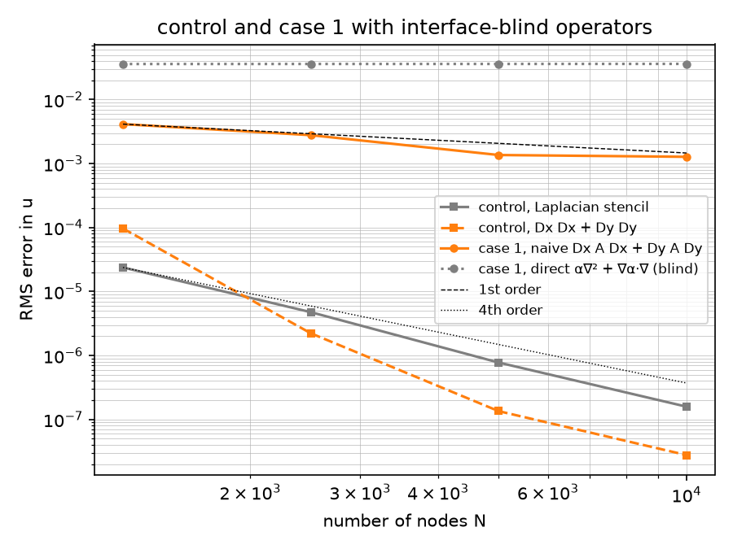

**The control's spectrum** (the α ≡ 1 baseline of epic #4, item 6). The
eigenvalues of the interior operators (Dirichlet rows removed,
`heat1d.march.interior_operator` with the node set's mask), 2000 nodes,
`h = 0.0238`, BD4 at `dt = h`:

```
operator        eigs  complex     max Re   h² min Re  h² max |Im|  BD4 max |ζ|
control-lap     1916     1096     -9.870      -13.47        0.119        0.790
control-naive   1916     1638     -9.870       -6.84        0.747        0.790
```

- Scattered-node RBF-FD is non-normal without any interface: 1096 of the
  1916 Laplacian eigenvalues are complex, 1638 of the product operator's,
  and the complex modes are not confined to the boundary zone (the median
  complex eigenvector carries 10–14 % of its mass in a zone holding 19 % of
  the nodes). The 1-D finding that the complex eigenvalues came entirely
  from the one-sided end rows does not carry over to 2-D; Fig. 5-6's cloud
  is the scattered-node method's own before any interface is added.
- The physical eigenvalues `-π²`, `-4π²`, `-5π²` (the modes `sin πy`,
  `sin 2πy` and `sin 2πx sin πy` of the periodic strip) come out to four
  digits from both operators.
- The product operator's spectrum is half as deep on the real axis
  (`h² min Re` −6.8 against −13.5) and six times as wide in the imaginary
  direction (0.75 against 0.12).
- At 1250 and 1600 nodes the product operator has a real **positive**
  eigenvalue: 169, 207 and 35 at 1250 for seeds 0, 1, 2; 992, 18 and −2.4
  at 1600; the rightmost eigenvalue is `-π²` for every seed from 2000
  nodes on. Its eigenvector sits on a handful of nodes (26–69 % of its mass
  on five) at `y ≈ 0.67`, where the straddling rows of `y = 0.6` meet the
  2h-wide strip of free nodes inside the band, and BD4 at `dt = h`
  amplifies it (root modulus 2.0 at 1250). The Laplacian stencil has no such
  mode at any count tried. From 2000 nodes BD4 at `dt = h` damps every
  mode of both operators (largest root modulus 0.79).

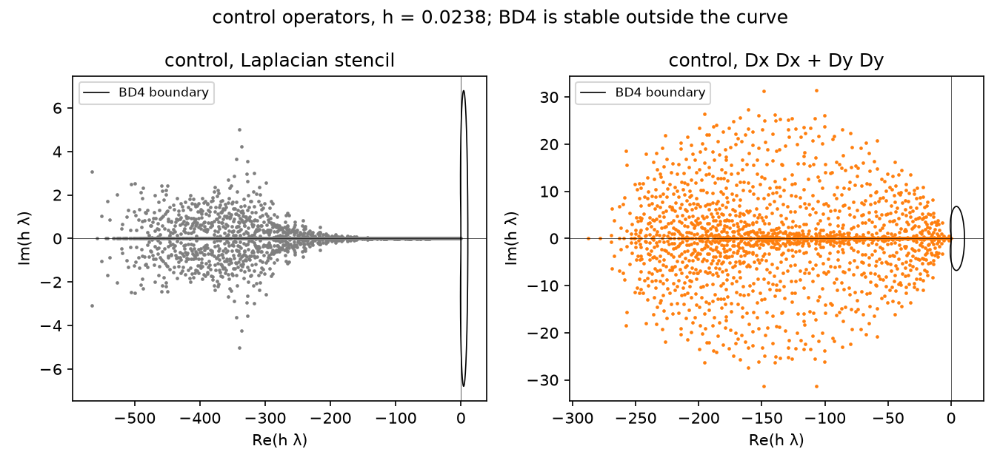

**Decisions (E2.2).**

- Stencil algebra in local coordinates scaled by the stencil radius, `ε`
  from the centre's own nearest neighbour (E1 lesson 5 applied to the
  weights; the continuity matrices of E2.3 will follow).
- The boundary zone is measured from the Dirichlet curves only; the MATLAB's
  x-seam check is not ported.
- `heat1d.march` now takes a Dirichlet mask or index list (`dirichlet=`)
  with `boundary(t)` returning the values in index order; the 1-D default is
  `{0, n−1}` and the 1-D results are unchanged (epic #4, item 7). E2.5 marches
  the 2-D operators through it with `nodes.dirichlet`.
- `heat2d.exact.LayeredExact` gives the eq. 34 / eq. 86 solution for any
  stack of constant-α layers and any growth rate `c_t`, so E2.5's parabolic
  case 1 has its reference already.
- The product operator's coarse-set growing mode is recorded, not fixed:
  it is the baseline's own failure, and the case sweeps of E2.5–E2.7 start
  at 1250 nodes as the papers do, so the first naive point may carry it.

Regenerate with `uv run python scripts/heat2d_control.py` (16 s at the
defaults; `--spectrum-n 1250` shows the growing mode, `--counts 2500 5000
10000 20000` the 20,000-node points, about 40 s).

### 2.3 Interface-aware stencils: the translated basis with curvature (E2.3)

**The construction** (`heat2d.interface`, dissertation §5.3, EABE §2.2.3;
the 2-D twin of §1.2's translated basis). For a stencil whose 30 nodes lie
in more than one region of the band, each interface it reaches gets a
local frame at the point of the curve nearest the stencil centre: `x′`
along the curve, `y′` along the normal into the `level > 0` side, both in
units of the stencil radius (the MATLAB's `normfactor`, epic #4 item 5).
The algebra runs on coefficient vectors of bivariate polynomials through
degree `p = 4` in the graded order of the RBF-FD polynomial block:
`Dx`, `Dy`, multiplication by α's Taylor table rotated and scaled into the
frame, `D = Dx M Dx + Dy M Dy` (exact below degree `p`, as in 1-D), and an
exact change of frame (rotation and shift) between the frames of one
stencil. The continuity matrices equate, along the interface
`y′ = f(x′)`, the first `p + 1 − 2k` coefficients in `x′` of `D^k u` and
the first `p − 2k` of the normal flux `α (∂_y′ − f′ ∂_x′) D^k u`; for
`p = 4` that is 5 + 4 + 3 + 2 + 1 = 15 rows, one per monomial, so `C` is
square. These are the counts of the MATLAB `continuityCreator` (the
papers' "`p − 2k`" and "`p − 2k − 1`" count from one). The translation
`C_to⁻¹ C_from` (eq. 81) carries the standard monomials from the centre's
region across each interface in turn; a stencil that reaches three regions
(case 3's ring; case 1 and 2 at low counts) changes frame at the second
interface and translates again, the 2-D form of §1.2's two-jump chain.
Rows of `[C_from | C_to]` are scaled by their largest entry before the
solve, as the MATLAB does; the product is unchanged. The stencil weights
then solve EABE eq. 2 with the translated basis in place of the monomials
(`rbf.augmented_solve`): Gaussians `ε = 0.4/d` in offsets scaled by the
stencil radius, each node's basis evaluated in its region's frame, and the
right-hand side `α ∇² + ∇α·∇` of the centre's own piece applied to every
function at the centre, the same form the direct operator uses.

**Curvature.** The expansion `f` enters twice, as the papers describe: it
is inserted for `y′` before the coefficients along the interface are read
off (eq. 29 / 82), and it turns the normal derivative into
`∂_y′ − f′(x′) ∂_x′` (eq. 30 / 83). The papers multiply by the expansions
of `cos θ′` and `sin θ′`; the common factor `cos θ′ = (1 + f′²)^{−1/2}`
multiplies both sides of every flux row and is an invertible series, so
the rows span the same space and it is dropped. `f` is found numerically,
as the papers' "standard FD method" does: Fornberg weights at `x′ = 0` on
`2p + 1` samples of the curve at arc spacing `scale/p`; on the circle
`r = 0.35` with `scale = 0.05` this gives `f₂ = −scale/2R` to 6e-12 and
`f₄ = −scale³/8R³` to 1e-10, on the sine graph `f₂ = κ scale/2` to 1e-9
relative, and on a flat line exactly zero. The flat variant (EABE Fig. 10
and 14's "linear interface") sets `f = 0` and keeps everything else, so on
case 1 the two variants build the same matrix to the last bit.

**Stencil groups** (`operators.build_stencils(…, interface=BOUNDARY)`).
A node whose stencil at the largest of the three sizes (the 42-node
interior stencil) reaches more than one region joins the interface group
and gets the 30-node / degree-4 stencil the paper uses "across
interfaces"; no standard stencil ever sees a jump. The MATLAB
instead flagged nodes within `queryFactor/√N = 5/√N` of an interface
(`seqFlag`); the crossing test needs no width and gives a zone of about
the interior stencil radius, `3.8/√N`. Of the group's members, 98 % have
30-node stencils that cross and are translated; the rest, at the group's
outer edge, keep the direct 30 / degree-4 row. Two more differences from
the MATLAB: it always anchored the standard monomials in the band's region
(`pFuncs`'s middle block is the identity) where we anchor on the centre's
side, which changes the basis of the span and not the span; and it handled
a stencil's second interface as the line `y′ = ±cos θ · 0.2` in the first
interface's frame (`intLoc`, `zoneWidth`), where we frame each interface
at its own nearest point.

**Case 1** (`scripts/heat2d_interface.py`, seed 0, 2026-09-21; RMS error,
order per halving of `h`; the naive line is §2.2's; "group" and "cross"
are the interface group and how many of its stencils are translated;
"build" covers the stencil groups, the direct operator and the translated
rows; the last column is EABE Fig. 7 read off the rendered page, six
markers from 1250 to 40,000 nodes):

```
     n       h  group  cross |      naive  order   time |      aware  order  build  solve  flat-diff |  EABE Fig. 7
  1250  0.0294    414    408 |   4.14e-03      -   0.1s |   3.71e-05      -   0.6s   0.0s    0.0e+00 |   1.0e-05
  2500  0.0208    588    576 |   2.78e-03   1.15   0.4s |   1.05e-05   3.66   0.8s   0.0s    0.0e+00 |   2.6e-06
  5000  0.0149    809    792 |   1.36e-03   2.14   1.5s |   2.30e-06   4.56   1.3s   0.1s    0.0e+00 |   5.5e-07
 10000  0.0105   1155   1134 |   1.28e-03   0.19   2.9s |   5.18e-07   4.27   2.1s   0.5s    0.0e+00 |   8.0e-08
```

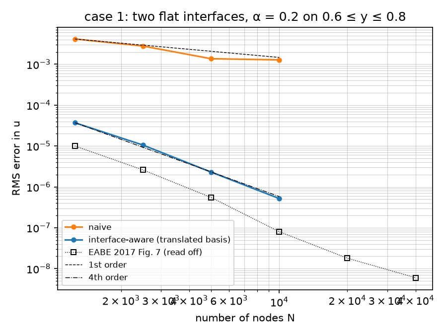

- *Fourth order*, as EABE Fig. 7 and §5.4.1 report: 3.7, 4.6, 4.3 per
  halving of `h`, and 3.95 to the 20,000-node point (1.33e-7 with
  1601 translated stencils, build 3.9 s, solve 1.6 s; `--counts 2500 5000
  10000 20000`, 41 s), a fit of 4.18 over 1250–20,000 nodes, against
  the naive operator's first order. The interface rows cost about 1.5 ms
  each in Python (one closest-point search, two or three 15 × 15
  continuity solves and one 45 × 45 saddle-point solve per stencil),
  1.7 s of the 2.1 s build at 10,000 nodes.
- *Against 2016*: our errors sit 3.7×, 4.0×, 4.2×, 6.5× and 7.4× above the
  Fig. 7 markers at 1250–20,000 nodes, at the same slope. The 2016 runs used
  the warped Gaussians of EABE §2.2.4 in every experiment but one; §2.4
  brings them in and they close the gap to 1.1–1.8× (its table), so the
  numbers here are the "plain RBFs, straddling rows" line of the ablation
  and not the port's best. The interface zone (above) and the node sets
  were not the cause.
- The flat and curvature-included variants agree to the last bit on
  case 1's flat interfaces, as the paper says they must.

**Continuity of the translated basis along curved interfaces** (the
driver's second table, degree 4, `scale = 0.05`): the largest jump over
the 15 basis functions in `u` and in `α n·∇u` at points of the curve at
arc offset `ξ` stencil radii from the foot point, for the sine interface
of case 2 (`0.2 + 0.1 sin 2πx sin 2πy` inside, 1 outside, foot near
`x = 0.13`) and the outer circle of case 3's ring (`α` 1/1500 : 1):

```
interface / variant                         | ξ = 0.5000 u      flux   | ξ = 0.2500 u      flux   | ξ = 0.1250 u      flux   | ξ = 0.0625 u      flux
case-2 sine y = 0.6 + 0.02 sin 2πx curved   |  4.03e-04  1.62e-02      |  1.23e-05  9.88e-04      |  3.81e-07  6.09e-05      |  1.18e-08  3.78e-06
                                             ratios per halving: u  32.7  32.4  32.2   flux  16.4  16.2  16.1
case-2 sine y = 0.6 + 0.02 sin 2πx flat     |  3.22e-03  1.96e-02      |  7.84e-04  6.34e-03      |  1.93e-04  3.10e-03      |  4.80e-05  1.54e-03
                                             ratios per halving: u   4.1   4.1   4.0   flux   3.1   2.0   2.0
case-3 ring r = 0.35 (α 1/1500 : 1) curved  |  1.16e+01  9.74e-01      |  1.81e-01  6.07e-02      |  2.82e-03  3.78e-03      |  6.98e-05  2.36e-04
                                             ratios per halving: u  64.1  64.1  40.3   flux  16.0  16.1  16.0
case-3 ring r = 0.35 (α 1/1500 : 1) flat    |  1.82e+01  9.64e-01      |  4.51e+00  6.03e-02      |  1.12e+00  1.78e-02      |  2.81e-01  8.92e-03
                                             ratios per halving: u   4.0   4.0   4.0   flux  16.0   3.4   2.0
```

- With curvature the jump in `u` falls as `ξ^{p+1}` (ratio 32 per halving)
  and the flux jump as `ξ^p` (16): continuity to `O(h^p)` along the curve,
  the ticket's first check. On the circle the expansion is even, so the
  `u` jump starts one order higher (64) until rounding.
- The flat assumption on a curved interface leaves jumps of `O(ξ²)` in `u`
  and `O(ξ)` in flux, the local linear approximation's own error, which is
  what turns EABE Fig. 10 and 14's "flat" lines first order. The ring's
  large absolute jumps are the 1500 : 1 contrast: the translated
  coefficients are that much larger than the anchored monomials.
- On a matched piecewise quadratic across a circle (`u = r²` inside,
  `(r² − R²)/5 + R²` outside for `α` 1 : 5) the curved stencils reproduce
  `∇·(α∇u) = 4` to 1e-6 at 2500 nodes and the flat ones miss by `O(1)`
  (`tests/heat2d/test_interface.py`); the two-interface chain across the
  ring, with the frame change between the circles, carries a radial
  profile through the 0.001-wide band exactly.

**Conditioning** (the driver's third table; every crossing stencil of a
case-2 node set, continuity matrices in units of the stencil radius;
"outside" is the `α ≡ 1` side, "inside" the band's, the translation from
outside to inside):

```
     n       h  stencils |  C outside (α=1) median    max |  C inside (band) median    max |  translation median     max
  1250  0.0294       408 |                   222.8  222.9 |                    25.1   30.5 |               178.0   645.2
  5000  0.0149       796 |                   222.8  222.8 |                    23.7   29.6 |               172.3   632.2
 20000  0.0075      1607 |                   222.8  222.8 |                    23.4   29.6 |               172.3   629.0
```

No trend with `N`, as the local units intend: the `α ≡ 1` side's matrix is
the same 15 × 15 matrix at every stencil (its 2, 6, 12 differentiation
factors set the 223), the band side's varies only through α's scaled
Taylor terms, and the translation's condition number reflects the 5 : 1
contrast. EABE Fig. 20's `O(s²)` growth with the contrast is E2.9's (#23).

**Decisions (E2.3).**

- One unit per stencil, the stencil radius, for the frames, α's tables and
  the interface expansion, as `rbf_fd_weights` and the MATLAB's
  `normfactor` do; the comment on #17 suggested the nearest-neighbour
  spacing `d`, and either gives the `N`-independence above.
- Frames come from each curve's `normal` alone, because `Circle`'s
  `tangent_angle` runs counter-clockwise while its normal points outward
  (the graphs' tangents and normals form a right-handed pair): `x′` is the
  normal rotated by −90°.
- The interface expansion is numerical (Fornberg on samples) even though
  every curve here is analytic, to follow the papers and to keep the
  `Curve` protocol at first and second derivatives.
- `cos θ′` is dropped from the flux rows (the argument above); the
  papers' cos/sin matrices would give the same translation.
- The interface group is decided by the crossing test on the interior
  stencil, not by a distance; both variants are one `curvature` flag on
  `interface_aware_operator`.
- The naive operator keeps §2.2's stencils (`build_stencils` without
  `interface=`), so its numbers do not move.

Regenerate with `uv run python scripts/heat2d_interface.py` (24 s at the
defaults; `--counts 2500 5000 10000 20000` adds the 20,000-node point).

### 2.4 Warped RBFs across interfaces, and the warp-and-straddle ablation (E2.4)

**The construction** (`heat2d.interface.Warp`, `build_warp`; EABE §2.2.4,
dissertation Fig. 5-1). A crossing stencil's Gaussians are written in the
anchor frame (the frame of the interface next to the centre's region), with
the normal coordinate `η` of every node replaced by a piecewise-linear
`η̃ = s_r η + b_r` by region: the identity on the centre's region, and
across each interface the slope multiplied by `α⁻/α⁺` going up (its
inverse going down), so that `α⁻ s⁻ = α⁺ s⁺` at every interface, with the
intercept keeping `η̃` continuous at the interface's `η` in the frame. A
Gaussian of `(ξ, η̃)` then has a continuous value and a continuous
`α ∂_n` at the interface, since both sides see the same `∂/∂η̃` and
`α ∂_η = α s ∂_η̃` balances; the RBF part of the stencil upholds the
interface conditions to first order where the translated polynomials
uphold them to order `p`. The stencil's Gaussian block
`A_ij = φ(|x̃_i − x̃_j|)` and its right-hand side use the warped offsets
(the centre's region is unstretched, so the derivatives at the centre are
the plain Gaussian's at the warped offset, with `∇α` rotated into the
frame); the polynomial block and its right-hand side are untouched, so the
polynomial exactness of §2.3 carries over (its tests run with the warp on
and off). This is the MATLAB's `ypositionsIntWarp = rhoEval/rhoAcross · y′`
under `RBFwarpFlag`, with its three-region cases (`evalZone` ×
`stencilZoneVec`) and its second interface at `zoneWidth = cos θ (yUI −
yLI)`; ours reads the second interface's foot point in the anchor frame
(exact for parallel lines and concentric circles, the same approximation
for the sine pair) and takes `α` at each interface's foot point on each
side rather than the pieces' constant parts (identical on cases 1 and 3;
on case 2 the ratio uses `0.2 + 0.1 sin 2πx sin 2πy` at the foot point
instead of `0.2`). Tested (`tests/heat2d/test_interface.py`): for a
Gaussian centred below a flat interface with `α` 1 : 1/2 (Fig. 6's
picture) the value and `α ∂_n` agree on the two sides at every point of the
interface to 1e-13 relative by the chain rule, the chain rule agrees with
one-sided differences to 1e-4, and the plain Gaussian misses the flux
balance by the factor 2; the slopes balance `α` at both interfaces of a
three-region flat band from any anchor and at each interface's own
foot-point values along case 2's sine pair; a warp across equal `α` leaves
the weights unchanged to 1e-10.

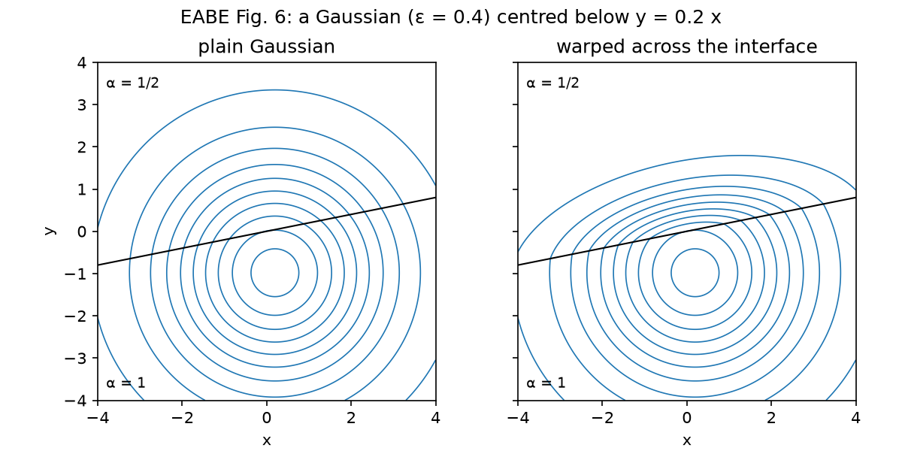

**Case 1: the four combinations of EABE Fig. 11** (`scripts/heat2d_warp.py`,
seed 0, 2026-09-21; RMS error against the analytic solution and order per
halving of `h`; "rows" are the straddling rows of §2.1, "none" the node
sets built with `straddle=()`, where the free nodes spread into the
cleared bands; "group" is the interface group with rows / without; the
last column is EABE Fig. 7; the 20,000-node row is from `--counts 2500
5000 10000 20000`, 50 s):

```
     n       h   group(rows/none) |   warp+rows  order |  plain+rows  order |   warp,none  order |  plain,none  order |  EABE Fig. 7
  1250  0.0294     414 /   468 |    1.60e-05      - |    3.71e-05      - |    5.01e-05      - |    1.23e-04      - |     1.0e-05
  2500  0.0208     588 /   668 |    3.79e-06   4.17 |    1.05e-05   3.66 |    7.02e-06   5.70 |    1.93e-05   5.35 |     2.6e-06
  5000  0.0149     809 /   955 |    6.11e-07   5.48 |    2.30e-06   4.56 |    1.67e-06   4.31 |    3.36e-06   5.25 |     5.5e-07
 10000  0.0105    1155 /  1343 |    1.45e-07   4.11 |    5.18e-07   4.27 |    1.97e-07   6.12 |    1.25e-06   2.83 |     8.0e-08
 20000  0.0075    1614 /  1914 |    1.92e-08   5.88 |    1.33e-07   3.95 |    5.02e-08   3.98 |    1.36e-07   6.44 |     1.8e-08
```

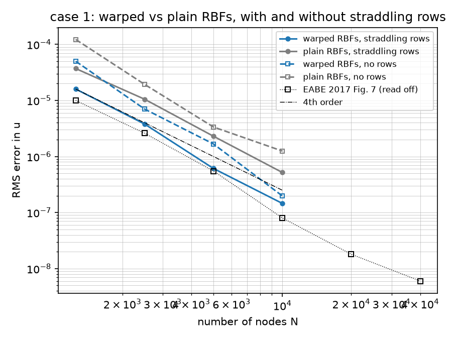

- *The warp closes §2.3's gap to 2016.* With the rows, the warped
  Gaussians cut the error by 2.3×, 2.8×, 3.8×, 3.6× and 6.9× at
  1250–20,000 nodes, from 3.7–7.4× above the Fig. 7 markers to 1.6, 1.5,
  1.1, 1.8 and 1.1×; at 20,000 nodes 1.92e-8 against the marker's 1.8e-8.
  The fit over 1250–20,000 nodes is 4.89 (plain 4.18), so the warp buys
  more at the finer counts. The remaining 10–80 % is within what a
  different node set gives (the `plain,none` orders wobble by that much
  between counts).
- *The rows matter less than the warp on case 1, and the two add up.*
  Without the rows the warped operator sits 2.5–3.0× above Fig. 7 (1.4–3.1×
  above `warp+rows`) at a fit of 5.09; the plain one without rows, Fig. 11's
  "no warp, no straddling" setting, is the worst at 6–16× above Fig. 7 and
  its order wobbles most (2.83 then 6.44), the mark of free nodes landing
  anywhere from 0.001 to 0.01 `h` from the interface. On this flat case all
  four are fourth order; Fig. 11's message that the gap widens on the curved
  case is E2.6's to measure.
- The interface group is 13–19 % larger without the rows (the crossing
  test on the interior stencil finds more crossing stencils among the
  scattered nodes) and the build times are the same.

**Case 2: the four combinations run** (the driver's second table, 1250–5000
nodes; case 2 has no analytic solution, and the errors against the
160,000-node reference, Fig. 11 proper, are E2.6's (#20) with the
resampling that needs; "build" is the warped operator's, the plain one's is
the same to 0.1 s):

```
     n       h  rows  group  cross |  build warp  plain   solve |  max|u| warp    plain |  warp - plain  rms       max
  1250  0.0294   yes    422    408 |       0.6s   0.6s   0.0s |     0.995734  0.995734 |            5.37e-05  2.20e-04
  1250  0.0294    no    469    388 |       0.6s   0.6s   0.0s |     0.995734  0.995734 |            2.71e-04  1.50e-03
  2500  0.0208   yes    594    576 |       0.9s   0.9s   0.0s |     1.000000  1.000000 |            1.25e-05  5.68e-05
  2500  0.0208    no    666    556 |       0.9s   0.8s   0.0s |     1.000000  1.000000 |            8.92e-05  5.25e-04
  5000  0.0149   yes    812    796 |       1.3s   1.3s   0.1s |     0.999725  0.999725 |            3.62e-06  1.41e-05
  5000  0.0149    no    967    791 |       1.4s   1.3s   0.1s |     0.999725  0.999725 |            3.71e-05  1.88e-04
```

- Every combination builds and solves at the three counts, and `max |u|`
  is the Dirichlet data's (the largest `sin 2πx` on the top row), the
  discrete maximum principle to 1e-6.
- On the straddled sets the warp moves the solution by 5.4e-5, 1.25e-5
  and 3.6e-6 RMS: ratios 4.3 and 3.5 per doubling of `N`, i.e. `h⁴`, the
  difference of two fourth-order operators. On the row-free sets it moves it
  5–10× more (2.7e-4, 8.9e-5, 3.7e-5; ratios 3.0 and 2.4), the first sign of
  what Fig. 11 shows on the curved case. The row-free sets put nodes within
  0.001–0.01 `h` of the curves; the exact level signs place them and the
  crossing stencils take them without any guard.
- The row-free interface groups are 11–19 % larger with fewer crossing
  30-node stencils (388 vs 408 at 1250): the 42-node crossing test sweeps in
  more nodes whose own 30 do not reach across.

**Decisions (E2.4).**

- The warp is on by default in `stencil_weights` and
  `interface_aware_operator`, as in every 2016 experiment but Fig. 11's one
  line; `scripts/heat2d_interface.py` passes `warp=False` so §2.3's table
  stays the plain-Gaussian reference and is reproducible.
- With `warp=False` the Gaussian block is the global-frame one of §2.3, bit
  for bit; the offsets are rotated into the anchor frame only when warping.
- `α` for the slope ratios is each side's value at the interface's foot
  point (the tables' constant terms), not the pieces' constant parts as in
  the MATLAB: the flux balance is a condition at the interface.
- Every node is stretched in the anchor frame, with the other interface at
  its foot point's `η` in that frame; the warp is a flat-interface stretch
  even on curved interfaces, as the MATLAB's was, and the curvature stays
  in the polynomials. The RBF part's continuity is first order either way.
- "No straddling" is `dataclasses.replace(domain, straddle=())`; nothing was
  added to `domain.py`.

Regenerate with `uv run python scripts/heat2d_warp.py` (39 s at the
defaults; `--counts 2500 5000 10000 20000` adds the 20,000-node row, 50 s).

### 2.5 Case 1: elliptic and parabolic convergence, and the spectrum against BD4 (E2.5)

**The march** (`heat2d.march`; dissertation §5.4, §5.4.1). The one
time-dependent problem of 2016 is eq. 84–85 with `c_t = 1`:
`u = e^t sin 2πx v(y)`, `v` the eq. 86 profile with `κ = sqrt(4π² + c_t/α)`
per layer (`case1_exact(growth=1.0)`, §2.2), started from the analytic
solution at `t = 0`, the top row `e^t sin 2πx`, the error read at
`t = 0.1`. The integrator is the 1-D module's BD4 (§1.4) behind the node
set's Dirichlet mask (`bd4_march(dirichlet=nodes.dirichlet)`, the §2.2
decision; epic #4, item 7), one LU of `I − (12/25) dt L` per operator;
`heat2d.march.dirichlet_boundary` turns per-curve values `(x, y, t) → u`
into the index-ordered `boundary(t)` it expects. `dt = h` is the row
spacing `1/round(0.95 √N)` (0.0294 at 1250 nodes, 0.0053 at 40,000), so the
march to `t = 0.1` is 3 to 19 steps. BD4's three starting values are the
analytic solution at `t = −3dt, −2dt, −dt` (`bd4_march(history=)`, new;
`heat2d.march.march_parabolic(..., solution=exact)`), so every step is BD4. Without
them the 1-D module's RK4 start-up runs on its ∞-norm bound: the row sums
of the 42-node stencils are about `20/h²`, so the start-up takes about
`30/h` sub-steps per step (1053 at 1250 nodes, 1909 at 4900); it lands
within 2.3 % of the analytic-history error at 2500 nodes (4.08e-6 against
3.99e-6, `tests/heat2d/test_march.py`).

**Convergence** (`scripts/heat2d_case1.py`, seed 0, 2026-09-21; RMS error
against the analytic solution and order per halving of `h`; the elliptic
column is §2.4's `warp+rows` line, bit for bit, since the node sets and the
operator are the same; "steps" are the BD4 steps to `t = 0.1`; the
`dt = h/2` column is the same march at twice the steps and its ratio to the
`dt = h` error; the last two columns are dissertation Fig. 5-5's parabolic
line read off the rendered page and EABE Fig. 7, which is Fig. 5-5's
elliptic line to reading accuracy; the 20,000- and 40,000-node rows are from
`--counts 1250 2500 5000 10000 20000 40000`, 40 s):

```
     n       h  group |   elliptic  order  time |  parabolic  order  steps  time |  dt = h/2   ratio  steps |  Fig. 5-5 par.  Fig. 7 ell.
  1250  0.0294    414 |   1.60e-05      -  0.0s |   1.76e-05      -      3  0.0s |   1.75e-05  0.991      7 |       1.8e-05      1.0e-05
  2500  0.0208    588 |   3.79e-06   4.17  0.0s |   3.99e-06   4.31      5  0.0s |   4.03e-06  1.009     10 |       3.8e-06      2.6e-06
  5000  0.0149    809 |   6.11e-07   5.48  0.2s |   6.01e-07   5.68      7  0.2s |   6.02e-07  1.002     13 |       6.3e-07      5.5e-07
 10000  0.0105   1155 |   1.45e-07   4.11  0.5s |   1.54e-07   3.90     10  0.5s |   1.54e-07  1.001     19 |       1.7e-07      8.0e-08
 20000  0.0075   1614 |   1.92e-08   5.88  1.6s |   2.13e-08   5.75     13  1.6s |   2.13e-08  1.001     27 |       2.7e-08      1.8e-08
 40000  0.0053   2294 |   5.28e-09   3.70  3.6s |   5.51e-09   3.87     19  3.9s |   5.51e-09  1.001     38 |       6.6e-09      6.0e-09
```

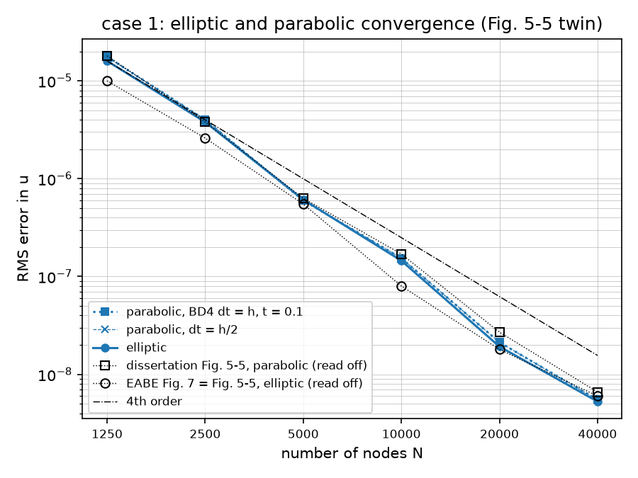

- *The parabolic line lands on 2016's.* 1.0, 1.0, 1.0, 0.9, 0.8 and 0.8×
  Fig. 5-5's parabolic markers at 1250–40,000 nodes; the fit over the six
  counts is 4.77 (Fig. 5-5's read-off fits at 4.63). The elliptic line is
  1.6, 1.5, 1.1, 1.8, 1.1 and 0.9× Fig. 7 (§2.4 had the first five), fit
  4.77 too, and its sixth point, 5.28e-9 at 40,000 nodes, is the first below
  the 2016 marker.
- *Our two lines coincide; 2016's did not.* The parabolic error is 1.10,
  1.05, 0.98, 1.06, 1.11 and 1.04× the elliptic one, where Fig. 5-5 shows
  1.8, 1.5, 1.2, 2.1, 1.5 and 1.1×. Halving `dt` moves our parabolic error
  by 0.9 % at 1250 nodes and by 0.1 % or less from 5000 on, so BD4's error
  over 3–19 steps at `dt = h` is invisible next to the spatial error, and
  the parabolic line is the spatial error of the `κ = sqrt(4π² + c_t/α)`
  profile. Whatever put 2016's parabolic line above its elliptic one (a
  start-up, or an error that a time step of the "average node spacing"
  carried) is not in this port; the 2016 2-D BD4 code is not preserved
  (`docs/paper-index.md`), so this stays an observation.

**The spectrum** (the Fig. 5-6 twin, `--spectrum-n 4900`, the default:
`h = 1/67 = 0.0149`, the 4766 interior eigenvalues of each operator, dense,
21 s for the three; BD4's largest root modulus at `dt = h` and at
Fig. 5-6's `dt = 0.02`):

```
operator        eigs  complex     max Re   h² min Re  h² max |Im|  BD4 max |ζ| @h  @0.02
aware-warp      4766     2828     -7.266      -13.19        0.385           0.897  0.865
aware-plain     4766     3062     -7.266      -13.19        1.489           0.897  0.865
naive           4766     4330     -7.271       -6.80        0.672           0.897  0.865
```

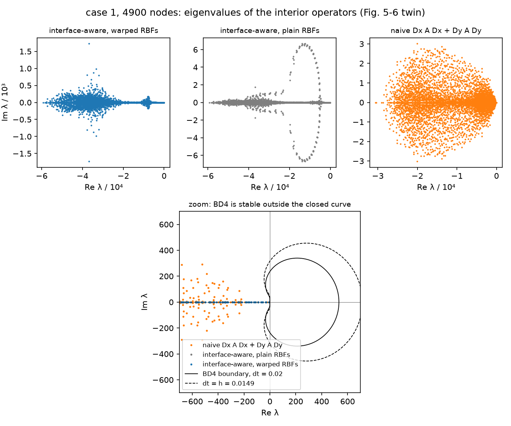

- *Placement against Fig. 5-6.* Its top panel runs from 0 to about
  `−5.4·10⁴` along the real axis with a cluster of complex eigenvalues,
  `|Im|` to about `1.5·10³`, near `−4·10⁴`; the warped operator here reaches
  `−5.9·10⁴` (`h² min Re = −13.19`, the control Laplacian's −13.47 of §2.2)
  with `|Im|` to `1.7·10³` in a cloud between `−2·10⁴` and `−6·10⁴`. In the
  zoom every eigenvalue of the interface-aware operators within ±700 of the
  origin sits on the real axis, as in the 2016 picture; the closed curve of
  BD4 at `dt = 0.02` is the same one (its right end at `Re λ = 533`, the
  root-locus `Σ (1 − e^{−iθ})^j / j` divided by `dt`).
- *The warp narrows the spectrum.* With plain Gaussians the crossing rows
  put a loop of 128 eigenvalues with `|Im| > 2·10³` (to `6.7·10³`,
  `h² max |Im|` 1.489) between `Re λ ≈ −0.5·10⁴` and `−2·10⁴`; the warped
  rows have none above `1.8·10³`, a largest `|Im|` four times smaller
  (0.385), and 234 fewer complex eigenvalues. So the warp moves eigenvalues
  toward the real axis, which is the direction BD4 likes: both operators
  are far outside its curve at `dt = h` (the loop's `Im(dt λ) ≈ ±100` sits
  at `Re(dt λ) ≈ −80` to `−300`), but a time integrator with a bounded
  region (RK4, the MATLAB's) would see the difference.
- *Every mode is damped, and the slowest one is physical.* The largest root
  modulus, 0.897 at `dt = h` and 0.865 at `dt = 0.02`, is the slowest mode's
  own `e^{λ dt}` with `λ = −7.27`, which all three operators give to three
  digits (−7.266, −7.266, −7.271): case 1's slowest mode is slower than the
  control's `−π²` because the band diffuses five times more slowly. No
  spurious mode outranks it at 4900 nodes.
- *The naive operator on case 1.* Half the depth on the real axis
  (`h² min Re` −6.80, as on the control), 4330 of 4766 eigenvalues complex,
  and §2.2's spurious growing mode is here too: a real eigenvalue at +847 at
  900 nodes and +17.7 at 1250, none at 1800, 2000 or 4900. At 1250 nodes BD4
  amplifies it (root moduli 1.69 at `dt = h`, 1.43 at 0.02, the point inside
  both curves in the driver's `--spectrum-n 1250` figure). At 900 nodes
  `dt λ = 29` lies to the right of the closed curve, outside it, and BD4
  damps a mode the operator says should grow: the integrator's unstable
  region is bounded, so a wrong operator can march stably.

**Decisions (E2.5).**

- BD4 in 2-D is `heat1d.march.bd4_march` behind the Dirichlet mask;
  `heat2d.march` adds the per-curve time-dependent values, the analytic
  history and the interior spectrum, and no second integrator.
- Verification runs start BD4 from the analytic history, the standard start
  for a multistep method measured against a known solution; the RK4
  start-up stays the default for marches without one. E4's stiff-edge
  marches (#33 onward) start from a separable reference that is known at
  every time, so they can use the history too.
- `dt = h` means the row spacing `nodes.h`, as in §2.2's spectra, 4 % above
  the `1/√N` the dissertation calls the average spacing; Fig. 5-6's
  `dt = 0.02` is tabulated next to it.
- The elliptic line is solved again rather than quoted from §2.4, so the
  driver is self-contained and the coincidence is a regression check.
- The E1 breadcrumb's Chebyshev cross-check of the separable reference is
  left to E4.2 (#33), whose smooth edges need it; for constant layers the
  exponentials of `LayeredExact` are exact and pinned by the MATLAB 6 × 6
  system and the per-layer ODE test (§2.2).

Regenerate with `uv run python scripts/heat2d_case1.py` (30 s at the
defaults: 8 s for the sweep to 10,000 nodes, 21 s for the three
eigenvalue problems at 4900; `--counts 1250 2500 5000 10000 20000 40000`
adds the two rows, 40 s; `--spectrum-n 1250` shows the naive operator's
growing mode).

### 2.6 Case 2: curved interfaces, FD4 / flat / curved convergence, the ablation, and wall-clock (E2.6)

**The reference** (`heat2d.resample.Reference`, `reference_solution`; plan
D4). Case 2 has no analytic solution, so, as in EABE §3.2, the errors are
measured against a 160,000-node run of the paper's own method: the
interface-aware operator with curvature, warped Gaussians and the straddling
rows on the seed-0 node set, `h = 1/380 = 0.00263`, an interface group of
4599 stencils. Node set 8.0 s, stencils and operator 30.3 s, SuperLU solve
28.6 s, 67 s in all on the M4 Pro (2026-09-21); `max |u| = 1 + 6e-10`, the
discrete maximum principle. It is cached as
`outputs/heat2d_case2_reference_n160000_seed0.npz` (3.6 MB: nodes, kinds,
Dirichlet indices, `u`) with a JSON sidecar (count, seed, iterations,
settings, the three times), and the driver reuses it whenever the count,
seed and iteration count match.

**The resampling** (`heat2d.resample.resample`). The reference and the
coarse solutions live on different node sets, so one has to be read at the
other's nodes, and `u` has a kink along each interface: any polynomial or
RBF interpolant whose stencil crosses a curve is first order there. The
E2.4 breadcrumb on #20 asked for an interface-aware resampling, and this is
it: each point is read through the stencil of the nearest *fine* node, the
fine set's own `build_stencils(..., interface=BOUNDARY)` groups deciding
what that means. Off the interfaces the RBF-FD system of eq. 2 is solved
with the identity in place of the operator and the evaluation point off the
centre (`rbf.rbf_interpolation_weights`, batched like the derivative
weights: the right-hand side is every Gaussian and every monomial at the
point, exact on polynomials through the stencil's degree and the unit
vector when the point is a node). Where the fine stencil crosses an
interface, the same system is solved with the translated basis of §2.3 and
the warped Gaussians of §2.4 (`interface.interpolation_weights`): the
right-hand side is each basis function at the point in the region the
point lies in, so the interpolant upholds the interface conditions to the
basis's order. To share the system, `stencil_weights` was refactored around
`interface.interface_stencil` (one crossing stencil's regions, translated
basis and Gaussian coordinates) with the operator on its right-hand side;
the four operator variants (curved / flat × warped / plain) on a 1250-node
case-2 set are bit-identical before and after, and §2.3–2.5's tests run
unchanged. A stencil built without the interface group reads every point
blind, which is the comparison below.

The driver measures what the resampling itself contributes by reading the
analytic solution of case 1, sampled on a 160,000-node case-1 set (`h`
0.00263, 8.4 s to build with both stencil sets), back at the coarse case-1
node sets and at the FD4 grid points (RMS and largest error against the
analytic values, aware then blind; `--check-n`):

```
     n       h |  nodes aware        max   time |  nodes blind        max |   grid aware        max |   grid blind        max
  1250  0.0294 |     1.78e-12   2.71e-11   0.1s |     1.78e-12   2.71e-11 |     2.92e-12   3.52e-11 |     1.38e-04   1.08e-03
  2500  0.0208 |     1.45e-12   3.00e-11   0.1s |     1.45e-12   3.00e-11 |     2.24e-12   3.53e-11 |     1.16e-04   1.08e-03
  5000  0.0149 |     1.25e-12   2.81e-11   0.2s |     3.09e-07   1.50e-05 |     2.26e-12   4.43e-11 |     9.84e-05   1.08e-03
 10000  0.0105 |     6.27e-13   1.27e-11   0.9s |     1.22e-06   1.98e-05 |     1.71e-12   4.52e-11 |     8.27e-05   1.08e-03
 20000  0.0075 |     1.39e-12   4.85e-11   1.5s |     1.11e-06   1.44e-05 |     1.58e-12   6.36e-11 |     3.41e-06   4.09e-05
 40000  0.0053 |     2.00e-12   5.04e-11   3.3s |     1.17e-05   1.66e-04 |     1.80e-12   5.25e-11 |     5.85e-05   1.08e-03
 80000  0.0037 |     3.14e-12   1.63e-10   5.8s |     9.45e-06   1.55e-04 |     3.20e-12   1.56e-10 |     1.02e-05   1.81e-04
```

- The interface-aware reading is good to 1–3e-12 RMS (largest 1.6e-10) at
  every count and on every grid: four orders below the finest curved point
  of the tables below (7.5e-9), so the resampling is invisible in them.
- The blind reading is 3e-7 to 1.2e-5 RMS at the coarse nodes from 5000
  nodes on and 1e-4 on every grid, i.e. it would have set the floor of every
  curve. At 1250 and 2500 nodes it coincides with the aware one because the
  coarse straddling rows keep every coarse node at least `0.5 h_c ≥ 0.010`
  from the curves, beyond the fine 42-node stencil radius (about `3.8 h_f
  = 0.010`), so no crossing fine stencil is ever asked; grid points land
  anywhere, which is why the grid column is bad at every count.
- Reading 80,000 points costs 5.8 s, of which the per-stencil Python loop
  over the 2300 crossing stencils is most. Points that share a fine centre
  share one system (its second commit, after review): that leaves the
  80,000-node read at 5.8 s, since coarse nodes rarely share a centre, and
  cuts the 640,800-point grid read of the FD4 table below from 48.5 s to
  29.5 s.

**The reference's own error** (the E1 breadcrumb on #20). If the curved
error falls as `N⁻²`, the measured difference at `N` is `m(N) = e(N)(1 −
q)` with `q = (N/160,000)²`, and the reference's own error is
`e(R) = q m/(1 − q)`: from the 80,000-node point (7.52e-9 measured) about
**3e-9**, a third of that point, to one figure only: the order per halving
in the table below swings between 2 and 6, so the exponent is the assumed
one and not a fitted one (fitting the last three points gives 4.4 and
2e-9). At 40,000 nodes `q = 1/16` and the reference moves the plotted value
by 6 %. So the fourth-order line has to bend once `N` passes about 10⁵, the
80,000-node marker sits where the bend begins (its true error is nearer
1e-8 than 7.5e-9), and the 40,000-node one is inside the trustworthy range. EABE Fig. 10 and 11 plotted the same
seven counts against the same 160,000-node reference, so their last marker
carries the same caveat.

**FD4** (`heat2d.fd4`). The Cartesian baseline is the MATLAB `FDheat1.m`'s
form, dissertation eq. 76 in 2-D (plan D3): `m` columns at `x = i/m`
(periodic, so every row of `Dx` is the centred five-point stencil) and
`m + 1` levels at `y = j/m` with the one-sided five-point rows of the 1-D
port within two of `y = 0` and `y = 1`, assembled as `Dx A Dx + Dy A Dy`
with `α` sampled at the grid points, the top and bottom levels the
Dirichlet rows. The grid is a `NodeSet`, so `solve_equilibrium` and
`resample` apply to it unchanged; `m (m + 1)` is chosen nearest the
requested count (1260 for 1250, 640,800 for 640,000). On the control it is
fifth order at these counts and on case 1 first (`tests/heat2d/test_fd4.py`).

**Fig. 10 / Fig. 5-9: FD4, flat and curved** (`scripts/heat2d_case2.py
--reference-n 160000 --counts 1250 … 80000 --fd4-counts 1250 … 640000`,
seed 0, 2026-09-21, 8.5 min in all; RMS error at the coarse nodes against
the resampled reference, order per halving of `h`; "group" is the
interface group with the rows / without; the times are the curved
operator's node set with stencils, operator, solve and the reading of the
reference; the last columns are EABE Fig. 10 and 11 read off the rendered
page, seven markers per line, about ±15 %):

```
     n       h  group(rows/none) |       flat  order |     curved  order  nodes  build  solve  read |       none  order |  Fig. 10 flat   curved  Fig. 11 none
  1250  0.0294     422 /   469 |   6.97e-04      - |   3.06e-05      -   0.1s   0.6s   0.0s   0.1s |   2.90e-04      - |   5.2e-04  2.6e-05   1.7e-04
  2500  0.0208     594 /   666 |   3.89e-04   1.69 |   1.25e-05   2.60   0.1s   0.9s   0.0s   0.1s |   6.79e-05   4.21 |   3.4e-04  8.5e-06   4.8e-05
  5000  0.0149     812 /   967 |   2.62e-04   1.19 |   6.24e-06   2.07   0.4s   1.3s   0.1s   0.2s |   3.93e-05   1.63 |   2.4e-04  1.4e-06   2.0e-05
 10000  0.0105    1148 /  1351 |   1.77e-04   1.12 |   6.99e-07   6.27   0.8s   2.2s   0.5s   0.9s |   4.20e-06   6.41 |   1.5e-04  3.9e-07   8.4e-06
 20000  0.0075    1612 /  1916 |   1.22e-04   1.09 |   1.75e-07   4.03   1.3s   3.8s   1.4s   1.5s |   7.64e-07   4.95 |   1.1e-04  9.3e-08   6.0e-06
 40000  0.0053    2297 /  2693 |   8.18e-05   1.14 |   4.87e-08   3.66   2.2s   7.0s   3.7s   3.3s |   1.59e-07   4.49 |   7.5e-05  3.1e-08   1.9e-07
 80000  0.0037    3245 /  3830 |   5.74e-05   1.02 |   7.52e-09   5.38   4.3s  14.3s  12.1s   5.9s |   2.77e-08   5.03 |   5.0e-05  9.3e-09   3.1e-08
```

```
     n       h |        fd4  order  build  solve  read |  Fig. 10 FD4
  1260  0.0286 |   7.80e-03      -   0.0s   0.0s   0.1s |   6.0e-03 (at 1250)
  2550  0.0200 |   6.41e-03   0.55   0.0s   0.0s   0.2s |   5.5e-03 (at 2500)
  4970  0.0143 |   3.10e-03   2.16   0.0s   0.1s   0.4s |   2.5e-03 (at 5000)
 10100  0.0100 |   2.57e-03   0.52   0.0s   0.2s   0.8s |   2.2e-03 (at 10000)
 20022  0.0071 |   1.17e-03   2.29   0.0s   0.4s   1.5s |   1.2e-03 (at 20000)
 40200  0.0050 |   1.03e-03   0.36   0.0s   1.4s   3.0s |   8.5e-04 (at 40000)
 79806  0.0035 |   4.03e-04   2.73   0.0s   3.5s   6.0s |   3.3e-04 (at 80000)
160400  0.0025 |   4.03e-04  -0.00   0.0s  13.2s  12.1s |
319790  0.0018 |   1.65e-04   2.58   0.1s  35.4s  24.2s |
640800  0.0013 |   1.56e-04   0.16   0.2s 107.6s  48.5s |
```

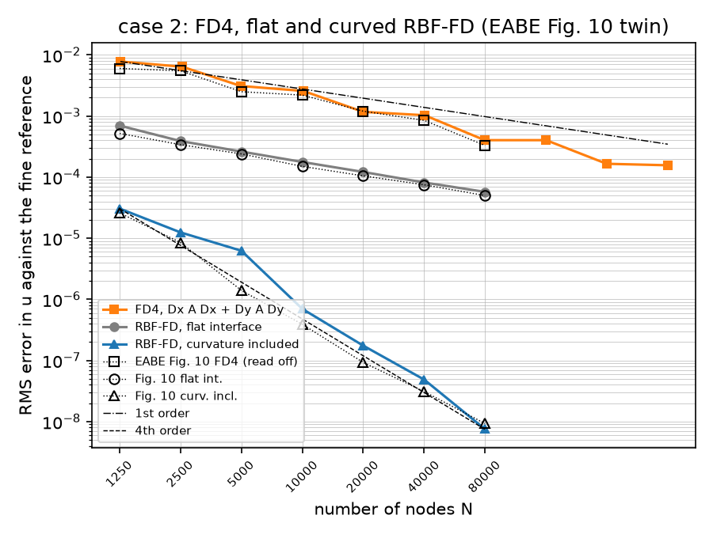

- *The flat line is first order and lands on 2016's.* 1.3, 1.1, 1.1, 1.2,
  1.2, 1.1, 1.1× the Fig. 10 markers at 1250–80,000 nodes, a fit of 1.18
  against the markers' 1.13: the local linear approximation's `O(ξ²)` jump
  in `u` and `O(ξ)` jump in flux along the curve (§2.3's continuity table)
  is what the operator converges to.
- *The curved line is fourth order.* Fit 4.11 over 1250–80,000 nodes
  (the markers fit at 3.91), 1.2, 1.5, 4.5, 1.8, 1.9, 1.6 and 0.8× the
  markers. The 5000-node point is high for the seed-0 node set alone:
  seeds 1 and 2 give 2.94e-6 and 2.84e-6 there (2.0–2.1× the marker),
  1.09e-5 and 1.67e-5 at 2500 and 5.07e-7 and 6.94e-7 at 10,000, the same
  node-set scatter as case 1's `plain,none` line in §2.4. The last point,
  7.52e-9 against the marker's 9.3e-9, is the one the reference's own
  error (above) reaches.
- *FD4 is first order with 2016's own wobble.* 1.3, 1.2, 1.2, 1.2, 1.0,
  1.2, 1.2× the markers at the seven shared counts, a fit of 1.34 over
  1260–640,800 grid points (the markers' 1.37); the order alternates
  between about 0.4 and 2.5 per halving exactly as the rendered figure's
  markers do. The alternation follows the grid: `m = 35, 50, 70, 100, 200,
  400, 800` put a level exactly on `y = 0.6` and `y = 0.8`, the mean lines
  of the interfaces, and `141, 282, 565` do not; the error stalls from each
  of the latter to the next. Doubling the count four more times, to
  640,800 grid points and 108 s, brings FD4 to 1.56e-4, where the curved
  RBF-FD operator is at 3.1e-5 with 1250 nodes in 0.7 s; the figure's
  extrapolation ("about 10¹¹ nodes to reach 10⁻⁸") stands.

**Fig. 11 / Fig. 5-10: the warp-and-straddle ablation.** The `none`
column above is the curved operator with plain Gaussians on node sets built
without the rows, the paper's "no warp; no straddling"; the `curved` column
is its "with warp and straddling".

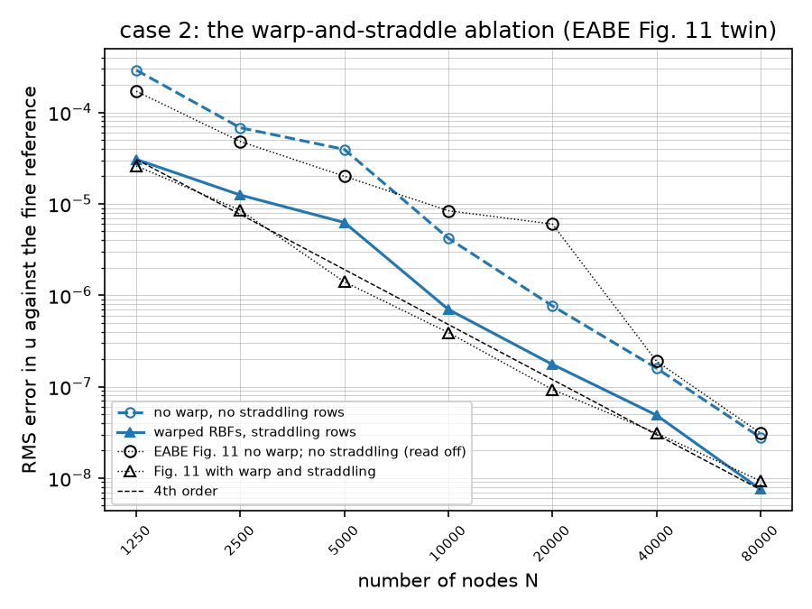

- Both lines are fourth order (fits 4.55 and 4.11); the warp and the rows
  together buy 9.5, 5.4, 6.3, 6.0, 4.4, 3.3 and 3.7× at 1250–80,000
  nodes. The 2016 figure's gaps are 6.5, 5.6, 14, 21, 65, 6.1 and 3.3×: the
  same at the ends, and its 10,000- and 20,000-node "no warp" markers
  (8.4e-6 and 6.0e-6, the second 0.1× ours) sit an order of magnitude above
  their own line's trend, a bump this port does not have and whose cause the
  unpreserved 2016 code cannot tell. The E2.4 breadcrumb's two candidates
  for a narrower gap (the flat stretch of the warp on a curved interface,
  the interface zone) were not needed.
- On this curved case the gap is 3–10× where on flat case 1 (§2.4) it was
  2.7–8×: the message of Fig. 11, that the two together matter, holds and
  is not much stronger with curvature.

**Fig. 5-11: error against wall-clock** (node set with stencils, operator
and solve on this machine, an Apple M4 Pro, Python 3.13, NumPy and SciPy's
SuperLU; the resampling is not counted, being the measurement's cost and
not the method's):

```
  RBF-FD curved:      n   nodes  build  solve  total |  error
                   1250    0.1    0.6    0.0    0.7 |  3.06e-05
                   2500    0.1    0.9    0.0    1.1 |  1.25e-05
                   5000    0.4    1.3    0.1    1.8 |  6.24e-06
                  10000    0.8    2.2    0.5    3.5 |  6.99e-07
                  20000    1.3    3.8    1.4    6.4 |  1.75e-07
                  40000    2.2    7.0    3.7   13.0 |  4.87e-08
                  80000    4.3   14.3   12.1   30.6 |  7.52e-09
  FD4:                n   grid+op  solve  total |  error
                   1260     0.00    0.0    0.0 |  7.80e-03
                  10100     0.00    0.2    0.2 |  2.57e-03
                  79806     0.02    3.5    3.5 |  4.03e-04
                 160400     0.04   13.2   13.3 |  4.03e-04
                 319790     0.08   35.4   35.5 |  1.65e-04
                 640800     0.17  107.6  107.8 |  1.56e-04
```

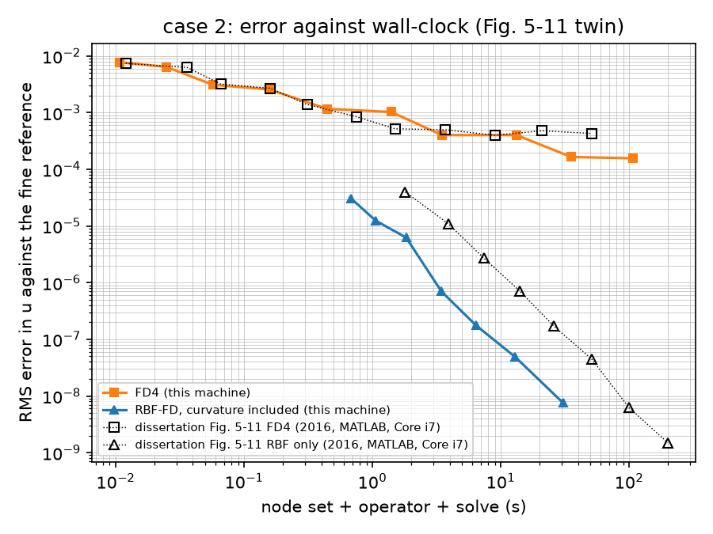

- The FD4 curve lies on the 2016 one to reading accuracy over the four
  decades they share (0.01–50 s): the grid and operator cost nothing and
  both are one sparse direct factorisation, MATLAB's backslash on a 2.7 GHz
  Core i7 in 2016 and SuperLU here. The 2016 line flattens at 4–5e-4 from
  about 1 s; ours keeps falling slowly to 1.6e-4 at 108 s.
- The RBF-FD curve sits 2.5–3× to the left of the 2016 "RBF only" one at
  the same error (0.7 s against 1.8 s at 1250 nodes, 31 s against about
  100 s at 80,000): a decade of hardware against a Python operator build
  whose crossing stencils are a per-stencil loop (1.5 ms each, §2.3). The
  build is half the total at every count and the solve grows fastest
  (0.0 → 12.1 s, `N^1.3` from 20,000 on).
- The 2016 "RBF only" line has an eighth point at 1.5e-9 and 200 s that a
  160,000-node reference cannot produce for a 160,000-node solve; it is
  quoted as read and not explained. The "RBF/FD4 hybrid" line, a node set
  that turns Cartesian away from the interface, is not ported.

**Decisions (E2.6).**

- FD4 in 2-D is a Cartesian grid (`heat2d/fd4.py`, a module the plan's list
  did not name; `treatments` is E4's), not the scattered-node
  `Dx A Dx + Dy A Dy` of §2.2, which stays the naive RBF-FD baseline: the
  performance plot needs FD4's cost, and the MATLAB comparison was a grid.
  Its node count is `m (m + 1)` and the points are plotted at that count.
- The reference is read at the coarse nodes (fine → coarse), never the
  coarse solution at the fine nodes: the fine stencils interpolate to
  `O(h_f^{p+1})`, the coarse ones would add an error of the solution's own
  order. The fine set's stencil groups decide aware / blind; the RMS runs
  over all coarse nodes, the Dirichlet rows included, as in every table so
  far.
- `interface.stencil_weights` is now a thin wrapper over
  `interface_stencil`; `interpolation_weights` shares the system. The
  refactor was checked bit for bit on the four variants.
- The reference cache is `npz` plus JSON, without the row tuples (a loaded
  `NodeSet` serves `build_stencils` and `resample`, not another solve), and
  is reused only when count, seed and iterations match.
- The 2016 markers of Fig. 10, 11 and 5-11 are read off the rendered pages
  (±15 %) and kept in the driver as `FIG10`, `FIG11_NONE`, `FIG511`.
- The driver's default is a 40,000-node reference and counts to 10,000, so
  it runs in about a minute; the tables and figures above are the
  160,000-node run.

Regenerate with `uv run python scripts/heat2d_case2.py` (53 s at the
defaults; the reference is cached under `outputs/` on the first run) and
`uv run python scripts/heat2d_case2.py --reference-n 160000 --counts 1250
2500 5000 10000 20000 40000 80000 --fd4-counts 1250 2500 5000 10000 20000
40000 80000 160000 320000 640000` for the tables above (8.5 min with the
reference cached, 1.1 min more without; the resampling check is 54 s of
it).

### 2.7 Case 3: the 0.001-wide insulating ring around a cooling unit, FD4 / flat / curved (E2.7)

**The problem** (EABE eq. 37–39, dissertation eq. 89–91; `heat2d.domain.case3`,
§2.1). `α = 1/1500 + (1/3000) sin 2πx sin 2πy` on the closed ring
`0.349 ≤ r ≤ 0.35` about `(0.5, 0.5)`, 1 elsewhere; `u = sin 6πx` on both
`y = 0` and `y = 1` and `u = 0` on the circle `r = 0.05`, whose inside is cut
out. The boundary data were re-read from both rendered pages (E0.2's reading
stands: the same sign on both rows). They bound `u` by 1 and change sign
three times along each row, and `sin 6πx` decays as `e^{−6π d}` away from a
row, so the solution is a pair of boundary layers with `|u| ≈ 0.06 sin 6πx`
at the ring's outer edge and `|u| < 5e-3` inside the ring, whose cooled
interior the insulator all but decouples; `RMS |u| = 0.17`. The mesh plot of
Fig. 13 / Fig. 5-13 shows a plateau at 1 with wiggles of 0.2 at the rows and
a well to 0 inside the ring, which no solution of eq. 39 can be; it was
drawn from other boundary data, and the twin below is of eq. 39's
(`docs/paper-index.md`).

**Ownership** (the E1 note on #21). The ring is thinner than the node spacing
at every count (`h ≥ 0.0026` at 160,000 nodes), so which nodes are "inside
it" is decided by the rows, not by chance: the straddling rows sit at
`±0.5 h_row` off the midline `r = 0.3495` (§2.1's `thinFlag` layout), the
free nodes keep `(0.5 + √3) h_row` clear of it, and no node of any set lies
inside the ring; the driver checks both on every node set and on the
reference (`ownership`) before an error is read. The operator's `α` and the
reference's therefore agree on every node's piece by construction, both
being `Band.piece_index` on the same coordinates; the stencils that cross
the midline reach regions 0 and 2 and are translated across both circles
(§2.3's chain, `interface_stencil` with `lowest = 0, highest = 2`), the
ring's own region holding basis functions but no nodes.

**The 1500 : 1 chain, checked** (the E2.4 note on #21, item 3). The matched
radial quadratic of `tests/heat2d/test_interface.py` at the ring's own
contrast (`u = r²` inside, `r²/α + b₁` on the ring, `r² + b₂` outside,
`∇·(α∇u) = 4` everywhere, `u` climbing by 1.05 across the 0.001) is
reproduced by `stencil_weights` on the real crossing stencils of a
2500-node case-3 set to a relative residual of 2e-12 with curvature on,
warp on or off, and is off by 4e-6 relative (5e-2 absolute) with the flat
frames: the chain is exact at 1500 : 1, and curvature is what makes it so
(`test_stencil_weights_are_exact_through_the_ring_at_its_1500_contrast`).

**FD4 with the cooling disc** (`heat2d.fd4.cartesian_grid`; the E2.6 note
on #20, item 2). The grid is §2.6's, and every grid point on or inside a
Dirichlet hole becomes a Dirichlet node of that curve, the staircase a
Cartesian code makes of the disc: the boundary is placed to within one
spacing, the five-point stencils outside read `u = 0` from the points
inside, and `fd4_operator` is unchanged. With the disc's points held at the
exact values of a harmonic solution instead there is no geometric error and
FD4 is fifth order on the control material (`tests/heat2d/test_fd4.py`), so
the plumbing is right and the staircase's first-order error is the only new
one. Errors are read over the grid points outside the disc. The ring FD4
sees through `α` sampled at the grid points alone: none fall in it at
1260 or 4970 grid points, 24 to 32 at 2550 to 20,022, and it is not until
`h < 0.001`, `m > 1000`, that a grid samples it at every angle.

**The resampling check** (the E2.6 note on #20, item 1). §2.6 read case
1's analytic solution, a smooth periodic function across flat interfaces
at 1 : 5, back at 1–3e-12; the question was whether the ring's 1500 : 1
chain leaves the read there. Two profiles were tried. The 1-D radial
equilibrium `a_k + (c/α_k) ln r` through the ring (`u = 0` on the cooling
circle, 1 at `r = 0.5`) is the physics, but its fifth derivative at
`r = 0.05` is 1e7 and the read measured that (3e-4 largest, at the cooling
circle), not the ring. The check uses instead the harmonic mode
`u = R(r) cos 2θ` (`heat2d.exact.RingMode`, `ring_exact`): `R = r²` scaled
inside (the polynomial `Re (x + iy)²`, regular at the centre),
`a r² + b r⁻²` on the ring and outside, `R` and `α R'` continuous at both
circles, so it solves `∇·(α∇u) = 0` with the ring at its constant part
`α = 1/1500` and satisfies every condition the translated basis enforces;
`R` climbs from 0.078 to 0.74 across the ring. It is not periodic in x, so
the check reads only the points within 0.1 of the midline (the annulus
`0.25 < r < 0.45`, inside which no fine stencil wraps the seam), the fine
set being case 3's own layout with the constant ring.

**The reference** (`reference_solution`, plan D4): 160,000 nodes, seed 0,
`h = 0.00263`, an interface group of 5038 three-region stencils; node set
8.2 s, stencils and operator 38.6 s (case 2's 30.3 s: each crossing stencil
now carries two interfaces), SuperLU solve 28.8 s, 76 s in all (M4 Pro,
2026-09-21); `max |u| = 1 + 1e-9`. Cached as
`outputs/heat2d_case3_reference_n160000_seed0.npz` (3.6 MB) with its JSON
sidecar, reused when count, seed and iterations match. Its own error, by
§2.6's `N⁻²` argument from the 80,000-node curved point (3.02e-7 measured):
about **1e-7**, to one figure, so the last marker below sits at the
reference's floor (its true error is nearer 4e-7 than 3e-7) and the
40,000-node one moves by 6 %.

**Fig. 14 / Fig. 5-14: FD4, flat and curved** (`scripts/heat2d_case3.py
--reference-n 160000 --counts 1250 … 80000 --fd4-counts 1250 … 1280000`,
seed 0, 2026-09-21, 29 min in all; RMS error at the coarse nodes against
the resampled reference, order per halving of `h`; `group` is the
interface group and `in ring` the nodes inside `0.349 ≤ r ≤ 0.35`; the times
are the curved operator's node set with stencils, operator, solve and the
reading of the reference; `plain` is the curvature-included operator with
plain Gaussians; the last columns are Fig. 5-14 read off the rendered page,
seven markers per RBF-FD line, about ±15 %):

```
     n       h  group  in ring |       flat  order |     curved  order  nodes  build  solve  read |      plain  order |  Fig. 14 flat   curved
  1250  0.0294    512        0 |   1.65e-03      - |   1.58e-03      -   0.1s   1.2s   0.0s   0.1s |   1.96e-03      - |   1.4e-03  1.4e-03
  2500  0.0208    694        0 |   4.47e-04   3.79 |   4.69e-04   3.52   0.1s   1.7s   0.0s   0.1s |   9.51e-04   2.09 |   8.0e-04  5.9e-04
  5000  0.0149    949        0 |   1.51e-04   3.25 |   1.13e-04   4.27   0.4s   2.5s   0.1s   0.2s |   9.90e-05   6.78 |   3.9e-04  2.5e-04
 10000  0.0105   1314        0 |   6.31e-05   2.51 |   3.02e-05   3.78   0.8s   3.9s   0.4s   1.5s |   2.06e-05   4.50 |   2.2e-04  7.7e-05
 20000  0.0075   1813        0 |   3.22e-05   1.95 |   6.03e-06   4.68   1.3s   6.2s   1.2s   2.3s |   4.58e-06   4.37 |   1.9e-04  2.0e-05
 40000  0.0053   2534        0 |   2.90e-05   0.30 |   1.39e-06   4.20   2.2s  10.6s   3.4s   5.4s |   9.04e-07   4.65 |   2.0e-04  3.7e-06
 80000  0.0037   3567        0 |   7.72e-05  -2.81 |   3.02e-07   4.39   4.3s  19.4s   9.5s   9.0s |   2.91e-07   3.26 |   2.5e-04  8.1e-07
```

```
      n       h   disc  ring |        fd4  order  build  solve   read |    no ring      blind |  Fig. 14 FD4
   1260  0.0286     12     0 |   6.14e-03      -    0.0s    0.0s    0.2s |   6.14e-03   6.15e-03 |   2.3e-01 (at 1250)
   2550  0.0200     21    24 |   5.62e-03   0.25    0.0s    0.0s    0.3s |   6.05e-03   5.55e-03 |   2.3e-01 (at 2500)
   4970  0.0143     37     0 |   6.28e-03  -0.33    0.0s    0.1s    0.6s |   6.28e-03   6.26e-03 |   2.3e-01 (at 5000)
  10100  0.0100     75    32 |   6.08e-03   0.09    0.0s    0.2s    1.2s |   6.24e-03   6.11e-03 |   2.3e-01 (at 10000)
  20022  0.0071    156    32 |   6.17e-03  -0.05    0.0s    0.4s    2.3s |   6.28e-03   6.18e-03 |   2.2e-01 (at 20000)
  40200  0.0050    311    80 |   6.15e-03   0.01    0.0s    1.2s    4.7s |   6.27e-03   6.16e-03 |   2.2e-01 (at 40000)
  79806  0.0035    621   144 |   6.15e-03  -0.00    0.0s    3.8s    9.2s |   6.28e-03   6.15e-03 |   2.2e-01 (at 80000)
 160400  0.0025   1251   296 |   6.14e-03   0.00    0.0s   10.7s   17.5s |   6.28e-03   6.14e-03 |   2.1e-01 (at 160000)
 319790  0.0018   2496   724 |   6.09e-03   0.03    0.1s   35.5s   24.6s |   6.29e-03   6.08e-03 |   2.1e-01 (at 320000)
 640800  0.0013   5019  1368 |   5.99e-03   0.04    0.2s   95.4s   36.7s |   6.29e-03   5.99e-03 |   2.1e-01 (at 640000)
1280292  0.0009  10024  2804 |   5.73e-03   0.13    0.3s  328.5s   60.2s |   6.29e-03   5.73e-03 |   2.0e-01 (at 1280000)
```

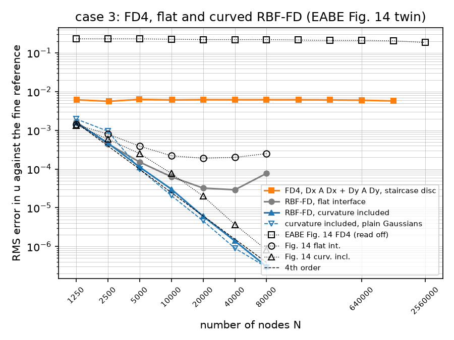

- *The curved line is fourth order.* Fit 4.13 over 1250–80,000 nodes
  (the markers fit at 3.58), orders 3.5 to 4.7 per halving of `h`, at 1.2,
  0.8, 0.5, 0.4, 0.3, 0.4 and 0.4× the Fig. 14 markers: on the marker at
  1250 nodes, then 2–3× below it. The last point is the one the reference's
  own error reaches. `max |u|` stays within 1 (0.9957 to 1.0000): the
  discrete maximum principle holds with the 1500 : 1 rows in.
- *The flat line stalls and then rises, as 2016's did, at a lower level.*
  1.65e-3 down to 2.90e-5 at 40,000 nodes and back up to 7.72e-5 at 80,000,
  against the markers' 1.4e-3 down to 1.9e-4 at 20,000 and up to 2.5e-4:
  1.2, 0.6, 0.4, 0.3, 0.2, 0.1 and 0.3×. The flat/curved gap is 1.0, 1.0,
  1.3, 2.1, 5.3, 21 and 256× at 1250–80,000 (2016's: 1.0, 1.4, 1.6, 2.9,
  9.5, 54, 309×), so the message of Fig. 14, that curvature decides
  convergence on the ring, holds with the same shape. Why our flat variant
  is 3–10× better than 2016's from 2500 nodes on cannot be checked, the
  2016 code being lost; on case 2 the two flat lines agreed to 1.1–1.3×
  (§2.6), so the difference is the ring's (two frames 0.001 apart, each at
  its own foot point, §2.3's decision, against whatever the 2016 code did
  with the `thinFlag` pair).
- *Plain Gaussians do as well as warped ones on the ring.* The `plain`
  line is 1.24, 2.03, 0.88, 0.68, 0.76, 0.65 and 0.96× the warped one
  (fit 4.26): below it from 5000 nodes on. The E2.4 note on #21 predicted
  this regime: the warp's slope on the ring is 1500 with no node in the
  band, so it only shifts the far side by 1.5 stencil radii, the cross-ring
  Gaussians are zero either way and the translated polynomials carry the
  coupling. 2016 plotted the warped setting (its text: warp on everywhere
  but one Fig. 11 line); the twin does too, the plain line dashed beside it.
  Case 2's 3–10× gain from warp and rows together (§2.6) does not carry to
  the ring.
- *FD4 sits on its no-ring floor.* 6.14e-3 at 1260 grid points and 5.73e-3
  at 1,280,292, against the same grid with `α ≡ 1` at 6.14e-3 to 6.29e-3:
  the Cartesian operator solves the problem without the ring until the
  spacing samples it, 24 to 1368 grid points inside the ring at 2550 to
  640,800 (none at 1260 and 4970, the counts whose spacing steps over it),
  and only the last grid, `m = 1131` and `h = 0.00088 < 0.001`, the first
  to sample it at every angle, moves off the floor (order 0.13). That is
  the dissertation's "no convergence until about 1600 nodes in each
  direction". The 1.28M-point solve took 5.5 min and its two reads 2 min;
  **the FD4 cap on this machine is 1,280,292 grid points** (plan D7), one
  doubling short of 2016's last marker at 2,560,000, and the dip that
  marker shows (2.0e-1 to 1.85e-1) is not reproduced.
- *2016's FD4 line at 0.23 is not reproduced and not explained.* It is 37×
  our floor at every count, and above the solution's own RMS (0.17), so it
  is the error of something far from the solution; the staircase disc is
  not it (the floor is set by the missing ring, not the disc: the `no ring`
  column, with the same staircase, agrees with `fd4` to 3 %), nor is a
  blind reading of the reference at the grid points (`blind`, the same
  numbers to 1 %). What the 2016 FD4 did with the disc, and how its
  reference was read inside the disc, the lost code cannot tell. The
  ratio to the marker is 0.03 throughout.

**Fig. 13 / Fig. 5-13: the mesh plot.** `heat2d_case3_solution.png` is
the 40,000-node curved solution (16.3 s: node set, operator, solve) as a
surface over its own node set, triangles inside the disc masked: `max |u|
= 0.99986`, `RMS |u| = 0.169`, `|u| < 4.5e-3` inside the ring. It shows the
two rows of three boundary bumps of `sin 6πx` decaying into a flat interior
with the hole; the ring is invisible at this scale, as an insulator around
a region at nearly the interior's level should be. It does not resemble
Fig. 5-13 (a plateau at 1 with a well inside the ring), for the reason
given at the top of this section.

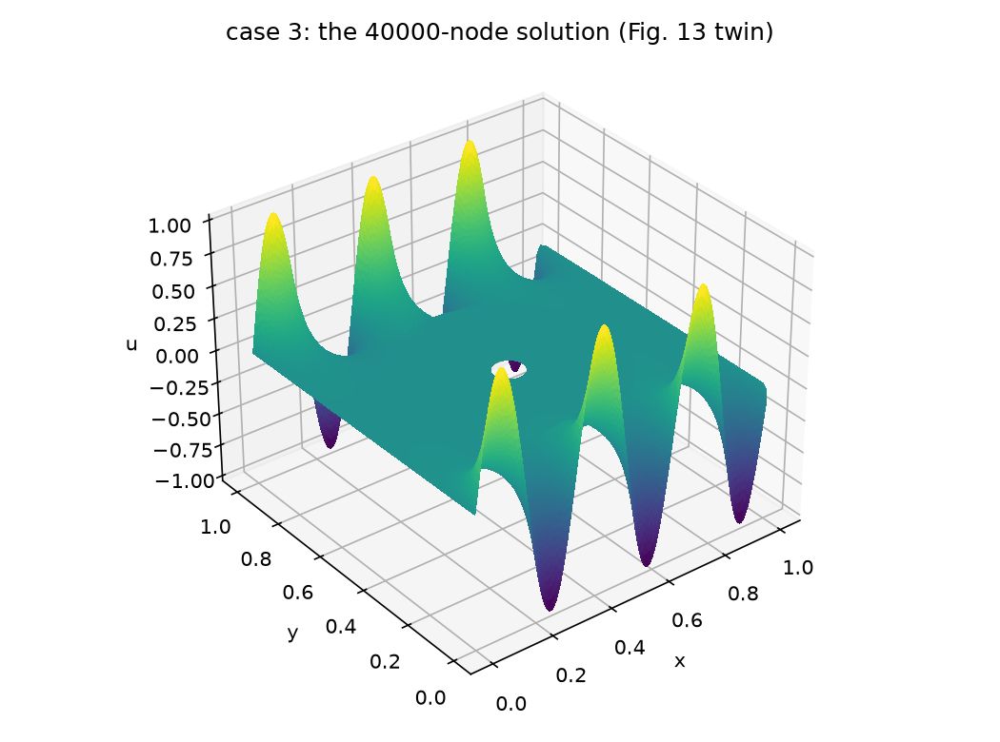

**The resampling check, measured** (`--check-n 160000`; the harmonic
mode on the 160,000-node case-3 layout with the constant ring, 8.6 s to
build with both stencil sets, read at the coarse case-3 nodes and the FD4
grid points within 0.1 of the midline; RMS / max error, aware then blind):

```
     n       h |  nodes aware        max   time |  nodes blind        max |   grid aware        max |   grid blind        max
  1250  0.0294 |     1.76e-12   1.04e-11   0.1s |     1.76e-12   1.04e-11 |     1.18e-11   1.23e-10 |     7.86e-04   5.92e-03
  2500  0.0208 |     1.67e-12   1.02e-11   0.1s |     1.67e-12   1.02e-11 |     1.36e-07   1.27e-06 |     6.10e-03   5.02e-02
  5000  0.0149 |     8.73e-12   3.45e-10   0.1s |     1.69e-04   4.60e-03 |     2.93e-11   3.94e-10 |     7.51e-03   1.03e-01
 10000  0.0105 |     1.37e-11   2.36e-10   1.2s |     7.39e-04   1.29e-02 |     6.80e-08   1.27e-06 |     9.92e-03   1.65e-01
 20000  0.0075 |     9.10e-12   9.24e-11   1.8s |     6.54e-04   8.16e-03 |     3.90e-08   1.37e-06 |     6.96e-03   1.06e-01
 40000  0.0053 |     3.76e-11   5.15e-10   4.5s |     9.03e-03   7.00e-02 |     6.54e-08   1.60e-06 |     8.28e-03   1.65e-01
 80000  0.0037 |     2.72e-11   3.07e-10   7.3s |     6.78e-03   5.68e-02 |     5.37e-08   1.88e-06 |     8.04e-03   1.57e-01
```

- At the coarse nodes the aware read is 2e-12 to 4e-11 RMS (largest
  5e-10): the 1500 : 1 chain leaves it within an order of case 2's 1–3e-12,
  four orders below the finest curved point (3.02e-7), so the resampling is
  invisible in the table above. The blind read coincides with it at 1250
  and 2500 nodes for §2.6's reason (the coarse rows keep every coarse node
  beyond the fine stencils' reach of the ring) and is 2e-4 to 9e-3 from
  5000 on.
- At the grid points the aware read is 1e-11 on the grids with no point
  inside the ring (1260, 4970) and 4e-8 to 1.4e-7 RMS (largest 1.9e-6) on
  the others: the points inside the ring are read through the ring's own
  translated basis, whose coefficients carry the 1500, and the truncation
  there is that much larger. It is three orders below FD4's 6e-3 and only
  FD4 ever reads there. The blind read is 1e-3 to 1e-2 on every grid.
  (With a 40,000-node fine set the aware read at the nodes is 2e-10 to
  1e-9, the driver's default.)
- The `RingMode` profile satisfies `∇·(α∇u) = 0` with `R` and `α R'`
  continuous across both circles to 1e-9 and is harmonic on each ring to
  the five-point Laplacian's own truncation (`tests/heat2d/test_exact.py`);
  its aware read through a 10,000-node fine set is under 1e-6 near the ring
  and the blind one more than 100× worse (`tests/heat2d/test_resample.py`),
  and the matched quadratic at 1500 : 1 reads back to 1e-9 through a
  5000-node set, including points inside the ring itself.

**Decisions (E2.7).**

- The boundary data are eq. 39 / eq. 91 as both rendered pages show them,
  `sin 6πx` on both rows with the same sign; Fig. 13 / 5-13's mesh plot
  was drawn from other data and is reproduced for eq. 39's instead.
- The FD4 grid keeps its `m (m + 1)` points and marks those on or inside a
  Dirichlet hole as that curve's Dirichlet nodes (`cartesian_grid`; a hole
  that is not a Dirichlet curve, or a Dirichlet curve that is not a hole, is
  refused); errors are read over the points outside the disc. The cap is
  1,280,292 grid points, 5.5 min per solve; 2016's 2,560,000 marker is not
  run.
- The Fig. 14 twin adds the curvature-included operator with plain
  Gaussians as a dashed line (the E2.4 note on #21); the driver also
  tabulates the FD4 grid solved without the ring and the FD4 error with a
  blind read, both cheap, so the two floors are on record.
- Ownership is checked, not assumed: the driver raises if any node of any
  set lies inside the ring or if the innermost pair fails to straddle both
  circles.
- The resampling check's profile is `heat2d.exact.RingMode` (`ring_exact`,
  `m = 2`), read within 0.1 of the midline; the ln-profile and the seam
  are the reasons above. `RadialEquilibrium` was written and removed in the
  same ticket.
- The 2016 markers of Fig. 14 are read off the rendered page (±15 %, the
  FD4 line ±5 %) and kept in the driver as `FIG14`; FD4's twelve markers
  run by doublings from 1250 to 2,560,000.
- The driver's default is a 40,000-node reference, counts to 10,000 and the
  mesh plot from the reference itself (80 s in all); the tables and
  figures above are the 160,000-node run.
- `no_ring()` in the driver, case 3's geometry and rows with `α ≡ 1`, is the
  control problem of dissertation §5.4.4 (E2.8, #22).

Regenerate with `uv run python scripts/heat2d_case3.py` (80 s at the
defaults; the reference is cached under `outputs/` on the first run) and
`uv run python scripts/heat2d_case3.py --reference-n 160000 --counts 1250
2500 5000 10000 20000 40000 80000 --fd4-counts 1250 2500 5000 10000 20000
40000 80000 160000 320000 640000 1280000` for the tables above (29 min:
reference 76 s, RBF-FD sweep 2.5 min, FD4 sweep 22 min of which the
1.28M-point grid is 7.5 min, the resampling check 54 s, the mesh plot
16 s).

### 2.8 Case 3 solved iteratively: the control problem, gmres and bicgstab, and Appendix B's diagonal-dominance preconditioner (E2.8)

**The problem** (dissertation §5.4.4 and Appendix B, EABE §3.3.2;
`scripts/heat2d_iterative.py`). Case 3 of §2.7 solved with `gmres` and
`bicgstab` in place of SuperLU, on the section's 19-node / degree-3 stencils
everywhere (`rbf.ITERATIVE`; curvature and warped Gaussians where they cross
the ring), next to the *control problem*: case 3's geometry, rows and
boundary data with `α ≡ 1`, here the plain RBF-FD Laplacian with no
interface group at all ("no interfaces are actually present"; the case-3
driver's `no_ring()`, the same material through 1 : 1 : 1 chains, is FD4's
control of §2.7). 2016 found the iterative solvers competitive with
backslash on the control (Fig. 5-16), gmres "far slower" on case 3 and
bicgstab failing outright (Fig. 5-17), and both restored by Appendix B's
preconditioner (Fig. 5-18). Errors are RMS against the 160,000-node
references of §2.7 read at the nodes through the fine stencils: case 3's
cached file, and the control's twin
(`outputs/heat2d_case3_control_reference_n160000_seed0.npz`, 82 s: node set
8.7 s, operator 42.3 s, solve 31.2 s). The tolerance is `|r| ≤ 1e-8 |b|`;
every iterative solution lands within 4e-11 to 6e-6 (relative) of the direct
one against a discretisation error of 1e-3 to 1e-4 relative, so the error
columns below agree to three figures and the 2016 device of plotting the
error against the time to solution is available.

**The reduced system, and a trap.** The iterative solvers see the interior
block of the operator with the Dirichlet columns moved to the right-hand
side (`heat2d.solve.reduced_system`, `ReducedSystem`; the same solution as
`solve_equilibrium` to 1e-12). On the identity-row form that the direct
path keeps, `bicgstab` breaks down at its **first** step on either problem,
ring or not: the right-hand side lives on the Dirichlet rows alone, so the
shadow residual `r̂ = b` is exactly orthogonal to every later residual
(`r̂ · (b − A b) = 0` when the Dirichlet rows are the identity;
`tests/heat2d/test_solve.py::test_bicgstab_breaks_down_on_the_identity_row_form`).
It is not 2016's failure, which spared the control problem, but it is the
one way found here to make bicgstab "completely fail".

**Appendix B, transcribed** (`heat2d.precondition`). A row's diagonal
dominance ratio (DDR, eq. 93) is `|a_ii| / Σ_{j≠i} |a_ij|`; the sweep adds to
a row, neighbour by neighbour outward from the diagonal, `−r_j / a_jj` times
the *original* row of neighbour `j`, cancelling the combined row's weight
there (eq. 94–97). The 1-D worked example, eq. 93's `D_Loc` transcribed to
its two printed decimals, comes back step by step: DDR 0.848, 0.802, 0.865,
0.940, 0.971 against the printed 0.846, 0.808, 0.872, 0.936, 0.968, and
`P_m = (0.021, 0.048, 0.149, 1, 0.603, 0.267, 0.125)` against eq. 98's
`(0.02, 0.05, 0.15, 1, 0.60, 0.27, 0.13)`
(`test_appendix_b_worked_example_is_reproduced_step_by_step`). The 2-D
recipe is the dissertation's for case 3: the 37 nearest nodes in distance
order, one sweep out, one in (farthest first), one out again, for every
interior row ("each RBF-FD stencil"); a Dirichlet neighbour is skipped,
its column being on the right-hand side already. `dominance_preconditioner`
runs the 111 cancellation steps for all rows at once, one sparse product
per step, and returns `P`; the preconditioned problem is `P A u = P b`
(eq. 99) formed explicitly, not SciPy's `M`. `P A` carries 89–93 nonzeros
per row against the operator's 19; `P` builds in 0.06 s at 1250 nodes and
1.4 s at 20,000.

**`spilu`, and its ordering.** The off-the-shelf comparison of plan D6 is
SuperLU's incomplete LU at its default drop tolerance 1e-4 and fill factor
10, used as SciPy's `M`. At SuperLU's default column ordering (COLAMD) the
factor is nonsense on case 3 from 20,000 nodes on: `M b` is off the solution
by 1e67 (3.8e28 at 40,000), bicgstab breaks down at step 1 and gmres stops
after one step 0.9 away from the solution; on the control it merely
degrades (47 and 79 bicgstab iterations at 20,000 and 40,000 where 10,000
took 3). The symmetric-pattern ordering `MMD_AT_PLUS_A`, everything else
equal, holds 2–3 bicgstab iterations to 40,000 nodes on both problems with
less fill (6.4–7.4× the operator's nonzeros against 7.7–8.3×) and faster
builds; full partial pivoting (`diag_pivot_thresh = 1`) does not rescue
COLAMD (144 iterations at 20,000, divergence at 40,000), a fill factor of
20 does (5 and 9 iterations), and a drop tolerance of 1e-5 makes it worse
(a factor "exactly singular" at 10,000). Probed 2026-09-21 at 10,000,
20,000 and 40,000 nodes; `ILU_ORDERING = "MMD_AT_PLUS_A"` is the module's
default and `--ilu-ordering COLAMD` reproduces the failure.

**The setup, the direct solve and the DDR** (`--reference-n 160000
--counts 1250 … 20000`, seed 0, 2026-09-21; `interior` is the reduced
system's size, `group` the rows whose stencils cross the ring, `build` the
node set with stencils and operator, `direct` SuperLU on the reduced
system; DDR min / median / fraction below 1 over every interior row and
over the group, before and after the three sweeps; `P build` and the
nonzeros per row of `P A`; `ilu` the `spilu` build):

```
control (α ≡ 1, no interface group)
     n  interior  group  build  nnz/row  direct  direct err |  DDR all: min  med  <1 |  P build  nnz/row | after all: min  med  <1 |  ilu
  1250      1171      0   0.1s     18.5   0.01s    2.21e-03 |  0.634 0.798 0.98 |   0.06s     88.9 |  0.866 0.939 0.77 |  0.00s
  2500      2389      0   0.2s     18.6   0.02s    7.78e-04 |  0.652 0.789 0.99 |   0.12s     90.5 |  0.914 0.936 0.84 |  0.01s
  5000      4845      0   0.4s     18.7   0.04s    2.02e-04 |  0.617 0.786 0.99 |   0.25s     91.7 |  0.909 0.936 0.89 |  0.04s
 10000      9780      0   0.9s     18.8   0.10s    8.10e-05 |  0.657 0.783 1.00 |   0.56s     92.5 |  0.914 0.935 0.92 |  0.10s
 20000     19690      0   1.5s     18.9   0.26s    2.43e-05 |  0.599 0.783 1.00 |   1.40s     93.2 |  0.903 0.935 0.95 |  0.26s

case 3 (the ring at 1500 : 1, curvature and warp on)
     n  interior  group  build  nnz/row  direct  direct err |  DDR all: min  med  <1 | group: min  med  <1 |  P build  nnz/row | after all: min  med  <1 | group: min  med  <1 |  ilu
  1250      1171    300   0.6s     18.5   0.01s    2.94e-03 |  0.167 0.786 0.98 | 0.167 0.631 1.00 |   0.06s     88.9 |  0.413 0.923 0.79 | 0.413 0.490 1.00 |  0.00s
  2500      2389    420   0.9s     18.6   0.02s    1.16e-03 |  0.207 0.786 0.99 | 0.207 0.612 1.00 |   0.12s     90.5 |  0.475 0.933 0.84 | 0.475 0.514 1.00 |  0.01s
  5000      4845    588   1.4s     18.7   0.04s    4.07e-04 |  0.240 0.785 0.99 | 0.240 0.584 1.00 |   0.25s     91.7 |  0.469 0.934 0.89 | 0.469 0.546 1.00 |  0.04s
 10000      9780    836   2.4s     18.8   0.10s    1.63e-04 |  0.267 0.782 1.00 | 0.267 0.546 1.00 |   0.57s     92.5 |  0.452 0.934 0.92 | 0.452 0.561 1.00 |  0.10s
 20000     19690   1176   3.9s     18.9   0.27s    5.78e-05 |  0.285 0.782 1.00 | 0.285 0.531 1.00 |   1.39s     93.2 |  0.455 0.934 0.95 | 0.455 0.566 1.00 |  0.25s
```

**The iterative solves** (inner iterations and the solver's own seconds;
full GMRES, then SciPy's restarted GMRES(20), then BiCGSTAB; each without
preconditioning, with Appendix B's `P`, with `spilu`; every solve converged
to the tolerance, none broke down; the RMS errors against the reference
equal the direct solve's to three figures in every cell and are not
repeated). One caveat on the Appendix B column: the solver's test there is
`|P b − P A u| ≤ 1e-8 |P b|`, a `P`-weighted norm, where the other two
columns are tested on `|b − A u|` (SciPy tests its `M`-preconditioned
solves on the true residual). The unweighted `|b − A u| / |b|` the
Appendix B solves stop at is 7e-9 to 1.1e-8 on the control and 7e-9 to
3.9e-8 on case 3 (the driver prints it; `IterativeResult.residual` is the
unweighted one), so the iteration counts compare at the same accuracy to
within a few per cent, and every solution's distance from the direct one
(4e-11 to 6e-6) is the check:

```
control
     n |   gmres none | gmres App. B |  gmres spilu | gmres(20) none | (20) App. B | (20) spilu | bicgstab none | bicgstab App. B | bicgstab spilu
  1250 |  110   0.03s |   36   0.01s |    3   0.00s |   202   0.01s |   42  0.00s |   3  0.00s |    73   0.00s |     23    0.00s |     1    0.00s
  2500 |  152   0.06s |   47   0.01s |    4   0.00s |   234   0.02s |   56  0.01s |   4  0.00s |   116   0.01s |     32    0.01s |     1    0.00s
  5000 |  191   0.12s |   62   0.03s |    4   0.00s |   428   0.05s |   86  0.03s |   4  0.00s |   136   0.02s |     42    0.02s |     2    0.00s
 10000 |  264   0.31s |   85   0.07s |    4   0.00s |   716   0.13s |  119  0.07s |   4  0.00s |   183   0.04s |     57    0.06s |     2    0.00s
 20000 |  336   0.73s |  107   0.18s |    5   0.01s |   797   0.25s |  138  0.16s |   5  0.01s |   280   0.11s |     68    0.14s |     2    0.01s

case 3
     n |   gmres none | gmres App. B |  gmres spilu | gmres(20) none | (20) App. B | (20) spilu | bicgstab none | bicgstab App. B | bicgstab spilu
  1250 |  139   0.04s |   69   0.01s |    3   0.00s |   231   0.02s |   89  0.01s |   3  0.00s |    98   0.00s |     50    0.01s |     1    0.00s
  2500 |  167   0.07s |   73   0.02s |    4   0.00s |   271   0.02s |   93  0.02s |   4  0.00s |   130   0.01s |     61    0.02s |     2    0.00s
  5000 |  248   0.20s |  102   0.06s |    4   0.00s |   482   0.06s |  127  0.04s |   4  0.00s |   182   0.02s |     67    0.03s |     2    0.00s
 10000 |  316   0.44s |  132   0.14s |    5   0.00s |   721   0.12s |  181  0.11s |   5  0.00s |   211   0.04s |     89    0.09s |     2    0.00s
 20000 |  381   0.95s |  154   0.30s |    6   0.01s |   877   0.26s |  207  0.25s |   6  0.01s |   319   0.12s |    104    0.22s |     2    0.01s

case 3 / control, unpreconditioned (iterations, seconds), and the gmres time ratio read off Fig. 5-17 / 5-16
  1250  gmres 1.26x  1.58x | bicgstab 1.34x  1.34x | 2016 gmres 75x
  2500  gmres 1.10x  1.21x | bicgstab 1.12x  1.10x | 2016 gmres 43x
  5000  gmres 1.30x  1.65x | bicgstab 1.34x  1.26x | 2016 gmres 75x
 10000  gmres 1.20x  1.42x | bicgstab 1.15x  1.07x | 2016 gmres 50x
 20000  gmres 1.13x  1.29x | bicgstab 1.14x  1.08x | 2016 gmres 71x
```

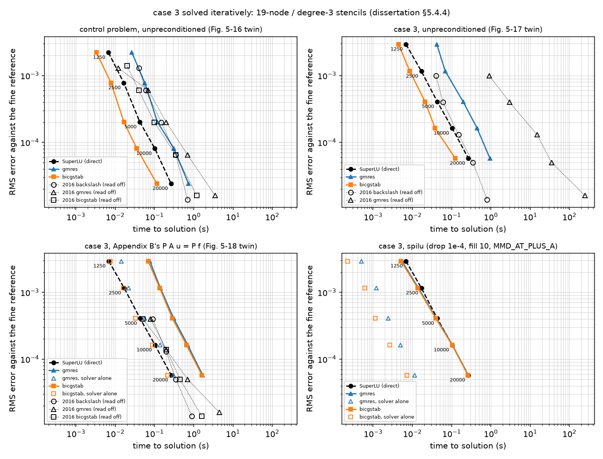

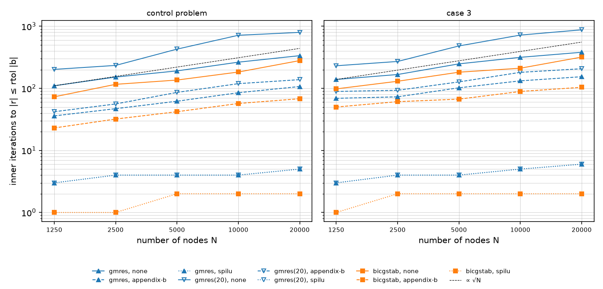

- *2016's breakdown is not reproduced.* On our case-3 operator gmres takes
  1.10–1.30× the control's iterations and 1.2–1.65× its time, bicgstab
  1.12–1.34× and 1.05–1.34×, where Fig. 5-17 against 5-16 has gmres 43–75×
  slower in time and no bicgstab line at all; bicgstab converges on case 3
  at every count (98 to 319 iterations), and none of the 90 solves failed.
  Our gmres reaches the direct solve's error on case 3 in 0.04–0.95 s where
  2016's took 0.9–250 s; our SuperLU takes 0.01–0.27 s against backslash's
  0.04–0.8 s. Why the 2016 rows broke the solvers and ours do not, the lost
  code cannot tell; the rows here are anchored on the centre's side with a
  frame at each interface's foot point (§2.3), the same construction whose
  flat variant was 3–10× better than 2016's on the ring (§2.7). As with the
  §2.7 discrepancies, this is stated without a theory.
- *The DDR says the same.* Case 3's crossing rows have DDR 0.17–0.29 at
  the least and medians 0.53–0.63, against 0.60–0.66 and 0.78–0.80 for the
  standard rows: lower, but not Fig. B-1a's "large peaks at very low
  value". At 10,000 nodes they sit in two spikes at 0.26 and 0.41 (the
  stencils of the two straddling rows are all alike) and a cluster at 0.8
  (crossing stencils whose centre is off the rows). Not one interior row of
  either problem is diagonally dominant before preconditioning (the
  19-node Laplacian rows sit at 0.78–0.80), and the solvers do not mind.
- *Appendix B works as a preconditioner, less as a dominance restorer.*
  The three sweeps cut the iterations 3.1–3.2× (gmres) and 3.2–4.1×
  (bicgstab) on the control and 2.0–2.5× and 2.0–3.1× on case 3, growing
  with N. The median DDR over all rows rises from 0.78 to 0.93 and 5–23 %
  of the rows become dominant (more at small N). The crossing rows, the
  ones the sweeps are for, come out *less* dominant in the median at the
  low counts and barely more at the high ones: their least DDR rises from
  0.17–0.29 to 0.41–0.48, but their median goes 0.63 → 0.49 at 1250 nodes
  (−22 %), 0.61 → 0.51 at 2500 (−16 %), 0.58 → 0.55 at 5000 (−7 %),
  0.55 → 0.56 at 10,000 (+3 %) and 0.53 → 0.57 at 20,000 (+7 %). The
  neighbours' rows bring their own off-diagonal mass in, and the group's
  histogram spreads over 0.45–0.6 instead of shifting up (Fig. B-1 twin
  below). The iteration win is the other rows' doing: applied to the
  crossing rows alone (the probe of 2026-09-21 at 2500 and 5000 nodes, not
  in the driver) the sweeps move the group's DDR the same way (least 0.21 →
  0.48, median 0.61 → 0.51) and cut the iteration counts by 5–9 % only.
  Appendix B's benefit to the rows it was designed for is therefore not
  shown here; its benefit as a preconditioner of the whole matrix is. In
  wall-clock the gain is
  gmres's: 0.95 → 0.30 s at 20,000 nodes, full GMRES's cost being quadratic
  in the iterations; bicgstab gets slower (0.12 → 0.22 s), each product
  with `P A` costing five times the operator's, and the `P` build (1.4 s at
  20,000) exceeds the direct solve (0.27 s) at every count. Fig. 5-18 has
  2016's preconditioned gmres at 0.9–5× and bicgstab at 0.6–1.8× of
  backslash's time; ours, solver alone, are 1.0–1.5× (gmres) and 0.75–1.0×
  (bicgstab) of SuperLU's, and 6–8× with the `P` build counted.
- *`spilu` is the strong baseline.* 3–6 gmres and 1–2 bicgstab iterations
  at every count on both problems, its build (0.00–0.26 s) about the
  direct solve's time, so bicgstab with `spilu` ties SuperLU in total
  time (0.26 against 0.27 s at 20,000) and no iterative variant beats it.
  The direct solve is 0.01 s at 1250 nodes and 0.27 s at 20,000; the only
  unpreconditioned solve under it is bicgstab from 10,000 nodes on (0.04
  against 0.10 s, 0.12 against 0.27 s), where 2016's bicgstab was 1.7×
  slower than backslash at the last marker. Full GMRES is 3.5× the direct
  solve at 20,000 (2016: 5×).
- *Iterations grow like √N or a little slower.* Over the 16-fold range,
  gmres 110 → 336 (exponent 0.40) and bicgstab 73 → 280 (0.48) on the
  control, 139 → 381 (0.36) and 98 → 319 (0.43) on case 3. GMRES(20) needs
  1.5–2.7× the iterations of full GMRES and is 2.4–3.7× faster in time at
  10,000–20,000 nodes, the orthogonalisation being what full GMRES pays for.
- *The 19 / 3 stencils converge at third order.* Control 2.21e-3 →
  2.43e-5 over 1250–20,000 nodes (fit 3.25; 3.0, 3.9, 2.6, 3.5 per
  doubling of N), case 3 2.94e-3 → 5.78e-5 (fit 2.83), 1.3–2.4× the
  control's. Against the 2016 markers, read with the counts taken to be
  1250 … 20,000: control 1.7, 1.3, 1.0, 1.2, 1.7× (the same error sequence,
  which is what supports the reading), case 3 2.9, 2.9, 3.1, 3.3, 4.1×; in
  2016 the case-3 error was 0.75× the control's, here 1.3–2.4×.

**Fig. B-1 twin and the DDR of the other operators** (`--ddr-n 10000`):

```
case 3 at 10,000 nodes: the 836 rows crossing the ring, median DDR 0.546 (min 0.267) before, 0.561 (min 0.452) after;
all 9780 interior rows 0.782 before, 0.934 after; fraction below 1: 1.00 → 0.92

DDR of other operators on the same node set (min / median / <1; the crossing rows)
  case 3, 19 / 3, warp on (this study)   0.267 0.782 1.00 | 0.267 0.546 1.00
  case 3, 19 / 3, plain Gaussians        0.330 0.782 1.00 | 0.330 0.516 1.00
  case 3, 42 / 5 and 30 / 4 (E2.7)       0.080 0.608 1.00 | 0.080 0.681 1.00
  control, 19 / 3                        0.657 0.783 1.00 | no group
  control, 42 / 5 and 30 / 4             0.318 0.608 1.00 | no group
```

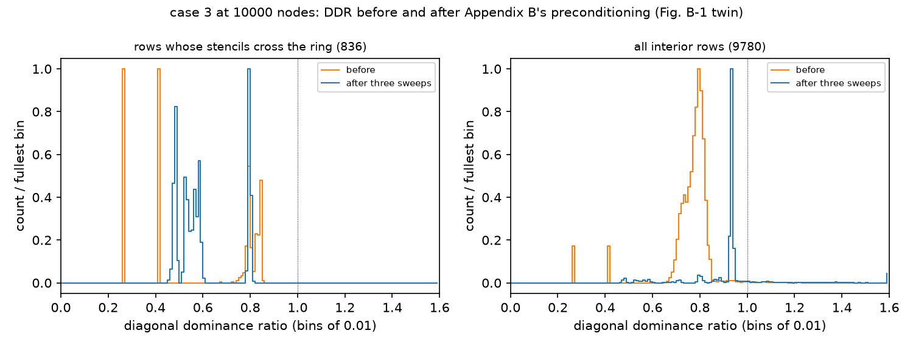

- The bigger stencils are the less dominant: E2.7's 42 / 5 and 30 / 4
  operator has a least DDR of 0.08 and a median of 0.61 on case 3 (0.32 and
  0.61 on the control) against 0.27 and 0.78 for the 19 / 3, so the E4.5
  (#36) operators, on the papers' stencils with seed rows, start lower than
  anything here. The warp does not decide the dominance either way (least
  0.33 with plain Gaussians against 0.27 warped, median 0.516 against
  0.546), so the E2.7 note's "take the papers' setting" stands.

**Decisions (E2.8).**

- The iterative solvers see the reduced interior system (`reduced_system`);
  `solve_equilibrium` keeps its identity-row form for the direct path.
  The identity-row bicgstab breakdown is pinned by a test as the trap it is.
- Full GMRES is the primary (MATLAB's default; one Arnoldi cycle of up to
  `maxiter` steps, SciPy's `legacy` semantics so that a cycle ending on the
  preconditioned residual is followed by another until the true residual
  passes), SciPy's GMRES(20) alongside; `rtol = 1e-8`, cap 3000 inner
  iterations; inner iterations are what is counted.
- Appendix B is applied to every interior row with 37 neighbours and
  three sweeps (out, in, out), Dirichlet neighbours skipped, the original
  rows combined, and `P A u = P b` formed explicitly (eq. 99); the
  preconditioned `ReducedSystem` keeps its `original`, and residuals are
  reported in the unweighted norm.
- `spilu` at its default drop tolerance and fill factor with the
  `MMD_AT_PLUS_A` ordering (`ILU_ORDERING`), SuperLU's COLAMD default having
  failed from 20,000 nodes; the driver's `--ilu-ordering` reaches it.
- Times are the solver's wall-clock; a preconditioner's build is a
  separate column, included in the filled markers of the performance
  figure and excluded from the hollow ones.
- The 2016 markers are read off Fig. 5-16 to 5-18 as `(seconds, error)`
  pairs (`FIG2016` in the driver, ±15 %), the counts taken to be 1250 to
  20,000 since neither text states them.
- The ticket's "done when" (bicgstab fails and gmres is slow on case 3,
  both recover with Appendix B) is answered rather than met: neither
  fails here, and the DDR before and after is tabulated above.

Regenerate with `uv run python scripts/heat2d_iterative.py` (31 s with the
references cached; the control's 40,000-node reference adds 16 s the first
time) and `uv run python scripts/heat2d_iterative.py --reference-n 160000
--counts 1250 2500 5000 10000 20000` for the tables above (46 s cached; the
control's 160,000-node reference adds 82 s the first time).

### 2.9 The extremizing parameter: eq. 40 at s = 10³ … 10¹¹, and the continuity matrices' conditioning (E2.9)

**The problem** (EABE §3.3.3, eq. 40; `heat2d.domain.case3(s)`,
`scripts/heat2d_extremes.py`). Case 3 with its ring made thinner and more
insulating together: `α = 1/(1.5 s) + (1/(3 s)) sin 2πx sin 2πy` on
`0.35 − 1/s ≤ r ≤ 0.35`, 1 elsewhere, everything else as in §2.7, for
`s = 10³` (case 3 itself: `0.35 − 1/1000 == 0.349` and the midline
`0.35 − 0.5/1000 == 0.3495` in double precision, so `case3()` is
`case3(1000)` bit for bit and the s = 10³ line below is §2.7's curved line
re-solved), 10⁸, 10⁹, 10¹⁰ and 10¹¹. The ring's resistance, its width over
its diffusivity, is `(1/s) / (1/(1.5 s)) = 1.5` at every s (`1.5 / (1 + 0.5
sin sin)` with the sine part), so as s grows the solutions tend to a
thin-layer limit with a contact resistance of 1.5 on `r = 0.35` and differ
from it by O(1/s): the s ≥ 10⁸ problems are one problem to eight or more
figures, and only the s = 10³ ring, 0.001 wide, is physically distinct.
2016 solved each against its own fine reference (Fig. 19) and found the
lines "almost as well, if not identically" to case 3 up to s ≈ 10⁸–10⁹,
degrading at 10⁹–10¹⁰ and flat at 7e-4 for s = 10¹¹, with the average
condition number of the continuity matrices growing like s² (Fig. 20,
about 4.5 s²) as the cause.

**What double precision holds.** At s = 10¹¹ the ring is 1e-11 wide at a
radius of 0.35, 1.8e5 ulps; `Circle(0.35 − 1/s)` stores its inner radius to
half an ulp, so the stored width is `1/s` to 5e-10 (s = 10⁸), 2.7e-8 (10⁹)
and 8.3e-8 (10¹⁰, 10¹¹) relative, and everything built from the two radii
inherits that and nothing worse: the frame shift between the two circles
that a crossing stencil computes from their foot points equals the stored
width to 6e-11 or better on the stencils probed (2026-09-21), and
`ring_exact(s)`'s climb across the ring matches `1.5 × α R'` to the same
8e-8 at s ≥ 10¹⁰ once its walk is formed from increments (decisions). The
stored geometry is therefore the problem to about seven figures at the
largest s, and nothing below is limited by it.

**Fig. 20 twin: the continuity matrices as s grows** (`--conditioning-n
10000`, 2026-09-21; every stencil of the 30-node / degree-4 interface group
crossing the ring, 1254 of them, both sides at both circles; 2-norm
condition numbers of the matrices `continuity_matrix` builds in the
stencil-radius frame, mean over the stencils in the first table and largest
in the second; "eq" scales each row by its largest entry; `P` is the
polynomial block of the RBF-FD system and "aug" the whole system
`[[A, P], [Pᵀ, 0]]`, with the translated basis anchored on the centre's
region as this port does, on the ring as the MATLAB did (§2.3;
`InterfaceStencil.polynomial_block(regions=)`), and with the flat frames;
"far" the largest coefficient of the basis on the region across the ring
from the centre; "residual" the worst relative residual of `stencil_weights`
on the matched radial quadratic through the ring, §2.7's exactness check at
every s, warp on and off; the DDR of the assembled operator's crossing rows
and of all interior rows, least and median):

```
     s |  ring raw   out raw  ring eq  out eq |  P centre    P band    P flat |  aug centre   aug band |       far  far flat |  Fig. 20
   1e3 |  6.07e+05  2.23e+02     16.5    16.5 |  2.88e+03  1.44e+08  2.91e+03 |    1.93e+06   4.15e+14 |  3.78e+03  1.72e+02 |   4.0e+06
   1e4 |  6.07e+07  2.23e+02     16.5    16.5 |  7.28e+03  1.93e+10  1.29e+03 |    4.23e+06   1.21e+19 |  3.79e+04  1.70e+02 |   4.5e+08
   1e5 |  6.07e+09  2.23e+02     16.5    16.5 |  6.96e+04  2.33e+12  1.24e+03 |    4.09e+07   7.63e+22 |  3.78e+05  1.70e+02 |   4.5e+10
   1e6 |  6.07e+11  2.23e+02     16.5    16.5 |  6.93e+05  1.93e+14  1.24e+03 |    4.04e+08   6.22e+26 |  3.78e+06  1.70e+02 |   4.0e+12
   1e7 |  6.07e+13  2.23e+02     16.5    16.5 |  6.87e+06  1.92e+16  1.23e+03 |    4.13e+09   6.13e+30 |  3.78e+07  1.70e+02 |   4.5e+14
   1e8 |  6.07e+15  2.23e+02     16.5    16.5 |  6.86e+07  1.94e+18  1.23e+03 |    4.03e+10   6.31e+34 |  3.78e+08  1.70e+02 |   4.5e+16
   1e9 |  6.07e+17  2.23e+02     16.5    16.5 |  6.86e+08  1.95e+20  1.23e+03 |    4.08e+11   6.28e+38 |  3.78e+09  1.70e+02 |   4.5e+18
  1e10 |  6.07e+19  2.23e+02     16.5    16.5 |  6.88e+09  1.93e+22  1.23e+03 |    4.09e+12   4.79e+42 |  3.78e+10  1.70e+02 |   4.5e+20
  1e11 |  6.07e+21  2.23e+02     16.5    16.5 |  6.88e+10  1.94e+24  1.23e+03 |    4.05e+13   3.49e+46 |  3.78e+11  1.70e+02 |   4.5e+22
```

```
     s |  ring raw   out raw  ring eq |  P centre    P band    P flat |  aug centre   aug band |       far |  residual warp  plain |  DDR group      all  | build  analysis
   1e3 |  1.52e+06  2.23e+02     16.6 |  1.02e+04  1.69e+09  1.05e+04 |    1.12e+07   1.11e+16 |  1.03e+04 |   2.1e-14   1.1e-14 |  0.080 0.681  0.080 0.608 |   4.7s    9.9s
   1e4 |  1.52e+08  2.23e+02     16.6 |  5.68e+04  1.66e+11  4.03e+03 |    5.30e+07   2.32e+20 |  1.02e+05 |   3.8e-14   3.9e-14 |  0.076 0.689  0.076 0.608 |   4.7s    9.9s
   1e5 |  1.52e+10  2.23e+02     16.6 |  5.37e+05  1.64e+13  3.51e+03 |    4.87e+08   1.65e+24 |  1.01e+06 |   1.7e-13   7.2e-14 |  0.104 0.687  0.104 0.608 |   4.7s    9.8s
   1e6 |  1.52e+12  2.23e+02     16.6 |  5.29e+06  1.70e+15  3.45e+03 |    2.77e+09   1.16e+28 |  1.01e+07 |   1.5e-12   8.3e-13 |  0.080 0.692  0.080 0.607 |   4.7s    9.9s
   1e7 |  1.52e+14  2.23e+02     16.6 |  5.27e+07  1.65e+17  3.45e+03 |    5.31e+10   1.11e+32 |  1.02e+08 |   1.3e-11   8.4e-12 |  0.118 0.693  0.118 0.608 |   4.7s   10.0s
   1e8 |  1.52e+16  2.23e+02     16.6 |  5.25e+08  1.65e+19  3.44e+03 |    2.47e+11   1.96e+36 |  1.02e+09 |   1.2e-10   1.4e-10 |  0.081 0.690  0.081 0.607 |   4.7s    9.8s
   1e9 |  1.52e+18  2.23e+02     16.6 |  5.24e+09  1.83e+21  3.44e+03 |    5.26e+12   5.54e+40 |  1.02e+10 |   1.6e-09   1.0e-09 |  0.081 0.692  0.081 0.608 |   4.7s    9.9s
  1e10 |  1.52e+20  2.23e+02     16.6 |  5.26e+10  1.87e+23  3.44e+03 |    5.26e+13   2.08e+44 |  1.01e+11 |   2.2e-08   7.7e-09 |  0.081 0.693  0.081 0.608 |   4.7s    9.9s
  1e11 |  1.52e+22  2.23e+02     16.6 |  5.26e+11  1.80e+25  3.44e+03 |    5.26e+14   8.72e+47 |  1.02e+12 |   1.4e-07   1.2e-07 |  0.079 0.691  0.079 0.608 |   4.7s    9.9s
growth with s (fit exponent): ring raw 2.00, all four 2.00, P centre 0.96, P band 2.01, aug centre 0.95, aug band 3.97, residual 0.91
median residual over the stencils (warp on / off): 1e3: 1.3e-16 / 1.5e-16; 1e4: 1.2e-16 / 1.9e-16; 1e5: 4.3e-16 / 6.5e-16; 1e6: 3.7e-15 / 6.1e-15; 1e7: 4.2e-14 / 6.6e-14; 1e8: 4.2e-13 / 6.3e-13; 1e9: 4.1e-12 / 6.7e-12; 1e10: 4.4e-11 / 6.5e-11; 1e11: 4.4e-10 / 6.4e-10
```

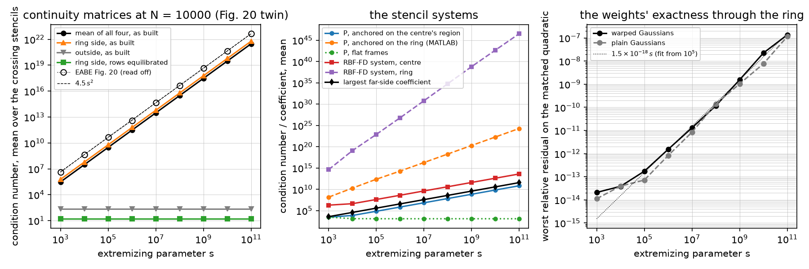

- *Fig. 20 is reproduced in its exponent and to a constant.* The ring
  side's matrices grow as `0.61 s²` (fit exponent 2.00; the mean over all
  four is the same line, the ring side's dominating it) against 2016's
  `4.5 s²`, 7× below at every s; the units are the stencil radius here and
  unrecorded in 2016, and a constant factor is all a change of units moves.
  The exponent is the row scaling of eq. 28 at degree 4: the rows of `D u`
  and of the flux carry one factor of `α = 1/(1.5 s)`, those of `D² u` and
  of the flux of `D u` two, so the matrix on the ring's side has rows of
  size 1, α, α, α², α² and its condition number is O(s²); with the interior
  spec's degree 5 across the ring the flux of `D² u` adds an α³ row and the
  exponent is 3 (2.8e7 at s = 10³ to 2.8e31 at 10¹¹ on the 42 / 5 stencils,
  probed 2026-09-21, not in the driver). The outside's matrices sit at 223
  at every s (§2.3's 223 on case 1).
- *The matrices are badly scaled, not badly conditioned.* With each row
  scaled by its largest entry the ring side's condition number is 16.5 at
  every s (largest 16.6) and the outside's 16.5. `translation_matrix`
  solves `C_to c = C_from` by LU with partial pivoting after scaling each
  row of `[C_from | C_to]` by its largest entry (the MATLAB's equilibration,
  which the outside's O(1) rows dominate, so the ring side's rows keep
  their 1, α, α² sizes going in); the accuracy of such a solve is that of
  the row-equilibrated matrix, not of the matrix as built, and the 10²² of
  Fig. 20 never reaches the weights. It is the number 2016 plotted; whether
  it was what broke the 2016 code cannot be checked.
- *What does grow into the weights is the far side's basis.* Anchored on
  the centre's region, the translated basis on the region across the ring
  carries coefficients of order s (`3.8 s`: 3.8e3 at 10³, 3.8e11 at 10¹¹),
  the polynomial block's condition number grows like s (2.9e3 to 6.9e10,
  exponent 0.96) and the RBF-FD system's like s (1.9e6 to 4.1e13); with the
  flat frames the far side stays at 170 and `P` at 1.2e3–2.9e3 for every s.
  The O(s) is the curvature's doing, and it is exact arithmetic, not
  rounding. The measured part is the `far` column and
  `test_far_side_basis_grows_like_s_with_curvature_only` (the far
  coefficient a thousandfold between s = 10⁶ and 10⁹ with curvature on,
  flat without it); the constants that follow are a derivation by hand,
  orders of magnitude rather than measurements: along the inner circle the
  `D u` row reads
  `12 c₄₀ + 2 c₂₂ + (2 c₂₁ + 6 c₀₃) f₂ = O(s)` with `c₀₃ ~ (1.5 s)²` from
  the flux of `D u` and `f₂ = κ scale / 2 ≈ −0.09`, so the ring's
  polynomial has `c₂₂ ~ 0.6 s²` in `ξ² η²`; the change of frame to the
  outer circle shifts η by `δ = (1/s) / scale` and turns it into
  `2 c₂₂ δ ~ 1.2 s / scale` in `ξ² η`, and restricting along the outer
  circle, `η = f₂' ξ²`, leaves `2 c₂₂ δ f₂' ~ 0.6 s κ² scale` in ξ⁴ that
  the far side's u-rows must match. The exact solution's tangential
  derivatives along the outer circle are O(1); the degree-4 polynomial's
  are O(s κ² scale) because its `ξ² η²` term, fixed at the inner circle,
  is read a ring's width away where the tangent frame has turned. The
  weights stay exact on the span but lose digits like s: the worst
  relative residual on the matched quadratic is 2.1e-14 at s = 10³ and
  1.4e-7 at 10¹¹, about `1.5e-18 s` from s = 10⁵ on (the figure's fitted
  line), warp on or off, and
  the median over the stencils 1.3e-16 to 4.4e-10 (`4e-21 s`). So the
  translated basis is good to about seven figures at s = 10¹¹, three
  orders below the 2016 floor of 7e-4 and one above the stored geometry's.
- *Anchored on the ring, the same span is hopeless from s = 10³.* The
  MATLAB anchored the standard monomials on the band (§2.3) and translated
  outward; on the ring that basis has `P` at 1.4e8 to 1.9e24 (exponent 2)
  and the RBF-FD system at 4.2e14 to 3.5e46 (exponent 4): the monomials of
  the ring translate to the outside with their normal derivatives divided
  by 1.5 s, so the 15 functions on each outside region are nearly the 5
  tangential ones and `P` is rank-deficient to O(1/s) there. Weights from
  such a system have no digits left by s = 10⁵ in this arithmetic. Whether
  the 2016 code's anchoring, units or equilibration put its breakdown at
  10⁹–10¹¹ rather than there cannot be checked, the code being lost; the
  ordering is the point: on this span the anchoring decides the
  conditioning, and this port anchors on the centre's side, a §2.3 decision
  made for a different reason.

**Fig. 19 twin: errors against N per s** (`--reference-n 160000 --counts
1250 … 80000`, seed 0, 2026-09-21; the papers' setting, curvature and warped
Gaussians, against a 160,000-node reference at the same s read at the coarse
nodes through its stencils; `plain` the same operator with plain Gaussians;
order per halving of h; the last column Fig. 19 read off the rendered page,
±30 %; `spread` in the first table is the RMS difference from the s = 10⁸
reference read at the 80,000-node set):

```
     s       n        h  group    nodes  operator   solve        max |u|     spread
   1e3  160000  0.00263   5038     8.2s     38.6s   28.8s  1.000000001   5.34e-06  (cached)
   1e8  160000  0.00263   5055     9.1s     40.2s   27.8s  1.000000000   0.00e+00  (solved)
   1e9  160000  0.00263   5053     8.2s     40.0s   28.7s  1.000000000   2.26e-08  (solved)
  1e10  160000  0.00263   5051     8.2s     40.2s   27.0s  1.000000000   1.77e-08  (solved)
  1e11  160000  0.00263   5057     8.3s     40.0s   28.3s  1.000000000   3.15e-08  (solved)
```

```
s = 1e3
     n       h  group  in ring |     curved  order  nodes  build  solve  read |      plain  order |  Fig. 19
  1250  0.0294    512        0 |   1.58e-03      -   0.1s   1.2s   0.0s   0.1s |   1.96e-03      - |   1.3e-03
  2500  0.0208    694        0 |   4.69e-04   3.52   0.1s   1.7s   0.0s   0.1s |   9.51e-04   2.09 |   6.0e-04
  5000  0.0149    949        0 |   1.13e-04   4.27   0.4s   2.6s   0.1s   0.3s |   9.90e-05   6.78 |   1.6e-04
 10000  0.0105   1314        0 |   3.02e-05   3.78   0.8s   3.9s   0.4s   1.5s |   2.06e-05   4.50 |   5.5e-05
 20000  0.0075   1813        0 |   6.03e-06   4.68   1.3s   6.2s   1.2s   2.3s |   4.58e-06   4.37 |   1.6e-05
 40000  0.0053   2534        0 |   1.39e-06   4.20   2.2s  10.7s   3.3s   5.3s |   9.04e-07   4.65 |   2.7e-06
 80000  0.0037   3567        0 |   3.02e-07   4.39   4.2s  19.7s   9.6s   9.1s |   2.91e-07   3.26 |   8.0e-07
ratio to Fig. 19: 1.22, 0.78, 0.68, 0.55, 0.38, 0.50, 0.38

s = 1e8
     n       h  group  in ring |     curved  order  nodes  build  solve  read |      plain  order |  Fig. 19
  1250  0.0294    518        0 |   1.51e-03      -   0.1s   1.2s   0.0s   0.1s |   4.48e-03      - |   1.4e-03
  2500  0.0208    700        0 |   4.08e-04   3.80   0.1s   1.8s   0.0s   0.1s |   5.71e-04   5.97 |   6.5e-04
  5000  0.0149    947        0 |   1.30e-04   3.43   0.4s   2.5s   0.1s   0.2s |   2.28e-04   2.76 |   2.2e-04
 10000  0.0105   1313        0 |   2.58e-05   4.63   0.8s   3.9s   0.4s   1.5s |   7.29e-05   3.26 |   7.4e-05
 20000  0.0075   1800        0 |   6.19e-06   4.15   1.3s   6.3s   1.2s   2.3s |   1.17e-05   5.31 |   2.4e-05
 40000  0.0053   2543        0 |   1.30e-06   4.46   2.2s  10.8s   3.7s   5.4s |   2.18e-06   4.82 |   4.9e-06
 80000  0.0037   3570        0 |   2.83e-07   4.40   4.2s  19.9s   9.9s   9.1s |   1.20e-06   1.73 |   1.2e-06
ratio to Fig. 19: 1.04, 0.63, 0.59, 0.35, 0.26, 0.27, 0.24

s = 1e9
     n       h  group  in ring |     curved  order  nodes  build  solve  read |      plain  order |  Fig. 19
  1250  0.0294    515        0 |   1.58e-03      -   0.1s   1.2s   0.0s   0.1s |   4.91e-03      - |   1.6e-03
  2500  0.0208    702        0 |   4.11e-04   3.90   0.1s   1.8s   0.0s   0.1s |   7.06e-04   5.63 |   5.4e-04
  5000  0.0149    942        0 |   1.25e-04   3.57   0.4s   2.5s   0.1s   0.2s |   1.84e-03  -2.87 |   1.8e-04
 10000  0.0105   1315        0 |   2.21e-05   4.96   0.8s   3.9s   0.4s   1.5s |   6.07e-05   9.77 |   9.0e-05
 20000  0.0075   1797        0 |   6.17e-06   3.71   1.3s   6.3s   1.2s   2.3s |   9.40e-06   5.42 |   2.5e-05
 40000  0.0053   2544        0 |   1.34e-06   4.37   2.2s  10.6s   3.7s   5.4s |   1.89e-06   4.60 |   9.6e-06
 80000  0.0037   3577        0 |   2.93e-07   4.37   4.2s  19.7s  10.8s   9.0s |   6.79e-07   2.94 |   6.9e-06
ratio to Fig. 19: 0.99, 0.76, 0.69, 0.25, 0.25, 0.14, 0.04

s = 1e10
     n       h  group  in ring |     curved  order  nodes  build  solve  read |      plain  order |  Fig. 19
  1250  0.0294    515        0 |   1.51e-03      -   0.1s   1.2s   0.0s   0.1s |   4.41e-03      - |   1.1e-03
  2500  0.0208    706        0 |   4.14e-04   3.75   0.1s   1.8s   0.0s   0.1s |   1.32e-03   3.51 |   5.7e-04
  5000  0.0149    942        0 |   1.24e-04   3.62   0.4s   2.6s   0.1s   0.2s |   1.07e-03   0.64 |   1.6e-04
 10000  0.0105   1310        0 |   2.49e-05   4.58   0.8s   3.9s   0.4s   1.5s |   3.50e-05   9.78 |   6.7e-05
 20000  0.0075   1797        0 |   6.12e-06   4.08   1.3s   6.3s   1.2s   2.3s |   1.76e-05   2.00 |   4.5e-05
 40000  0.0053   2529        0 |   1.42e-06   4.19   2.2s  10.7s   3.5s   5.4s |   1.99e-06   6.25 |   1.3e-05
 80000  0.0037   3574        0 |   3.10e-07   4.37   4.2s  19.7s  10.4s   9.0s |   5.48e-07   3.70 |   1.1e-05
ratio to Fig. 19: 1.31, 0.73, 0.75, 0.37, 0.14, 0.11, 0.03

s = 1e11
     n       h  group  in ring |     curved  order  nodes  build  solve  read |      plain  order |  Fig. 19
  1250  0.0294    513        0 |   1.54e-03      -   0.1s   1.2s   0.0s   0.1s |   6.88e-03      - |   2.0e-03
  2500  0.0208    700        0 |   4.07e-04   3.87   0.1s   1.8s   0.0s   0.1s |   5.33e-04   7.42 |   1.2e-03
  5000  0.0149    951        0 |   1.30e-04   3.42   0.4s   2.6s   0.1s   0.2s |   2.40e-04   2.40 |   8.5e-04
 10000  0.0105   1316        0 |   2.40e-05   4.85   0.8s   3.9s   0.4s   1.5s |   3.75e-05   5.31 |   7.8e-04
 20000  0.0075   1802        0 |   6.24e-06   3.91   1.3s   6.3s   1.3s   2.3s |   1.34e-05   2.98 |   7.4e-04
 40000  0.0053   2537        0 |   1.28e-06   4.52   2.2s  10.7s   3.6s   5.4s |   1.03e-05   0.77 |   7.4e-04
 80000  0.0037   3577        0 |   2.96e-07   4.23   4.2s  19.6s  10.2s   9.0s |   5.07e-07   8.66 |   7.4e-04
ratio to Fig. 19: 0.77, 0.34, 0.15, 0.03, 0.01, 0.00, 0.00

ratio of each s line to the s = 1e3 line at each count (curved): 1e8: 0.96, 0.87, 1.15, 0.85, 1.03, 0.94, 0.94; 1e9: 1.00, 0.88, 1.11, 0.73, 1.02, 0.97, 0.97; 1e10: 0.95, 0.88, 1.09, 0.83, 1.02, 1.02, 1.03; 1e11: 0.98, 0.87, 1.15, 0.79, 1.03, 0.93, 0.98
```

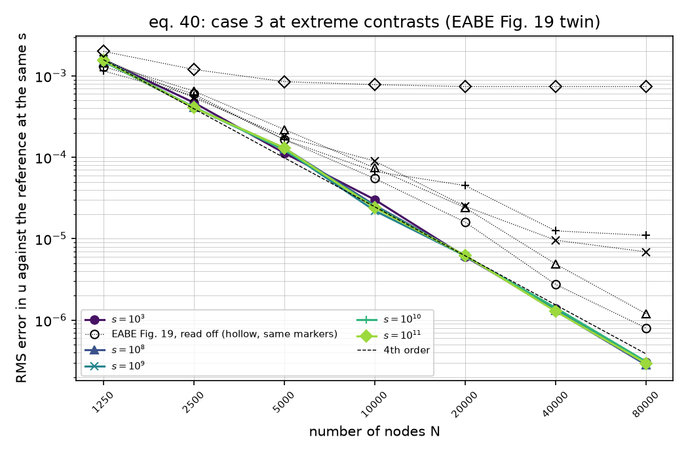

- *The breakdown is not reproduced.* Every s line is the s = 10³ line to
  within the node sets' scatter, 0.73–1.15× at every count, and fourth
  order throughout (fits over 1250–80,000 nodes: 4.14, 4.14, 4.15, 4.10,
  4.13 for s = 10³ … 10¹¹). At s = 10¹¹ the error is 2.96e-7 at 80,000
  nodes, the reference's own floor (§2.7: about 1e-7), where Fig. 19 has
  7.4e-4 flat from 5000 nodes: 0.03× the marker at 10,000 nodes and below
  0.01× beyond; the 10¹⁰ line ends at 0.03× its marker, the 10⁹ at 0.04×,
  the 10⁸ at 0.24×, the 10³ at 0.38× (this reading of Fig. 19 sits 0.7–1.0×
  §2.7's reading of Fig. 14 for the same line). The s ε loss of the basis
  (1.4e-7 worst, 4e-10 median at 10¹¹) is below the discretisation error
  at every count run; the floor it would set is not reached by 80,000
  nodes. `max |u|` stays within 1 at every s, as at s = 10³.
- *The references agree.* The s ≥ 10⁸ references differ from the 10⁸ one
  by 1.8e-8 to 3.2e-8 RMS at the 80,000-node set, below their own error of
  about 1e-7, as one problem solved on node sets that differ by the
  rows' 0.5/s: the O(1/s) physics is not visible at 160,000 nodes. The
  10³ reference differs by 5.3e-6, the 0.001-wide ring's own O(w).
- *Plain Gaussians are the one setting that degrades with s.* At s = 10³
  the plain line is 0.65–1.24× the warped one (§2.7); at s ≥ 10⁸ it is
  1.2–14× above it and erratic (1.84e-3 at 5000 nodes for s = 10⁹ after
  7.1e-4 at 2500; 1.03e-5 at 40,000 for 10¹¹ after 1.34e-5 at 20,000),
  converging in the end to 5.1e-7 to 1.2e-6 at 80,000. The spectrum
  below says why.

**The spectrum** (the E2.5 note on #23; `--spectrum-n 2000`, the dense
eigenvalues of the interior operator on the 2000-node set at each s, 1903
interior nodes; `complex` means `|Im λ| > 1e-8 max |λ|`, `positive` counts
real parts above zero):

```
     s  operator  complex  positive     max Re   h² min Re  h² max |Im|   time
   1e3  curved       1026         0    -14.340     -13.445        0.182   2.1s
   1e3  plain         956        53   2725.888     -13.445        0.128   2.0s
   1e8  curved       1070         0    -14.328     -13.323        0.406   2.1s
   1e8  plain         956        60   7083.363     -13.324        0.407   2.0s
   1e9  curved       1066         0    -14.330     -13.518        0.475   2.1s
   1e9  plain         956        59   6937.031     -13.518        0.475   2.0s
  1e10  curved       1094         0    -14.329     -13.546        0.532   2.1s
  1e10  plain         970        60   6836.736     -13.549        0.532   2.0s
  1e11  curved       1058         0    -14.332     -13.645        0.386   2.1s
  1e11  plain         968        60   6968.740     -13.646        0.386   2.0s
```

- *The warped operator is stable at every s and the plain one is not.* With
  the warp, `max Re λ = −14.3` at every s, the complex count 1026–1094 and
  `h² max |Im|` 0.18 at s = 10³ and 0.39–0.53 at s ≥ 10⁸; there is no loop
  of the case-1 kind (§2.5), the plain and warped `h² max |Im|` coinciding
  at s ≥ 10⁸. The plain-Gaussian operator has eigenvalues with positive
  real parts, 53 to 60 of them on this set, the largest `+2.7e3` at
  s = 10³ and `+6.8e3` to `+7.1e3` at s ≥ 10⁸; on 1250, 2500 and 4000
  nodes (probed 2026-09-21, not in the driver) 48, 48 and 0 of them at
  s = 10³ against 50, 69 and 87 at s = 10¹¹, the count growing with N
  there; the warped operator has none on any set at any s.
  So the warp's 1.5-unit shift of the far side, "not decisive" for accuracy
  or dominance at s = 10³ (§2.7, §2.8), decides the sign of the spectrum on
  the ring: a march of the plain operator would grow like `e^{7000 t}`, and
  its elliptic solves are the erratic plain lines above. The E2.4 note's
  "the sweep may run both cheaply" stands, with this as the result.

**The DDR** (the E2.8 note on #23). The crossing rows' diagonal dominance
ratio at 10,000 nodes is 0.076–0.118 at the least and 0.681–0.693 in the
median at every s (all interior rows: the same least, median 0.607–0.608;
§2.8's 42 / 5 + 30 / 4 numbers at s = 10³ were 0.080 and 0.681): the
dominance of the assembled rows does not see s at all.

**The resampling check** (the E2.7 note on #23; `ring_exact(s=s)`, the
harmonic mode through the ring at `α = 1/(1.5 s)`, on the 160,000-node
constant-ring layout at each s, read at the coarse case-3 nodes within 0.1
of the ring; RMS / largest error, aware then blind):

```
     s      n  points |       aware        max |       blind        max
   1e3   1250     586 |    1.76e-12   1.04e-11 |    1.76e-12   1.04e-11
   1e3   2500    1076 |    1.67e-12   1.02e-11 |    1.67e-12   1.02e-11
   1e3   5000    2165 |    8.72e-12   3.45e-10 |    1.68e-04   4.60e-03
   1e3  10000    4364 |    1.37e-11   2.36e-10 |    7.38e-04   1.29e-02
   1e3  20000    8733 |    9.09e-12   9.24e-11 |    6.54e-04   8.16e-03
   1e3  40000   17634 |    3.75e-11   5.15e-10 |    9.03e-03   7.00e-02
   1e3  80000   35304 |    2.71e-11   3.07e-10 |    6.77e-03   5.68e-02
   1e8   1250     582 |    1.59e-12   1.11e-11 |    1.59e-12   1.11e-11
   1e8   2500    1073 |    2.06e-12   2.38e-11 |    2.06e-12   2.38e-11
   1e8   5000    2173 |    1.11e-11   3.08e-10 |    1.87e-04   3.68e-03
   1e8  10000    4358 |    8.05e-12   1.54e-10 |    7.84e-04   1.27e-02
   1e8  20000    8741 |    5.78e-12   9.60e-11 |    6.46e-04   8.33e-03
   1e8  40000   17618 |    2.05e-11   3.52e-10 |    9.03e-03   6.32e-02
   1e8  80000   35325 |    1.93e-11   3.13e-10 |    6.80e-03   5.56e-02
   1e9   1250     583 |    1.69e-12   1.08e-11 |    1.69e-12   1.08e-11
   1e9   2500    1081 |    1.86e-12   1.78e-11 |    1.86e-12   1.78e-11
   1e9   5000    2174 |    1.08e-11   3.67e-10 |    1.20e-04   2.94e-03
   1e9  10000    4357 |    7.61e-12   1.46e-10 |    7.63e-04   1.17e-02
   1e9  20000    8741 |    5.70e-12   7.42e-11 |    6.49e-04   8.32e-03
   1e9  40000   17613 |    2.00e-11   3.70e-10 |    9.05e-03   6.36e-02
   1e9  80000   35328 |    1.93e-11   3.26e-10 |    6.80e-03   5.58e-02
  1e10   1250     584 |    1.68e-12   1.10e-11 |    1.68e-12   1.10e-11
  1e10   2500    1077 |    2.00e-12   1.93e-11 |    2.00e-12   1.93e-11
  1e10   5000    2169 |    2.30e-12   2.94e-11 |    1.06e-04   2.64e-03
  1e10  10000    4358 |    6.72e-12   1.01e-10 |    7.15e-04   1.21e-02
  1e10  20000    8745 |    6.69e-12   7.27e-11 |    6.46e-04   8.30e-03
  1e10  40000   17614 |    2.26e-11   3.49e-10 |    9.07e-03   6.34e-02
  1e10  80000   35332 |    2.55e-11   5.78e-10 |    6.81e-03   5.60e-02
  1e11   1250     580 |    1.62e-12   9.38e-12 |    1.62e-12   9.38e-12
  1e11   2500    1075 |    1.95e-12   2.52e-11 |    1.95e-12   2.52e-11
  1e11   5000    2172 |    7.77e-12   3.08e-10 |    1.03e-04   2.89e-03
  1e11  10000    4358 |    7.82e-12   1.40e-10 |    7.92e-04   1.32e-02
  1e11  20000    8747 |    5.09e-11   1.44e-09 |    6.44e-04   8.34e-03
  1e11  40000   17612 |    1.01e-10   2.30e-09 |    9.05e-03   6.33e-02
  1e11  80000   35323 |    1.80e-10   5.82e-09 |    6.80e-03   5.60e-02
```

- The aware read is 1.6e-12 to 3.8e-11 RMS for s ≤ 10¹⁰, §2.7's 1.8e-12 to
  3.8e-11 at s = 10³ reproduced bit for bit there, and 5e-11 to 1.8e-10
  (largest 5.8e-9) at s = 10¹¹ from 20,000 nodes on: the reading goes
  through the same far-side basis as the weights and loses digits like s
  with them, and 1.8e-10 is where the s = 10¹¹ line would floor if its
  discretisation error got there (it is 3e-7 at 80,000 nodes). The blind
  read coincides with the aware one at 1250 and 2500 nodes (§2.6's reason)
  and is 1e-4 to 9e-3 beyond, at every s.

**Decisions (E2.9).**

- `case3(s)` is eq. 40 at any s with `case3()` its s = 1000 (`ring_radii`,
  `CASE3_S`; an s whose ring would reach the cooling circle, `s ≤ 1/0.3`,
  is refused); the straddling rows sit on the midline `0.35 − 0.5/s`, so the
  ownership check of §2.7 (no node in the ring, the innermost pair
  straddling both circles) holds and is run on every node set and
  reference.
- Each s has its own reference in the papers' setting, cached as
  `heat2d_extremes_reference_s<s>_n<N>_seed<seed>.npz`; s = 10³ reads the
  case-3 file. The references are read against one another at one node set
  and the spread is reported, since for s ≥ 10⁸ they solve one problem to
  O(1/s).
- `RingMode`'s walk forms the climb across each ring from `expm1` / `log1p`
  increments of `r^m` and `r^-m` (the pair `(a, b)` on a ring 1/s thick is
  O(s), and evaluating `a r^m + b r^-m` at the outer radius cancelled two
  O(s) terms to an O(1) climb, losing log10(s) digits); `ring_exact(s=s)`
  takes the parameter. The coefficients at s = 10³ are unchanged to 1e-8
  and the climb at s = 10¹¹ is `1.5 × α R'` to the stored width's 8e-8.
  `radial` at a point inside a thin ring still evaluates the O(s) pair;
  only FD4 grids have such points and the sweep runs none.
- The matched quadratic of the exactness check is formed from the stored
  radii (`(R₂ − R₁)(R₂ + R₁)(1.5 s − 1)`, no cancellation), so it agrees
  with the geometry the stencils see; the worst and the median residual over
  every crossing stencil are reported, since a few stencils centred on the
  outermost row with three nodes across the ring reproduce it to 3e-6 only
  at every s including 10³ (a stencil-geometry property, not an s effect;
  seen on 1250-node sets, not on 2500).
- The condition numbers are those of the matrices `continuity_matrix`
  builds, in stencil-radius units, both sides at both circles, mean over
  the crossing stencils; the ring side's alone and the row-equilibrated
  ones are tabulated beside them because Fig. 20 does not say which it
  averaged. The band-anchored comparison evaluates `translated_basis`
  anchored on region 1 at the stencil's nodes through
  `InterfaceStencil.polynomial_block(regions=)`; the operator itself is not
  re-anchored (the anchor and the centre's region are one in
  `stencil_weights`, and separating them is not this ticket's).
- The 2016 markers are read off Fig. 19 (`FIG19`, ±30 %; its s = 10³ line
  is Fig. 14's curved line and reads 0.7–1.0× §2.7's reading of Fig. 14)
  and Fig. 20 (`FIG20`, about 4.5 s², ±40 %).
- The driver's default is a 20,000-node reference per s, counts to 5000
  and conditioning at 2500 nodes (4.5 min in all); the tables above are the
  160,000-node run. At 2500 nodes the s-dominated columns, the matrices as
  built and row-equilibrated and the ring-anchored `P`, are within 8 % of
  the 10,000-node ones, while the far coefficient, the centre-anchored `P`
  and system and the residual scale with the stencil radius and are about
  twice as large there (the far coefficient 7.5e3 against 3.8e3 at
  s = 10³), as the mechanism above says they should.
- The ticket's "done when": both figures regenerate; the breakdown near
  s = 10¹¹ is not reproduced, every line being fourth order to the
  reference's floor, and its absence is explained above: the O(s²) of
  Fig. 20 is row scaling that a pivoting solve never sees, what this port's
  basis does lose is s ε (seven figures left at 10¹¹), and on the same
  span the ring-anchored basis of the MATLAB is hopeless from s = 10⁵ in
  this arithmetic, which points at the anchoring without the lost code to
  confirm it. Two more 2016 discrepancies for E2.11's list: the s = 10¹¹
  floor, and Fig. 20's prefactor (7×, units).

Regenerate with `uv run python scripts/heat2d_extremes.py` (4.5 min; the
five 20,000-node references are cached under `outputs/` on the first run)
and `uv run python scripts/heat2d_extremes.py --reference-n 160000 --counts
1250 2500 5000 10000 20000 40000 80000 --conditioning-n 10000` for the
tables above (25 min: the four new references 5.2 min, the sweeps 13 min,
the conditioning 3.2 min, the spectra 21 s, the resampling check 3 min).

### 2.10 Closing the 2-D port: the reproduction table, the discrepancies, the decisions and regenerating (E2.11)

**What §2 is.** Nine subsections, one per ticket E2.1–E2.9, each with its
construction, its tables with the 2016 read-off beside ours, its findings,
its decisions and its regeneration line. E2.10 (#24), the cornered
interface, was closed as won't do on 2026-09-21 (corners will be a separate
repository's; the manuscript's limitations section covers them), so this
subsection closes the section. Conventions that hold throughout, stated once:
every 2-D error is the RMS over all nodes of the coarse set, the Dirichlet
rows included; node sets are seed 0 with 100 repulsion iterations unless a
table says otherwise, and `h = 1/round(0.95 √N)` is their row spacing; an
"order" is per halving of `h` between consecutive counts and a "fit" the
slope of `log error` against `log h` over the counts shown; the 2016 markers
are read off the pages rendered with `pdftoppm -r 200` (the E1 breadcrumb on
#25), their count checked against the figure before a sweep was fixed, and
kept in the drivers as `FIG…` tables with their reading accuracy (±15 %
unless stated); times are wall-clock on an Apple M4 Pro with Python 3.13,
NumPy, SciPy and SuperLU.

**The reproduction table.** One row per 2-D figure in the plan's list
(dissertation Fig. 5-5–5-6, 5-9–5-11, 5-14–5-18 and 5-22; EABE Fig. 7, 10,
11, 14 and 16–20) and one for each figure §2 reproduced beside them (the
node sets, the two mesh plots, Fig. B-1). "2016" and "ours" give the ends of
each line over the counts the two share, "ratio" ours over 2016 across
those counts, and "rate" the fitted order, 2016's from the `FIG…` markers
(the section's own value where it states one, the same fit against `h`
otherwise) and ours from the section's table.

| 2016 figure | What it shows | Twin under `docs/figures/`, section | 2016 | Ours | Ratio ours / 2016 | Rate 2016 / ours |
| --- | --- | --- | --- | --- | --- | --- |
| Diss. 5-3; EABE 8, 12 | the case-1, 2, 3 node sets at 2500 nodes; Fig. 12b's zoom on the ring | `heat2d_nodes_case1/2/3.png`, §2.1 | six straddling rows per interface; Fig. 12b's pair at ±0.5 h across the ring | the same layout; free-node spacing 0.83–1.13 h | layout only | — |
| Diss. 5-5, parabolic line | case 1, `u_t = ∇·(α∇u)` to `t = 0.1` against eq. 86 | `heat2d_case1_convergence.png`, §2.5 | 1.8e-5 → 6.6e-9 (1250–40,000) | 1.76e-5 → 5.51e-9 | 0.8–1.0 | 4.63 / 4.77 |
| Diss. 5-5, elliptic line = EABE 7 | case 1 equilibrium against eq. 34, warp and rows | `heat2d_case1_convergence.png`, §2.5 (the four variants in `heat2d_warp_case1.png`, §2.4; plain Gaussians in `heat2d_interface_convergence.png`, §2.3) | 1.0e-5 → 6.0e-9 (1250–40,000) | 1.60e-5 → 5.28e-9 | 0.9–1.8 | 4.48 / 4.77 |
| Diss. 5-6 | the 4900-node case-1 spectrum against BD4's region at `dt = 0.02` | `heat2d_case1_spectrum.png`, §2.5 | real axis to −5.4e4, `\|Im\|` to 1.5e3, every eigenvalue within ±700 of the origin real | −5.9e4, 1.7e3, the same; largest root modulus 0.865 at `dt = 0.02` | placement | — |
| Diss. 5-9 = EABE 10 | case 2: FD4, flat and curved against the 160,000-node reference | `heat2d_case2_convergence.png`, §2.6 | curved 2.6e-5 → 9.3e-9, flat 5.2e-4 → 5.0e-5 (1250–80,000), FD4 6.0e-3 → 3.3e-4 | 3.06e-5 → 7.52e-9, 6.97e-4 → 5.74e-5, 7.80e-3 → 4.03e-4 | 0.8–1.9 (4.5 at 5000, seed 0); 1.1–1.3; 1.0–1.3 | 3.91 / 4.11; 1.13 / 1.18; 1.37 / 1.34 |
| Diss. 5-10 = EABE 11 | case 2 ablation: warp and rows against neither | `heat2d_case2_ablation.png`, §2.6 | none 1.7e-4 → 3.1e-8, 3.3–65× above curved | 2.90e-4 → 2.77e-8, 3.3–9.5× above | 0.1–2.0 (0.1 at 20,000, 2016's bump) | 3.95 / 4.55 |
| Diss. 5-11 | case 2 error against wall-clock | `heat2d_case2_performance.png`, §2.6 | FD4 0.012–51 s at 7.4e-3 → 4.3e-4; RBF 1.8–200 s at 4e-5 → 1.5e-9 | FD4 on 2016's curve over 0.01–50 s; RBF-FD 0.7–31 s at 3.1e-5 → 7.5e-9 | RBF-FD 2.5–3× faster at equal error | — |
| Diss. 5-13 = EABE 13 | the case-3 solution over 40,000 nodes | `heat2d_case3_solution.png`, §2.7 | a plateau at 1 with a well inside the ring, 0 to 1.4 | `max \|u\|` 0.99986, RMS 0.169: two rows of `sin 6πx` bumps decaying into a flat interior | not reproduced (discrepancy 1) | — |
| Diss. 5-14 = EABE 14 | case 3: FD4, flat and curved against the 160,000-node reference | `heat2d_case3_convergence.png`, §2.7 | curved 1.35e-3 → 8.1e-7; flat 1.4e-3 → 2.5e-4 (stall at 1.9e-4, 20,000); FD4 0.23 → 0.185 (to 2,560,000) | 1.58e-3 → 3.02e-7; 1.65e-3 → 7.72e-5 (stall at 2.9e-5, 40,000); 6.14e-3 → 5.73e-3 (to 1,280,292) | 0.3–1.2; 0.1–1.2 (discrepancy 3); 0.03 (discrepancy 2) | 3.58 / 4.13; 0.89 / stall; — |
| Diss. 5-15 = EABE 15 | the control problem's 40,000-node solution, "no interfaces present" | `heat2d_iterative_control.png`, §2.8 | the same plateau at 1 with a well to 0 as Fig. 5-13, 0 to 1.4, without the ring's step | the 40,000-node control reference of eq. 39's data (19 / 3 stencils, α ≡ 1): the two rows of bumps and the hole | not reproduced (discrepancy 1) | — |
| Diss. 5-16 = EABE 16 | control: error against time, backslash / gmres / bicgstab | `heat2d_iterative_performance.png` (first panel), `heat2d_iterative_iterations.png`, §2.8 | direct 0.04–0.7 s at 1.3e-3 → 1.4e-5, gmres 0.012–3.5 s at 1.3e-3 → 1.6e-5, bicgstab 0.02–1.2 s at 1.4e-3 → 1.6e-5 | direct 0.01–0.26 s, gmres 0.03–0.73 s, bicgstab 0.00–0.11 s at 2.21e-3 → 2.43e-5 | errors 1.0–1.7 (counts taken as 1250–20,000) | 3.3 / 3.25 |
| Diss. 5-17 = EABE 17 | case 3: the same, unpreconditioned | second panel, §2.8 | gmres 0.9–250 s, 43–75× the control's; bicgstab "completely failed" | gmres 0.04–0.95 s, 1.2–1.65× the control's; bicgstab 98–319 iterations, every solve converged | errors 2.9–4.1; breakdown not reproduced (discrepancy 4) | 3.1 / 2.83 |
| Diss. 5-18 = EABE 18 | case 3 with Appendix B's `P` | third panel, §2.8 | gmres 0.9–5× and bicgstab 0.6–1.8× backslash's time | solver alone 1.0–1.5× and 0.75–1.0× SuperLU's, 6–8× with the `P` build; iterations cut 2.0–3.1× | — | — |
| Diss. B-1 | DDR histograms of the crossing rows before and after the sweeps | `heat2d_iterative_ddr.png`, §2.8 | "large peaks at very low value", lifted by the sweeps | least 0.17–0.29 → 0.41–0.48, median 0.53–0.63 → 0.49–0.57; all rows 0.78 → 0.93 | no low peaks; the median does not move | — |
| EABE 19 | eq. 40 at s = 10³ … 10¹¹ against per-s references | `heat2d_extremes_convergence.png`, §2.9 | s = 10³ 1.3e-3 → 8.0e-7; s = 10¹¹ 2.0e-3 → 7.4e-4, flat from 5000 (±30 %) | every s 1.5e-3 → 3.0e-7, 0.73–1.15× the s = 10³ line | 10³ 0.4–1.2; 10⁸ 0.24–1.04; 10⁹–10¹¹ 0.00–1.3 (discrepancy 5) | 3.66, 3.45, 2.73, 2.37, 0.42 / 4.14, 4.14, 4.15, 4.10, 4.13 |
| EABE 20 | the continuity matrices' mean condition number against s | `heat2d_extremes_conditioning.png`, §2.9 | ≈ 4.5 s², 4.0e6 → 4.5e22 (±40 %, units unrecorded) | 0.61 s² as built, 6.07e5 → 6.07e21; 16.5 row-equilibrated | 0.14 (discrepancy 6) | exponent 2.00 / 2.00 |
| Diss. 5-22 | the cornered interface, second order | none | — | — | not run: E2.10 (#24) closed as won't do | — |

Every figure in the plan's list therefore has a regenerating twin except
Fig. 5-22, which was taken out of scope; the lines that 2016 drew are all
here at their 2016 rates or better, and the six places where the numbers
part company are listed next.

**The 2016 discrepancies**, stated without a theory. The 2016 2-D code is
not preserved (`docs/paper-index.md`), and Brad's own reading (2026-09-21)
is that he does not know where these come from either and that they may be
mistakes in that lost code; the notes keep stating them plainly.

1. *Fig. 13 / 5-13's mesh plot is not of eq. 39's data* (§2.7): it runs
   from 0 to 1.4 with a well inside the ring, where eq. 39's solution is
   bounded by 1 and changes sign; the twin is of eq. 39's. Fig. 5-15 / EABE
   Fig. 15, the control problem's 40,000-node solution, is the same picture
   without the ring's step (rendered 2026-09-21 for this section), so both
   2016 mesh plots were drawn from the same other boundary data, and both
   twins are of eq. 39's.
2. *2016's FD4 on case 3 sits at 0.23* (§2.7), 37× our no-ring floor of
   6e-3 and above the solution's own RMS of 0.17; the staircase disc and a
   blind read of the reference are ruled out, and the dip at 2,560,000 grid
   points is beyond our cap.
3. *The flat line on the ring* (§2.7) is 0.1–0.6× 2016's from 2500 nodes on
   with the same shape (a stall, then a rise), where on case 2 the two flat
   lines agreed to 1.1–1.3×.
4. *Fig. 5-17's iterative breakdown is not reproduced* (§2.8): bicgstab
   converges on case 3 at every count and gmres costs 1.2–1.65× the
   control's time, not 43–75×; E2.8's "done when" was answered rather than
   met, and Appendix B is a preconditioner of the whole matrix here rather
   than a restorer of the crossing rows' dominance.
5. *Fig. 19's floor at 7.4e-4 for s = 10¹¹ is not reproduced* (§2.9): every
   s line is the s = 10³ line to 0.73–1.15× and fourth order to the
   reference's own floor. §2.9 says why it could not appear in this
   arithmetic with this anchoring (Fig. 20's O(s²) is row scaling a
   pivoting solve never sees; the basis loses about `s ε`, seven figures at
   10¹¹), and that the ring-anchored basis of the MATLAB conditions like s⁴
   and is hopeless from s = 10⁵, which points at the anchoring without the
   code to confirm it.
6. *Fig. 20's prefactor* (§2.9): 0.61 s² here against about 4.5 s², the
   exponent 2.00 in both; the units of the 2016 matrices are unrecorded and
   a change of units moves a constant factor only.

Quoted as read and not explained, being smaller: Fig. 5-5's parabolic line
sits 1.1–2.1× above its elliptic one where ours coincide (§2.5); Fig. 11's
10,000- and 20,000-node "no warp" markers sit an order above their own
line's trend (§2.6); Fig. 5-11's eighth RBF point at 1.5e-9 and 200 s is
below what a 160,000-node reference can measure (§2.6); Fig. 5-16 to 5-18
state no node counts, and 1250–20,000 is the reading their error levels
support (§2.8).

**Decisions (E2.1–E2.11), the index.** Each section's own list is the
record; this is where to look.

- E2.1 (§2.1): rows of `round(0.95 √N)` with the MATLAB's half-up rounding;
  case 3 straddles the ring's midline, the `thinFlag` layout; three
  departures from the MATLAB's repulsion (redraw in both coordinates,
  `cKDTree` periodic neighbours, shared angular positions on circles).
- E2.2 (§2.2): stencil algebra in coordinates scaled by the stencil radius
  with `ε` from the centre's nearest neighbour; the boundary zone from the
  Dirichlet curves only; `Dx`, `Dy` rows at every node; `heat1d.march`
  behind a Dirichlet mask; `LayeredExact` for any layer stack; the product
  operator's coarse-set growing mode recorded, not fixed.
- E2.3 (§2.3): one unit per stencil for frames, α tables and the interface
  expansion; frames from `Curve.normal` alone; the expansion numerical;
  `cos θ′` dropped from the flux rows; the interface group by the crossing
  test on the interior stencil; anchored on the centre's side with the
  MATLAB's continuity row counts; the naive operator keeps §2.2's stencils.
- E2.4 (§2.4): the warp on by default (`heat2d_interface.py` pins it off so
  §2.3's table stands); the plain block bit for bit; slope ratios from α at
  each foot point; a flat stretch in the anchor frame even on curved
  interfaces; "no straddling" is `replace(domain, straddle=())`.
- E2.5 (§2.5): BD4 in 2-D is the 1-D marcher behind the Dirichlet mask;
  verification marches start from the analytic history; `dt = h` is the row
  spacing; the elliptic line re-solved as a regression check; the Chebyshev
  cross-check of the separable reference left to E4.2 (#33).
- E2.6 (§2.6): FD4 in 2-D is a Cartesian `m (m + 1)` grid (`heat2d/fd4.py`);
  references are read fine → coarse through the fine set's own stencils;
  `stencil_weights` a wrapper over `interface_stencil`; `npz` + JSON caches
  reused when count, seed and iterations match; the 2016 markers as `FIG…`
  tables; a 40,000-node reference at the defaults.
- E2.7 (§2.7): eq. 39's data as both rendered pages show them; the FD4 grid's
  Dirichlet hole as a staircase, the cap at 1,280,292 grid points; the
  plain-Gaussian line dashed on the Fig. 14 twin; ownership checked on every
  node set; `RingMode` for the resampling check; `no_ring()` is E2.8's
  control.
- E2.8 (§2.8): the iterative solvers see the reduced interior system; full
  GMRES primary with GMRES(20) alongside at `rtol = 1e-8`; Appendix B on
  every interior row with 37 neighbours and out-in-out sweeps, `P A u = P b`
  explicit; `spilu` with `MMD_AT_PLUS_A`; solver time and preconditioner
  build reported apart; the markers as `(seconds, error)` pairs.
- E2.9 (§2.9): `case3(s)` is eq. 40 with `case3()` its s = 1000; one
  reference per s, read against one another; `RingMode` walks by `expm1` /
  `log1p` increments; the matched quadratic from the stored radii; condition
  numbers in stencil-radius units with the band-anchored comparison through
  `polynomial_block(regions=)`; a 20,000-node reference per s at the
  defaults.
- E2.10 (#24): closed as won't do on 2026-09-21; nothing depends on it.
- E2.11 (this subsection): the plan's `heat2d_nodes.py` and
  `heat2d_solvers.py` are `heat2d_nodesets.py` and `heat2d_iterative.py`,
  and `heat2d_control.py`, `heat2d_interface.py` and `heat2d_warp.py`
  (E2.2–E2.4) are drivers the plan's list did not name; the Fig. 5-15 twin
  is the iterative driver's 40,000-node control reference drawn through
  `plotting.surface_over_nodes`, which the case-3 mesh plot now shares;
  every driver has a test that runs `main(argv)` into a temporary directory
  at the smallest admissible sizes (5–26 s each) and one that it refuses
  inadmissible inputs with `parser.error` before writing anything.

**What E3–E5 inherit from §2** (the breadcrumbs on #26–#52, collected):
the interface-aware resampling is what any reference on another node set
needs, blind reads floor every curve at 1e-4 (§2.6); a fine reference's own
error follows from the `N⁻²` argument and bends the last marker (§2.6,
§2.7); `spilu` needs `MMD_AT_PLUS_A` and the identity-row form breaks
bicgstab at step 1 (§2.8); on the ring the warp decides the sign of the
spectrum, not the accuracy (§2.7, §2.9), so E4.5's plain-Gaussian seeds
should be watched for positive eigenvalues; the naive product operator can
carry a growing mode on coarse sets (§2.2, §2.5); the 1-D lesson that
complex eigenvalues come from the end rows does not hold in 2-D (§2.2); and
the elliptic and parabolic case-1 errors coincide at `dt = h` (§2.5), so a
parabolic knee in E4 is the operator's and not BD4's.

**Reference caches under `outputs/`** (gitignored; `npz` with a JSON sidecar
each, 3.6 MB per 160,000-node file, reused when count, seed and iterations
match; E5.3's results cache should list them):

```
heat2d_case2_reference_n160000_seed0            §2.6   67 s to make
heat2d_case3_reference_n160000_seed0            §2.7   76 s;  n40000 (the default run), n20000 (the extremes default)
heat2d_case3_control_reference_n160000_seed0    §2.8   82 s;  n40000 (the default run, 16 s)
heat2d_extremes_reference_s1e8…s1e11_n160000    §2.9   77 s each;  n20000 (the default run)
```

**Regenerating** (the copies under `docs/figures/` were taken from
`outputs/` on 2026-09-20 and 2026-09-21; every driver prints the tables of
its section):

```sh
uv run python scripts/heat2d_nodesets.py     # 1 s: the three node-set figures (§2.1)
uv run python scripts/heat2d_control.py      # 16 s: the control and the blind case-1 operators, spectra (§2.2)
uv run python scripts/heat2d_interface.py    # 24 s: case 1 with plain Gaussians, continuity and conditioning (§2.3)
uv run python scripts/heat2d_warp.py         # 39 s: the four combinations on case 1, the warped Gaussian (§2.4)
uv run python scripts/heat2d_case1.py        # 30 s: Fig. 5-5 and 5-6 twins (§2.5)
uv run python scripts/heat2d_case2.py        # 53 s: Fig. 10, 11 and 5-11 twins; the 40,000-node reference cached (§2.6)
uv run python scripts/heat2d_case3.py        # 80 s: Fig. 14 and 13 twins; the 40,000-node reference cached (§2.7)
uv run python scripts/heat2d_iterative.py    # 31 s cached, 47 s the first time: Fig. 5-15 to 5-18 and B-1 twins (§2.8)
uv run python scripts/heat2d_extremes.py     # 4.5 min: Fig. 19 and 20 twins; the 20,000-node references cached (§2.9)
```

The documented runs behind the tables (times with the references cached;
the first run adds the times above):

```sh
uv run python scripts/heat2d_control.py --counts 2500 5000 10000 20000 --spectrum-n 1250        # 40 s (§2.2)
uv run python scripts/heat2d_interface.py --counts 2500 5000 10000 20000                        # 41 s (§2.3)
uv run python scripts/heat2d_warp.py --counts 2500 5000 10000 20000                             # 50 s (§2.4)
uv run python scripts/heat2d_case1.py --counts 1250 2500 5000 10000 20000 40000                 # 40 s (§2.5)
uv run python scripts/heat2d_case2.py --reference-n 160000 --counts 1250 2500 5000 10000 20000 40000 80000 \
    --fd4-counts 1250 2500 5000 10000 20000 40000 80000 160000 320000 640000                    # 8.5 min (§2.6)
uv run python scripts/heat2d_case3.py --reference-n 160000 --counts 1250 2500 5000 10000 20000 40000 80000 \
    --fd4-counts 1250 2500 5000 10000 20000 40000 80000 160000 320000 640000 1280000            # 29 min (§2.7)
uv run python scripts/heat2d_iterative.py --reference-n 160000 --counts 1250 2500 5000 10000 20000   # 46 s (§2.8)
uv run python scripts/heat2d_extremes.py --reference-n 160000 --counts 1250 2500 5000 10000 20000 40000 80000 \
    --conditioning-n 10000                                                                      # 25 min (§2.9)
```
