# Stiff smooth edges in diffusion: seed stencils for `∂ₓ α ∂ₓ` (E3–E4)

The sub-grid-edge study of this repo: a material edge of width δ smaller
than the node spacing h, and stencils on the unchanged grid that keep
fourth order through it because their polynomial basis is replaced by
*seeds*, functions continued through the edge by ODEs. Canonical for E3–E4
(plan D11); the manuscript quotes this note and never becomes a second
source of truth. §1 is the formulation (E3.1, #26); §2 holds the 1-D
results (E3.2, #27, to E3.6, #31, which closes it in §2.5); §3 is the
2-D design (E4.1, #32) and §4–5 hold the 2-D results, from the smooth
flat band and its references (E4.2, #33, §4.1), the naive baseline
through it (E4.3, #34, §4.2), the scalar seeds on one stencil (E4.4,
#35, §4.3) and in the matrix (E4.5, #36, §4.4), the flat δ sweep
(E4.6, #37, §4.5) and the curved feature (E4.7, #38, §4.6); §3.10
designs the tangential chain that E4.7 asked for (E4.11, #81), and §4.7
holds its results; §3.11 is what EABE eq. 40's ring needed beyond it
(E4.8, #39), and §4.8 holds the ring's results; §4.9 holds the
coefficient treatments on scattered nodes (E4.9, #40), and §4.10 the
Gaussians on rows anchored inside a smooth resistive layer (E4.12, #84).
§5 closes the 2-D study (E4.10, #41): the snapshot, the results files,
what §4 states, the hypotheses' ledger and the limitations. The port of
the 2016 methods this builds on is in `docs/port-notes.md`.

The construction is the one of the wave-equation companion, *Seed
stencils: high-order finite differences and RBF-FD through material edges
too steep for the grid* (B. P. Martin, 2026; packaged for arXiv on
2026-09-20, cited below as "the companion"), specialised to the diffusion
operator. Nothing is imported from it (plan D2): the chain, the marchers
and the tests are re-derived and re-implemented here, and the companion is
cited for the wave case and for the well-posedness argument it proved in
the two-field setting.

## 1. Formulation (E3.1, #26)

### 1.1 Setting

The 1-D heat equation of dissertation ch. 4 (eq. 51; EABE eq. 1), on
[−1, 1] with Dirichlet ends and a positive diffusivity α(x):

    u_t = ∂ₓ (α u_x) ≡ L u.

At an interface, temperature and heat flux are continuous, and so is every
time derivative of both (eq. 52–55): for every k, `Dᵏu` and `α ∂ₓ Dᵏu`
match from the two sides. The equilibrium problem (`u_t = 0`) has constant
flux `α u_x = B`, so `u = u(−1) + B ∫_{−1}^{x} dξ/α`, which is the
quadrature reference of `heat1d.exact.equilibrium_exact` (exact at any
δ); the parabolic reference is Chebyshev collocation per smooth piece
(`chebyshev_parabolic`, port notes §1.6).

**The smooth edge.** E3.2 (#27) replaces the jump at an interface `x_c`
by a tanh transition of width δ between the two smooth pieces
`α⁻`, `α⁺` of `PiecewiseAlpha`:

    α(x) = (1 − s(x)) α⁻(x) + s(x) α⁺(x),    s(x) = ½ [1 + tanh((x − x_c)/δ)],

so that δ = 0 is the jump bit for bit and the pieces keep their own
variation (constants for the MATLAB problem `1/9 | 1`; `1` and
`0.1 + 0.4 sin 2πx` for eq. 75, whose layer [0, 0.5] has both edges at
contrast `1 | 0.1` since the sinusoid vanishes at 0 and 0.5). The tails
round to the pieces in double precision beyond about 19δ from the centre
(`1 − tanh z = 2e^{−2z}` to leading order, below 2.2e-16 at z = 18.4).
Both edges of a layer are two such transitions; a layer thinner than the
stencil is the double-cross of §1.3.

**The three regimes.** For δ ≫ h a standard FD4 stencil sees a smooth
coefficient and is fourth order. For δ ≪ h it samples α on the two sides
of what is, to it, a jump, and treats the coefficient as smooth between
nodes: the first-order failure of Fig. 4-7. The dissertation's translated
basis (E1.2) is exact for δ = 0 and, as §1.7 shows, off at first order in
δ for a smooth edge. Between the two, at δ ≈ h and below, nothing standard
is fourth order, and that is the case the seeds are built for.

**Baselines, as named throughout.** *Naive* is `Dx A Dx`, dissertation
eq. 76 with `A = diag α(x_j)` sampled at the nodes (plan D3;
`operators.naive_operator`); *jump-aware* or *the δ = 0 construction* is
E1.2's operator with the translated basis of eq. 74 built from the pieces'
Taylor coefficients at `x_c` (`operators.jump_aware_operator`); *seeds*
is what E3.4 (#29) builds, below.

### 1.2 The chain: seeds as the profiles of solutions polynomial in time

Look for solutions polynomial in time, `u(x, t) = Σ_{j=0}^{J} tʲ g_j(x)`.
Matching powers of t in `u_t = L u` gives

    (j + 1) g_{j+1} = L g_j,     L g_J = 0,

so `g_J ∈ ker L` and the t = 0 profile satisfies `L^{J+1} g₀ = 0`. The
heat equation is first order in time, so one power of L is spent per power
of t (the wave equation spent two: `(j+2)(j+1) g_{j+2} = L g_j`), but the
spaces the profiles fill are the same nested kernels `ker Lᵐ` as in the
wave case, and with constant α they are exactly the polynomials: the
time-polynomial solutions of `u_t = α u_xx` are the classical heat
polynomials of Rosenbloom & Widder (1959), `v_n(x, t) = Σ_k n!/(k! (n−2k)!)
x^{n−2k} (α t)^k`, whose t = 0 profiles are the monomials. The seeds are
the t = 0 profiles of the variable-coefficient heat polynomials, anchored
at the stencil's evaluation point.

**Definition (seeds at x_e).** With `α_e = α(x_e)`,

    φ₀ = 1;
    α φ₁′ = α_e,   φ₁(x_e) = 0;
    L φ_k = k (k − 1) α_e φ_{k−2},   φ_k(x_e) = φ_k′(x_e) = 0   (k ≥ 2).

Constant α gives `φ_k = (x − x_e)ᵏ` by induction (`L (x − x_e)ᵏ =
α k (k − 1) (x − x_e)^{k−2}` and the anchor conditions fix the two
constants). This is the companion's u-field chain with ρ = 1 and K = α,
so `c_e² = α_e`, in a single field (plan §3.1).

Read one seed at a time, each is the profile of one time-polynomial
solution and says what one monomial becomes through the edge:

- **φ₀**: `u ≡ C`.
- **φ₁, the x-like seed**: `L φ₁ = 0`, the equilibrium of constant flux,
  `φ₁(x) = α_e ∫_{x_e}^{x} dξ/α(ξ)`. It is the flux `α u_x` that stays
  smooth through the edge, not the slope; over one cell this seed is the
  harmonic-mean conductance of the finite-volume literature (§1.8).
- **φ₂, the x²-like seed**: `u = φ₂ + 2 α_e t` solves the heat equation
  with `u_t ≡ 2 α_e`: the profile on which the temperature's rate is
  constant. The constant matters: `u_t ≡ 0` would only return `ker L`.
- **φ₃**: `u = φ₃ + 6 α_e t φ₁`, with `u_t = 6 α_e φ₁ ∈ ker L`: the flux
  of `u_t` is constant, `α ∂ₓ u_t = 6 α_e²`.
- **φ₄**: `u = φ₄ + 12 α_e t φ₂ + 12 α_e² t²`, with `u_tt ≡ 24 α_e²`.

So the even seeds are the conditions `∂ₜᵏu = const` (k = 0, 1, 2) and the
odd seeds the conditions `α ∂ₓ ∂ₜᵏu = const` (k = 0, 1): in that order
they are the five continuity conditions `(u, 0), (flux, 0), (u, 1),
(flux, 1), (u, 2)` that `interface.continuity_conditions(4)` interleaves
for the degree-4 continuity matrices (dissertation eq. 71, EABE eq. 23).
The interleaving of the wave case is the same, but there it alternated
between two fields; here both conditions are on the one field u, so there
is no even/odd field swap to route and one chain serves every stencil. A
six-point stencil adds `φ₅ ↔ (flux, 2)`.

**The stencil.** The weights approximate `L u` at `x_e` from `u` at the
nodes `x_1 < … < x_p` (p = 5 for FD4) by reproducing the operator on the
seeds, the same moment conditions E1.2's `stencil_weights` imposes on the
translated basis:

    Σ_i w_i φ_k(x_i) = (L φ_k)(x_e) = 2 α_e δ_{k,2},    k = 0 … p − 1,

since `L φ_k = k (k − 1) α_e φ_{k−2}` vanishes at the anchor for every k
but 2. Only the span of the seeds enters, and §1.4 shows the spans are
canonical, so a different anchor or normalisation changes nothing in the
weights.

### 1.3 Numerics of the chain: the first-order form (for E3.4)

The chain is integrated as a first-order system that never differentiates
α. The state is `(φ_k, ψ_k)` with `ψ_k = α φ_k′` the flux of the seed:

    φ_k′ = ψ_k / α,     ψ_k′ = k (k − 1) α_e φ_{k−2},

with initial data `φ₀(x_e) = 1`, `ψ₁(x_e) = α_e` and zero otherwise. All
p seeds march together (2p states), from `x_e` outward to each side of the
stencil, since `φ_k` only needs `φ_{k−2}`. A jump is a segment boundary
across which `(φ, ψ)` is continuous, which is the weak reading of §1.4, so
the same march covers δ = 0 (E3.4 may instead dispatch δ = 0 to E1.2's
algebra and check the two agree to rounding on constant pieces). A stencil
that straddles both edges of a thin layer marches through both: the
diffusion twin of E1.2's translate-twice (`test_a_window_that_sees_both_
interfaces_of_a_thin_layer_translates_twice`).

**Stencil coordinate.** In `ξ = (x − x_e)/h_s` the chain is invariant:
`φ̃_k(ξ) = φ_k(x)/h_sᵏ` satisfies the same chain with `α(x_e + h_s ξ)`, so
`φ̃_k ≈ ξᵏ` and the interpolation matrix `A_{ki} = φ̃_k(ξ_i)` is a small
perturbed Vandermonde matrix; the weights are `w = w̃/h_s²` with
`A w̃ = 2 α_e e₂`. The constant-α condition numbers are 23.5 for the
half-width normalisation `ξ_i = 0, ±½, ±1` (the companion's choice) and
42.5 for E1.2's units of h, `ξ_i = 0, ±1, ±2`; marching in physical x at
h = 0.01 instead gives 8e7 (a scratch check, 2026-09-21; E3.4 confirms),
so the march is done in ξ. Prediction P5 (§1.9): `cond A` stays within a small factor of
the constant-α value at every δ (the companion saw 20 to 60 for δ from
1e-5 to 1).

**Segments and tolerances**, as in the companion: boundaries at every edge
centre and at ±10δ from it, so the adaptive step never has to find the
edge inside a long step over flat material; an explicit order-8 Runge–Kutta
march (`DOP853`) at rtol 1e-13 and atol 1e-15. Which rows: every row one
of whose window nodes lies within 19δ of an edge centre, so the seeded
region reaches 19δ + 2h from each centre; for δ ≳ h every row near the
layer is rebuilt and for δ ≳ 0.05 nearly every row in the domain, which
is harmless (§1.4's last paragraph). Cost in the companion's
implementation: 5 to 15 ms per stencil, seconds per operator; the same is
expected here.

### 1.4 Nested kernels, and the jump as the δ → 0 limit

Since L sends each seed two steps down the chain,
`span{φ₀, …, φ_k}` is the (k + 1)-th space of

    {1} ⊂ ker L ⊂ {L g = const} ⊂ ker L² ⊂ {L² g = const} ⊂ ker L³ ⊂ ⋯

and the spaces, not the basis, determine the weights.

**The jump.** For δ = 0 read L in the weak sense, `φ` and `α φ′`
continuous across `x_c`. Then `ker L` is spanned by 1 and a piecewise
linear function whose slopes are in the ratio `α⁺/α⁻`: the translated x of
dissertation eq. 74 (the 0.5 in its second row is `α_R/α_L` for the
`1 | 0.5` example). `L φ₂ = 2 α_e` is `u_t` continuous with its flux, and
so on up the chain, each `∂ₜᵏu = const` or `α ∂ₓ ∂ₜᵏu = const` being one
of the continuity conditions the translated basis was built from. For
constant pieces the chain for a jump *is* the translated basis of eq. 74:
one construction with two implementations, algebra for a jump
(`interface.translated_basis`; `test_translated_basis_keeps_u_flux_and_
their_time_derivatives_continuous` is its check) and an ODE march for a
smooth edge.

**Smoothly varying pieces are not quite the same limit.** E1.2's anchor
side carries the plain monomials `(x − x_c)ᵏ` and applies the operator
truncated at degree 4 (`interface.coefficient_operator`), while the seed
`φ₂` solves `(α φ₂′)′ = 2 α_e` exactly: `φ₂ = (x − x_e)² − ⅔ (α_e′/α_e)
(x − x_e)³ + ⋯`. Within a stencil the two five-dimensional spaces differ
at relative `O(h α′/α)`, first order in h with a fixed constant, the same
"different space, both fourth order on solutions" as the companion's
resolved-edge remark (its weights differed from Fornberg's by 17 % at
δ = 8h). So E3.4's δ → 0 test compares with E1.2's weights on the MATLAB
medium, where the limit is exact, and on eq. 75 records the floor at which
the difference saturates instead of claiming a limit.

**Rate of approach: first order in δ/h.** A scratch check of the chain
above (2026-09-21, not committed; E3.4 reproduces it in `tests/`): for the
`1/9 | 1` jump half a cell right of the evaluation node and the tanh edge
of §1.1, `max|w_seed − w_jump| / max|w_jump|` is 84 %, 47 %, 11 %,
1.1 % and 0.11 % at δ/h = 1, 0.5, 0.1, 0.01 and 0.001, and constant α
returns Fornberg's second-derivative weights times α to 2e-15. The
companion measured 22 %, 10 %, 0.98 %, 0.098 % at δ/h = 1, 0.1, 0.01,
0.001 for contrast 4; the constant grows with the contrast, the order does
not. Two consequences carried over: an edge below about `1e-5 h` is better
served by the jump weights directly, and for δ of the order of the stencil
or wider every row is seeded and the standard weights would have done as
well, so seeding a resolved edge costs accuracy nothing.

### 1.5 Well-posedness: the seeds form an extended complete Chebyshev system

**Proposition.** Let α be positive and continuous on an interval I
containing `x_e`, or positive and piecewise continuous on I with finitely
many jumps, L read in the weak sense. Then for every k the seeds
`φ₀, …, φ_k` form an extended complete Chebyshev (ECT) system on I:
interpolation in their span at any k + 1 distinct points of I is uniquely
solvable. Hence the stencil solve `A w̃ = 2 α_e e₂` is nonsingular for
every δ ≥ 0 and every node set, not only the ones tried.

*Proof sketch* (the companion's, with ρ = 1). Each space of the chain is
the kernel of an operator in Pólya form, a product of `∂ₓ` and
multiplications by positive functions:

    Lᵐ    = ∂ₓ α ∂ₓ ∂ₓ α ∂ₓ ⋯ ∂ₓ α ∂ₓ      (2m derivatives, weights 1 and 1/α alternating),
    ∂ₓ Lᵐ = ∂ₓ ∂ₓ α ∂ₓ ⋯ ∂ₓ α ∂ₓ           (2m + 1 derivatives),

with `ker Lᵐ` the even spaces and `{Lᵐ g = const} = ker ∂ₓ Lᵐ` the odd
ones. The kernel of such an operator has the nested basis `w₀, w₀ ∫ w₁,
w₀ ∫ w₁ ∫ w₂, …` in its weights, here `1, ∫ 1/α, ∫ (1/α) ∫ 1, ∫ (1/α) ∫ 1
∫ (1/α), …`, and is an ECT system on any interval where the weights are
positive (Pólya 1922; the structure theorem in Karlin & Studden 1966; the
disconjugacy side in Coppel 1971); in particular it has the Haar property.
The seeds span these kernels: their number matches the order, and they
are independent because their leading behaviour at `x_e` is triangular,
`φ_k = c_k (x − x_e)ᵏ (1 + o(1))` with `c_k ≠ 0`, by integrating
`(α φ_k′)′ = k (k − 1) α_e φ_{k−2}` twice from the anchor; only the
first-order system is used. For the weak reading the nested integrals are
unaffected by finitely many jumps of the weights, and the argument is the
same.

Two remarks specific to this repo. When the evaluation node sits *on* a
jump, which E1.2's rows at an interface node do (rows 50 and 75 of the
101-node eq. 75 grid), `α_e` is the owner's value (`region_index` puts a
point on a jump to its right, `PiecewiseAlpha.at_interface` names the
owner) and `ψ₁(x_e) = α_e` gives `φ₁` slope 1 on the owner's side and
`α_e/α_other` on the other; the leading-behaviour argument runs on the
owner's side and nothing else changes. And the Haar property of the
nested-integral system survives jumps in the weights for Lagrange
interpolation at distinct points (the Rolle argument between consecutive
zeros only needs the derivative to exist almost everywhere with the sign
of the next weight), which is why the confluent ("extended") part of ECT
is the only part the jump costs and the stencil solves are never
threatened.

The seeds are close relatives of two classical objects, cited and not
claimed: splines whose pieces lie in `ker L` are the L-splines of Schultz
& Varga (1967), and the harmonic-mean coefficient `h / ∫ dx/α` of the
conservative difference schemes of Tikhonov & Samarskii (1962) is the
two-point version of `φ₁` (§1.8). The literature ledger (E5.2, #43)
places the construction; nothing here claims novelty. *E5.2 found the 1-D
construction classical in every part (`LITERATURE.md` §1a K1–K3). With
`q = 0`, `u₀ = 1` and `p = α`, the seeds are the recursive integrals of
Kravchenko & Porter's spectral-parameter power series, `φ_k = k! α_e^⌈k/2⌉`
times their `X^(k)` (odd k) or `X̃^(k)` (even k), taken from the anchor
(`tests/heat1d/test_stiff.py::test_the_seeds_are_the_formal_powers_of_the_
sturm_liouville_operator`). Three-point schemes of any order whose
coefficients come from Cauchy problems through a piecewise-smooth
coefficient are Samarskii & Makarov's exact and truncated schemes (1990;
Gavrilyuk et al. 2011).*

### 1.6 Truncation error: third order locally on the seeded rows, fourth globally

Interpolation in an ECT system has a Newton form whose remainder carries
the operator that annihilates the space in place of the (k + 1)-th
derivative (the generalised divided differences of Mühlbach 1973). For
the five-point stencil the annihilator of `span{φ₀, …, φ₄} = {L² g =
const}` is `M = ∂ₓ L²`, five derivatives, so on a function g the stencil's
local truncation error is

    τ(g) = Σ_i w_i g(x_i) − (L g)(x_e) = c₅ h³ (M g) + c₆ h⁴ (⋯) + ⋯,

with constants the remainder formula expresses through the weights `1` and
`1/α` inside the stencil. **This is one order lower than the companion's
`O(h⁴ ∂ₓ L² g)`**, and the ticket's wording carried that over: the wave
case differentiated once on five points, which is fourth order for any
node placement, while a second derivative on five points is generically
third order and reaches fourth only when the `h³` term cancels by
symmetry, as it does for the centred constant-α stencil (`Σ_i w_i ξ_i⁵ =
0`). A jump or a sub-grid edge breaks the symmetry. Checked on E1.2's own
rows: with the degree-4 weights and the sixth function of the degree-6
translated basis as g (in `ker L³`, outside the reproduced space), the
`h³` moment `Σ_i w_i g(ξ_i) − (L g)(0)` is 0.32, 0.084 and 172 for the
`1/9 | 1` jump at ½, 3/2 and 0 cells from the evaluation node, and
zero to rounding for equal pieces, where the `h⁴` moment on the seventh
function is −8, FD4's `−h⁴ u⁽⁶⁾/90`
(`tests/heat1d/test_interface.py::test_jump_rows_have_an_h3_moment_and_
equal_pieces_do_not`).

The global order is still four. A third-order local error confined to O(1)
rows in 1-D, or to a strip of O(1/h) rows along an interface in 2-D, costs
one order less in the solution than the same error everywhere (the
discrete Green's function is bounded and the strip has measure O(h)):
`O(h⁴)`, which is what E1 measured on the jump (rates 3.85–4.19 elliptic
and parabolic, port notes §1.3–1.4) and what the 2016 2-D results show.
So the prediction reads: seeded rows `O(h³ ∂ₓ L² u)` locally, plain rows
`O(h⁴ u⁽⁶⁾)`, solution `O(h⁴)`. Its two readings are what the plan (§3.2)
built the epics around:

- **Equilibrium: the seed rows are exact.** `L u = 0` gives `M u = 0`,
  and more than that, `u = A + B φ₁ ∈ span{φ₀, φ₁}` in every seeded
  window, so the moment conditions reproduce `L u` exactly there at any δ
  and any h. Where the pieces are constants (the MATLAB medium) every
  plain row sees a linear function and is exact too, and the discrete
  equilibrium solution is the exact one to solver precision. On eq. 75 the
  plain FD4 rows inside the layer keep their `O(h⁴ u⁽⁶⁾)` smooth-α error,
  which does not depend on δ: the elliptic seed line is the smooth
  problem's fourth-order line, one line for every δ. E3.4's acceptance
  "exact to 1e-12 at every δ" is therefore a statement about constant
  pieces (or a seed-every-row mode), and §1.8 says why no 1-D equilibrium
  experiment can rank the exact methods.
- **Parabolic: the driving derivative is bounded independently of δ.**
  `u_t = L u` gives `L² u = u_tt` and `M u = ∂ₓ u_tt`, the x-derivative of
  another solution of the heat equation (`u_tt` is continuous with a
  continuous flux, like u), which is bounded independently of δ: it
  changes by the contrast ratio across the edge whatever the width. FD4's
  `u⁽⁵⁾` is `∼ δ⁻⁴` inside the edge, and the naive `Dx A Dx` rows that see
  an unresolved edge miss an O(1) fraction of the slope jump, O(1/h) in
  `L u`. Whether the seeded rows' constant `c₅` is in fact independent of
  δ/h is not a consequence of the proposition (the Peano kernel involves
  `1/α` across the stencil); it is the prediction E3.4 tests, P7 below.

Diffusion smooths, so for t > 0 every `∂ₜᵏu` is itself a solution and the
second reading holds for the whole chain; and across an edge of width δ
the flux changes only by `∫_edge u_t dx = O(δ)`, so in diffusion a
sub-grid edge is close to a jump at all times. That is why the δ = 0
construction is a serious baseline here (§1.7) and why the seeds' margin
over it is set by δ, not by a propagating O(1) signal as in the wave case.

### 1.7 The knee, and the δ = 0 construction on a smooth edge (predictions for E3.3)

**The naive knee.** With `h` the node spacing and `δ` the edge width,
naive FD4 converges at about first order while `h ≳ δ`, as it does at the
jump (E1: rates 1.00–1.35), and at fourth order once `h ≲ δ`, with a knee
at `h ≈ δ`; the companion saw a factor 200 between `h = 2δ` and `h = δ`.
The pre-knee rates are not cleanly first order because the nodes sample
the tanh at grid-dependent positions, so the effective jump moves with n.
Elliptic and parabolic lines both show the knee: the degeneracy of §1.8 is
a property of the exact schemes, not of the naive one.

**The δ = 0 construction on a smooth edge**, E1.2's operator applied at
the edge centre with the pieces' Taylor data as if δ were 0, is off in two
measurable ways. Its weights differ from the seeds' at first order in δ/h
(§1.4's 84 % … 0.11 %). Its solution converges at fourth order to the
*jump* medium's solution, not to the true one, so against the true-δ
reference its error saturates at the difference of the two problems'
solutions, which is first order in δ: with `F_δ(x) = ∫_{−1}^{x} dξ/α_δ`,

    F_δ(x) − F₀(x) → −c δ  for x past the edge,
    c = ∫_ℝ [ 1/α₀(z) − 1/(α⁻ + (α⁺ − α⁻) s(z)) ] dz,

a quadrature of the closed-form integrand: c = 8.79 for the 9 : 1 contrast
of the MATLAB medium and 10.36 for the 10 : 1 contrast of eq. 75's edges,
in either direction (2026-09-21, scratch; E3.3 found the closed form
`c = (a − b) ln(a/b) / (2ab)`, `exact.edge_resistance_deficit`, §2.2). On
the MATLAB medium `F₀(1) = 10`, so the flux and the solution shift by about
0.9 δ relative, 2e-3 at δ = 0.0025: comparable to the naive error on the
coarsest grids and five orders above the seeds'. E3.3 tabulates this floor
exactly from the two quadrature references, elliptic; the parabolic floor
is O(δ) with a time-dependent constant and is measured, not predicted.
(§2.2 qualifies the saturation: the construction sits on the floor only
while `h ≳ 2δ`; once the grid resolves the edge its error grows to an
O(1) constant instead, since the rebuilt rows keep enforcing a kink.)

**Seeds.** Fourth order at every δ with a constant that does not depend on
δ; the δ = 0.0025 and 0.01 parabolic lines should agree with the δ = 0
jump-aware line to three digits at every n, as the companion's did, and
the elliptic lines are exact on the MATLAB medium.

### 1.8 The 1-D elliptic degeneracy and its finite-volume twin (plan §3.2)

Three constructions are exact on the 1-D equilibrium problem at any h and
any δ, for a piecewise-constant α:

1. **The seed rows** (§1.6, first reading), and hence the seed operator
   on constant pieces.
2. **The translated basis** of E1.2 (`test_a_jump_between_constants_is_
   solved_exactly`, `test_a_two_cell_layer_between_constants_is_solved_
   exactly`), which is the seeds at δ = 0.
3. **The conservative three-point scheme with exact face conductances**
   `a_{i+½} = h / ∫_{x_i}^{x_{i+1}} dξ/α`: its discrete flux
   `a_{i+½} (u_{i+1} − u_i)/h` equals the exact flux B at the exact nodal
   values, so the exact solution satisfies every discrete equation to
   rounding. This is Tikhonov & Samarskii's homogeneous scheme (1962) and,
   for piecewise-constant α, Patankar's interface conductivity, the
   harmonic mean of the two cell values (his 1980 book, ch. 4). It is
   exact at δ = 0 and at every δ > 0 alike, since the face integral is
   exact for any profile.

The 1-D elliptic problem therefore cannot rank the methods (plan R2): it
is the sanity check and the limit case, one figure and a remark, and the
headline 1-D figure is parabolic, where the FV scheme is second order and
the seeds fourth.

**A correction for E3.5 (#30).** The plan's T1, "the cell harmonic mean
of α over one and two cells, a material the naive operator samples", is
not item 3. `Dx A Dx` applied to a kinked solution is not exact for any
nodal α, because `Dx` of the kink is already O(1) off at the nodes beside
it: on the MATLAB jump sitting mid-cell at 100 nodes, the residual
`max |L_h u_exact|` over the interior rows is 5.6 with the one-cell
harmonic mean at the nodes and 1.2 with the two-cell mean, where the
jump-aware operator gives rounding
(`tests/heat1d/test_operators.py::test_no_nodal_alpha_makes_dx_a_dx_
exact_on_a_kinked_equilibrium` pins both at 0.5 and 1e-9). Any nonzero
residual disproves exactness; nothing below depends on the two values or
their order. So #30's acceptance line "T1 is exact on the 1-D equilibrium
problem with a piecewise-constant α" holds only for the conservative
form. The recommendation: build both, T1 as the changed medium under
`Dx A Dx` (the like-for-like comparator, expected first order at the edge
like every nodal treatment) and T1-FV, the three-point conservative
scheme with exact face conductances (item 3: second order at every δ,
exact at equilibrium by construction), which is the strongest low-order
comparator on that ground and the finite-volume twin the manuscript
should show. Brad decides; #30's text is amended either way (breadcrumb
posted with this ticket). E3.5 built both; §2.4 has the tables.

### 1.9 What the later sections check

The predictions above, numbered so §2 can tick them off:

- **P1 (E3.2)** δ = 0 reproduces the jump medium bit for bit; the tanh
  tails reach the pieces' values at about 19δ; the parabolic reference
  converges to 1e-10 between two Chebyshev resolutions at every δ.
- **P2 (E3.3)** Naive `Dx A Dx`: rate ≈ 1 for `h ≳ δ`, a knee at
  `h ≈ δ`, fourth order below, elliptic and parabolic (§1.7).
- **P3 (E3.3)** The δ = 0 construction: weights first order in δ/h from
  the seeds'; elliptic error saturating at the floor `c δ` of §1.7 with
  c = 8.79 (9 : 1) and 10.36 (10 : 1), reproduced exactly from the two
  quadrature references; parabolic error O(δ), measured. (§2.2: the
  saturation holds for `h ≳ 2δ` only.)
- **P4 (E3.4)** Constant α gives Fornberg's weights times α to rounding;
  on constant pieces the seed weights reach E1.2's at first order in δ/h
  (84 %, 47 %, 11 %, 1.1 %, 0.11 % at δ/h = 1, ½, 0.1, 0.01, 0.001 for
  `1/9 | 1` half a cell off the node); on eq. 75's pieces the difference
  saturates at an `O(h α′/α)` floor to be recorded (§1.4).
- **P5 (E3.4)** `cond A` in the stencil coordinate within a small factor
  of the constant-α Vandermonde value (23.5 half-width, 42.5 units of h)
  at every δ from 1e-5 to 1 (§1.3).
- **P6 (E3.4)** Equilibrium exact to solver precision at every δ on the
  MATLAB medium; on eq. 75 one δ-independent fourth-order line equal to
  the smooth problem's (§1.6).
- **P7 (E3.4)** Parabolic error fourth order at every δ with a
  δ-independent constant, the δ = 0.0025 and 0.01 lines on the δ = 0
  jump-aware line to three digits (§1.7); local truncation on the seeded
  rows `O(h³)` with a δ-independent constant, plain rows `O(h⁴)`.
- **P8 (E3.4)** The double-cross: a layer thinner than the stencil
  (both tanh edges inside one window) handled by one march, its δ → 0
  limit E1.2's translate-twice weights at first order in δ/h.
- **P9 (E3.4)** The seed operator's spectrum is real and negative like
  the jump-aware one (port notes §1.5: extreme `−16/3 h⁻²` in the α = 1
  material), damped by BD4 at dt = h; any complex pairs come from the
  one-sided end rows, not the edge.
- **P10 (E3.5)** T1 under `Dx A Dx` is first order at the edge and not
  exact at equilibrium; T1-FV is exact at equilibrium and second order in
  the parabolic problem at every δ; T0 (widening to `max(δ, mh)`) trades
  the knee for the §1.7 floor with `mh` in place of δ, first order in h
  with the constant `c m`; T2 (arithmetic mean) is the worst of them,
  being the "regularise α itself" case. The parabolic ranking predicted:
  seeds < T1-FV < T1 ≈ T0 < T2 ≈ naive in error at every δ below h.

### 1.10 References for §1

Verified entries are those of the companion's `paper/references.bib`
(fetched 2026-09-20) plus two Crossref records fetched 2026-09-21; the
E5.2 ledger re-verifies before any enters `paper/references.bib`. *Done
2026-09-24 (#43): every entry below is in `paper/references.bib` with a
dated note, and `LITERATURE.md` §2 P6 logs the fetches.*

- Martin, B. P. (2016), *Application of RBF-FD to Wave and Heat Transport
  Problems in Domains with Interfaces*, PhD thesis, CU Boulder; ch. 4.
- Martin, B. & Fornberg, B. (2017), Eng. Anal. Bound. Elem. 79, 38–48,
  doi:10.1016/j.enganabound.2017.03.005.
- Martin, B. P. (2026), *Seed stencils: high-order finite differences and
  RBF-FD through material edges too steep for the grid*, arXiv preprint
  (packaged 2026-09-20; identifier to be filled in when announced).
- Rosenbloom, P. C. & Widder, D. V. (1959), Expansions in terms of heat
  polynomials and associated functions, Trans. Amer. Math. Soc. 92,
  220–266, doi:10.1090/s0002-9947-1959-0107118-2 (Crossref, 2026-09-21).
- Pólya, G. (1922), Trans. Amer. Math. Soc. 24, 312–324,
  doi:10.1090/S0002-9947-1922-1501228-5.
- Karlin, S. & Studden, W. J. (1966), *Tchebycheff Systems*, Interscience.
- Coppel, W. A. (1971), *Disconjugacy*, LNM, Springer, doi:10.1007/BFb0058618.
- Mühlbach, G. (1973), J. Approx. Theory 9, 165–172,
  doi:10.1016/0021-9045(73)90104-4.
- Schultz, M. H. & Varga, R. S. (1967), L-splines, Numer. Math. 10,
  345–369, doi:10.1007/BF02162033.
- Tikhonov, A. N. & Samarskii, A. A. (1962), Homogeneous difference
  schemes, USSR Comput. Math. Math. Phys. 1, 5–67,
  doi:10.1016/0041-5553(62)90005-8.
- Patankar, S. V. (1980), *Numerical Heat Transfer and Fluid Flow*,
  Hemisphere; the Crossref record found is the CRC Press 2018 edition,
  doi:10.1201/9781482234213, ch. 4 "Heat Conduction" (the interface
  conductivity). Pinned by E5.2 from the 1980 edition: §4.2-3 "The
  Interface Conductivity", pp. 44–47, eqs. 4.9–4.10 (`LITERATURE.md` P4).

## 2. Results in 1-D (E3.2–E3.6)

### 2.1 The smooth medium and the references at any δ (E3.2, #27)

`heat1d.domain.SmoothEdges(jump, delta)` is §1.1's medium: the pieces of a
`PiecewiseAlpha` blended across each interface with `s = ½ [1 + tanh((x −
x_c)/δ)]`, the edges folded in from the left so the pieces' weights are a
partition of unity even for a layer thinner than δ. `alpha_x` is analytic
(`s′ = 2 s (1 − s)/δ`). On both study media alpha stays positive at every
δ (eq. 75's minimum is 0.12 at δ = 0.0025, 0.28 at 0.04; the sinusoid piece
is negative on part of (−0.5, 0) but its weight there is below 0.12).
Decisions, each pinned by a test in `tests/heat1d/test_domain.py`:

- **δ = 0 is the jump bit for bit** in `alpha`, `alpha_x`, `taylor`,
  `elements` and `interfaces` (delegation, not a limit).
- **The tails.** The blend is computed from the near piece on each side, so
  beyond `TANH_REACH` = 20 δ from a centre it *is* the piece to the bit for
  values within a factor ten of each other; at the 19δ of §1.1 it is
  within two ulps. `alpha_x` there is the true derivative of the blend,
  3e-15 at 20δ for δ = 0.0025, not zero.
- **`taylor` returns the pieces' data**, not the smooth alpha's expansion
  (whose k-th coefficient is O(δ⁻ᵏ) and would serve no stencil), and
  `interfaces` are the edge centres: `jump_aware_operator(grid,
  SmoothEdges(m, δ))` is therefore §1.7's δ = 0 construction on a smooth
  edge with no further code, which is what E3.3 (#28) measures.
- **Elements.** Every medium reports `elements()`, the intervals on which
  alpha is smooth up to their ends, and both references cut on them: the
  pieces for a jump; for a smooth edge the cuts `x_c ± m δ`, `m ∈
  EDGE_CUTS = (1, 3, 9, 27)`, with cuts closer than δ/2 to a kept one
  merged (the two edges of eq. 75 at δ = 0.04 share cuts) and the medium
  itself as every element's piece. Each element spans at most a factor
  three in `z = (x − x_c)/δ` away from `[−δ, δ]`, which keeps the
  transition's pole at `z = iπ/2` and, for contrasts of order ten, the
  complex zero of alpha at Bernstein-ellipse parameter ρ ≳ 3.4 from every
  element; past 27δ the tails are below 1e-23.

**The equilibrium reference** is the quadrature of E1.1 on those cuts. For
a tanh edge between constants `a | b` the integral has the closed form
`F = δ [z/a + (a − b)/(2ab) ln(a + b e^{2z})]` + const, and the 24-point
Gauss panels reproduce it to 1e-14 at δ from 0.1 to 1e-6 for the `1/9 | 1`
contrast and to 1e-13 at contrast 100 (`test_quadrature_on_a_tanh_edge_
matches_the_closed_form`). The first-order approach to the jump of §1.7
shows in it: `F₀(1) − F_δ(1)` is positive and scales exactly with δ
(ratios 10.000 between δ = 0.01, 0.001, 0.0001); E3.3 records the constant.

**The parabolic reference** is E1.3's Chebyshev collocation generalised
from pieces to elements (`ChebyshevPieces` on `elements()`, `u` and
`α u_x` matched at every element edge, which on a smooth edge's cuts is C¹
continuity), integrated by Radau, kept as `ParabolicReference` (element
edges, nodal values, JSON metadata; `evaluate` interpolates to any grid)
and cached under `outputs/` by `parabolic_reference(..., cache=)`, reused
when medium (its `repr`), problem label, `t_end`, resolution and tolerances
match. Two decisions, 2026-09-21:

- **Radau's tolerances are (rtol, atol) = (1e-9, 1e-11) (`RADAU_RTOL`,
  `RADAU_ATOL`), not E1.3's (1e-12, 1e-13).** The linear system's Newton
  iteration converges in one step and the next update is the round-off of
  the solve, about `eps · h ‖A‖` in absolute terms; Radau measures it
  against `atol + rtol |y|`, counts the iteration as failed where it
  exceeds that, and cuts the step, so it is the absolute tolerance that
  has to sit above the floor. On the `1/9 | 1` edge at δ = 0.0025
  (unsplit elements; ‖A‖ up to 6e10 on the δ-wide ones), with 24 and 32
  nodes per element:

  | rtol, atol | steps, 24 nodes | steps, 32 nodes | time |
  | --- | --- | --- | --- |
  | 1e-12, 1e-13 | fails after 12 s: "required step size is less than spacing between numbers" | 20,614 | 53 s |
  | 1e-10, 1e-12 | 3,291 | 13,127 | 6 s / 46 s |
  | 1e-10, 1e-11 | 519 | 709 | ≤ 1 s |
  | 1e-9, 1e-11 | 400 | 399 | 0.1–0.2 s |

  Every run agrees with the (1e-9, 1e-11) one to 1.4e-13 or better; at
  δ = 0 the (1e-12, 1e-13) run (1805 steps) and the (1e-9, 1e-11) run
  (436) agree to 1e-13; and E1.3's accuracy tests pass with margin at the
  new default (the decaying mode to 2e-13, the separable solution to
  2e-11, the t = 30 equilibrium to 1.4e-11). Port notes §1.4 now say so.
  (The first draft of this note blamed rtol and put the failure at 32
  nodes; the review caught it, and the table is the re-measurement.)
- **Resolution: 20 nodes per element, elements wider than 0.1 split
  (`ChebyshevPieces.build(max_width=)`), checked against 24 nodes and
  0.05.** The collocation system's round-off floor grows with the node
  count on the δ-wide elements (the Chebyshev equilibrium against the
  quadrature on the `1/9 | 1` edge at δ = 0.0025: 8e-12, 7e-12, 1e-11
  at 24, 32, 48 unsplit nodes; on eq. 75: 5e-11, 1e-10, 2e-10, and
  the 48-node Radau march there takes 2529 steps and 76 s) while the
  truncation error falls with it on the wide pieces (32 unsplit nodes leave
  eq. 75's half-unit sinusoid layer at 6e-9, 48 at 5e-13). Fewer nodes on
  narrower elements serve both: 20 nodes resolve a tanh element to 1e-11
  (ρ ≥ 3.4) and a 0.1-wide piece of the sinusoid to 1e-12, 16 do not
  (1e-9).

`scripts/heat1d_stiff.py` (20 s, both media at the four δ of E3.3, the
check resolutions cached too) reports, per medium and δ, the reference's
elements, interior unknowns, Radau steps and seconds, the check's seconds,
the max difference between the two resolutions on 2001 points
(*agreement*) and the Chebyshev equilibrium's max difference from the
quadrature at the reference's resolution (*elliptic*). The element,
unknown and step counts reproduce exactly from run to run; the two floor
columns are round-off and move by 10–30 % between runs of the same code
on the same machine (threaded BLAS reductions), so they are quoted to one
figure:

| medium | δ | elements | unknowns | steps | s (ref / check) | agreement | elliptic |
| --- | --- | --- | --- | --- | --- | --- | --- |
| `1/9 \| 1` | 0 | 20 | 380 | 436 | 0.25 / 1.24 | 8e-13 | 5e-13 |
| | 0.04 | 23 | 437 | 433 | 0.31 / 1.47 | 1e-12 | 8e-13 |
| | 0.01 | 25 | 475 | 429 | 0.35 / 1.87 | 5e-12 | 6e-12 |
| | 0.0025 | 27 | 513 | 427 | 0.46 / 2.13 | 2e-12 | 1e-12 |
| eq. 75 | 0 | 20 | 380 | 473 | 0.27 / 1.35 | 2e-11 | 9e-12 |
| | 0.04 | 27 | 513 | 473 | 0.50 / 2.23 | 3e-11 | 3e-11 |
| | 0.01 | 30 | 570 | 470 | 0.51 / 2.77 | 5e-11 | 1e-11 |
| | 0.0025 | 33 | 627 | 468 | 0.63 / 3.26 | 6e-11 | 1e-11 |

**P1 holds**: δ = 0 is the jump bit for bit, the tails are the pieces to
the bit beyond 20δ (two ulps at 19δ), and the parabolic reference agrees
between two resolutions to about 6e-11 at worst (eq. 75 at δ = 0.0025;
5.5e-11 and 6.3e-11 in two runs), 2e-12 on the `1/9 | 1` medium, against
the ticket's 1e-10. The floor is a property of collocation on δ-wide
elements in double precision, not of the tolerance; eq. 75's is 5–10×
the constant-piece medium's. For the study
that is enough by four orders on eq. 75, where every method's error stays
above 1e-6 (the plain FD4 rows inside the layer, §1.6), and by two on the
`1/9 | 1` medium, where the jump-aware line reached 6e-12 at 800 nodes in
E1.3: the 800-node points of E3.4's seed line will sit on the reference's
floor and are read as such.

Tests (`tests/heat1d/test_exact.py`): the closed form above at five δ and
two contrasts; the δ = 0 medium passing the jump's closed form bit for bit
with the jump; the Chebyshev equilibrium on a smooth edge within 3e-11 of
the quadrature at δ = 0.04 and 0.0025; the two-resolution agreement below
1e-10 at δ = 0, 0.01, 0.0025; the cache round trip (files written, reused
with the recorded run time, rebuilt when `t_end` changes, a dot in the
file stem kept). `tests/test_heat1d_stiff.py` runs the driver at two δ and
checks that the second run reads every reference from the cache.

### 2.2 The naive knee, and the δ = 0 construction on a smooth edge (E3.3, #28)

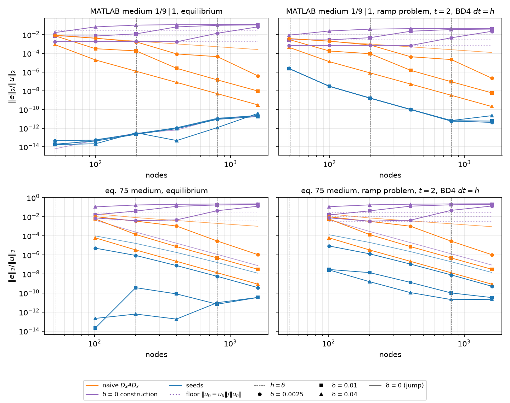

`scripts/heat1d_stiff.py` (the knee study appended to the reference check;
45 s cold, 4 s with everything cached; the sweep to 6400 nodes behind
`--counts`, 3 min once, its parabolic errors kept in
`outputs/heat1d_stiff_knee.json`). Two operators on the smooth medium at
δ ∈ {0, 0.04, 0.01, 0.0025}: naive `Dx A Dx` (`naive_operator`, the α
sampled at the nodes) and the δ = 0 construction (`jump_aware_operator`,
E1.2's rows across the edge centre with the pieces' data, the direct rows
on the smooth α elsewhere; §1.7). Both problems of §2.1: the equilibrium
against the quadrature, the ramp problem at t = 2 (BD4, dt = h) against the
cached Chebyshev reference, errors `‖e‖₂/‖u‖₂` at the nodes. Node counts
double from 50 to 6400 with E1's placements, the MATLAB edge mid-cell
(even counts) and eq. 75's two edges on nodes (`4k + 1`); eq. 75 starts at
101 because at 49 nodes `h α′/α ≈ 1` where the sinusoid meets the layer's
edges and the jump-aware operator's spectrum crosses into the right
half-plane (largest real part 248; 8.8 at 53 nodes, −2.1 at 101, −2.06 from
201 to 801, none positive from 101 on; measured on the interior operator
with the Dirichlet rows removed, `interior_operator`, as BD4 steps it and
as port notes §1.5 plots it), which E1 never ran either. Each δ > 0 line is read against its **floor**, the two
exact solutions' difference at the nodes, `‖u₀ − u_δ‖₂/‖u_δ‖₂` (quadrature
against quadrature; reference against reference for the ramp), which is
what the δ = 0 construction converges to while the grid does not resolve
the edge. Rates are `log₂` of consecutive errors; `h = δ` falls at n = 51,
201 and 801 for the three δ.

**The naive knee (P2 holds).** Errors and rates, both media:

| n | δ = 0 (jump) | δ = 0.04 | δ = 0.01 | δ = 0.0025 |
| --- | --- | --- | --- | --- |
| *MATLAB medium, equilibrium* | | | | |
| 50 | 8.26e-3 | 8.58e-4 | 7.64e-3 | 8.68e-3 |
| 100 | 4.08e-3 (1.02) | 1.97e-5 (5.44) | 3.15e-4 (4.60) | 4.23e-3 (1.04) |
| 200 | 2.04e-3 (1.00) | 1.23e-6 (4.01) | 1.85e-4 (0.77) | 1.69e-3 (1.32) |
| 400 | 1.02e-3 (1.00) | 7.81e-8 (3.97) | 2.51e-6 (6.20) | 8.70e-5 (4.28) |
| 800 | 5.12e-4 (1.00) | 4.90e-9 (3.99) | 1.46e-7 (4.11) | 4.47e-5 (0.96) |
| 1600 | 2.56e-4 (1.00) | 3.07e-10 (4.00) | 9.34e-9 (3.97) | 3.90e-7 (6.84) |
| 3200 | 1.28e-4 (1.00) | 1.93e-11 (3.99) | 5.88e-10 (3.99) | 1.80e-8 (4.43) |
| 6400 | 6.42e-5 (1.00) | 1.50e-11 (0.36) | 1.05e-10 (2.49) | 1.16e-9 (3.96) |
| *MATLAB medium, ramp, t = 2* | | | | |
| 50 | 3.86e-3 | 4.50e-4 | 3.09e-3 | 3.85e-3 |
| 100 | 1.97e-3 (0.98) | 1.29e-5 (5.12) | 1.79e-4 (4.11) | 2.04e-3 (0.92) |
| 200 | 9.90e-4 (0.99) | 8.19e-7 (3.98) | 9.25e-5 (0.95) | 7.90e-4 (1.37) |
| 400 | 4.97e-4 (0.99) | 5.22e-8 (3.97) | 1.54e-6 (5.91) | 4.36e-5 (4.18) |
| 800 | 2.49e-4 (1.00) | 3.28e-9 (3.99) | 9.32e-8 (4.04) | 2.19e-5 (0.99) |
| 1600 | 1.25e-4 (1.00) | 2.05e-10 (4.00) | 5.96e-9 (3.97) | 2.20e-7 (6.64) |
| 3200 | 6.24e-5 (1.00) | 1.35e-11 (3.93) | 3.76e-10 (3.99) | 1.14e-8 (4.27) |
| 6400 | 3.12e-5 (1.00) | 1.64e-11 (−0.28) | 2.57e-11 (3.87) | 7.27e-10 (3.96) |
| *eq. 75 medium, equilibrium* | | | | |
| 101 | 2.06e-2 | 6.12e-5 | 5.83e-3 | 1.02e-2 |
| 201 | 8.05e-3 (1.35) | 3.26e-6 (4.23) | 1.38e-4 (5.40) | 3.44e-3 (1.56) |
| 401 | 3.98e-3 (1.01) | 2.12e-7 (3.95) | 7.38e-6 (4.22) | 1.06e-3 (1.70) |
| 801 | 1.98e-3 (1.01) | 1.34e-8 (3.98) | 4.77e-7 (3.95) | 2.85e-5 (5.22) |
| 1601 | 9.87e-4 (1.00) | 8.39e-10 (4.00) | 3.07e-8 (3.96) | 1.04e-6 (4.77) |
| 3201 | 4.92e-4 (1.00) | 5.30e-11 (3.98) | 1.94e-9 (3.99) | 6.08e-8 (4.10) |
| 6401 | 2.46e-4 (1.00) | 1.32e-11 (2.01) | 1.52e-10 (3.67) | 3.90e-9 (3.96) |
| *eq. 75 medium, ramp, t = 2* | | | | |
| 101 | 1.93e-2 | 6.06e-5 | 5.68e-3 | 9.61e-3 |
| 201 | 7.30e-3 (1.40) | 3.25e-6 (4.22) | 1.34e-4 (5.40) | 3.23e-3 (1.57) |
| 401 | 3.62e-3 (1.01) | 2.11e-7 (3.95) | 7.36e-6 (4.19) | 1.01e-3 (1.68) |
| 801 | 1.80e-3 (1.01) | 1.33e-8 (3.98) | 4.76e-7 (3.95) | 2.74e-5 (5.20) |
| 1601 | 8.96e-4 (1.00) | 8.36e-10 (3.99) | 3.06e-8 (3.96) | 1.03e-6 (4.73) |
| 3201 | 4.47e-4 (1.00) | 5.62e-11 (3.90) | 1.93e-9 (3.99) | 6.07e-8 (4.09) |
| 6401 | 2.24e-4 (1.00) | 4.54e-11 (0.31) | 2.02e-10 (3.26) | 3.90e-9 (3.96) |

While `h ≳ 4δ` the naive line is the jump's, at about first order (rates
0.9–1.7; the pre-knee rates are noisy because the nodes sample the tanh at
grid-dependent positions, as §1.7 said, and on the MATLAB medium the
δ = 0.01 line even shows a 4.6 followed by a 0.77). Across the knee the
error drops by two to three orders between `h = 2δ` and `h = δ/2` (MATLAB
δ = 0.0025: 8.70e-5 → 3.90e-7, a factor 220; eq. 75: 1.06e-3 → 1.04e-6, a
factor 1000; the companion saw 200 between `h = 2δ` and `h = δ`), the
single doubling `h = δ → δ/2` carrying most of it (rates 5.9–6.8 there).
Below `h ≈ δ/2` every line is fourth order (3.9–4.4) down to the direct
solve's round-off at 6400 nodes (1–5e-11, where the δ = 0.04 rates
collapse). The ramp problem repeats the equilibrium's numbers and rates
to two digits at every count: at t = 2 the ramp solution is close to
equilibrium, and the knee is a property of the operator, not of the
problem. On eq. 75 the knee sits at the same `h/δ`, one to two orders
higher in error, since the sinusoid piece is not resolved to rounding by
any of these grids.

**The δ = 0 construction (P3 holds for `h ≳ 2δ`, and fails below).** The
same runs, the floor quoted at the finest count (it moves by 3 % over the
sweep as the nodal norm converges):

| n | δ = 0.04, floor 2.92e-2 | δ = 0.01, floor 7.47e-3 | δ = 0.0025, floor 1.88e-3 |
| --- | --- | --- | --- |
| *MATLAB medium, equilibrium* | | | |
| 50 | 1.68e-2 | 7.35e-3 | 1.836e-3 |
| 100 | 6.85e-2 | 7.21e-3 | 1.861e-3 |
| 200 | 1.05e-1 | 1.23e-2 | 1.869e-3 |
| 400 | 1.18e-1 | 6.86e-2 | 1.743e-3 |
| 800 | 1.23e-1 | 1.00e-1 | 1.42e-2 |
| 1600 | 1.25e-1 | 1.12e-1 | 6.87e-2 |
| 3200 | 1.26e-1 | 1.16e-1 | 9.91e-2 |
| 6400 | 1.27e-1 | 1.18e-1 | 1.10e-1 |

| n | δ = 0.04, floor 1.14e-2 | δ = 0.01, floor 2.87e-3 | δ = 0.0025, floor 7.19e-4 |
| --- | --- | --- | --- |
| *MATLAB medium, ramp, t = 2* | | | |
| 50 | 8.80e-3 | 2.823e-3 | 6.970e-4 |
| 100 | 2.51e-2 | 2.782e-3 | 7.122e-4 |
| 200 | 3.91e-2 | 4.79e-3 | 7.158e-4 |
| 400 | 4.45e-2 | 2.34e-2 | 7.009e-4 |
| 800 | 4.67e-2 | 3.54e-2 | 4.65e-3 |
| 1600 | 4.77e-2 | 3.99e-2 | 2.30e-2 |
| 3200 | 4.81e-2 | 4.17e-2 | 3.45e-2 |
| 6400 | 4.84e-2 | 4.25e-2 | 3.88e-2 |

| n | δ = 0.04, floor 3.05e-2 / 2.71e-2 | δ = 0.01, floor 1.20e-2 / 1.06e-2 | δ = 0.0025, floor 3.59e-3 / 3.20e-3 |
| --- | --- | --- | --- |
| *eq. 75 medium, equilibrium / ramp* | | | |
| 101 | 1.08e-1 / 1.12e-1 | 1.62e-2 / 1.53e-2 | 7.39e-3 / 7.51e-3 |
| 201 | 1.68e-1 / 1.73e-1 | 3.89e-2 / 4.09e-2 | 3.79e-3 / 3.41e-3 |
| 401 | 1.99e-1 / 2.04e-1 | 1.21e-1 / 1.27e-1 | 4.60e-3 / 4.29e-3 |
| 801 | 2.13e-1 / 2.18e-1 | 1.70e-1 / 1.77e-1 | 4.24e-2 / 4.60e-2 |
| 1601 | 2.20e-1 / 2.24e-1 | 1.90e-1 / 1.97e-1 | 1.25e-1 / 1.32e-1 |
| 3201 | 2.23e-1 / 2.27e-1 | 1.99e-1 / 2.06e-1 | 1.67e-1 / 1.75e-1 |
| 6401 | 2.24e-1 / 2.29e-1 | 2.03e-1 / 2.09e-1 | 1.84e-1 / 1.92e-1 |

Two regimes, and the prediction covered only the first:

- **`h ≳ 4δ`: on the floor, to three digits.** MATLAB δ = 0.0025 at 50,
  100, 200 nodes: 1.836e-3, 1.861e-3, 1.869e-3 against floors 1.836e-3,
  1.861e-3, 1.869e-3; the ramp 6.970e-4, 7.122e-4, 7.158e-4 against
  6.983e-4, 7.122e-4, 7.158e-4; eq. 75 at 101 nodes 7.39e-3 against
  3.60e-3 (the 101-node grid also carries E1's own 4.3e-3 at δ = 0, so
  it is not yet on the floor), at 201 nodes 3.79e-3 against 3.60e-3. The
  construction converges to the *jump's* solution, and its error is the
  distance between the two problems, first order in δ: the elliptic floor
  is 0.73–0.75 δ on the MATLAB medium (2.92e-2, 7.47e-3, 1.88e-3), the
  ramp's at t = 2 is 0.28 δ (1.14e-2, 2.87e-3, 7.19e-4), the
  "time-dependent constant" of §1.7 measured at one time. On eq. 75 the
  floors are 0.76 δ, 1.20 δ, 1.44 δ (elliptic) and 0.68 δ, 1.06 δ, 1.28 δ
  (ramp): not proportional to δ at these widths, for the reason the next
  paragraph gives.
- **`h ≲ δ`: off the floor and growing, to an O(1) constant.** Once the
  plain rows resolve the edge (they are fourth-order rows on the smooth α,
  nothing wrong with them), the three or four rebuilt rows still impose
  the translated basis, a kink with slope ratio `α⁺/α⁻` at the centre,
  on a solution whose slope ratio across the centre cell tends to one.
  The discrete solution takes the kink, and the error saturates at a
  constant of the contrast and the problem: 0.127 (equilibrium) and 0.048
  (ramp) on the MATLAB medium, 0.22 and 0.23 on eq. 75, reached from
  below with rate −0.6, −0.2, −0.06, −0.02 per doubling. Between the two
  regimes the error dips slightly *below* the floor at `h ≈ 2δ` (MATLAB
  δ = 0.0025: 1.743e-3 against 1.871e-3; the partly resolved plain rows
  pull the solution part of the way to the truth) and is 7–10× the floor
  at `h = δ`. On constant pieces the error is nearly a function of `h/δ`
  alone: 6.85e-2, 6.86e-2, 6.87e-2 at `h/δ ≈ ½` for the three δ, 0.105,
  0.100, 0.099 at ¼. So "treat the edge as a jump" is the right baseline
  exactly where the grid cannot see the edge, and the worst of all the
  lines where it can; to use it one has to know δ and switch it off at
  `h ≈ 2δ`, which the seeds never need (§1.4's last paragraph: for
  δ ≳ h every row is seeded and the seeds' weights tend to the standard
  ones). The naive line never does anything that bad, and the
  jump-aware line at δ = 0 is E1's: exact to rounding on the two
  constants (6e-15 to 3e-10 as the solve's conditioning grows), fourth
  order on eq. 75 (3.85–4.12).

**The floor's constant.** With `F(1) = ∫_{−1}^{1} dξ/α` the total
resistance, `(F₀(1) − F_δ(1)) / δ` against §1.7's `c`, which E3.3 found
in closed form: the antiderivative of the blended integrand in
`z = (x − x_c)/δ` is `z/a + (a − b)/(2ab) ln(a + b e^{2z})`
(`tests/heat1d/test_exact.py::tanh_edge_integral`), and subtracting the
jump's `z/a`, `z/b` on the two sides leaves, as `Z → ∞`, only the
logarithms' difference:

    c(a, b) = (a − b) ln(a/b) / (2ab)    (`exact.edge_resistance_deficit`),

symmetric in `a ↔ b`, positive since `1/α` is convex (the blend's
resistance is below the jump's), 8.788898 for `1/9 | 1` and 10.361633 for
`1 | 0.1`. On the MATLAB medium the measured ratio is 8.788898 at all
three δ (ratio 1.0000: the tails are exponentially small and the shift is
`c δ` to rounding). On eq. 75, whose two edges both have contrast ten so
that `Σ c = 20.72`, the measured ratio is 9.06, 15.31, 18.95 at δ = 0.04,
0.01, 0.0025 (0.44, 0.74, 0.91 of the limit; 19.96 at δ = 0.001, 20.64 at
0.0001): the sinusoid piece has `α′/α = 25` where it meets the layer's
edges, so at δ = 0.01 its value changes by 75 % across `±3δ` and the
"constant contrast" the closed form assumes is not what the edge sees.
The approach is first order in δ with a constant of that slope; the
floors above are the exact quantity and carry it. E3.5's T0 (widen δ to
`m h`) inherits `c m h` on constant pieces and this slower approach on
eq. 75.

**"How far off in weights" as a residual (the first-order-in-δ/h defect).**
The seed weights the ticket compares against are E3.4's (P4 keeps §1.4's
scratch numbers, 84 % … 0.11 % at δ/h = 1 … 0.001); what E3.3 measures
without seeds is the same defect as the rows' residual on the true-δ
equilibrium, which is what enters the solution error. At fixed h (200 and
201 nodes, h = 0.01) with δ = (δ/h) h, `max |L_h (u_δ − u₀)|` over the
rows whose windows straddle a centre, `h²` of it over δ, `h² |L_h u₀|`
on the same rows (rounding on the constants, E1.2's exactness; the
sinusoid's own third-order truncation on eq. 75, which is why the
residual is taken on the difference), and the naive rows' `h · max |L_h
u_δ|` for the scale of a row that misses the slope jump outright:

| δ/h | MATLAB: residual | h² res / δ | h² \|L_h u₀\| | naive h \|L_h u_δ\| | eq. 75: residual | h² res / δ | h² \|L_h u₀\| | naive h \|L_h u_δ\| |
| --- | --- | --- | --- | --- | --- | --- | --- | --- |
| 1 | 6.58 | 0.066 | 4e-17 | 7.0e-3 | 20.2 | 0.20 | 3.6e-6 | 2.3e-2 |
| 0.5 | 5.34 | 0.107 | 4e-17 | 8.2e-3 | 20.5 | 0.41 | 3.6e-6 | 0.11 |
| 0.1 | 2.38 | 0.239 | 4e-17 | 7.9e-2 | 5.02 | 0.502 | 3.6e-6 | 0.32 |
| 0.01 | 0.238 | 0.2387 | 4e-17 | 0.109 | 0.515 | 0.515 | 3.6e-6 | 0.39 |
| 0.001 | 0.0238 | 0.2387 | 4e-17 | 0.112 | 0.0516 | 0.516 | 3.6e-6 | 0.39 |

`h² · residual / δ` settles to 0.2387 (MATLAB) and 0.516 (eq. 75) by
δ/h = 0.01, so the rows are off by `C δ/h²` against the naive rows'
`0.11/h` and `0.39/h`: a first-order-in-δ/h fraction of a wrong row,
ratio about `2 δ/h` on the MATLAB medium, and `u_δ − u₀ → −B c δ` past the
edge is what the row sees (a step of that size across the window). At
δ = h the scaled residual is a third of the constant: the edge is partly
inside the window and the rows are less wrong per unit δ, consistent with
the dip below the floor at `h ≈ 2δ` above.

**What this changes downstream.** P2 is ticked. P3 is ticked for the
unresolved regime and corrected for the resolved one; the manuscript's
baseline paragraph should say both, and the reason. The knee figure is
the frame E3.4's seed lines go on (one δ-independent fourth-order line
through the whole plot is the claim, P7), and E3.5's treatments are read
against the same floors. On eq. 75 the study's δ are not in the
asymptotic range of the floor constant, so any statement there quotes the
measured floor, not `c δ`.

Tests: `tests/test_heat1d_stiff.py` pins the grids' placements and the
101 floor, the knee on both media (pre-knee rates averaging below 2, a
first post-knee rate above 3.8, a factor above 100 between `h = 2δ` and
`h = δ/2`, E1's δ = 0 line), the construction on the floor to 1 % for
`h ≥ 4δ` and above 10× it at `h = δ/2` (elliptic, δ = 0.01 and 0.0025;
ramp at δ = 0.01 with the floor at 0.28 δ), the floor constants (exact on
the MATLAB medium, a first-order approach on eq. 75), the scaled residual
constant to 5 % between δ/h = 0.01 and 0.001 and below half of it at
δ/h = 1, and the driver's figure and cache;
`tests/heat1d/test_exact.py` pins the closed form against the quadrature
gap in both directions of the contrast.

### 2.3 The seed stencils (E3.4, #29)

`heat1d/stiff.py`: the chain of §1.2 marched as §1.3 prescribes, and the
seed operator on the knee sweep of §2.2 as its third line (blue; the δ = 0
construction moves to purple). The figure above replaces §2.2's. The
implementation, so the numbers below can be read:

- **The march.** One first-order system in `(φ_k, ψ_k = α φ_k′)`, DOP853
  at rtol 1e-13 / atol 1e-15 (`SEED_RTOL`, `SEED_ATOL`) in the stencil
  coordinate `ξ = (x − x_e)/h_s`, `h_s = max |x_i − x_e|` (the companion's
  half-width normalisation, `ξ_i = 0, ±½, ±1` on an interior row), with a
  fresh segment at every edge centre and at `±10δ` from it (`EDGE_STOP`).
  On each segment α is read from the piece of the medium's element that
  contains it (`Medium1D.elements`), which is what makes the evaluation
  one-sided at a jump: δ = 0 is marched like any other width, the centre a
  stop across which `(φ, ψ)` is continuous, and it reproduces E1.2's
  algebra to rounding (P4 below) rather than being dispatched to it.
- **Batched rows.** Every seeded row whose window has the same node pattern
  `ξ_i` marches in one system (`seed_profiles`, `(rows, 2, 5)` states):
  the rows' stops, spaced `h/h_s = ½` apart in ξ, union to at most six per
  side, so an operator costs some sixteen `solve_ivp` calls whatever the
  count of seeded rows: 0.11 s for the 1284 rows of δ = 0.04 at 1600 nodes
  (1442 on eq. 75), 0.04 s for the 8 rows of δ = 0.0025 at 100. The batch
  agrees with single-row marches to 6e-15 on φ where the edge is resolved
  and to 2e-13 where it is not (DOP853's error norm is an RMS over the
  batch, so the few rows crossing the steep part are controlled to a factor
  sqrt(rows) more loosely); the weights agree to 7e-12 relative at worst
  and the solutions to rounding (`test_the_batched_march_agrees_with_
  single_stencils`; the equilibrium errors below are the same whether the
  rows are marched together, in eights or singly).
- **Which rows.** Those whose window span overlaps `(x_c − 20δ, x_c + 20δ)`,
  `TANH_REACH` (E3.2's bit-exact reach, not §1.3's 19δ): at δ = 0 exactly
  `straddling_windows`; 8 rows at δ = 0.0025 and 84 at δ = 0.04 on 100
  nodes; every row, the one-sided end rows in batches of their own, once
  the reach covers the domain. `reach` is the operator's one knob.
- **Cost of the study.** The driver reruns in 3.7 s with everything
  cached and took 18 s to add the 24 seed marches of the ramp sweep to the
  knee cache; the 41 tests of `tests/heat1d/test_stiff.py` and
  `tests/test_heat1d_stiff.py` run in 17 s.

**P4, the weights (holds).** Constant α = 0.7 gives 0.7 × Fornberg's
second-derivative weights to 1e-15 on the centred window and 2e-16 with
the centre off the nodes (the chain is nilpotent, so the order-8 march
reproduces the monomials exactly). On the MATLAB window of §1.4 (the
`1/9 | 1` jump half a cell right of the node, h = 0.01), `max |w_seed −
w_jump| / max |w_jump|` against E1.2's weights, with the stencil solve's
condition number as built and with the rows of A scaled to unit max norm
(the seeds carry the normalisation `α_e^{⌈k/2⌉}`, §1.2, which the weights
never see):

| δ/h | difference | cond A | rows scaled |
| --- | --- | --- | --- |
| 0 | 7e-16 | 90.3 | 90.3 |
| 1 | 0.843 | 100.4 | 147.0 |
| 0.5 | 0.465 | 137.9 | 206.7 |
| 0.1 | 0.114 | 114.2 | 114.2 |
| 0.01 | 0.0107 | 92.2 | 92.2 |
| 0.001 | 0.00107 | 90.5 | 90.5 |

§1.4's scratch numbers to three digits (84 %, 47 %, 11 %, 1.1 %, 0.11 %),
first order in δ/h (ratios 10.6 and 10.0 over the last two decades), and
the δ = 0 march equal to the translated basis to rounding at offsets ½,
3/2 and 0 cells (the last with the jump *on* the evaluation node, `α_e`
the owner's). The double-cross of P8 is the same limit twice over.

On eq. 75 the difference does not go to zero. At the layer's edge on a
node (x = 0, 201 nodes, `α_e` = 0.1 the layer's, `α′/α = 25` on that side)
it is 2.24, 2.04, 1.69, 1.31, 1.26 at δ/h = 1, ½, 0.1, 0.01, 0.001 and
1.25 at δ = 0: the `O(h α′/α)` floor of §1.4, at which E1.2's
degree-4-truncated operator on plain monomials and the exact chain part
company. It is first order in h (at x = 0.5: 1.75, 1.25, 0.50, 0.22 for
h = 0.02, 0.01, 0.005, 0.0025), O(1) on every grid of the study, and both
operators are fourth order on solutions (P6, P7): the two spaces are
different and equally good, as §1.4 said, and the seeds' one is the
better of the two in the solution error by 6–44× (below).

**P5, conditioning (holds, with the constant).** `cond A` in the stencil
coordinate is 23.5 at constant α for the centred window (the Vandermonde
value) and, on the MATLAB window, 90 at every δ ≤ 0.01 h (the translated
basis' own value at δ = 0), rising to 138 at δ = h/2 (207 rows-scaled) and
back to 24 for δ ≥ 10 h, where the seeds are the monomials again (§1.4's
last paragraph): within a factor six of the Vandermonde value from δ =
1e-5 h to 100 h, the companion's "20 to 60" at contrast 4 becoming 24 to
138 at contrast 9. On eq. 75's edge node the as-built numbers are 84 to
648 and the rows-scaled 117 to 452: the sinusoid's `h α′/α = 0.25` bends
every seed away from `ξ^k` inside the window, and the δ = 0 value (648) is
inflated by `α_e` being the owner's 0.1 rather than the blend's 0.55, a
row scaling the weights do not see (the rows-scaled 452 against 450 at
δ = 0.001 h). No solve in the study is threatened; the equilibrium
residuals below are rounding.

**P6, equilibrium (holds on constant pieces; on eq. 75 it is the plain
rows' line).** On the MATLAB medium the seed line is exact at every δ:

| n | δ = 0 | δ = 0.04 | δ = 0.01 | δ = 0.0025 | E1.2 at δ = 0 |
| --- | --- | --- | --- | --- | --- |
| 50 | 1.4e-14 | 1.7e-14 | 1.9e-14 | 4.5e-14 | 6.2e-15 |
| 100 | 5.9e-14 | 2.2e-14 | 4.2e-14 | 5.3e-14 | 5.1e-14 |
| 200 | 2.6e-13 | 3.2e-13 | 2.2e-13 | 2.6e-13 | 2.9e-13 |
| 400 | 1.2e-12 | 4.7e-14 | 8.9e-13 | 1.1e-12 | 6.3e-13 |
| 800 | 1.2e-11 | 1.2e-12 | 8.8e-12 | 1.0e-11 | 1.0e-11 |
| 1600 | 2.3e-11 | 3.8e-11 | 1.7e-11 | 2.3e-11 | 1.9e-11 |

Below 1e-12 to 400 nodes at every δ, then growing exactly as E1.2's own
δ = 0 line does (last column): the direct solve's conditioning, not the
seeds. The seed rows' residual on the exact solution, `h² max |L_h u_δ|`
over the seeded rows at 200 nodes, is 1.8e-16, 2.5e-16, 9.7e-17 at δ/h =
1, ½, 0.1 and 2.4e-13, 5.8e-13 at 0.01, 0.001 (against the δ = 0 rows'
6.6 … 0.024 of §2.2): rounding while the march crosses the edge in a few
steps, and the march's own floor once it takes many, which the solution
sees at δ ≲ h/40 (1.0e-11 at 101 nodes and δ = 5e-4, 4e-11 at 100 nodes
and δ = 1e-4; tightening rtol to SciPy's 100 eps changes neither, and
§1.4's remark that an edge below 1e-5 h is better served by the jump
weights stands, with the bound nearer 1e-2 h for 1e-12 work). The
ticket's "exact to 1e-12 at every δ" is met where the direct solve allows
it and for δ ≳ h/40.

On eq. 75 the seed rows are exact too, and the line is the error of the
rows that are *not* seeded, which depends on δ through the reach:

| n | δ = 0 | δ = 0.04 | δ = 0.01 | δ = 0.0025 | E1.2 at δ = 0 |
| --- | --- | --- | --- | --- | --- |
| 101 | 9.69e-5 | 2.2e-13 | 2.0e-14 | 5.05e-6 | 4.25e-3 |
| 201 | 1.58e-5 (2.61) | 6.2e-13 | 3.6e-10 | 8.65e-7 (2.55) | 2.45e-4 (4.12) |
| 401 | 1.79e-6 (3.14) | 1.8e-13 | 8.0e-11 | 7.54e-8 (3.52) | 1.67e-5 (3.88) |
| 801 | 1.57e-7 (3.51) | 9.6e-12 | 6.7e-12 | 5.61e-9 (3.75) | 1.13e-6 (3.89) |
| 1601 | 1.18e-8 (3.74) | 3.4e-11 | 3.4e-11 | 3.63e-10 (3.95) | 7.39e-8 (3.93) |

At δ = 0.04 the reach (0.8) covers the layer and the solve is exact at
every count. At δ = 0.01 it covers it at 101 nodes (2e-14) and from 201
on leaves the rows with `x ∈ (0.2, 0.3)` plain: FD4 on the sinusoid at
h = 0.01, pre-asymptotic (`u⁽⁶⁾ ∼ (2π)⁶`), 3.6e-10, falling to the solve's
floor by 801; seeding every row (`reach = 40`) at 201 nodes returns
1.3e-13. At δ = 0.0025 the reach is 0.05 and the layer's interior is plain
from 101 nodes on: the line is the sinusoid's own FD4 error with the rows
nearest the edges (`h α′/α = 0.5` at 101 nodes) removed, rate 2.55 → 3.95
as those rows become asymptotic. At δ = 0 only the six straddling rows are
seeded and the line is 44× below E1.2's at 101 nodes and 6× at 1601, at
rates 2.6 → 3.7 against E1.2's 3.9–4.1: E1.2's error was dominated by its
straddling rows' `O(h³)` local term, the seeds' by the plain rows next to
them. So "one δ-independent fourth-order line equal to the smooth
problem's" (§1.9) is right about the seeded rows and wrong about the
line, which is whichever plain rows the reach leaves inside the layer;
the note's prediction assumed the seeded set did not move with δ.

**P7, parabolic (holds; three digits at δ = 0.0025, 1.5 % at 0.01).** The
ramp problem at t = 2, BD4 at dt = h, against the true-δ reference:

| n | δ = 0 | δ = 0.04 | δ = 0.01 | δ = 0.0025 | construction at 0.0025 |
| --- | --- | --- | --- | --- | --- |
| *MATLAB medium* | | | | | |
| 50 | 2.487e-6 | 2.388e-6 | 2.462e-6 | 2.480e-6 | 6.97e-4 |
| 100 | 2.951e-8 (6.40) | 3.049e-8 (6.29) | 2.989e-8 (6.36) | 2.954e-8 (6.39) | 7.12e-4 |
| 200 | 1.614e-9 (4.19) | 1.690e-9 (4.17) | 1.638e-9 (4.19) | 1.616e-9 (4.19) | 7.16e-4 |
| 400 | 9.757e-11 (4.05) | 1.027e-10 (4.04) | 9.886e-11 (4.05) | 9.741e-11 (4.05) | 7.01e-4 |
| 800 | 6.1e-12 (4.00) | 6.5e-12 (3.97) | 6.3e-12 (3.97) | 5.6e-12 (4.12) | 4.65e-3 |
| 1600 | 4.2e-12 | 2.2e-11 | 5.8e-12 | 4.2e-12 | 2.30e-2 |
| *eq. 75 medium* | | | | | |
| 101 | 1.280e-4 | 2.606e-8 | 2.922e-8 | 8.497e-6 | 7.51e-3 |
| 201 | 1.991e-5 (2.68) | 1.531e-9 (4.09) | 1.373e-8 (1.09) | 1.281e-6 (2.73) | 3.41e-3 |
| 401 | 2.201e-6 (3.18) | 1.107e-10 (3.79) | 1.301e-9 (3.40) | 1.082e-7 (3.57) | 4.29e-3 |
| 801 | 1.910e-7 (3.53) | 2.1e-11 | 1.017e-10 (3.68) | 7.953e-9 (3.77) | 4.60e-2 |
| 1601 | 1.421e-8 (3.75) | 2.2e-11 | 3.3e-11 | 5.064e-10 (3.97) | 1.32e-1 |

On the MATLAB medium the seed line is one line: the δ = 0.0025 points sit
on the δ = 0 ones (the jump-aware operator's, which the seeds *are* at
δ = 0 on constant pieces) to 0.1–0.3 % at every count to 400, the δ = 0.01
ones to 1.0–1.5 % and the δ = 0.04 ones (δ ≈ h at 50 nodes, a genuinely
different solution) to 3–5 %; the rates are 6.4, 4.2, 4.05, 4.0 (E1.3's
super-convergent first pair, then four), and from 800 nodes every δ sits
on the reference's 2e-12 floor of §2.1 (6e-12, then 4e-12 to 2e-11), as
that section said the 800-node points would. The construction's δ =
0.0025 line is on its floor (7e-4) to 400 nodes, seven orders above the
seeds there and ten once h ≤ δ; the naive line crosses the seed line
nowhere. On eq. 75 the
reading of P6 repeats: δ = 0.04 (every row seeded) is the fourth-order
line 2.6e-8 → 2e-11 (4.09, 3.79, then the reference's 2–6e-11 floor), δ =
0.01 has the plain rows' 1.4e-8 at 201 nodes (1.7e-9 with every row
seeded) and is fourth order past it, δ = 0.0025 runs 2.7 → 4.0, and δ = 0
is 38× below E1.2's 4.93e-3 … 8.53e-8 at rates 2.7 → 3.75 against 3.9–4.1.

Two library-level checks without the Chebyshev reference, on the separable
solution `e^{ct} v(x)` (E1.3's pattern, `chebyshev_equilibrium(shift=c)`
on the smooth medium's elements; MATLAB medium, δ = 0, 0.01, 0.0025, 50 to
400 nodes): the seed lines converge at 4.95, 4.84, 4.15 and agree across
δ to 0.07 %, 0.17 %, 0.85 %, 2.3 % as the errors fall from 1.6e-6 to
1.0e-10 and the profiles `v_δ` themselves differ at O(δ). And §1.6's
local truncation on v (`L v = c v`): the seeded rows' residual is third
order (rates 3.06, 3.78 at δ = 0.01 and 3.15, 3.51 at 0.0025 over 100 →
400 nodes; `residual · n³` 0.27, 0.26, 0.15 and 0.43, 0.38, 0.27, the same
within a factor two between the widths, the "δ-independent constant"
P7 asked for) and the plain rows' fourth (3.94, 3.97 and 3.94, 4.01); at
800 nodes both are on the 48-node collocation profile's floor.

**P8, the double-cross (holds).** A layer two cells thick (`1 | 0.1 | 1`
on [0, 2h] at h = 0.05) with both tanh edges inside one window: the
window's seed weights are E1.2's translate-twice weights to 7.6e-15 at
δ = 0 and differ from them by 22.2 %, 1.86 %, 0.182 % at δ/h = 0.1, 0.01,
0.001 (first order in δ/h with constant 1.8 against the single edge's 1.1:
two edges, each a 10 : 1 contrast, inside one window);
the seed operator annihilates the smooth layer's exact equilibrium to
3e-13 at δ/h = 0, 0.1 and 0.5, the windows seeing both centres numbering
1, 5 and 23. One march, two stops per edge.

**P9, the spectrum (holds, and more).** The interior operator's
eigenvalues (Dirichlet rows removed, `interior_operator`) at δ = 0 and
0.0025:

| medium | n | max Re λ | max \|Im λ\| | min Re λ · h² | BD4 max amplification |
| --- | --- | --- | --- | --- | --- |
| MATLAB | 50 | −0.831 / −0.834 | 0 | −5.302 | 0.967 |
| | 100 | −0.831 / −0.834 | 0 | −5.326 | 0.983 |
| | 400 | −0.831 / −0.834 | 0 | −5.333 | 0.996 |
| eq. 75 | 49 | −2.05 / −2.08 | 0 | −5.302 | 0.918 |
| | 53 | −2.05 / −2.08 | 0 | −5.306 | 0.924 |
| | 101 | −2.06 / −2.08 | 0 | −5.326 | 0.960 |
| | 401 | −2.06 / −2.08 | 0 | −5.333 | 0.990 |

Real to the bit (no complex pair anywhere, the one-sided end rows
included), negative, the extreme FD4's `−16/3 h⁻²` in the α = 1 material
to 0.6 % at 50 nodes and 0.01 % at 400, BD4-damped at dt = h; the
least-damped eigenvalue moves by 0.4 % (MATLAB) and 1.5 % (eq. 75) between
the jump and the sub-grid edge. And the seed operator is stable on eq. 75 at
49 and 53 nodes (largest real part −2.05), where the δ = 0 construction
has eigenvalues at +248 and +8.8 (§2.2, `MIN_COUNT`): E1.2's under-resolved
translated basis, `h α′/α ≈ 1` at the layer's edges, is what crossed the
axis, and the exact chain does not. The sweep still starts at 101 (its
grids are shared by the three operators); E3.6 may run the seeds coarser
if the figure wants it.

**What this changes downstream.** P4, P5, P7, P8 and P9 are ticked as
predicted, P6 on constant pieces too; two readings are corrected. On
eq. 75 the seed line is the plain rows' line and moves with the reach, so
any statement about it names δ and the reach (the manuscript's 1-D
elliptic remark should stay on the MATLAB medium, where the exactness is
clean, plan R2). P7's "three digits at every n" holds for δ = 0.0025 and
becomes 1.5 % at δ = 0.01 and 5 % at 0.04, where δ ≈ h and the solutions
differ; the claim to make is the one line through the whole plot in the
figure, not a digit count. Three things for the manuscript: the seeds
need no δ to be switched off where the construction does (§2.2's h ≲ 2δ
regime is the seeds' at cost nothing: 1e-12 elliptic and the same
parabolic line at every h/δ from 16 to 1/32); they are the jump-aware
operator itself at δ = 0 on constant pieces (one construction, two
implementations, checked to rounding) and a better operator than it on
smoothly varying pieces (6–44× on eq. 75) and at coarse counts (stable at
49 nodes); and the march's floor at δ ≲ h/40 (a row residual of 1e-12,
a solution error of 1e-11) is the one place the ODE implementation shows,
which a collocation integration of the same chain would remove and E3.6
may mention as not built. E3.5 (#30) reads its treatments against the
tables above with the seed line as the target; E3.6 (#31) inherits
`COLOURS` (purple for the construction, blue for the seeds) and the
figure.

Tests: `tests/heat1d/test_stiff.py` (Fornberg at four centres; the δ = 0
march against E1.2 at three offsets; the 84 % … 0.11 % limit and its
ratios; the condition numbers' range, ends and peak; eq. 75's first-order
floor; the equilibrium below 1e-12 at three counts and three δ with the
residual below 1e-14, and the march's floor at δ = 1e-4; eq. 75's exact,
plain-row and δ = 0 lines against E1.2's; the separable solution's rates
and cross-δ agreement; the local truncation orders and constants; the
double-cross; the seeded windows at δ = 0 and with the reach; the spectra
at four grids with the construction's instability pinned at 49 nodes; the
batch against single stencils at 14 and at 1284 rows; six-point stencils
against Fornberg and against the degree-5 translated basis; the dispatch;
validation) and
`tests/test_heat1d_stiff.py` (the driver's seed line on the ramp problem
at the study's reference resolution, the weights and conditioning table,
the eq. 75 floor, the spectra at 49 and 101 nodes).

### 2.4 The coefficient treatments (E3.5, #30)

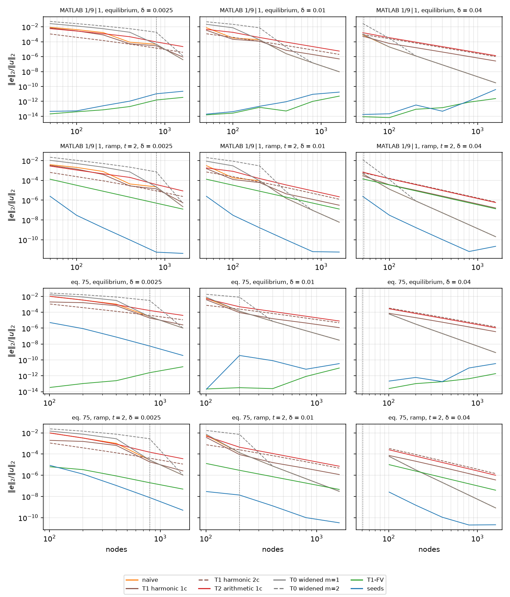

`heat1d/treatments.py`, and the comparator tables appended to
`scripts/heat1d_stiff.py` (30 s cold per medium for the 144 extra BD4
marches, 2 s cached; the whole driver 2 min cold, 6 s cached). Plan §3.4's
"change the medium, keep the scheme" comparators on §2.2's grids and
problems, read against the true-δ references with the seeds as the
target:

- **The nodal treatments are a material.** `NodalAlpha(grid, values)`: a
  table at the nodes, linear between them, no interfaces, elements cut at
  the nodes. `naive_operator` samples it to the bit, so a treatment is
  `Dx A Dx` on a changed A and nothing else. T1 `harmonic_cells(grid,
  medium, cells)` is `(b − a) / ∫_a^b dξ/α` over the window `x_j ± cells
  h/2` (one cell: the node's own cell; two: to the neighbours; clipped at
  the domain ends), T2 `arithmetic_cells` the same window's `∫ α / (b −
  a)` (`exact.alpha_integral`, the resistance quadrature with the other
  integrand). Both are differences of cumulative quadratures, so they
  carry a relative rounding of about `n ε` (1e-12 at 6400 nodes), below
  anything the tables read.
- **T0** `widened_edge(grid, medium, m)` is `SmoothEdges(jump, max(δ,
  m h))`: the same class, a wider edge, so the references and the windows
  stay consistent; below `δ = m h` it does not depend on δ at all.
- **T1-FV** `face_conductance_operator` is the three-point conservative
  scheme with `a_{i+½} = h / ∫_{x_i}^{x_{i+1}} dξ/α` (§1.8 item 3), an
  operator, not a medium; zero end rows for the Dirichlet rows to replace.
- **T3**, the band-limited α, is not built: the ticket keeps it only if
  E5.2 (#43) finds it in use for diffusion. *It did not (waves only;
  `LITERATURE.md` §1d), so T3 is dropped.*

Errors `‖e‖₂/‖u‖₂` at the nodes (the rate in parentheses), the ramp
problem at t = 2, MATLAB medium, the comparator columns in P10's order
with the untreated naive line and the seeds as the two ends:

| n | h/δ | naive | T1 1c | T1 2c | T2 1c | T0 m=1 | T0 m=2 | T1-FV | seeds |
| --- | --- | --- | --- | --- | --- | --- | --- | --- | --- |
| *δ = 0 (jump, mid-cell)* | | | | | | | | | |
| 50 | ∞ | 3.86e-3 | 3.86e-3 | 6.26e-4 | 3.86e-3 | 1.12e-2 | 2.22e-2 | 1.31e-4 | 2.49e-6 |
| 100 | ∞ | 1.96e-3 (0.98) | 1.96e-3 (0.98) | 2.30e-4 (1.44) | 1.96e-3 (0.98) | 5.67e-3 (0.98) | 1.13e-2 (0.98) | 3.24e-5 (2.02) | 2.95e-8 (6.40) |
| 200 | ∞ | 9.90e-4 (0.99) | 9.90e-4 (0.99) | 8.32e-5 (1.47) | 9.90e-4 (0.99) | 2.85e-3 (0.99) | 5.69e-3 (0.99) | 8.10e-6 (2.00) | 1.61e-9 (4.19) |
| 400 | ∞ | 4.97e-4 (0.99) | 4.97e-4 (0.99) | 2.97e-5 (1.48) | 4.97e-4 (0.99) | 1.43e-3 (0.99) | 2.86e-3 (0.99) | 2.02e-6 (2.00) | 9.76e-11 (4.05) |
| 800 | ∞ | 2.49e-4 (1.00) | 2.49e-4 (1.00) | 1.06e-5 (1.49) | 2.49e-4 (1.00) | 7.18e-4 (1.00) | 1.43e-3 (1.00) | 5.06e-7 (2.00) | 6.11e-12 (4.00) |
| 1600 | ∞ | 1.25e-4 (1.00) | 1.25e-4 (1.00) | 3.75e-6 (1.50) | 1.25e-4 (1.00) | 3.59e-4 (1.00) | 7.18e-4 (1.00) | 1.26e-7 (2.00) | 4.18e-12 (0.55) |
| *δ = 0.01* | | | | | | | | | |
| 50 | 4.08 | 3.09e-3 | 1.53e-3 | 7.03e-4 | 1.79e-3 | 8.65e-3 | 2.00e-2 | 1.30e-4 | 2.46e-6 |
| 100 | 2.02 | 1.79e-4 (4.11) | 1.23e-4 (3.63) | 2.37e-4 (1.57) | 8.21e-4 (1.13) | 2.93e-3 (1.56) | 8.69e-3 (1.20) | 3.27e-5 (2.00) | 2.99e-8 (6.36) |
| 200 | 1.01 | 9.25e-5 (0.95) | 5.97e-5 (1.04) | 6.99e-5 (1.76) | 1.54e-4 (2.41) | 9.12e-5 (5.00) | 2.92e-3 (1.57) | 8.14e-6 (2.00) | 1.64e-9 (4.19) |
| 400 | 0.50 | 1.54e-6 (5.91) | 4.38e-6 (3.77) | 1.91e-5 (1.87) | 3.48e-5 (2.15) | 1.54e-6 (5.89) | 7.34e-6 (8.63) | 2.03e-6 (2.00) | 9.89e-11 (4.05) |
| 800 | 0.25 | 9.32e-8 (4.04) | 1.20e-6 (1.87) | 4.94e-6 (1.95) | 8.74e-6 (1.99) | 9.32e-8 (4.04) | 9.32e-8 (6.30) | 5.09e-7 (2.00) | 6.32e-12 (3.97) |
| 1600 | 0.13 | 5.96e-9 (3.97) | 3.09e-7 (1.96) | 1.25e-6 (1.99) | 2.19e-6 (2.00) | 5.96e-9 (3.97) | 5.96e-9 (3.97) | 1.27e-7 (2.00) | 5.76e-12 (0.13) |
| *δ = 0.0025* | | | | | | | | | |
| 50 | 16.3 | 3.85e-3 | 3.28e-3 | 6.35e-4 | 2.78e-3 | 1.05e-2 | 2.16e-2 | 1.31e-4 | 2.48e-6 |
| 100 | 8.08 | 2.04e-3 (0.92) | 1.37e-3 (1.26) | 2.38e-4 (1.42) | 1.11e-3 (1.33) | 4.99e-3 (1.08) | 1.06e-2 (1.02) | 3.20e-5 (2.03) | 2.95e-8 (6.39) |
| 200 | 4.02 | 7.90e-4 (1.37) | 3.95e-4 (1.79) | 8.94e-5 (1.41) | 4.59e-4 (1.27) | 2.16e-3 (1.21) | 5.02e-3 (1.09) | 8.00e-6 (2.00) | 1.62e-9 (4.19) |
| 400 | 2.01 | 4.36e-5 (4.18) | 2.74e-5 (3.85) | 2.96e-5 (1.60) | 1.99e-4 (1.20) | 7.23e-4 (1.58) | 2.16e-3 (1.22) | 2.01e-6 (2.00) | 9.74e-11 (4.05) |
| 800 | 1.00 | 2.19e-5 (0.99) | 1.40e-5 (0.97) | 8.69e-6 (1.77) | 3.76e-5 (2.41) | 2.18e-5 (5.05) | 7.21e-4 (1.58) | 5.01e-7 (2.00) | 5.61e-12 (4.12) |
| 1600 | 0.50 | 2.20e-7 (6.64) | 5.50e-7 (4.67) | 2.37e-6 (1.87) | 8.59e-6 (2.13) | 2.20e-7 (6.63) | 4.96e-7 (10.5) | 1.25e-7 (2.00) | 4.22e-12 (0.41) |

The δ = 0.04 block (h/δ = 1.02 at 50 nodes, resolved from 100 on) and both
elliptic tables are in the driver's output; the seed line is §2.3's, on
the reference's floor from 800 nodes.

**P10, T1-FV (holds).** Exact at equilibrium at every δ and both
placements: 1e-14 at 50 nodes, rising with n to 6.5e-12 at 1600 (MATLAB)
and 1.4e-11 at 1601 (eq. 75), the cumulative quadrature's `n ε` on top of
the direct solve's growth that the seed line shows too (§2.3); the
discrete flux equals `equilibrium_flux` at every face to 2e-12
(`test_the_face_conductance_scheme_is_exact_at_equilibrium`). Second order
in the ramp problem at every δ with one constant: on the MATLAB medium the
δ = 0, 0.01 and 0.0025 columns agree to 1 % at every count and the δ = 0.04
one (1.40e-4 → 1.35e-7) sits 7 % above them; on eq. 75 the rate is 2.00
at every δ from 401 nodes on but the constant moves with δ by up to 40 %
(6.47e-8, 3.93e-8, 4.62e-8, 4.99e-8 at 1601 nodes for δ = 0, 0.04, 0.01,
0.0025: the sinusoid varies across the edge, §2.2's slow approach again),
with one wobble (rate 0.91 at 201 nodes, h = 4δ, δ = 0.0025) where the
face across the edge changes character. **On eq. 75 it is ahead of the seeds at coarse counts:**
at δ = 0, 1.63e-5, 4.12e-6, 1.03e-6 against the seeds' 1.28e-4, 1.99e-5,
2.20e-6 at 101, 201, 401 nodes, the seeds ahead from 801 (1.91e-7 against
2.59e-7); at δ = 0.0025, 6.35e-6 against 8.50e-6 at 101, the seeds ahead
from 201. That is §2.3's pre-asymptotic sinusoid line (rates 2.7 → 3.75
on the plain rows, the `O(h α′/α)` floor), not the edge: at δ = 0.04 and
0.01 the seeds lead at every count, by 400× at 101 nodes and δ = 0.01
(2.92e-8 against 1.28e-5). On the MATLAB medium they lead everywhere, by
50× at 50 nodes and 3e4× at 1600.

**P10, T1 under `Dx A Dx` (holds, with a reading).** Not exact: the
module reproduces §1.8's residuals 5.58 and 1.24 (one and two cells, the
mid-cell jump at 100 nodes; `test_no_nodal_alpha_makes_dx_a_dx_exact_
the_section_1_8_residuals`). With the edge mid-cell the one-cell window
ends *on* the jump, so at δ = 0 T1 (one cell) and T2 (one cell) are the
naive operator to rounding in every row of the table; on eq. 75, whose
edges sit on nodes, the one-cell window straddles them and T1 (one cell)
is 9–35× below naive at δ = 0 (2.07e-3 → 2.56e-5, rates → 1.5). The
**two-cell harmonic mean converges at order 1.5** in this norm (rates 1.44
→ 1.50 parabolic, 1.50 elliptic, both media), a local defect and not a
global one: its max-norm error is O(h) (1.18e-3 → 7.28e-5 at 100 → 1600
nodes, rates 1.00) and sits on the two nodes beside the edge, with
rounding (1e-12) beyond |x| > 0.2, so `‖e‖₂/‖u‖₂ ∝ h · n^{−1/2}`. A
max-norm table would call it first order; the manuscript says which norm.
It is the best nodal treatment while the edge is unresolved (7.03e-4
against naive's 3.09e-3 at 50 nodes, δ = 0.01), 6–33× ahead of naive at
δ = 0 (the gap widening with n, the orders differing by ½) and 4–9× at
h ≥ 4δ.

**P10, T0 (holds, with the constant).** T0's own floor is the widened
medium's exact equilibrium against the true one, `‖u_{max(δ, m h)} −
u_δ‖/‖u_δ‖`, and T0's elliptic error *is* that floor: to 0.1 % for m = 2
at every h > δ/2 (ratios 1.000 on both media, 1.006 at h = δ/2 where the
widened edge is `1.01 δ` wide and the operator is at its own knee) and to
1 % for m = 1 at h ≥ 2δ (1.006, 0.998, 0.999, 1.000 at δ = 0.0025), then
above it at
h ≈ δ (ratio 4.9 at h = 1.01 δ, 19 at 1.00 δ: `m h − δ` is a sliver and the
naive operator's knee error is what is left), and the naive operator
itself once m h ≤ δ. The floor is `c (m h − δ)` in resistance (§2.2's
closed form, `test_the_widened_edge_sits_a_resistance_deficit_from_the_
true_medium` to 1e-10) and 0.70–0.74 `(m h − δ)` in this norm on the
MATLAB medium, drifting to 0.66 by a width of 0.08 as the widened tails
reach the boundary. So T0 is first order with the constant `c m`, as
predicted, and that makes it the **worst** treatment, not T1's equal: 2.9×
(m = 1) and 5.7× (m = 2) above naive at δ = 0 on the MATLAB medium, on
every grid. Widening an edge the grid already fails to resolve adds
resistance error without removing the knee; it only ever helps a scheme
whose failure is on the resolved side, which `Dx A Dx` is not.

**P10, T2 (holds where it says "≈ naive", not elsewhere).** Equal to
naive at δ = 0 with the edge mid-cell (the one-cell window again), 20–40 %
below it on eq. 75, and at δ > 0 the worst nodal treatment for h ≲ 2δ
(1.54e-4 against T1's 5.97e-5 at h = δ, δ = 0.01), second order once the
edge is resolved.

**Every nodal treatment caps the naive operator at second order once the
edge is resolved.** For h ≲ δ/4 the naive line is fourth order and the
treated lines are second order with the FV constant times 1–5 (δ = 0.04,
1600 nodes, ramp: naive 2.05e-10, T1-FV 1.35e-7, T1 1c 1.62e-7, T2
5.76e-7, T1 2c 6.50e-7; the seeds 2.2e-11 on the reference's floor): the
cell mean perturbs a smooth α by O(w²) and the fourth-order operator
faithfully solves the perturbed problem. The nodal treatments therefore
have the δ = 0 construction's property (§2.2): they help only while
h ≳ δ and must know δ to be switched off, which the seeds need not.

**The ranking as measured.** With the edge unresolved (h ≥ 4δ, δ = 0
included), on both media and both problems: *seeds < T1-FV < T1 (two
cells) < naive ≳ T1 (one cell) ≈ T2 < T0 (m = 1) < T0 (m = 2)*, the middle
three within a factor two of each other; at 200 nodes and δ = 0.0025 on
the ramp problem, 1.6e-9, 8.0e-6, 8.9e-5, 7.9e-4 / 4.0e-4 / 4.6e-4, 2.2e-3,
5.0e-3. Across the knee (h from 2δ to δ/2) the naive line and T0 (m = 1)
drop through the cell-mean lines, and in §2.2's dip at h ≈ 2δ naive can
come in below T1 (two cells) by a quarter (δ = 0.01 at 100 nodes; not at
δ = 0.0025 and 400). Resolved
(h ≤ δ/4): *seeds < naive = T0 < T1-FV ≈ T1 (one cell) < T2 ≈ T1 (two
cells)*. P10's "T1 ≈ T0" and "T2 ≈ naive at every δ" are corrected; its
order of the ends stands, with the one exception above (eq. 75 below 800
nodes at δ = 0 and 0.0025, where the seeds' sinusoid line is still
pre-asymptotic and the second-order FV is ahead).

**What this changes downstream.** P10 is ticked for T1-FV's exactness and
order and for T0's floor and constant, and corrected for the ranking.
Three things for the manuscript: the strongest low-order comparator is
the finite-volume scheme with exact face conductances, exact at
equilibrium and second order at every δ with one constant, and on the
smoothly varying medium it is ahead of the seeds until the seeds' own
sinusoid error has converged (the honest comparator paragraph says so;
E4.9's scattered-node treatments, #40, have no such twin); the cell means
and the widened edge are first-order-family treatments (1.5 in this norm
for the two-cell mean) that help only while h ≳ δ and cap the fourth-order
operator at second order once h ≲ δ/4, so they share the construction's
need to know δ; and the 1-D elliptic table cannot rank the methods (plan
§3.2), T1-FV and the seeds both exact and growing together with n, so the
elliptic remark stays one line and the ranking is the parabolic table's.
E3.6 (#31) inherits `COMPARATORS`, `COMPARATOR_STYLE` and the figure; E5.2
(#43) pins the sources (Tikhonov & Samarskii 1962 for the exact
conductances, Patankar 1980 ch. 4 for the harmonic mean) and decides T3.

Tests: `tests/heat1d/test_treatments.py` (every treatment the identity on
a constant α, T1-FV then α times the three-point second difference; the
`NodalAlpha` table, interpolant, slopes, elements and validation; the
windows' clipping; T1-FV exact at equilibrium at three δ on both
placements and both media with the flux to 1e-11; Patankar's harmonic mean
at δ = 0 mid-cell and the pieces' own values on a node; §1.8's residuals
5.58 and 1.24 from the module; the δ = 0 forms bit-equal through
`SmoothEdges(jump, 0)`, the first-order approach as δ → 0 for the means
and the conductances, T0 δ-independent below `m h`; AM ≥ HM with the 7/3
ratio beside the mid-cell jump, both means second order on a sinusoid
with the 4× between one and two cells; T1-FV second order on a
manufactured smooth problem; the widened medium's resistance deficit
`c (m h − δ)`; the one-cell mean seeing the tanh tail and nothing beyond
it; a smooth-edged eq. 64) and `tests/test_heat1d_stiff.py` (the
comparator table complete at every δ with T1-FV's rate 2 and δ-independent
constant, the ranking where the edge is unresolved, the one-cell means
equal to naive at δ = 0 mid-cell, the elliptic exactness of T1-FV and the
seeds; T0 on its floor to 1 % for m = 2 and the floor constant in
0.65–0.76; the driver's second figure and the cache keys).

### 2.5 Closing the 1-D study: the seed functions, a snapshot, the driver, and what §2 states (E3.6, #31)

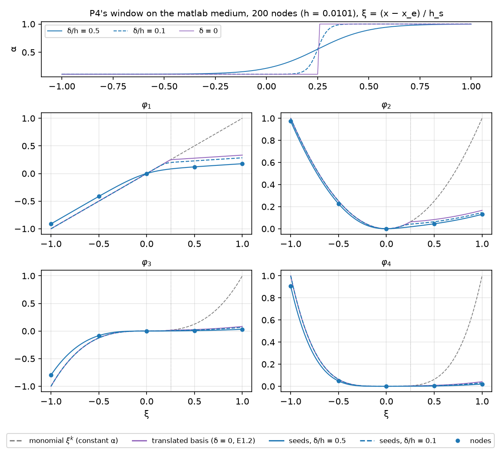

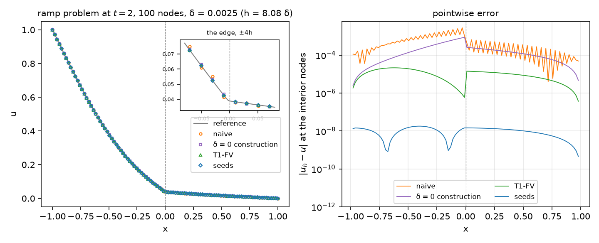

E3.6 adds the two figures the manuscript draws its construction and its
headline from, the run's results file, and this closing section, which
states what §2 has established with the numbers and the subsection each
traces to. `scripts/heat1d_stiff.py` now runs, in this order: the
references and their checks (§2.1), the knee sweep with the seed line and
the P4–P9 tables (§2.2–2.3), the comparators (§2.4), the seed functions and
the snapshot (this section), then writes `outputs/heat1d_stiff.json`. From
a populated `outputs/` the whole driver takes 6.0 s (references 0.1 s,
knee 3.3 s, comparators 2.1 s, the two figures 0.6 s), well under the
minute #31 asks for; cold it is about 2 min, all of it the parabolic
references (20 s) and the 396 BD4 marches of the knee and comparator
sweeps, every one cached in `heat1d_stiff_knee.json` afterwards.

- **The seed functions (first figure).** P4's window on the MATLAB medium
  (200 nodes, h = 0.01005, the `1/9 | 1` edge half a cell right of the
  evaluation node, `h_s = 2h`), in the stencil coordinate `ξ = (x −
  x_e)/h_s` in which the march works (§1.3): α across the window on top,
  and below it seeds `φ₁ … φ₄` at δ/h = ½ and 0.1 against the monomials
  `ξ^k` (constant α) and E1.2's translated basis (δ = 0, `translated_basis`
  re-centred at `x_e` with `shift_matrix`, which is what the initial
  conditions `φ_k(x_e) = φ_k′(x_e) = 0` pick out of its span). Each seed is
  multiplied by `(α₀/α_e)^⌈k/2⌉`, `α₀` the jump's value at `x_e` and `α_e`
  the blend's, so that the lines are comparable across δ: the seeds carry
  the normalisation `α_e^⌈k/2⌉` of §1.2, every moment condition is
  homogeneous in it, and the weights never see it (without the factor the
  δ/h = ½ seeds sit a factor two off, `α_e` being 0.22 there against the
  owner's 0.11). On the node's side of the edge the δ = 0 seeds are the
  monomials themselves (checked to 1e-13), across it they are the
  translated polynomials with the 9 : 1 slope, and the δ > 0 seeds bend
  through the edge instead of kinking at it. The sup distances over the
  window (`seed_functions`; the driver prints δ/h = 0, ½, 0.1 and the
  test the ladder below it):

  | δ/h | vs E1.2, k = 1 | k = 2 | k = 3 | k = 4 | vs `ξ^k`, k = 1 | k = 2 |
  | --- | --- | --- | --- | --- | --- | --- |
  | 0 | 2.9e-15 | 2.7e-15 | 2.1e-15 | 1.4e-15 | 0.667 | 0.833 |
  | 1 | 0.312 | 0.198 | 0.559 | 0.440 | 0.831 | 0.861 |
  | 0.5 | 0.167 | 0.045 | 0.204 | 0.094 | 0.822 | 0.870 |
  | 0.1 | 5.12e-2 | 2.12e-2 | 1.67e-2 | 1.02e-2 | 0.715 | 0.853 |
  | 0.01 | 5.12e-3 | 2.51e-3 | 1.81e-3 | 1.20e-3 | 0.672 | 0.836 |
  | 0.001 | 5.12e-4 | 2.55e-4 | 1.83e-4 | 1.22e-4 | 0.667 | 0.834 |

  At δ = 0 the march *is* E1.2's algebra function by function, to 3e-15
  (P4 checked the weights only, §2.3); from δ/h = 0.1 down the distance is
  first order in δ/h to three digits (P4's weights: 11 %, 1.1 %, 0.11 %);
  the monomials stay O(1) away at every δ, the kink. On eq. 75's window
  (201 nodes, the edge on the node) the δ = 0 distance is 0.19–0.40 and does not shrink with δ: that is the
  `O(h α′/α)` gap between E1.2's degree-4-truncated pieces and the exact
  chain that P4 recorded in the weights (1.25, i.e. 125 %, at h = 0.01), so
  the figure
  is the MATLAB window's and the eq. 75 seeds are compared to the
  reference solution, not to E1.2, throughout §2.
- **The snapshot (second figure).** The ramp problem at t = 2 on 100 nodes
  (h = 0.0202) with δ = 0.0025, `h = 8δ`: the reference, the four nodal
  solutions (naive, the δ = 0 construction, T1-FV, the seeds) with a zoom
  at the edge, and the interior nodes' errors. The point of the grid is
  that the four regimes of §2 are in one picture: naive on its first-order
  line, the construction on its `c δ` floor, T1-FV on its second-order
  line, the seeds on the δ = 0 jump-aware line, and the errors are the
  sweeps' own numbers for this row (`snapshot` repeats them to 1e-12):

  | operator | ‖e‖₂/‖u‖₂ | max \|e\| | at x | share of ‖e‖₂² within 2h of the edge |
  | --- | --- | --- | --- | --- |
  | naive `Dx A Dx` | 2.04e-3 | 2.78e-3 | −0.030 | 0.16 |
  | δ = 0 construction | 7.12e-4 | 8.79e-4 | −0.010 | 0.23 |
  | T1-FV | 3.20e-5 | 2.16e-5 | −0.616 | 0.03 |
  | seeds | 2.95e-8 | 1.80e-8 | −0.394 | 0.07 |

  What it shows: the naive error is largest beside the edge (1.5 h to its
  left) and carries a node-to-node oscillation, the checkerboard mode of
  `Dx A Dx` excited by the sampled edge, but 84 % of its energy lies more
  than 2h away, on the α = 1/9 side where the profile is steep; the
  construction's error is smooth and global, the profile shifted by the
  resistance deficit `c δ` (§1.7) with its maximum at the edge; T1-FV's
  is largest far from the edge (its second-order truncation on the
  curved profile, the edge itself handled exactly by the face
  conductances); the seeds' 2.95e-8 is the δ = 0 line's at this count,
  flat across the domain with two sign changes (the dips), and about half
  of it is BD4's time error at `dt = h`: with `dt → h/8` it is 1.47e-8
  (*corrected by E4.10's roundtable, §5.6; this sentence had called it the
  BD4 time error*). The zoom makes the naive and construction
  errors visible to the eye at u ≈ 0.05: this is what an unresolved edge
  costs at fourth order's price.
- **The results file and `--data-dir`.** `results_cache.py` (plan D1;
  E5.3, #44) is now in the package: `ResultsCache(driver, args)` collects
  every table the driver prints (`add`) and its phases' seconds (`time`),
  and `write` puts `{"schema": 1, "driver", "date", "git": {"sha",
  "dirty"}, "args", "timings", "tables"}` at every path it is given, float
  keys as `%g` (`"0.0025"`), numpy as Python. The driver writes
  `outputs/heat1d_stiff.json` on every run and, with `--data-dir
  paper/data`, the same file there for the manuscript's number check; its
  tables are `references`, `knee/equilibrium`, `knee/ramp`,
  `floor_constants/<medium>`, `row_residuals/<medium>`,
  `weights_vs_jump/<medium>`, `seed_spectra/<medium>`,
  `comparators/equilibrium`, `comparators/ramp`,
  `widened_floors/<medium>/<δ>`, `seed_functions` and `snapshot`, each a
  list of row dicts or a medium → δ → rows map. Two caveats carried from
  §2.2 and §2.4: the knee cache is a working cache keyed by label and
  reference resolution and does not notice a change to an operator's
  construction or to the marcher (delete `heat1d_stiff_knee.json` after
  one); the results file is never read back by a driver, only by E5.3's
  scripts, and records `dirty: true` when the tree has uncommitted
  changes, which `paper_numbers.py` should refuse. *Both done in E5.3
  (#44): the knee cache's header carries a hash of the 1-D package, the FD
  weights and the driver (`KNEE_SOURCES`), so a change to any of them
  empties it; `paper_data.py --verify`, which `paper_numbers.py` runs
  first, refuses a dirty file, one from another command line (schema 2's
  `argv`) and one from a commit outside HEAD's history. The results file
  also keeps the seed-function and snapshot figures' arrays, the nodal
  errors included, for the manuscript's figures (`paper/figures/README.md`).*

**What §2 states.** The four things #31 asks the section to say, with
their numbers and where they were measured:

1. **The knee (§2.2, P2 ✓).** Naive `Dx A Dx` on a smooth edge of width δ
   is first order in h while `h ≳ δ`, turns at `h ≈ δ` and is fourth
   order below, elliptic and parabolic, on both media: on the MATLAB ramp
   problem 1.8e-4 at h = 2δ to 1.5e-6 at h = δ/2 (δ = 0.01), 4.4e-5 to
   2.2e-7 (δ = 0.0025), a 100–200× drop across the knee, and on eq. 75
   5.7e-3 to 7.4e-6 (δ = 0.01), 1.0e-3 to 1.0e-6 (δ = 0.0025), 800–1000×.
   The δ = 0 construction (E1.2's rows at the edge centre) sits on the
   resistance-deficit floor `‖u₀ − u_δ‖/‖u_δ‖ = c δ`, `c = (a − b)
   ln(a/b)/(2ab) = 8.79` on the MATLAB medium, reproduced to six digits
   from the two quadratures, for `h ≳ 2δ` only (P3, corrected in §2.2):
   once the grid resolves the edge its rebuilt rows enforce a kink the
   solution lacks and its error grows to O(1) (at 1600 nodes and δ = 0.01,
   0.11 at equilibrium and 0.04 on the ramp problem), so it needs δ to be
   switched off. Both baselines are in the
   snapshot above.
2. **The seeds' rates (§2.3, P4–P9 ✓).** The seed operator is fourth
   order at every δ with a δ-independent constant: on the MATLAB ramp
   problem one line for every δ, rates 6.4, 4.2, 4.05 and 4.0–4.1 from 50
   to 800 nodes (2.5e-6 → 6e-12, then the reference's 2e-12 floor; 2e-11 at
   δ = 0.04), with δ =
   0.0025 on the δ = 0 jump-aware line to 0.1–0.3 %, δ = 0.01 to 1–1.5 %
   and δ = 0.04 to 3–5 % where δ ≈ h and the solutions genuinely differ
   (P7 as measured: "one line", not "three digits at every n"). These
   are fully discrete at `dt = h`, and part of them is BD4's: the spatial
   error alone (`dt → h/8`, E4.10's roundtable, §5.6) is 1.47e-8, 1.05e-9,
   7.40e-11 and 4.5e-12 at 100–800 nodes, rates 3.8, 3.8, 4.0, with
   δ = 0.0025 on δ = 0 to 0.3 % and δ = 0.01 to 1.8 %, so the order and
   the one line are the space discretisation's; the time error is about
   half the total at 100 nodes and a quarter from 200 (it is the 6.4). At
   equilibrium the seeds are exact to solver precision at every δ (P6:
   below 1e-12 to 400 nodes, then the direct solve's own growth). The
   seeds are E1.2's operator at δ = 0 on constant pieces (2e-14 in the
   weights, 3e-15 in the functions above) and need no δ to be switched
   off: §2.2's `h ≲ 2δ` regime costs them nothing. On eq. 75 the seeded
   rows are exact where the reach covers the layer and the line is the
   plain rows' sinusoid line, still pre-asymptotic at these counts (rates
   2.7 → 3.75 at δ = 0, 1.3e-4 → 1.4e-8 from 101 to 1601 nodes); with the
   edge rows seeded at δ = 0.04 the line is 2.6e-8, 1.5e-9, 1.1e-10 and
   the 2e-11 reference floor (rates 4.1, 3.8). Two floors to quote: the
   references' own error (5e-12 MATLAB, 6e-11 eq. 75, §2.1; *5e-12 is E5.3's
   number check's correction: the 2e-12 quoted here before was δ = 0.0025's*) and the DOP853
   march's at δ ≲ h/40 (row residual 1e-12, solution 4e-11, §2.3).
3. **The comparator ranking (§2.4, P10 corrected).** With the edge
   unresolved (h ≥ 4δ, δ = 0 included), on both media and both problems,
   in ‖e‖₂/‖u‖₂: *seeds < T1-FV < T1 (two cells) < naive ≳ T1 (one cell)
   ≈ T2 < T0 (m = 1) < T0 (m = 2)*; at 200 nodes and δ = 0.0025 on the
   MATLAB ramp problem 1.6e-9, 8.0e-6, 8.9e-5, 7.9e-4 / 4.0e-4 / 4.6e-4,
   2.2e-3, 5.0e-3. T1-FV, the conservative scheme with exact face
   conductances, is exact at equilibrium and second order at every δ with
   one constant (rate 2.00; 1.31e-4 → 1.26e-7 from 50 to 1600 nodes), the
   strongest low-order comparator; every nodal treatment (cell means,
   widened edge) caps the naive operator at second order once `h ≲ δ/4`
   and so shares the construction's need to know δ; T0 is the worst,
   sitting on the floor `c (m h − δ)`. Two caveats the manuscript's
   comparator paragraph must carry: on eq. 75 T1-FV is *ahead of the
   seeds* at δ = 0 below 801 nodes and at δ = 0.0025 at 101, where the
   seeds' sinusoid line is pre-asymptotic (item 2); and the two-cell
   harmonic mean's order 1.5 is a local O(h) defect on the two nodes
   beside the edge, first order in the max norm, so the norm is named
   wherever the ranking is quoted.
4. **The elliptic remark (§1.8, §2.2, §2.4; plan §3.2).** On the MATLAB
   medium the 1-D equilibrium problem cannot rank the methods: its
   solution has constant flux and lies in `span{φ₀, φ₁} = ker L`, so every
   seeded row is exact at any δ and h, and with constant pieces so is every
   plain row: the seed operator is exact (1.9e-14 at 50 nodes, δ = 0.01,
   growing with n to 1.7e-11 at 1600 through the solver), and so is any
   finite-volume scheme with exact face conductances (T1-FV, 1e-14 →
   6.5e-12). *On eq. 75, whose pieces vary, the plain rows are not exact
   (E4.10's roundtable, §5.6): the seed operator's equilibrium error is
   9.7e-5 → 1.2e-8 at δ = 0 over 101–1601 nodes (5.0e-6 → 3.6e-10 at
   δ = 0.0025; exact at δ = 0.01 and 0.04, where the reach covers the
   layer), while T1-FV stays at 3e-14 → 1.4e-11, so there the equilibrium
   does rank, for a reason that has nothing to do with the edge.* What the elliptic
   tables do show is the same knee for the naive operator (7.6e-3 at
   h = 4δ to 9.3e-9 at h = δ/8, δ = 0.01, MATLAB) and the construction on
   the same `c δ` floor, so the elliptic row of the knee figure is the
   sanity check and the limit case, one figure row and one remark; the
   ranking is the parabolic tables'. In 2-D the tangential variation takes
   the equilibrium solution out of the normal operator's kernel and the
   elliptic problem becomes a real test (E4).

**The predictions of §1.9, as they stand.**

| | Section | Status |
| --- | --- | --- |
| P1 the medium and the references | §2.1 | holds: δ = 0 bit for bit, references agree to 6.3e-11 (eq. 75) and 5e-12 (MATLAB; 2e-12 before E5.3's check, δ = 0.0025's) between resolutions |
| P2 the naive knee at h ≈ δ | §2.2 | holds, elliptic and parabolic, both media |
| P3 the δ = 0 construction on the `c δ` floor | §2.2 | holds for `h ≳ 2δ` with c = 8.79 to six digits; corrected: O(1) growth once `h ≲ 2δ` |
| P4 the seed weights → E1.2's at first order in δ/h | §2.3, §2.5 | holds (84 % … 0.11 %), and function by function to 3e-15 at δ = 0; eq. 75's `O(h α′/α)` floor recorded |
| P5 `cond A` Vandermonde-like | §2.3 | holds: 90 → 138 (peak at δ = h/2) → 23.5 |
| P6 equilibrium exact at every δ | §2.3 | holds below 1e-12 to 400 nodes on the MATLAB medium; the march floor at δ ≲ h/40 added; on eq. 75 only where the reach covers the layer (§5.6) |
| P7 fourth order at every δ, one line | §2.3 | holds as "one line for every δ" (0.3 %, 1.5 %, 5 %), not three digits; local truncation O(h³) seeded / O(h⁴) plain |
| P8 the double-cross | §2.3 | holds: 7.6e-15 at δ = 0, first order in δ/h |
| P9 spectra real and negative | §2.3 | holds, and the seeds are stable on eq. 75 at 49 and 53 nodes where the construction is not |
| P10 the treatments' ranking | §2.4 | T1-FV exact and second order, T0's floor and constant hold; ranking corrected: T0 is the worst, T2 ≈ T1 (one cell) ≈ naive, T1 (two cells) ahead of naive; eq. 75 exception recorded |

**Limitations to carry into the manuscript.** The DOP853 march's floor
at δ ≲ h/40 (a collocation integration of the same chain would remove it;
not built); the ramp problem's errors at `dt = h` being part BD4's (half at
100 nodes, a quarter from 200, statement 2); the eq. 75 seed line being the plain rows' pre-asymptotic
sinusoid line, so the medium's fourth-order claim rests on its δ > 0
rows and the MATLAB medium; the seed-function figure's `(α₀/α_e)^⌈k/2⌉`
normalisation, stated in its caption; the snapshot's grid chosen at
`h = 8δ` because it is the row of the sweep at which the four lines are
ordered and do not overlap, the naive operator and the δ = 0 construction
2.9× apart (near the knee those two are never more than about 5× apart,
which is what a knee is), T1-FV a further 22× below and the seeds 1000×
below that (at h = 2δ the naive operator is in §2.2's dip); and the knee
cache's blindness to operator changes.

Tests: `tests/test_results_cache.py` (`jsonable` on numpy, paths and float
keys; write-and-read round trip with the provenance, a second `add`
replacing the first, `read_results` refusing another file; `git_state`
naming this checkout and nothing outside one) and `tests/test_heat1d_stiff.py`
(the seed functions on E1.2's translated basis to 1e-13 at δ = 0 and first
order in δ/h down the ladder 0.1, 0.01, 0.001 with 5.12e-4 for φ₁, the
monomials on the node's side, the window's stencil units; the snapshot
repeating the sweep's four errors to 1e-12 with the ranking, the seeds
four orders below naive, the naive and construction errors mostly away
from the edge and the naive maximum beside it; `main` with `--data-dir`
writing the two figures and the same results file to both directories
with the schema's tables, timings and args).

**What this changes downstream.** E3 (#5) is complete: §2 is the
canonical 1-D account and every number the manuscript's §3 (E5.5, #46)
will quote is in it with a subsection to trace to; the figures it lifts
are the knee with the seeds (§2.3), the seed functions and the snapshot
(§2.5), the treatments (§2.4), all regenerated by one driver in seconds.
E5.1 (#42) can scaffold `paper/` against this section. E5.3 (#44) reads
`outputs/heat1d_stiff.json` into `paper/data/` and adds the content hash
the knee cache lacks (*done, the caveat above*). E4.10 (#41) gives `heat2d_stiff.py` the same
`--data-dir` and `ResultsCache`. Corners stay out (E2.10's decision).

## 3. Two dimensions: the design of the scalar seeds (E4.1, #32)

The design note for E4.2–E4.10, written before any 2-D seed code, as §1
was written before the 1-D code. It fixes the notation (the frame, the
anchor, the flux variables), writes the straight-feature chain out, says
how the seeds enter the 2016 stencil of `heat2d.interface`, decides the
curved and double-edged cases, and turns plan §3.3's elliptic questions
into the numbered hypotheses H1–H12 of §3.7, each with the experiment and
the ticket that answers it. §3.8 is for whoever implements E4.2–E4.10:
the decisions that are already taken, the traps §2 and the port found,
and where each piece goes. Nothing here is measured; §4–5 will tick the
hypotheses off as §2.5 ticked P1–P10.

### 3.1 Setting

The 2-D problems are the port's (port notes §2): the x-periodic unit
strip, Dirichlet rows at `y = 0` and `y = 1` (and on the cooling circle of
case 3), `u_t = ∇·(α ∇u) ≡ L u`, with α one smooth piece inside a closed
band between two interfaces and another outside it (`heat2d.domain.Band`).
Case 1 is the flat band `0.6 ≤ y ≤ 0.8` with `α = 0.2` inside and 1
outside; case 2 bends both interfaces into `c + 0.02 sin 2πx` and puts
`0.2 + 0.1 sin 2πx sin 2πy` inside; case 3 is the ring `0.349 ≤ r ≤ 0.35`
at contrast 1500 : 1, extremised by `s` in E2.9. The 2016 method
(dissertation §5.3, EABE §2.2.3–2.2.4, port notes §2.3–2.4) rebuilds the
rows of the 30-node / degree-4 stencils that cross an interface: the 15
monomials of the RBF-FD saddle-point system are replaced by the
translated basis, piecewise polynomials continuous in `u`, in the normal
flux and in `D^k u` and its flux along the interface, and the Gaussians
are warped so that their `α ∂_n` is continuous too. Everything is written
in a local frame at the foot point of the interface nearest the stencil
centre, `x′` along the tangent, `y′` along the normal into `level > 0`, in
units of the stencil radius.

**The smooth edge in 2-D.** E4.2 (#33) replaces each interface by a tanh
transition of width δ in the *signed normal distance* to the curve
(`Curve.signed_distance`, exact for the graphs through the foot-point
Newton iteration and for the circles), composed edge by edge exactly as
`heat1d.domain.SmoothEdges._blend` composes them: from the outside piece,
across the lower curve into the inside piece with weight
`s(d₁/δ)`, then across the upper curve back out with weight `s(d₂/δ)`,
`s(z) = ½ (1 + tanh z)`, so that a band thicker than its edges has two
independent transitions and a band thinner than its edge (case 3's ring
at δ > w = 0.001, §3.6) has the product profile `α_out + (α_in − α_out)
s(d₁/δ) (1 − s(d₂/δ))` whose peak is below the full contrast. On case 1
this is E3.2's 1-D medium in `y`, bit for bit, so the separable reference
`u = sin 2πx v(y)` of E4.2 is a 1-D problem in `y` with E3.2's α. δ = 0 is
the jump medium bit for bit, in `alpha`, `gradient` and the pieces'
`taylor` tables, so every 2016 driver runs on the smooth medium unchanged
at δ = 0. The smooth medium keeps the band's *protocol* (`region_index`,
`region_piece`, `interfaces`, `taylor`) with the jump's values: that is
what makes the δ = 0 construction below free.

**The three baselines, named as in §1.1.** *Naive* is `Dx A Dx + Dy A Dy`
with `A = diag α(x_j, y_j)` sampled at the nodes (plan D3;
`operators.naive_operator`, on §2.2's stencils, no interface group).
*The δ = 0 construction* is `interface_aware_operator` run on the smooth
medium: its crossing rows read the pieces' Taylor tables and the curves'
frames as if δ were 0, its direct rows read the smooth α, and it needs no
new code. *Seeds* is what E4.4–E4.5 build: the same operator with the
crossing rows, and every other row whose stencil sees an edge, rebuilt on
the seed basis of §3.2. The comparators of E4.9 are the disc means and
the widened edge of plan §3.4 (§3.8 lists them).

**What the seeds keep and what they change.** Kept, from the port: the
node sets with their straddling rows, the stencil groups (42 / 5 interior,
30 / 4 in the boundary zone and across interfaces), the Gaussian block
with `ε = 0.4/d`, the saddle-point solve `rbf.augmented_solve`, the
Dirichlet rows, BD4 at `dt = h` from the analytic history, SuperLU and the
iterative solvers of E2.8. Changed: the 15 augmenting functions of a
crossing stencil (seeds in place of translated polynomials), the warp's
coordinate (§3.4), and which rows are rebuilt (those that see the edge,
not only those that cross a curve). Nothing about hyperviscosity: the
diffusion operator is dissipative and BD4 implicit, so the companion's
§5.3 problem (the hyperviscosity row's footprint) has no twin here; what
replaces it is the implicit solve's conditioning (H5) and the spectrum's
right edge (H6).

### 3.2 The local frame, the anchor, and the straight-feature ansatz

**Frame and anchor.** A seeded stencil keeps the 2016 frame's orientation
(`interface.frame_at` at the foot point of the nearest interface, `x′`
tangential, `y′` normal into `level > 0`) and moves its origin to the
*evaluation node*, which lies on the normal through that foot point: the
seeds are anchored where the operator is evaluated, as in §1.2, and in
the stencil coordinate

    ξ = (x′ − x′_e) / h_s,    η = (y′ − y′_e) / h_s,    h_s = the stencil radius,

in which the chain is invariant (§1.3) and every seed is O(1) with
`φ ≈ ξᵃ ηᵇ` on constant α. The 2016 basis keeps its origin at the foot
point; the two are one span with a shift of origin between them
(`interface.frame_change` between two frames of the same angle is the
2-D `shift_matrix`), which is how E4.4 compares the seeds with E2.3's
translated basis in the jump limit (H2). The material along the normal,

    α_n(η) = α(x_e + h_s η n),   n the unit normal at the foot point,

is what the march samples; `α_e = α_n(0)` is the anchor value.

**The ansatz.** Where the material depends on the normal coordinate alone
(exactly on case 1's flat edges; locally, to the order §3.5 states, on a
curved one) the seed of the monomial `ξᵃ ηᵇ` is a polynomial in ξ with
coefficient functions of η,

    φ_{ab}(ξ, η) = Σ_j g_j(η) ξʲ,    j = a, a − 2, …, a mod 2,

because `L (g(η) ξʲ) = ξʲ L_n g + j (j − 1) α g ξ^{j−2}` with
`L_n = ∂_η α ∂_η`: the operator lowers the ξ-degree by two or not at all,
so only the levels of `a`'s parity below `a` are ever driven. The chain of
§1.2 read in 2-D is

    L φ_{ab} = α_e [ a (a − 1) φ_{a−2,b} + b (b − 1) φ_{a,b−2} ],

the constant-coefficient operator's action on the monomial with the
lower monomials' *seeds* on the right, frozen at the anchor, exactly
`L φ_k = k (k − 1) α_e φ_{k−2}` with the seeds of `x^{k−2}` on the right.
Collecting the coefficient of `ξʲ` gives, per seed and per level, one
second-order ODE in η that never differentiates α once it is written with
the flux variable `ψ_j = α g_j′`:

    g_j′ = ψ_j / α_n(η),
    ψ_j′ = α_e [ a (a − 1) g_j^{(a−2,b)} + b (b − 1) g_j^{(a,b−2)} ] − (j + 2)(j + 1) α_n(η) g_{j+2}^{(a,b)},

with the anchor data `g_a(0) = [b = 0]`, `ψ_a(0) = α_e [b = 1]` and every
other `g_j(0)`, `ψ_j(0)` zero: the monomial's jet in η at its top level,
and for `b ≥ 2` zero data with the source generating `ηᵇ`, as
`φ_k(x_e) = φ_k′(x_e) = 0` did in §1.2. The right-hand side of seed
`(a, b)` at level `j` needs the *same level* of the seeds `(a − 2, b)` and
`(a, b − 2)`, both of `a`'s parity, and the level `j + 2` of itself: the
system is triangular in total degree and in level, and all 15 seeds of
degree ≤ 4 march together as one linear first-order system of

    22 levels  (5 + 4 + 6 + 4 + 3 for a = 0 … 4),  44 states,

against about 600 for the companion's elastic seeds (plan §3.1's "about
70" counted every level below `a`; the parity trim cuts it to two-thirds). With
constant α the solution is the monomial itself (`g_a = ηᵇ`, every lower
level zero, by induction on the degree as in §1.2), which is E4.4's first
check.

**Four seeds in closed form, and the one that is not a product.** The
linear seeds are the 1-D ones stretched along the tangent: `φ₁₀ = ξ`
through any edge (`ψ₁ ≡ 0` gives `g₁ ≡ 1`), `φ₀₁ = φ₁(η) = α_e ∫₀^η
dη′/α_n`, the constant-flux profile of §1.2, and `φ₁₁ = ξ φ₁(η)`;
`φ₀₂ = φ₂(η)` is the 1-D `x²`-seed. The first seed that is not a 1-D seed
times a power of ξ is

    φ₂₀ = ξ² + g₀(η),    (α_n g₀′)′ = 2 (α_e − α_n),  g₀(0) = g₀′(0) = 0:

`L ξ² = 2 α_n(η)` is not constant across the edge, and `g₀` is the normal
profile that restores `L φ₂₀ ≡ 2 α_e`, the "`u_t = const`" condition of
§1.2 for a temperature quadratic *along* the edge. It vanishes on
constant α, is O(1) in stencil units across an unresolved edge, and is
what a 1-D construction cannot supply: the 2-D content of the seeds is in
the coupling of tangential monomials to normal profiles, and E4.6's
elliptic test (plan §3.2) is a test of exactly these seeds, since
`sin 2πx v(y)` is not in the span of the 1-D seeds at any resolution.

**A symmetry that tests the march.** The frozen-α problem is invariant
under shifts along ξ, so the seed of `(ξ + c)ᵃ ηᵇ` anchored at the same
node is the binomial combination of lower seeds, and matching powers of
`c` gives

    g_j^{(a,b)}(η) = C(a, j) · g₀^{(a−j, b)}(η)   for every level j,

with `g₀^{(m,b)} ≡ 0` for odd `m`. So only the nine level-zero functions
`g₀^{(m,b)}`, `m ∈ {0, 2, 4}`, `m + b ≤ 4`, are independent (18 states),
and the 44-state march must reproduce the identity to rounding: an
E4.4 test that costs nothing and catches a wrong factor in the level
coupling, the twin of the companion's injected-error test (its §4.2).
The 44-state form is the one to implement, since it is the one that
generalises to a tangentially varying α (§3.5) and to the elastic case.

### 3.3 Numerics of the march (for E4.4)

Everything §1.3 and §2.3 settled in 1-D carries over unchanged; the
differences are in the bookkeeping of a scattered stencil.

- **One march per stencil, both directions from the anchor**, the state
  `(g_j, ψ_j)` for the 22 levels, DOP853 at `SEED_RTOL = 1e-13`,
  `SEED_ATOL = 1e-15` in the stencil coordinate (the 1-D constants,
  re-used, not re-tuned), restarted at every node's η so that node
  values are integrated and never interpolated (the companion's choice;
  DOP853's dense output is one order below its step and was not trusted
  at 1e-13), and at every edge centre and its `±EDGE_STOP δ = ±10δ`
  flanks along the normal. On case 1 the stops are the two lines
  `y = 0.6, 0.8` read in the frame, `η_c = (y_c − y_e)/h_s` (`cos θ = 1`);
  for a curved interface they are the crossings of the normal line with
  each curve, by Newton (the companion's `crossings`), and both curves
  of a band are stops of the same march whatever the anchor (§3.6).
- **α on each segment from the smooth medium's normal profile**, and at
  δ = 0 from the piece of the region the segment lies in, so the
  evaluation is one-sided at a jump and the march reproduces E2.3's
  algebra (H2) the way the 1-D march reproduced E1.2's to 2e-14 (§2.3).
  The 2-D medium therefore needs the "smooth piece per region" contract
  of `Medium1D.elements`: `region_piece(j).alpha` on a segment, never the
  blend, when δ = 0.
- **Batching.** The 1-D trick (§2.3: every row with the same node pattern
  in one `solve_ivp` system) has one exact 2-D use: the nodes of one
  straddling row share `y_e` and, on a flat edge, the same α_n, so their
  stencils' seeds are the same functions of (ξ, η) and one march with the
  union of their η targets serves the row (the targets are exact, not
  interpolated). Free nodes have their own `y_e` and march alone;
  stacking different anchors into one system is possible (block
  diagonal, the RMS-norm dilution of §2.3) and not worth it at 44 states.
  Cost estimate: 44 states, a few hundred steps, a few milliseconds per
  stencil; the interface group is 414–2294 rows at 1250–40,000 nodes on
  case 1 (port notes §2.3), so an operator's seeds cost seconds, against
  the 1.5 ms per row the 2016 rows cost already. #35's "milliseconds per
  stencil" is the acceptance line.
- **Which stencils are seeded** (the E3.4 breadcrumb): those with a node
  within `TANH_REACH δ = 20δ` of an edge centre in signed normal distance,
  for either curve; at δ = 0 that is exactly the crossing test
  `operators.interface_crossings`. The stencil *groups* follow the same
  rule one size up, as `build_stencils` already does with the 42-node
  crossing test: a node whose 42-node stencil sees the edge joins the
  interface group and gets the 30 / 4 stencil, so that no 42 / 5 stencil
  ever sees an unresolved edge, and of the group the members whose own 30
  nodes see it are seeded, the rest keep the direct row. A boundary-zone
  node whose one-sided 30 / 4 stencil sees an edge is seeded on its own
  nodes; the chain is anchored at the node and marches only where nodes
  are, so one-sidedness costs nothing. At δ = 0.04, `20δ = 0.8` covers
  the strip and every row is seeded (§1.3's last paragraph; P4 says it
  costs accuracy nothing, only the marches' time, about 40,000 × a few
  ms at the largest count); a `--seed-reach` knob for the resolved end of
  the sweep is E4.6's call, with the resolved-edge penalty measured
  either way (H8).
- **Normalisation and conditioning.** The seeds carry `α_e^{⌈(a+b)/2⌉}`
  through the chain constants, as in 1-D (§1.2, §2.5), and across a
  9 : 1 or 1500 : 1 contrast the normal profiles are O(contrast) in
  stencil units: the seed block's condition number sees the scaling and
  the weights do not (the moment conditions are homogeneous in it).
  Report `cond` of the 30 × 15 seed block raw and column-scaled next to
  the polynomial block's (32–34 in the companion's case; the 2016 basis
  here has the continuity matrices' 25–223, port notes §2.3), and expect
  the companion's picture (H3): within a small factor of the polynomial
  block at every δ, tending to it as δ → 0.
- **The floor.** The 1-D march's floor at `δ ≲ h/40` (row residual 1e-12
  in units of h⁻², solution 4e-11, §2.3) is the same integrator on the
  same chain and will be here too; case 3's ring at s = 10³ with
  δ = 0.0025 on 40,000 nodes is at `δ/h = 0.5`, well above it, and the
  extremised ring of E4.8 is where it may show. Below about `1e-2 h`
  dispatch to the jump construction, as §1.4 says.

### 3.4 The seeds in the RBF-FD system, and the warp they bring with them

**The saddle-point system.** EABE eq. 2 with the seed block in place of
the polynomial block (`rbf.augmented_solve` takes any `P`; E2.3 already
passes the translated block through it):

    [ A   S ] [ w ]   [ (L G_j)(x_e) ]
    [ Sᵀ  0 ] [ λ ] = [ (L φ_e)(x_e) ],     S_{ie} = φ_e(ξ_i, η_i),

`A` the Gaussian block in the (warped) coordinates below, the 30 nodes'
seed values read off the march, and the right-hand side the *true*
operator applied to each function at the anchor. For the seeds that is
the chain's constant term plus one correction:

    (L φ_e)(x_e) = 2 α_e [e ∈ {(2,0), (0,2)}] + h_s α_ξ [e = (1,0)]    (stencil units),

`α_ξ` the tangential derivative of α at the anchor. The chain gives the
first term (`a (a − 1) φ_{a−2,b} + b (b − 1) φ_{a,b−2}` at the anchor is
nonzero only for the two quadratics, where the lower seed is `φ₀₀ = 1`);
the second is what the frozen normal profile leaves out, since
`∂_ξ (α ∂_ξ φ) = α_ξ φ_ξ + α φ_ξξ` and at the anchor `α = α_e` exactly
while `φ_ξ ≠ 0` only for `φ₁₀ = ξ`. The normal derivative `α_η` never
appears: the seeds satisfy `∂_η α_n ∂_η` exactly with the true profile.
On case 1 `α_ξ = 0`; on case 2's inside piece it is the sine product's
tangential gradient, rotated into the frame as `stencil_weights` already
rotates `∇α` (`Frame.rotate_in`). So the seeds carry the operator's
`∇α · ∇` term through the ODE and need it at the anchor only once, in
one entry, where the 2016 rows apply `α ∇² + ∇α · ∇` to all 15 functions.
The weights come back as `w = w̃ / h_s²`.

**The Gaussian part, and the smooth warp for free.** The E2.4 breadcrumb
on #32 conjectured that the seeds' warp is the quadrature
`η̃(η) = ∫₀^η α_e / α_n dη′`, continuous through the edge and equal to
`interface.Warp`'s piecewise-linear stretch at δ = 0. That integral is
the seed `φ₀₁` itself. So the warped coordinate of a seeded stencil is

    (ξ, η̃) = (ξ, φ₀₁(η)),

read off the same march at every node, no `region` and no second
quadrature; at δ = 0 on constant pieces it is `Warp.apply` bit for bit
(slope 1 on the anchor's side, `α_e / α_across` beyond the jump,
continuous at it), and at δ > 0 it is the smooth stretch. The Gaussian
block is `G(ξ_i − ξ_j, η̃_i − η̃_j)` as in E2.4, and its right-hand side is
`L` applied to `G(ξ, φ₀₁(η))` at the anchor by the chain rule. Written out
with `η̃′ = α_e / α_n`, at any point of the normal line

    L G(ξ, η̃(η)) = α_ξ G_ξ + α G_ξξ + ∂_η(α η̃′) G_η̃ + α η̃′² G_η̃η̃,
    α η̃′ = α_e  ⇒  ∂_η(α η̃′) = 0,

so the term in `G_η̃` that the 2016 rows carry as `α_η G_η` (the
`g_eta * dy` of `stencil_weights`) is cancelled *exactly* by the warp's
curvature `η̃″(0) = −α_η / α_e`, and at the anchor (`η̃′ = 1`)

    (L G)(x_e) = α_e (G_ξξ + G_η̃η̃) + α_ξ G_ξ,

the plain Gaussian's Laplacian at the warped offsets times `α_e`, plus
the same tangential correction as the seeds'. E4.5 should implement the
general chain-rule form and assert the cancellation, not assume it; the
piecewise warp at δ = 0 has `η̃″ = 0` on the anchor's side and keeps the
`α_η G_η` term, and the two forms agree there because `α_n` is the
anchor's piece. This is the "smooth warp" of the ablation twin of Fig. 11
(H7): *seeds + φ₀₁-warp* against *seeds + plain Gaussians*, with E2.4's
2.3–6.9× on case 1 at δ = 0 as the expectation for what the warp is worth
and E2.9's finding that on the ring the warp decides the *sign* of the
spectrum as the reason not to run the seeds plain there.

**The jump limit is E2.3's stencil.** At δ = 0 on constant pieces across
a flat interface the seed of `ξᵃ ηᵇ` is the monomial on the anchor's
side and, on the far side, a polynomial of degree ≤ 4 (the chain with
constant coefficients and polynomial sources) that is continuous with
its flux at every ξ and, by induction down the chain, has `D^k φ` and
its flux continuous too: the 15 conditions the continuity matrices
impose, all exact for constant pieces on a flat line. `C` being square
and nonsingular, the far side is E2.3's translated polynomial, the two
15-dimensional spans coincide, and with the same Gaussian block (warp on
both, or off both) the weights agree to rounding (H2): the 2-D form of
"one construction, two implementations" (§1.4), with the three-region
stencils of a thin band included since both curves are stops of one
march. On a *curved* interface E2.3 carries the curvature through the
expansion `f` and the seeds of §3.5 do not, so they differ at O(κ h_s);
on case 2's tangentially varying inside piece E2.3 truncates α's Taylor
table at degree 4 where the seeds freeze it along the normal, §1.4's
`O(h α′/α)` remark. So the rounding-level agreement is case 1's, and on
cases 2 and 3 E4.4 records the distance and its order instead of
claiming a limit, exactly as §2.3 did for eq. 75.

**Stencil size: 30 / 4, and why the companion's 19 / 3 warning does not
carry over.** The companion found degree-4 seed stencils unstable across
a sharp edge in the wave case, with hyperviscosity, and settled on
19 nodes and degree 3 (its §5.3). The 2016 diffusion method uses 30 / 4
across the jump in every experiment and the port reproduces its fourth
order with them (port notes §2.3–2.9), the seed rows tend to those rows
as δ → 0 (H2), and there is no hyperviscosity row whose footprint could
be wrong. The seed stencils are therefore 30 / 4, the interface group's
spec, and the spectrum study of H6 is where a surprise would show.

### 3.5 Curved features: route (a), and what it leaves out

Plan §3.1 and the companion's §4.1 name three routes for a curved edge:
(a) the straight-feature seeds along the true normal through the foot
point, curvature dropped; (b) a local boundary-value problem per stencil
on a fine patch (the multiscale / oversampling construction); (c) global
harmonic coordinates. The companion built (a), measured it on the same
sine pair at amplitude 0.02, and found route (b) unnecessary on these
node sets (its §5.6.2). E4.7 (#38) takes route (a) first and measures the
same things.

**Route (a) here.** The frame is E2.3's at the foot point of the nearest
curve, the anchor the evaluation node on its normal, the profile `α_n`
sampled along that normal with the stops where the line meets each curve
and its images (Newton; the flat formula kept for `θ = 0` so that case 1
is bit for bit the flat march). Along that line the blend is exactly the
medium's tanh in the normal distance of the curve the line is normal to,
so a curved-edge stencil's seeds are the *flat* seeds of its local
coordinates (the companion's `test_curved_seeds_are_the_flat_seeds_of_
the_same_local_stencil`, 1e-12): nothing in §3.2–3.4 changes.

**Two things it gets wrong, with their sizes.** A node at tangential
offset `x′` sits at true normal distance `y′ − κ x′²/2 + O(κ²)` from the
curve while its seed value assumes `y′`; over a 30-node stencil of radius
`r ≈ √(30 / πN)` on the case-2 curves, `κ ≤ 0.02 (2π)² = 0.79` (tilt to
7.2°), the geometric error `κ r²/2` at the outer nodes is

    N        1250    2500    5000   10,000  20,000  40,000
    r        0.087   0.062   0.044   0.031   0.022   0.015
    κ r²/2   3.0e-3  1.5e-3  7.5e-4  3.8e-4  1.9e-4  9.4e-5

to be read against δ: larger than a δ = 0.0025 edge at 1250 nodes,
0.3 δ at 5000 and 0.075 δ at 20,000, and 0.075 δ at 5000 for δ = 0.01.
It shrinks with N only as h², so route (a)'s geometry shows first at the
sharpest δ on the coarsest sets, and where it shows the seed value at an
outer node is off by that fraction of the edge profile. The companion
saw exactly this pattern: at the seed floor through δ = 0.005 and 0.01
at every N, and 1.4–1.5× the flat seeds' error at δ = 0.0025 on its
10,000- and 19,600-node sets. The second thing: case 2's inside piece
`0.2 + 0.1 sin 2πx sin 2πy` varies along the tangent, the frozen profile
does not, and §3.4's anchor correction `α_ξ` restores consistency of the
moment conditions at the anchor only; away from it the seeds solve the
wrong problem by `O(x′ α_ξ)`, first order in `h_s` with a fixed constant.
By §1.4's argument (the spaces differ at O(h), the annihilator's
coefficients at O(1) on lower-order terms, the local error stays
`O(h³)`) the order survives and the constant changes; the 2016 rows,
which carry α's full Taylor table, do not have this term. It is the
diffusion twin of the companion's oblique-incidence question and is
measured, not predicted, in H9.

*Both halves of that paragraph are wrong at an unresolved edge (E4.7,
§4.6).* The geometric error is not a fraction of the edge profile to be
read against δ: moving a tanh edge by `Δ = κ x′²/2` changes the seed
values beyond it by `Δ` times the jump in the flux-carrying slope,
whatever δ is, so it is an `O(κ h²)` error in value, and in a row whose
weights are `O(h⁻²)`, an `O(κ)` truncation error that does not converge.
At δ = 0 route (a) is E2.3's `curvature=False` construction, EABE Fig.
10's first-order flat line. And §1.4's argument covers a smooth
perturbation of the space, not this one: a tangential variation of α
across an unresolved edge changes the flux ratio the seeds impose from
node to node, a kinked correction outside the seed span, so it too is an
`O(1)` truncation error. §4.6 splits and measures the two; E4.11 (plan
R7) builds the tangential chain the last paragraph below names (§3.10;
§4.7: fourth order again).

**If route (a) is not enough.** The first step is not route (b) but the
companion's route (a′): keep the marches, evaluate each seed at the
node's true `(arclength, normal distance)` instead of its tangent
coordinates, and scale the tangential jets at the anchor by
`1/(1 − κ y′_e)`, which makes the material exact at every node and
leaves only the operator's curvature terms (`κ ∂_n` and the metric of
the tangential derivative) as the error, at no march cost. For the
tangential variation of α the matching step is the ξ-Taylor ansatz: with
`α = Σ_m a_m(η) ξᵐ` the levels couple through `a_m` (`ξʲ` is driven by
`g_{j+2−m}` and by `∂_η(a_m ∂_η g_{j−m})`), the system is no longer
triangular but is still 44 linear ODEs in η, truncated at the operator's
consistency order as `interface.coefficient_operator` truncates. Neither
is built unless H9's residual probe asks for it; route (b) stays named
and unbuilt, with the companion's reasons.

### 3.6 The double-stiff ring, and the extremizing sweep with seeds

**Two edges in one march.** Case 3's ring is 0.001 wide and thinner than
the node spacing at every count (`h ≥ 0.0026` at 160,000 nodes; port
notes §2.7), its straddling rows sit `±0.5 h` off the midline and no
node lies inside it. A stencil crossing the midline reaches regions 0
and 2, and E2.3 translates it across both circles with a frame change
between them (port notes §2.3). The seeds have no frame change and no ring
polynomial: the normal through the foot point of the *nearest* circle
crosses both, both crossings and their `±10δ` flanks are stops, and one
march carries the 44 states through the ring, the diffusion twin of
§1.3's double-cross and of P8 (7.6e-15 at δ = 0). For the concentric
circles the normal is radial and the crossings are exact; the seeds'
march parameters are carried as *widths* `(w, δ)` from the outer radius,
never as two absolute radii, because `Circle(0.35 − 1/s)` stores the
ring's width to only 8e-8 relative at `s ≥ 10¹⁰` (E2.9's breadcrumb on
#39, item 3). *E4.8 (§4.8) found the rule has teeth for a second reason: the
march's stops are two O(1) numbers in stencil units `w/h_s` apart, so however
the radii are stored the ring the march crosses is its width only to
`ulp(1)/(w/h_s)`, 1e-7 in the median and 6e-7 at worst over stencils at
s = 10¹¹. `Band.gap` carries `1/s` and the march runs in the offset from the
outer crossing (`SmoothBand._gap_line`, `seeds._march`).*

**The smooth ring.** With δ of the order of `w` or above, §3.1's product
profile `α_out + (α_in − α_out) s(d₁/δ) (1 − s(d₂/δ))` never reaches the
ring's plateau: the effective contrast is reduced and the "ring" is a
resistive bump of height `(α_in − α_out) s(w/2δ)²` at its midline, which
tends to a quarter of the contrast, not to zero, as `w/δ → 0` (corrected
by E4.2, §4.1: the first version of this sentence gave `tanh(w/2δ)`, the
peak of the *difference* of the two edges `s(d₁/δ) − s(d₂/δ)`, which is
another composition; which one the smooth ring should use is E4.8's call).
*Decided on #39 (Brad, 2026-09-23): neither. Both lose the ring's contact
resistance, the fold keeping 0.41 of the jump's 1.5 at δ = w/10 and 0.01 at
w/4 (s = 10³) and about `0.6 δ` at every s ≥ 10⁸, the difference about `w`.
The smooth ring blends the resistivity by the difference of the edges,
`1/α = 1/α_out + (1/α_in − 1/α_out)[s(d₁/δ) − s(d₂/δ)]`
(`SmoothBand(…, composition="resistance")`), whose excess resistance is the
jump's at every (s, δ) (§4.8).*
That is a different problem from the jump ring, on purpose (it is what a
sub-grid smooth layer *is*), and the notes must say at each δ what the
bump's contact resistance `∫ dr/α` across it is, since that, not the
plateau, is what the solution feels (port notes §2.9: the ring's resistance 1.5 at
every s is what the s-sweep holds fixed).

**What the s-sweep asks of the seeds.** Port notes §2.9 found that the
continuity matrices' `O(s²)` (Fig. 20) is row scaling a pivoting solve
never sees (16.5 row-equilibrated at every s), and that what does grow
into the 2016 weights is the far side's translated basis, `O(s κ² scale)`
from the ring polynomial's normal terms coupling through the curvature
and the frame shift, with the weights' residual on the matched radial
quadratic growing like `1.5e-18 s` at the worst stencil (the fitted line
from s = 10⁵ on; the s = 10¹¹ point is 1.4e-7). The seeds have
no such intermediate. What they carry instead is physical: across a
resistive ring the constant-flux seed `φ₀₁` climbs by `α_e w / α_ring`,
i.e. `O(s w / h_s)` in stencil units (about `2e9` at `s = 10¹¹`), in one
column of `S`, and the seeds built on it (`φ₁₁`, `φ₂₁`, `φ₀₃`, …) the
same. So the seed block's raw condition number should grow like
`s w / h_s`, a *column* scaling, and be O(1) column-equilibrated (H11);
*corrected by E4.8 (§4.8): eq. 40's ring is `w = 1/s` wide, so `s w = 1` and
the climb is `1.5 α_e / h_s`, about 30 stencil radii, at every s (the `2e9`
took case 3's `w = 0.001` at s = 10¹¹); the seed block's condition number is
flat in s, the resistance being what eq. 40 holds fixed;*
the march itself is exact in the `(g, ψ)` form, `ψ` continuous and
`g′ = s ψ` a scale, not a stiffness; and the number to report is E2.9's
own, the worst and median relative residual of the seed weights on the
matched radial quadratic per s (`matched_residual` in
`scripts/heat2d_extremes.py`, formed from the stored radii), next to
port notes §2.9's `1.5e-18 s` fitted line. With a smooth ring the matched profile is the
radial solution of `∇·(α ∇u) = 4` regular at the centre,
`u′ = 2r/α(r)`, `u = ∫ 2r/α dr`, one quadrature with the smooth `α(r)`:
the reference-free instrument of E4.8 at any `(s, δ)`.

**The reference problem, stated now.** Fig. 19's twin at δ = 0 needs no
new reference: the per-s 160,000-node jump-aware runs of E2.9 are cached,
and the seeds must sit on E2.9's line (every s the s = 10³ line to
0.73–1.15×). At δ > 0 there is *no independent reference for the smooth
ring*: it is not separable, and a Fourier × Chebyshev product grid would
have to resolve a 0.0025-wide tanh at r = 0.35 across the whole strip. A
self-convergence line against a fine seed run (160,000 nodes, `h ≈ δ`)
through the resampling of E2.6 is what can be had, and it measures the
seeds against themselves. So E4.8's evidence for δ > 0 is the matched
radial residual (exact) first and the self-convergence line second, and
if the fine run is too costly the ticket scales back to the δ = 0 sweep
with seeds plus the residual at every `(s, δ)`, which already answers
"does the breakdown move and is the march the new limit". Brad decides
at E4.8; the plan's "Fig. 19–20 twins with a seeds line" reads as
"Fig. 20's twin at every δ, Fig. 19's at δ = 0" until then. *Decided on #39
(Brad, 2026-09-23): the matched radial residual and the truncation probe on an
exact radial mode through the smooth ring (`SmoothRingMode`), both
reference-free, at every (s, δ) and for every construction, and a
self-convergence line against a 160,000-node seed run read only where its
own stencils see no edge (its standard interpolant; no seed-aware
resampling), §4.8.*

### 3.7 Hypotheses for E4.4–E4.9, with the experiment that tests each

Plan §3.3's elliptic questions and §3.2–3.6's predictions, numbered so
§4–5 can tick them off as §2.5 ticked P1–P10. "Reference" means the
separable Chebyshev reference of E4.2 on the flat cases, the cached
160,000-node jump-aware runs at δ = 0 on the curved ones, and the matched
radial quadratic on the ring.

| | Hypothesis | Experiment | Ticket |
| --- | --- | --- | --- |
| H1 | **The march is the chain.** Constant α returns the 15 monomials to rounding; the shift identity `g_j^{(a,b)} = C(a,j) g₀^{(a−j,b)}` holds to rounding through a δ = h/8 edge; `L φ_e − α_e Σ C φ_{e′}` evaluated on a tensor grid through the edge with high-order finite differences (the companion's injected-error lesson: no coefficient bookkeeping shared with the march) is ≤ 1e-10 relative; one stencil marches in milliseconds. | `tests/heat2d/test_seeds.py` at δ ∈ {h/8, h, 8h}; the residual grid 25 × 801 | E4.4 |
| H2 | **The jump limit is E2.3.** At δ = 0 on case 1 the seed span equals the translated basis's span (each column in the other's span to 1e-12, three-region stencils included) and the stencil weights agree to rounding with the same Gaussian block; at δ > 0 the distance is first order in δ/h (P4's ladder, 84 % … 0.11 % in 1-D at δ/h = 1 … 0.001; the companion's 2-D 2.3e-2 → 2.4e-4 at δ = 1e-3 → 1e-5 with h = 0.05). On case 2 the distance saturates at O(κ h_s) and O(h α_ξ/α), recorded, not claimed as a limit. | seed block vs `InterfaceStencil.basis`, both re-centred; `stencil_weights(warp=False)` vs the seed solve | E4.4, E4.5 |
| H3 | **Seed blocks condition like polynomial blocks** (P5's twin): the 30 × 15 block's condition number column-scaled within a small factor of the constant-α polynomial block's at every δ from 1e-5 h to 8 h, tending to the translated block's as δ → 0; raw, it carries the `α_e^{⌈k/2⌉}` and contrast scaling. | table per δ/h on one real stencil of each case | E4.4 |
| H4 | **The seed operator is the aware operator at δ = 0 and the direct operator at δ ≫ h** (P4, P7 in 2-D): on case 1 at δ = 0 the seed operator's elliptic and parabolic errors equal port notes §2.5's warped line (1.60e-5 → 5.28e-9, fit 4.77) to rounding; at δ = 0.0025, 0.005, 0.01 the lines are fourth order with a δ-independent constant and lie on the δ = 0 line to a few per cent where δ ≪ h; the elliptic and parabolic lines coincide at `dt = h` as port notes §2.5's do. The elliptic line is a real test (plan §3.2): `sin 2πx v(y)` is outside the 1-D seeds' span, so the error is O(h⁴), not zero. | the flat sweep, every (n, δ) | E4.6 |
| H5 | **Global solvability does not degrade as δ → 0** (plan R3): the seed rows' diagonal dominance (least and median DDR) and the reduced system's `gmres` / `bicgstab` iteration counts, with and without `spilu` and Appendix B's `P`, are monotone in δ/h between the direct rows' values (δ ≫ h) and the jump-aware rows' (δ = 0: least 0.08, median 0.61 on the 42 / 5 + 30 / 4 operator; bicgstab 98–319 iterations on case 3, gmres 1.1–1.3× the control's), with no breakdown; SuperLU's solve time and residual do not move with δ. If this fails at some δ/h the plan is revised before E4.6 (#36's done-when). | DDR and iteration tables per δ/h ∈ {8, 1, 1/8, 1/64, 0} on case 1 at 10,000 nodes and case 3 at 20,000 | E4.5 |
| H6 | **Spectra** (P9's twin): the seed operator's eigenvalues at 4900 nodes on case 1 sit where the warped aware operator's do (max Re −7.27, `h² min Re` −13.2, `h² max |Im|` ≤ 0.4, every eigenvalue within ±700 of the origin real), at every δ; the slowest mode is the physical −7.27 and BD4's largest root modulus 0.897 at `dt = h`; no positive eigenvalue with the warp on. With plain Gaussians the crossing rows' complex loop of port notes §2.5 (`h² max |Im|` 1.49) returns and on the ring positive eigenvalues may (E2.9: 50–87 at s = 10¹¹ on 1250–4000 nodes). | `interior_eigenvalues` per operator and δ, the Fig. 5-6 twin with a seeds panel | E4.5 |
| H7 | **The warp is worth on seeds what it is worth on polynomials** (the E2.4 breadcrumb): seeds with the `φ₀₁`-warp against seeds with plain Gaussians on case 1, 2.3–6.9× at 1250–20,000 nodes at δ = 0 (E2.4's numbers, since H2 makes the two operators equal there) and a comparable factor at δ > 0; the chain-rule right-hand side equals `α_e Δ_{ξη̃} G + α_ξ G_ξ` at the anchor to rounding; at δ = 0 the warp coordinate equals `Warp.apply` bit for bit. | the Fig. 11 twin with two seed lines; a unit test on the cancellation | E4.5, E4.6 |
| H8 | **The rule needs no δ**: seeded rows are those that see the edge (reach 20δ), the seed operator needs no threshold to be switched off, and the resolved-edge penalty at δ = 0.04 (every row seeded) is ≤ 1.2× the direct operator's error (P4: the seed weights tend to the standard ones as δ/h grows; §1.4's different-space remark bounds the rest). | the δ = 0.04 column of the flat sweep, seeded vs direct | E4.6 |
| H9 | **Route (a) reproduces the flat numbers** at δ ≥ 0.005 for n ≥ 5000 and shows its geometric floor `κ r²/2` (§3.5's table) at δ = 0.0025 on the coarse sets as a factor ≤ 1.5 above the flat line; the seed rows' residual on the true curved solution (E4.7's probe) converges at the bulk rows' rate; the tangential-α term of case 2's inside piece changes the constant, not the order. Route (a′) is built only if the probe's residual stalls. *Fails (§4.6): the probe stalls on both terms; E4.11. Answered by E4.11 (§3.10, §4.7): the tangential chain reproduces the flat numbers within 1.4–3.9× from 5000 nodes at every δ, and its probe converges at 2.7–3.6.* | the curved sweep against the flat one at equal δ; the residual probe | E4.7 |
| H10 | **The 2-D knee** (P2's twin, measured first): naive `Dx A Dx + Dy A Dy` on scattered nodes is first order while `h ≳ δ` and fourth order once `h ≲ δ`, elliptic and parabolic; the δ = 0 construction sits on an O(δ) floor (the two references' difference, exact from the separable solves) for `h ≳ 2δ` and grows once the grid resolves the edge (§2.2); what separates resolved from unresolved most sharply is the flux jump across the edge read from the discrete solution. Watch the naive operator's coarse-set growing mode (+847 at 900 nodes, +17.7 at 1250) before quoting a parabolic naive number. | the naive and construction lines of the flat sweep | E4.3, E4.6 |
| H11 | **The ring**: the seed march through both edges reproduces E2.9's s = 10³ line at δ = 0 (the Fig. 19 twin) and the matched radial residual stays at or below port notes §2.9's worst-stencil line at every s (the fit `1.5e-18 s`, not the single s = 10¹¹ point 1.4e-7), with no `O(s κ² scale)` term; the raw seed block conditions like `s w/h_s` (one column) and O(1) column-scaled; the march floor of §3.3 is the first limit to appear, at the largest s and smallest δ, and the stored width's 8e-8 the second. *Answered by E4.8 (§3.11, §4.8): the seeds are exact on the matched profile to rounding at every s (1.3–2.1e-15 at 10,000 nodes, E2.3 1.36e-7 at 10¹¹), their block and system condition independently of s (`s w = 1` on eq. 40: the `s w/h_s` above took w = 0.001), no march floor appears, and the stored width floors nothing once the ring carries its `gap` (without it the stops lose digits like s, 1.2e-10 at 10¹¹). Fig. 19's twin needed the flux seeds and φ₀₁'s level 0 as the warp, and is then fourth order at every s, 0.48–0.97× E2.3 from 5000 nodes.* | `matched_residual` per (s, δ); Fig. 20's twin with a seeds line | E4.8 |
| H12 | **The comparators** (P10's twin): the disc harmonic and arithmetic means and the widened edge cap the naive operator at second order once `h ≲ δ/4` and are first order while the edge is unresolved; T0 is the worst, sitting on the widened floor; there is no conservative scheme on scattered nodes, so T1-FV has no twin and the strongest low-order comparator is the two-cell disc harmonic mean; the seeds are 3–4 orders below every treatment at δ ≤ h/4 on the parabolic problem. The ranking is quoted in the RMS norm with the max norm beside it. *Answered by E4.9 (§4.9): the disc means cap the naive product at second order once resolved (the r²/8 term, measured), and T0 is then the naive line; the radius-h means and T0 are first order while unresolved, T0 the worst on its own floor; but the two-cell disc harmonic mean is not the strongest comparator. It is 1.6–3.4× above plain sampling at the jump, and no treatment beats sampling by more than 1.75× anywhere; the half-spacing means help only while h ≳ 2–3δ. The seeds' lead over the best treatment grows from 2.3 to 4.7 orders over 1250–40,000 nodes.* | the comparator tables per δ, elliptic and parabolic | E4.9 |

### 3.8 For the implementer of E4.2–E4.10

Written for whoever picks up the next tickets (Brad expects a different
model to), so that the decisions above are read as decisions and the
traps §2 and the port paid for are not paid for twice.

**Checked in scratch, 2026-09-22** (a 190-line script marching the
44-state chain of §3.2 with `solve_ivp`, not committed; E4.4 reproduces
every line in `tests/heat2d/test_seeds.py`): constant α returns the 15
monomials to 1.3e-15; the shift identity holds to 2.2e-16 through a
tanh edge half a stencil radius from the anchor at δ = h_s/24 (δ = h/8),
where the largest seed is 10 in stencil units for the 1 : 0.2 contrast;
the PDE residual `L φ_e − α_e Σ C φ_{e′}` on a 25 × 1601 tensor grid with
eighth-order differences in η is 2.2e-10 relative, the differences'
own floor; `α η̃′ = α_e` holds to 1.1e-16 with `η̃ = φ₀₁`, the chain-rule
form of `L G` on the normal line agrees with `α G_ξξ + α_e η̃′ G_η̃η̃` to
4.5e-12 and with `α_e Δ G` at the anchor to 1e-10; and on a real 30-node
stencil of the 2500-node case-1 set at δ = 0 (anchor at y = 0.5896, the
edge 0.17 radii away, regions 0 and 1) the seed block's columns lie in
the translated basis's span and conversely to 3e-16, the weights of the
seed solve equal `stencil_weights(warp=False)` to 5.1e-13 relative, and
the condition numbers are 176 (E2.3's block), 212 (seeds, raw) and 142
(seeds, columns scaled). One stencil's march, restarted at all 30 node
η's: 3.2 ms at δ = 0, 12 ms through the tanh edge. So H1, H2 (its δ = 0
half) and H7's cancellation are established on one stencil before any
package code exists, and #35's "milliseconds" is met with a margin.

**Decisions taken here, not to be re-derived.**

1. The smooth medium keeps the `Band` protocol with the jump's
   `region_index`, `region_piece`, `interfaces` and `taylor`, and adds
   the blended `alpha` and `gradient` (§3.1). Consequence: naive, the
   δ = 0 construction and every 2016 driver run on it unchanged, and
   δ = 0 is the jump bit for bit. Name it as E4.2 likes
   (`SmoothBand(band, delta)` is the obvious one); give it
   `normal_profile(j, x, y)` returning the callable `α_n(η)` and the
   stops for a stencil anchored at `(x, y)` on the normal of interface
   `j`, in stencil units, and at δ = 0 the piece-per-segment rule.
2. The seed frame is E2.3's orientation with the origin at the
   evaluation node, in units of the stencil radius; the march is in
   `(ξ, η)`; the α_e normalisation stays in the seeds; `cond` is
   reported raw and column-scaled (§3.2–3.3).
3. The 44-state chain with the flux variables, DOP853 at the 1-D
   tolerances, restarted at every node η and at the centres ± 10δ; one
   march per stencil, the straddling rows batched by shared `y_e` if it
   ever matters (§3.3).
4. The right-hand side of the seed block is `2 α_e` on the two
   quadratics plus `h_s α_ξ` on `ξ`, nothing else (§3.4). Test it against
   `stencil_weights`'s polynomial right-hand side at δ = 0, where the two
   must agree.
5. The Gaussian coordinate is `(ξ, φ₀₁(η))`, its right-hand side the
   chain-rule form with the cancellation asserted, `warp=False` the plain
   ablation (§3.4). At δ = 0 assert equality with `Warp.apply`.
6. Seed stencils are 30 / 4 (§3.4). Seeded rows: the reach-20δ rule on
   the 30 nodes; the interface group: the same rule on the 42 nodes.
7. Curved edges take route (a) with the anchor correction, and (a′)
   before (b) if H9 fails (§3.5). The ring: widths, not radii; both
   circles as stops of one march (§3.6). *E4.8 (§3.11): the widths are
   `Band.gap` and the march's offset from the outer circle; the ring also
   needed its own series, the flux seeds and a warped ε.*
8. E4.8's δ > 0 evidence is the matched radial residual first; the
   self-convergence reference is Brad's call (§3.6). *Decided on #39:
   residual and probe first, a far-field self-convergence line second.*

**Traps carried over from §2 and the port, in the order they will bite.**

- *The naive operator's growing mode* on the coarse sets (+847 at 900
  nodes, +17.7 at 1250; port notes §2.2, §2.5): check
  `interior_eigenvalues(op, nodes).real.max()` before quoting a
  parabolic naive number at 1250 nodes (the E2.5 breadcrumb on #34).
- *`atol`, not `rtol`, trips a stiff integrator* on a reference whose
  solution is small (E3.2's Radau lesson, §2.1): the separable
  parabolic reference in `y` inherits E3.2's 1e-9 floor and its
  20-node / 0.1-split recipe.
- *The knee cache is blind to operator changes* (§2.2, §2.5): key the
  2-D operator cache on δ, n, seed, mode, warp and reach, and delete it
  after any change to the marcher.
- *`spilu` needs `MMD_AT_PLUS_A`* and *the iterative solvers see the
  reduced system*, never the identity-row form (port notes §2.8); the
  E2.8 breadcrumb on #36 has the machinery's names.
- *On the ring the warp decides the sign of the spectrum* (port notes
  §2.7, §2.9): never run the seeds plain on case 3 without looking at
  `max Re λ`.
- *E1.2's and E2.3's rows differ from the exact chain at O(h α′/α) on a
  smoothly varying piece* (§1.4, §2.5): on case 2 compare the seeds
  with the reference, not with E2.3, and record the distance.
- *The march floor at δ ≲ h/40* (§2.3) and *the stored ring width at
  8e-8* (port notes §2.9) are the two floors of E4.8; name which one a
  number sits on.
- *A blind read of a reference floors every curve at 1e-4* (port notes
  §2.6): any reference on another node set goes through the
  interface-aware resampling, and at δ > 0 through a seed-aware one
  (`interpolation_weights` with the seed block: the same system with
  the identity on the right, as E2.6 built for the jump).
- *Every 2-D error is the RMS over all nodes, Dirichlet rows included*,
  `h = 1/round(0.95 √N)`, orders per halving of h (port notes §2.10);
  the 1-D study's `‖e‖₂/‖u‖₂` is a different norm and the manuscript
  must not mix them in one table.

**Where the pieces go** (the plan's module names, CLAUDE.md's layout).

| Piece | Module | Ticket |
| --- | --- | --- |
| the smooth band, `normal_profile`, the Chebyshev separable references in `y` (elliptic and parabolic), `dirichlet_boundary` from the reference | `heat2d/domain.py`, `heat2d/exact.py` | E4.2 (#33) |
| the naive sweep, `--delta`, the knee table, the flux-jump diagnostic | `scripts/heat2d_stiff.py --mode naive` | E4.3 (#34) |
| the chain, `seed_profiles` (one stencil), `seed_basis` (values and the anchor right-hand side), the shift-identity and residual tests | `heat2d/seeds.py`, `tests/heat2d/test_seeds.py` | E4.4 (#35) |
| `seed_weights`, the `φ₀₁` warp, `build_operators(mode="seeds")` and the seeded-row rule, DDR / iteration / spectrum tables | `heat2d/seeds.py`, `heat2d/operators.py`, `scripts/heat2d_stiff_eigenvalues.py` | E4.5 (#36) |
| the flat sweep, cached operators, the rule and the resolved-edge penalty | `scripts/heat2d_stiff.py --mode seeds` | E4.6 (#37) |
| route (a) profiles by Newton on the sine curves, the product-grid reference for δ > 0, `--amplitude` | `heat2d/seeds.py`, `heat2d/exact.py`, the driver | E4.7 (#38) |
| the smooth ring, widths from the outer radius, `matched_residual` through smooth α, the s-sweep with seeds, `--ring` *(E4.8 put its driver in `scripts/heat2d_ring.py`, reusing E2.9's references and helpers; the radial references are in `heat2d/exact.py`)* | `heat2d/domain.py`, `scripts/heat2d_extremes.py` | E4.8 (#39) |
| disc harmonic / arithmetic means (radius h/2, h), the widened edge, band-limited α if E5.2 keeps it | `heat2d/treatments.py` | E4.9 (#40) |
| the figures, §4–5 of this note, `--data-dir` and `ResultsCache` as in `heat1d_stiff.py` *(done, §5.1; the eigenvalue driver too)* | `scripts/heat2d_stiff.py`, `docs/figures/` | E4.10 (#41) |

Every driver default runs in seconds (plan D7); the sweeps and the
references sit behind flags and cache under `outputs/`, and the notes
record the run times as §2 did.

### 3.9 References for §3

Those of §1.10, plus the companion's 2-D sections (its `docs/stiff-
features.md` §4.1–4.2, §5.3, §5.6; cited as the arXiv preprint in the
manuscript, never as files, plan D2), dissertation §5.3 and EABE
§2.2.3–2.2.4 for the frame, the continuity matrices and the warp, and,
for routes (b) and (c) of §3.5, the multiscale FEM of Hou & Wu and the
harmonic coordinates of Owhadi & Zhang named in plan R1; those two
enter `paper/references.bib` only through E5.2's verification, and
nothing in §3 claims novelty over them. *E5.2 added the nearest stencil
relative, Tsukerman's FLAME (local solutions satisfying the interface
conditions in difference stencils, for piecewise-constant media), and the
LOD line's high order through under-resolved coefficients in Galerkin form
(`LITERATURE.md` §1a K4–K5).*

### 3.10 The tangential chain: seeds in the curve's own coordinates (E4.11, #81)

Written after E4.7 found route (a) `O(1)`-inconsistent wherever α varies
along an unresolved edge (§4.6, plan R7), and before any package code, as
§3.1–3.8 were. The numbers below are a scratch prototype's (2026-09-22,
about 300 lines, not committed), which marched the first level cutoff's 110
states; E4.11's code reproduced them and §4.7 holds the results. *One
decision here was revised by the implementation, the level cutoff: the
first cutoff, `j ≤ 4 − b`, left a contrast-sized constant on the η-seeds,
and every seed now keeps level 4 ("Why every seed keeps level 4" below).*

**What §4.6 asks for.** Route (a)'s two failures are one failure. In the
tangent frame at the foot point α is not a function of the normal
coordinate alone, because the edge bends away from the tangent line or
because the pieces change along it, and the frozen profile of §3.2 puts the
foot point's kink and flux ratio at every ξ. The cure is a coordinate
system in which the edge *is* a coordinate line, with a chain that carries
α's variation along it.

**The coordinates.** Write every point near the foot curve `γ(σ)` (its own
parameter: x on a graph, the turn on a circle) as

    x = γ(σ) + d n(σ),

`n` the unit normal into `level > 0` and κ the signed curvature (`Curve`'s
conventions: positive bends towards `+n`). These are the curve's normal
coordinates, one-to-one inside the focal distance, which `FOOT_CURVATURE`
already guarantees for route (a)'s line (§4.6). The metric is diagonal,
`|∂x/∂σ| = m = |γ′| (1 − κ d)` and `|∂x/∂d| = 1`, so

    L u = ∇·(α ∇u) = (1/m) [ ∂_σ ((α/m) ∂_σ u) + ∂_d (α m ∂_d u) ],

the divergence form with no cross term. In stencil units about the anchor
`(σ₀, d_e)`,

    ξ = μ_e (σ − σ₀) / h_s,    η = (d − d_e) / h_s,    m̂ = m / μ_e,    μ_e = m(σ₀, d_e),

`L` keeps its form with `m̂` for `m` and `h_s⁻²` outside, and `m̂ = 1` at the
anchor, so ξ is the arclength of the anchor's parallel curve in stencil
radii and `L ξ² = 2 α_e` there. The line `ξ = 0` is route (a)'s normal line
with route (a)'s η: its `NormalProfile`, stops and pieces are unchanged.
What is new is that the foot curve is `η = −d_e / h_s` *at every ξ*, so a
jump condition holds on a coordinate line.

**The ansatz, with the levels coupled.** Keep §3.2's seed of `ξᵃ ηᵇ` as a
polynomial in ξ with profiles in η, now with every level,

    φ_ab = Σ_{j=0}^{4} g_j(η) ξʲ,

and expand the three coefficients along the coordinate lines:
`α/m̂ = Σ_k A_k(η) ξᵏ`, `α m̂ = Σ_k B_k(η) ξᵏ` and `m̂ = Σ_k M_k(η) ξᵏ`, with
`k ≤ 4`. The chain of §3.2 is kept verbatim,
`L φ_ab = α_e [a (a − 1) φ_{a−2,b} + b (b − 1) φ_{a,b−2}]`, that is
`m̂ L φ = m̂ α_e S φ`. Collecting `ξⁱ` with the level flux

    ψ_i = Σ_k B_k g′_{i−k}    (the ξⁱ coefficient of the normal flux α m̂ ∂_η φ)

gives each level as a first-order pair,

    g′_i = [ψ_i − Σ_{k≥1} B_k g′_{i−k}] / B_0,
    ψ′_i = α_e Σ_k M_k (S g)_{i−k} − Σ_k A_k (i + 2 − k)(i + 1) g_{i+2−k},

a missing level being zero. The first line is triangular (multiplication by
the series `1/B`), so the march never differentiates α. `g_i` and `ψ_i` are
continuous through a jump on the coordinate line level by level, so §3.3's
one-sided pieces carry over unchanged. On a flat line with α a function of
η alone (`A_k = B_k = M_k = 0` for `k ≥ 1`, `m̂ ≡ 1`) the pair is §3.2's and
the levels of the other parity stay zero: the chain is §3.2's, with 44 of
its 150 states live. The anchor data are §3.2's: `g_a(0) = [b = 0]`,
`ψ_a(0) = α_e [b = 1]` (`B_0 = α_e` at the anchor), and zero for every other
level. Two things of §3.2 do not survive, the parity trim and the shift
identity (ξ-translation is no longer a symmetry), so H1's shift test is
replaced by H13's residual.

**Why every seed keeps level 4, and the count.** `A_k, B_k = O(h^k)` (α's
and the metric's tangential derivatives times `h_s^k`) and
`M_k = O(h^{k+1})` for `k ≥ 1`, so level j of seed (a, b) above its top is
`O(h^{j−a})`. The seed's coefficient in a smooth solution is `O(h^{a+b})`,
so that level contributes `O(h^{b+j})`, and the order count alone would
keep it only when `b + j ≤ 4`: `Σ_b (5 − b)² = 55` levels, the first
cutoff, which the prototype and the first implementation used. What the
count hides is the constant. Across a jump the far side of the seed of
`ξᵃ ηᵇ` carries the flux ratio `α_e / α_far` to the power `⌈b/2⌉`, and its
first dropped level multiplies that by `h_s |∂_s ln α_far|` to the power
`5 − b − a`; for φ₀₄, which kept level 0 alone, that is about
`100 · h_s · 3` against the space's own `h⁵` term on case 2's rows above
the upper curve at `x ≈ 0.1–0.4`, where the band's piece is 0.1 against 1
and varies by half itself across a stencil. On the flat lines with case 2's
piece those rows' truncation sat 4× E2.3's from 40,000 to 160,000 nodes;
on case 2 it was E2.3's size but coherent along the curve (the RMS row
truncation 1.5× what every level gives, the error in `0.75 ≤ y ≤ 0.85`
4.7×). On the finer sets those rows set the error: case 2 at δ = 0 on
40,000 nodes was 3.55e-8 (0.67× E2.3's), the flat lines with case 2's
piece 13× the flat seeds, and on those lines at 160,000 nodes still 4.9×
E2.3's (§4.7). Keeping every seed to level 4, whatever b, takes
the η-seeds' tangential levels as far as the stencil's degree: case 2 at
40,000 nodes 7.18e-9 (0.14× E2.3's), the flat lines' 1.72e-8 and 3.45e-9 at
40,000 and 80,000 (1.4× and 1.1× E2.3's), the curvature-only geometry
unchanged (1.01e-8 against 9.99e-9), and δ > 0 within ±40 % either way.
Two more levels on every seed instead (85 levels) gave the same numbers to
two digits, so it is the η-seeds' levels that matter. The count is 75
levels, 150 states. The series stop at `k = 4`: `A_5` enters only the
fourth level of the seeds whose first level is `O(1)`, `O(h⁶)` in u.

**What each term carries.** `M_0`, the metric at the foot point, is the
osculating circle. It puts the kink on the curve instead of on the tangent
line, and it is the rung that was order 3.4 on concentric circles (#81's
scratch). The ξ-dependence `M_1` (κ′) is why that rung alone is first order
on the sine pair. `B_1 = (α m̂)_ξ` is the tangential variation of the flux
ratio: level 1 of φ₀₁ is driven by `(B_1 g′_0)′` and its flux
`ψ_1 = B_0 g′_1 + B_1 g′_0` is continuous, so `g′_1` kinks by exactly the
ratio's slope along the curve. That is the term `r₁ ξ (η − η_c)₊` which
§4.6 showed no route-(a) seed contains.

**The moment right-hand side.** At the anchor only level 0 of `L φ`
survives, and its equation is marched with every term it has: the levels
above 4 vanish at `η = 0`, and so do their data. So the chain holds
exactly on the whole line `ξ = 0` at every truncation, and

    (L φ_ab)(x_e) = 2 α_e [(a, b) ∈ {(2, 0), (0, 2)}],

with §3.4's `h_s α_ξ` entry on φ₁₀ gone. `φ₁₀ = ξ` plus lower levels driven
by `A_1, A_2, …` satisfies `L φ₁₀ = 0`, so the tangential derivative is
carried by the march instead of by the moment conditions. E4.11 evaluates
`(L φ_e)(x_e)` from the anchor state and the rate and asserts it, as E4.5
asserted the warp's cancellation.

**The Gaussians.** The warp stays the constant-flux seed, `(ξ, η̃)` with
`η̃ = φ₀₁(ξ, η)` and all its levels, read off the block. At the anchor
φ₀₁'s ξ-derivatives vanish (its levels 1–3 start at zero with zero flux),
and `∂_η (α m̂ ∂_η φ₀₁) = ψ′_0 = −(2 A_0 g_2 + A_1 g_1) = 0`. So

    (L G)(x_e) = α_e (G_ξξ + G_η̃η̃) + A_1(0) G_ξ,

§3.4's form, with `A_1(0) = ∂_ξ (α/m̂)` at the anchor in place of `h_s α_ξ`.
The plain Gaussians in `(ξ, η)` add `B_η(0) G_η`, `B_η = ∂_η (α m̂)`, the
term the warp cancels; ε comes from physical distances as before. In the
prototype a warp of φ₀₁'s level 0 alone was within 11 % of the full seed on
the case-2 probe either way (lower at 1250 and 2500 nodes, higher at 5000),
and plain Gaussians were 3× worse at 1250. With no measured winner the full
seed is kept, since its flux is continuous at every ξ.

**The tangential series.** The coefficients `a_k(η)` of α, and of the
metric, come from Fornberg weights at `ξ = 0` on 11 points at spacing 0.2
along the coordinate lines at the same d. The sample points
`γ(σ_k) + d n(σ_k)`, `σ_k = σ₀ + h_s ξ_k / μ_e`, are formed once per
stencil and are exact, with no series for the geometry, so a rate
evaluation costs α at 11 points. On a segment at δ = 0 every sample uses
that segment's piece, its smooth extension, as E2.3's Taylor tables do. A
constant piece is its own series, exactly. At δ > 0:

- the foot edge's factor `s(d/δ)` is a function of η alone and is applied
  exactly;
- the pieces are sampled;
- the other curve's factor is its saturated value whenever the stencil's
  sample region lies beyond `TANH_REACH δ` of that curve, which is the
  common case. `edge_value` rounds to the piece there, to `e^{−40}` times
  the contrast;
- otherwise the other curve's signed distance along each straight sample
  line is interpolated on 17 Chebyshev points of the march's range, built
  once per stencil (it is analytic out to the curve's focal set, about 1
  away, against a line at most 0.2 long); the foot curve's distance is `d`
  exactly.

The metric's series is `m̂ = G(ξ) − d K(ξ)`, from `|γ′|` and `|γ′| κ` on the
same samples, once per stencil. The series has converged: between 11 points
at 0.2 and 15 at 0.12 the weights of 40 case-2 rows at 1250 nodes and
δ = 0.0025 (the coarsest spacing and the narrowest edge) moved by 3.6e-10.
Case 2's piece turns 0.55 rad per stencil radius there.

**Node coordinates.** Each node's `(σ_i, d_i)` on the foot curve comes from
`closest` and `signed_distance`, one Newton per node, with ξ periodic in σ.

**Scope, and what is refused.** The foot curve must stay within
`FOOT_CURVATURE` (unchanged). At δ = 0 the other curve may meet a stencil
only as a coordinate line of the foot curve's frame (parallel flat lines,
concentric circles): a jump across a line that is not `η = const` is
outside the ansatz and is refused. Case 2's band is 0.2 thick and no 30-node
stencil at 1250 nodes or finer crosses both curves (§4.6). At δ > 0 the
other edge enters through the series, smoothly in ξ. Concentric circles are
admitted into `SmoothBand.normal_profile` (the radial line, the crossings
exact), which H14 needs; E4.8 keeps the widths-not-radii rule of §3.6.

**Checked in scratch**, with the first cutoff `j ≤ 4 − b` (E2.3's crossing
rows; RMS of `L u` on the product grid's equilibrium for the probe, the RMS
error over all nodes otherwise; fits per halving of h over the counts
shown; §4.7 has the implemented chain's):

| geometry | line | 1250 | 2500 | 5000 | 10000 | 20000 | fit |
| --- | --- | --- | --- | --- | --- | --- | --- |
| A (curvature) | probe, E2.3 curved | 6.45e-03 | 2.52e-03 | 8.51e-04 | 3.18e-04 | 1.02e-04 | 3.03 |
| A | probe, route (a) | 4.54e-02 | 3.48e-02 | 3.06e-02 | 2.74e-02 | 2.54e-02 | 0.36 |
| A | probe, tangential | 8.86e-03 | 4.00e-03 | 8.70e-04 | 3.94e-04 | 1.21e-04 | 3.18 |
| B (tangential α) | probe, E2.3 | 8.43e-03 | 1.38e-03 | 8.33e-04 | 2.91e-04 | 1.09e-04 | 2.99 |
| B | probe, route (a) | 4.17e-02 | 3.73e-02 | 3.48e-02 | 3.27e-02 | 3.13e-02 | 0.18 |
| B | probe, tangential | 1.82e-02 | 4.33e-03 | 1.85e-03 | 5.60e-04 | 2.18e-04 | 3.18 |
| case 2 | probe, E2.3 curved | 1.10e-02 | 5.64e-03 | 2.06e-03 | 6.69e-04 | 2.43e-04 | 2.85 |
| case 2 | probe, route (a) | 6.44e-02 | 5.23e-02 | 4.53e-02 | 3.91e-02 | 3.58e-02 | 0.38 |
| case 2 | probe, tangential | 3.38e-02 | 9.81e-03 | 1.95e-03 | 6.97e-04 | 2.70e-04 | 3.59 |
| A | error, E2.3 curved | 2.17e-05 | 4.54e-06 | 2.55e-06 | 3.30e-07 | 7.83e-08 | 4.05 |
| A | error, tangential | 3.22e-05 | 5.74e-06 | 1.19e-06 | 1.87e-07 | 6.82e-08 | 4.59 |
| B | error, E2.3 | 1.77e-05 | 4.05e-06 | 8.66e-07 | 2.70e-07 | 6.09e-08 | 4.10 |
| B | error, tangential | 1.52e-04 | 1.67e-05 | 2.20e-06 | 3.53e-07 | 1.40e-07 | 5.20 |
| B, δ = 0.0025 | error, tangential (route (a): 4.30e-4 → 7.08e-5) | 1.61e-04 | 1.83e-05 | 2.77e-06 | 3.65e-07 | 4.52e-08 | 5.92 |
| case 2 | error, E2.3 curved | 3.06e-05 | 1.25e-05 | 6.25e-06 | 7.03e-07 | | 3.52 |
| case 2 | error, tangential | 2.83e-04 | 4.79e-05 | 2.05e-06 | 4.67e-07 | | 6.54 |

The probe's route (a) and E2.3 rows, rerun in the same script, are §4.6's
to the digit; the E2.3 error rows and route (a)'s δ = 0.0025 line are
quoted from §4.6. Further checks:

- *Split geometry A at δ = 0.0025*: 3.29e-5, 4.87e-6, 8.48e-7 at 1250–5000
  nodes, against route (a)'s 7.91e-4, 4.22e-4, 2.97e-4.
- *Case 2 at δ = 0.01*: 9.13e-5, 1.83e-5, 3.81e-6, rate 4.6.
- *The flat limit*: on 60 crossing stencils of case 1 at 2500 nodes, the
  tangential block is §3.2's to 1e-13 and the weights to 6e-12, at
  δ = 0, 0.0025 and 0.01.
- *An independent residual*: on the sine pair with `0.2 + 0.1 sin sin` on
  both sides (smooth, so differences apply), at `h_s = 0.05`, the true
  curvilinear operator applied by twelfth-order differences to the marched
  seeds leaves `L φ_e − α_e (S φ)_e` at 1e-13 or below on `ξ = 0` for all
  15 seeds. Off the line it grows like `|ξ|^{5−b}` under the first cutoff
  (fitted slopes 5.0, 4.0, 3.0, 2.0, 1.1 for `b = 0 … 4`), except φ₁₀'s
  4.1, which is the dropped `A_5`; with every seed to level 4, like `|ξ|⁵`
  (4.9–5.1) for all but φ₁₀ (4.2).
- *Concentric circles* (0.25, 0.35, constant pieces, `RingMode`): the probe
  is 3.81e-3 and 1.04e-3 at 2500 and 5000 nodes (the osculating rung
  3.60e-3, 1.06e-3; E2.3 1.77e-2, 5.17e-3).
- *The distance to E2.3's span* on case 2 (the sine of the largest
  principal angle) has median 0.24, 0.18, 0.11, 0.082 at 1250–10,000
  nodes, first order: the two constructions tend to one space at a rate,
  where on case 1 they were one space to rounding (H2).

The tangential line is fourth order everywhere it was measured. On the
probe it converges at E2.3's rate, 3.2–3.6 against 2.9–3.0, where route (a)
stalled at 0.2–0.4. Through an unresolved edge it is below route (a) by
2.7× at 1250 nodes and by 350× (A, 5000) to 1600× (B, 20,000) at the finest
counts run. At δ = 0 it is below E2.3-curved from 5000 nodes on case 2 and A, and
1.3–2.5× above it on B from 5000. It is *above* E2.3 at 1250 nodes, 9× on
case 2 and B. The worst rows there sit above the upper curve at
`x ≈ 0.1–0.35`, where the band's piece is 0.1 against 1 and varies by half
itself across a stencil. The seed span fits the true solution 2–4× worse
than E2.3's basis there (least squares on the 30 nodes; 2× in the median
over all crossing rows), and neither more levels nor another warp moves
it. So it is the space's constant at the coarsest set, not the Gaussians,
and it is gone by 5000 nodes. §4.7 reports it rather than tuning it away.
*Half right (§4.7): it is the space's constant, but more levels do move it.
The one-count test above at 1250 nodes was noise; on the finer sets the
same rows set the error, and every seed to level 4 halves the 1250-node
point (case 2 at δ = 0: 1.25e-4) and takes the fine counts below E2.3's.*

**Cost.** A tangential row took 12–17 ms at δ = 0 (550–700 rate
evaluations, the first cutoff's 110 states) and 35–70 ms at δ > 0, with
every sample paying the other curve's Newton; the flat rows took 1.3–4.4 ms
(§4.5). The
saturated shortcut above removes most of the δ > 0 cost wherever the other
curve is beyond 20 δ, which is every case-2 row at δ ≤ 0.005.

**Hypotheses H13–H17, for §4.7.**

| | Hypothesis | Experiment | Ticket |
| --- | --- | --- | --- |
| H13 | **The chain is the curvilinear chain.** On a smooth medium the true operator applied by differences leaves `L φ_e − α_e (S φ)_e` at rounding on the normal line and `O(|ξ|⁵)` off it (φ₁₀ `O(|ξ|⁴)`, the dropped `A_5`); on case 1 the tangential seeds are §3.2's to the march tolerance, block and weights, at δ = 0 and δ > 0; `(L φ_e)(x_e)` from the anchor state is the right-hand side above. | `tests/heat2d/test_seeds.py` | E4.11 |
| H14 | **Concentric circles are the osculating rung.** With constant pieces the coupling vanishes and the crossing rows' probe on `RingMode` converges at order ≥ 3, below E2.3-curved's. | the probe on two circles | E4.11 |
| H15 | **The jump limit on a curved or tangentially varying edge.** At δ = 0 on case 2 and on §4.6's A and B the crossing rows' probe converges at E2.3's rate (2.9–3.0, §4.6) within a small factor of E2.3's rows; the elliptic and parabolic errors are fourth order within a small factor of E2.3-curved's; the span distance to E2.3's basis falls at first order. | the curved sweep at δ = 0; a span table | E4.11 |
| H16 | **H9 again.** At δ ∈ {0.0025, 0.005, 0.01} on case 2 the tangential line is fourth order within a small factor of the flat seeds' at equal (n, δ) (§4.5), A and B each close, and the probe converges at every δ; what does not is named. | the curved sweep, one new label | E4.11 |
| H17 | **Cost.** A tangential row costs a small multiple of a flat one, and the documented curved sweep stays within the hour. | timings per δ | E4.11 |

**Decisions taken here, not to be re-derived.**

1. The foot curve's normal coordinates in its own parameter, ξ scaled by
   `μ_e` so that `m̂ = 1` at the anchor. The normal line is route (a)'s,
   with its profile, stops and pieces. The Gaussians live in `(ξ, η̃)`;
   there is no Cartesian frame.
2. Every seed to level 4 (75 levels, 150 states; revised from `j ≤ 4 − b`,
   above), series to `k = 4`, one linear system in the flux variables,
   DOP853 at the 1-D tolerances, restarted at every node's η and every stop
   (§3.3, unchanged).
3. The chain constant is `α_e` on both sources, and the anchor data are
   §3.2's.
4. The right-hand side is `2 α_e` on the two quadratics and nothing else,
   asserted from the anchor state.
5. The Gaussians are in `(ξ, φ₀₁(ξ, η))` with right-hand side
   `α_e Δ + A_1(0) ∂_ξ`; the plain ablation is in `(ξ, η)` and adds
   `B_η(0) ∂_η`.
6. The series use 11-point Fornberg weights at spacing 0.2 along the
   coordinate lines at the same d, with the sample points formed once per
   stencil. Constant pieces and the foot edge are exact. The other edge is
   saturated beyond `TANH_REACH δ` of the sample region, and otherwise its
   distance along each sample line is a 17-point Chebyshev interpolant (the
   float Newton's to 1e-15; a Newton per sample cost half a band row).
7. The scope is `FOOT_CURVATURE`, and at δ = 0 the other curve only as a
   coordinate line. `normal_profile` admits concentric circles.
8. The flat chain stays: E4.4–E4.7's lines are reproducible to the bit.
   The tangential chain is a switch (`tangential=True` on `seed_basis`,
   `seed_weights`, `seed_operator`) and two labels on the curved sweep
   (`tangential`, `tangential-plain`). On case 1 it equals §3.2's to the
   tolerance, which a test checks; case 1 gets no line of its own.

**Where the pieces go.**

| Piece | Module |
| --- | --- |
| the coupled chain, the foot coordinates and their sampler, the march, `tangential=` on `seed_basis` / `seed_weights` / `weights_of` | `heat2d/seeds.py` |
| `Curve.speed`, concentric circles in `normal_profile` | `heat2d/domain.py` |
| `seed_operator(tangential=)` | `heat2d/operators.py` |
| the two lines on the curved sweep, the probe (already there), a span table | `scripts/heat2d_stiff.py` |
| H13–H17 answered | §4.7 |

### 3.11 A thin resistive layer: the ring's exact width, its smooth form, and the flux seeds (E4.8, #39)

Written after the fact, as §3.10 was not: E4.8 set out to run §3.6 on the
tangential chain of §3.10 and found three things the ring needs that no
earlier feature did. Each is a switch that only a ring turns on (a `Band`
with a `gap`), so E4.4–E4.11's numbers are the same to the bit (checked on
case 1 and case 2 rows, flat and tangential, both warps, δ = 0 and 0.0025).
§4.8 holds the measurements.

**The width.** EABE eq. 40's ring is `w = 1/s` wide at a radius of 0.35.
`Circle(0.35 − 1/s)` stores it to 8e-8 at `s ≥ 10¹⁰` (port notes §2.9), and
worse, the march's stops are two O(1) numbers in stencil units `w/h_s` apart,
so the segment it crosses is the width only to `ulp(1)/(w/h_s)`: 1e-7 in the
median and 6e-7 at worst at s = 10¹¹, different on every row. `Band.gap`
carries `1/s` exactly (`case3(s)` sets it), `SmoothBand.normal_profile` gives
the ring's stops as offsets from the outer circle's crossing
(`NormalProfile.origin`, `.offsets`), and `seeds._march` runs in that offset,
so the ring's segment is `gap/h_s` to rounding. The other circle is the foot
circle's coordinate line `d ∓ gap`, exact, and its edge is never saturated.

**The ring's series.** Across the ring `1/(α m̂)` is `1.5 s` at δ = 0 and
about 1500 on the smooth ring's plateau, and it multiplies the rounding of
the Fornberg series (a few hundred ulps of the samples, resampled at every
stage) into the η-seeds' small tangential levels, past DOP853's absolute
tolerance: rows took up to 150,000 rate evaluations (170–240 ms a row at
every `s ≥ 10⁵` at δ = 0; a median 90 ms and 5 s at worst at δ = 0.001). On a
ring every segment's series come from a piecewise Chebyshev interpolant in η
(`RING_POINTS`, nine points a piece, halved until it matches the sampled
series to 1e-13 of their largest coefficient or stops improving at their own
rounding), one polynomial a piece, so the stages see a smooth function.

**The smooth ring** (the decision on #39, 2026-09-23). §3.6's fold keeps
0.41 of the ring's contact resistance at δ = w/10 and 0.01 at w/4 (s = 10³),
and about `0.6 δ` at every s ≥ 10⁸; the difference of the edges in α keeps
about `w`. So the smooth ring blends the resistivity,

    1/α = 1/α_out + (1/α_in − 1/α_out) [s(d₁/δ) − s(d₂/δ)],

`SmoothBand(…, composition="resistance")`, whose excess resistance
`∫ (1/α − 1/α_out) dn` is the jump's `w (1/α_in − 1/α_out)` at every (s, δ).
The share `s(a) − s(b)` is formed without cancelling the two logistics
(`layer_share`), from `d₁ = d₂ + gap`: at s = 10¹¹ and δ = 1e-3 it is 1e-8 of
each. As s → ∞ at fixed δ the ring tends to a layer of peak resistivity
`0.75/δ` that no longer depends on s, as the jump ring tends to a contact
resistance. Its tail carries the contrast (`(1.5/δ) e^{−2z}` beyond the
ring), so the fold's saturation shortcut is not used for it.

**The flux seeds.** With the 15 seeds of §3.10 the ring's rows next to the
ring stalled at fine counts (§4.8: without the flux seeds the case-3 line at
s = 10³ falls at 2.25–3.33 per halving from 10,000 nodes and ends 8.2 and 11.8×
E2.3's at 40,000 and 80,000, 2.2 and 3.2× at s = 10¹¹; the first round of the
sweep, the 15 seeds with `φ₀₁`'s every level as the warp, fell at 2.3–2.9 and
ended 11.7 and 7.7× at 80,000 for s = 10³ and 10¹¹). Fitted by least squares to
the exact mode through the ring at its constant part, the seed span is O(h⁵) on
the near side alone, 7× below E2.3's basis, but O(h⁴) on the rows with 10–12 of
their 30 nodes across the ring, where E2.3's is O(h⁵). A kink carries the flux into the far
side's values times the distance beyond it; a thin resistive layer carries
it with no such factor, `[u] = R F` with `R = 1.5` the contact resistance and
`F` the flux at the ring. The degree-4 seeds carry a flux in those with
`b ≥ 1`, and their flux at the ring is a polynomial of degree 3 in the
tangential and normal offsets; the true flux differs from that by O(h⁴), which
`R` turns into an O(h⁴) error in the far side's values, O(h²) in the rows that
read many of them. So on a ring the block adds the five seeds of degree 5
with a flux, `ξ⁴η, ξ³η², ξ²η³, ξη⁴, η⁵` (`seeds.flux_exponents`; the chain of
degree 5 is marched, every seed to level 5): 20 seeds on the 30 nodes. Their
moment conditions vanish at the anchor (the right-hand side of the chain is
zero there for each), so `rhs` is still `2 α_e` on the two quadratics. `φ₄₁`
alone gained 1.5× in the fit; all five make it O(h⁵) (§4.8). Why E2.3's
translated basis, whose continuity rows also carry the flux to degree 3
along the curve, fits at O(h⁵) with 15 functions is not established here;
its Cartesian frame couples the circle's curvature into the flux of its
degree-4 monomials, which is the likely source.

**The Gaussians on a ring.** Two changes to §3.10's Gaussians, both found
on the ring and measured there. First, the warp is `φ₀₁`'s level 0 alone,
`g₀(η)`, not the whole seed: its higher levels carry the ring's resistance
along ξ (case 3's piece varies 3 : 1 around the ring) into the far side's
warped coordinate, a shear of about 4 per stencil radius at every h, and the
Gaussians on it put a floor under the case-3 line (3.3e-6 at 80,000 nodes,
11× E2.3's; the seeds at 40,000, 80,000 and 160,000 all about 3e-6 apart
where E2.3's converged). Level 0 alone gives 2.3e-7 at 80,000 and moves the
s = 10¹¹ line by 3–5 %; its flux and derivative at the anchor are the full
seed's, so the right-hand side is unchanged. §3.10 kept every level on case 2
for want of a measured winner (±11 %); the ring is one. Second, `ε`: an anchor
inside the smooth ring has `α_e` a twentieth of the pieces' or less, and
`g₀ = ∫ α_e/α` compresses its neighbours by that factor in η̃; Gaussians
shaped on the physical spacing are too flat in the coordinate they live in
(the seed system's condition number reached 1e8). On a ring `ε = shape / d`
takes `d` from the nodes in `(ξ, g₀)`. Elsewhere both are §3.4's and §3.10's.

**The Gaussians on rows anchored in an edge** (E4.12, #84; §4.10 has the
measurements). The warp `g₀′ = α_e/α` has slope 1 over the anchor's side of the
stencil only where the anchor sits on its piece. An anchor in an edge (on the
ring, in the resistivity tail that reaches several δ out, `(1.5/δ) e^{−2z}`) has
`α_e` below its piece's, and the warp squeezes its own side by `α_e/α_piece`,
0.2–0.4 on the rows that made §4.8's δ = 0.001 outlier. Neither ε nor a warp
that does not squeeze repairs that (§4.10). The failure is not consistency (the
probe on those rows keeps falling) but stability: the anchor's share of a
squeezed row, `−w_e / Σ_{j≠e} |w_j|`, is 0.08–0.13 against plain Gaussians'
0.25–0.27, and a whole ring of such rows is amplified by the inverse. Plain
Gaussians fail the other way where the edge is nearly resolved: at δ = 0.0025
some tail rows get an anchor weight of the wrong sign. So a row anchored off its piece,
`|ln(α_e/α_piece)| > 0.05` (`seeds.PIECE_TOL`, `α_piece` the δ = 0 band's alpha
at the anchor), is solved with both Gaussian blocks on its one march and keeps
the weights whose anchor dominates the row more (`seeds.diagonal_share`,
Appendix B's eq. 93 with its sign; `seeds.gaussian_choice`); a row on its piece
keeps the warp. At δ = 0 every anchor is on its piece, so the rule is the warp
bit for bit and E4.8's δ = 0 numbers do not move. Like the other switches of
this section it is on only on a band with a `gap`; §4.10 measures it on the flat
band and case 2 as an ablation (`seeds-edge`, `tangential-edge`).

**Decisions (E4.8).**

1. The ring carries its width (`Band.gap`); the stored radii stay the jump's
   (E2.9's numbers are unchanged).
2. The smooth ring is the resistance composition.
3. On a ring the tangential series are the piecewise interpolant, the block
   has the 20 flux seeds (`flux=True`, the default there; `flux=False` is the
   ablation, the 15), the warp is `φ₀₁`'s level 0 and the Gaussians' ε is the
   warped spacing's.
4. The evidence at δ > 0 is reference-free first (the matched radial profile,
   `heat2d.exact.matched_radial`; the truncation probe on the exact mode,
   `SmoothRingMode`, the radial equation in flux form by DOP853 at 1e-13) and a
   self-convergence line second, against a 160,000-node seed run read only
   where its own stencils see no edge (`far_read`).
5. The seeds' scope stays §3.10's `FOOT_CURVATURE`: on the ring at δ > 0 the
   reach rule seeds rows whose normal lines come nearer the circle's centre,
   so the coarsest count grows with δ (1250 at δ = 0; at 1250 ten rows are
   refused at δ = 0.001, none at 2500 for any width run); the driver names
   the refusal.

**Decision (E4.12, Brad on #84, 2026-09-23).** On a ring a row anchored off its
piece keeps the Gaussians, warped or plain, with the stronger diagonal; the rule
is a ring's switch like the four above, and making it the default elsewhere is
left to E4.10 (#41), which regenerates the lines the manuscript quotes.
*Decided there (§5.2, Brad on #41, 2026-09-23): it stays the ring's; off the
ring the row-by-row choice at near-ties can do worse than either uniform choice.*

## 4. Results in 2-D (E4.2–E4.12)

### 4.1 The smooth flat band and the separable references (E4.2, #33)

**The medium.** `heat2d.domain.SmoothBand(band, delta)` is §3.1's
medium, built as §3.8's decision 1 says: the jump's protocol kept, only
`alpha` and `gradient` blended. Decisions, each pinned by a test in
`tests/heat2d/test_domain.py` unless named otherwise:

- **δ = 0 is the band bit for bit** in `alpha`, `gradient`,
  `piece_index`, `region_index`, `region_piece`, `interfaces` and
  `taylor`, on all three cases (delegation, not a limit).
- **One blend step for both dimensions.** The per-edge step of
  `heat1d.domain.SmoothEdges._blend` is factored out as
  `heat1d.domain.edge_blend` (the blend from the near side and
  `s′ = 2 s (1 − s)`); the refactor is bit-identical (a SHA-256 of
  `alpha` and `alpha_x` on both 1-D study media and a thin layer at six
  δ, 200,001 points, the same before and after). The 2-D medium folds the
  edges in from the outside piece, across the lower curve into the inside
  piece, then across the upper curve back out, with `z = d/δ` for the
  curve's `signed_distance` `d`. On case 1 `alpha` and `gradient`'s y
  component are therefore E3.2's 1-D medium in `y` bit for bit, and the x
  component is zero.
- **The gradient** is the blend's: the pieces' gradients blended, plus
  `s′(d/δ) (b − a) ∇d / δ` with `∇d` the unit normal at the foot point
  (`curve.normal(curve.closest(x, y))`). It matches central differences of
  `alpha` near the edges on all three cases at δ = 0.01 to the
  differences' own error. That, the tanh-blend identity on a flat edge
  (to 1e-15 in `alpha`, 1e-13 in `gradient`) and the tails are what "the
  edge is smooth to rounding" means here.
- **The tails.** Beyond `TANH_REACH δ` = 20δ from both curves `alpha` is
  the piece bit for bit (cases 1–3 at δ = 0.01 and 0.0025; at δ = 0.04
  the reach covers the strip). `gradient` there is the blend's true
  derivative, 7e-16 at 20δ, not zero (E3.2's tails, §2.1).
- **Every operator runs on it unchanged** (`tests/heat2d/
  test_operators.py`, 1250 nodes). At δ = 0 the naive, direct and aware
  operators are the jump's bit for bit. At δ = 0.01 the aware operator's
  crossing rows are the jump's bit for bit, since they read the pieces'
  data, and its direct rows read the smooth α, which makes it §3.1's
  "δ = 0 construction on a smooth edge" with no new code. The direct rows
  beyond 20δ move by at most 7e-15, against entries up to 2.6e4: the
  gradient's tail.
- `with_smooth_edges(domain, δ)` swaps the material and nothing else, so
  a smooth domain's node sets are the jump's.

**A band thinner than its edges, and a correction to §3.6.** The fold
gives `o + (i − o) s(d₁/δ) (1 − s(d₂/δ))` for outside and inside pieces
`o`, `i`. At the midline of a band of width `w` that is `s(w/2δ)²` of the
contrast: 0.78 at `w = 2δ`, 0.39 at `w = δ/2` and ¼ at `w = 0` (measured to
1e-14). Under the fold, then, a band does not fade out with its width: a
zero-width band keeps a bump `¼ (i − o) sech²(d/δ)`. §3.6 had given the
ring's bump height as `(α_in − α_out) tanh(w/2δ)`. That is the peak of
the other natural composition, the difference of the two edges,
`o + (i − o) [s(d₁/δ) − s(d₂/δ)]`: also a partition of unity for ordered
edges, and the one whose bump vanishes with `w`. The two differ by
`(i − o) s(d₂/δ) (1 − s(d₁/δ))`, about `e^{−2w/δ}` of the contrast at the
midline. On case 1 that is rounding for δ ≤ 0.01 and 3.6e-5 at δ = 0.04
(`α(0.7)` = 0.21067 by the fold, 0.21071 by the difference), so for E4.3–E4.6
the choice does not matter; the fold is kept for its bit-for-bit match
with E3.2's 1-D medium. For E4.8's ring (`w = 0.001` against
δ = 0.0025) it defines the problem: the fold's midline reaches 0.36 of the
contrast, the difference's 0.20, neither near the plateau. §3.6 is
corrected in place, and the choice is E4.8's (breadcrumb on #39).

**The normal profile.** `SmoothBand.normal_profile(j, x, y, scale)` returns
a `NormalProfile`, what E4.4's march samples. The line is
`(x, y) + scale η n`, with `n` the unit normal at interface `j`'s foot
point nearest the anchor (`frame_at`'s `y′`). The stops are both curves'
crossings of the line and, at δ > 0, their `± EDGE_STOP δ` flanks. They
are formed as `heat1d.stiff._stops` forms them, so on case 1 they are the
1-D march's stops bit for bit (`(0.6 − y_e)/h_s` and `(0.8 − y_e)/h_s` at
δ = 0). `pieces[k]` is α on segment `k`: at δ = 0 the piece of the region
the segment lies in, one-sided at a stop (tested there, with the segment
named), and at δ > 0 the smooth band on every segment. `alpha_e` is α at
the anchor. Two limits, both deliberate:
- Flat interfaces only. A curved one raises `NotImplementedError` naming
  E4.7 (#38), whose route (a) needs Newton crossings, and E4.8 (#39),
  whose ring is carried as widths.
- The stops are not merged. When a band is exactly 20δ wide (case 1 at
  δ = 0.01) the inner flanks of its two edges land 1e-16 apart, and
  E4.4's march merges its stops with its node targets at `MERGE_TOL`
  anyway, as the 1-D one does.

**The references.** `heat2d.exact.SeparableReference` (made by
`case1_reference(δ, c)` or `separable_reference(material, c)`). With α a
function of `y` alone, `u = e^{ct} sin 2πx v(y)` with

    (α v′)′ − (4π² α + c) v = 0,    v(0) = 0,   v(1) = 1,

and `v` is E3.2's Chebyshev-element collocation in `y`.
`heat1d.exact.chebyshev_equilibrium(..., wavenumber=κ)` gains the
`− κ² α v` term, with α one-sided per element (`ChebyshevPieces.alpha`,
new), and `chebyshev_profile` returns the nodal solution. The medium in `y`
is `profile_medium(material)`: `SmoothEdges` over `outside | inside |
outside` at the two lines, restricted to `[0, 1]` by the new
`heat1d.domain.OnInterval`, which clips E3.2's elements and drops a cut
closer than δ/2 to an end as `SmoothEdges.elements` drops one near ±1. It
is bit for bit the 2-D medium's α in `y` (`tests/heat2d/test_exact.py`).
It refuses curved interfaces and non-constant pieces, which do not
separate. The resolution is E3.2's recipe, 20 nodes per element and
elements no wider than 0.1 (`REFERENCE_N_CHEB`, `REFERENCE_MAX_WIDTH`),
checked against 24 nodes and 0.05. The methods mirror `LayeredExact`'s
(`v`, `v_y`, `__call__`, `flux_y`; a point on an element edge reads the
element above it), and `boundary_values()` is `(0, e^{ct} sin 2πx)` for
`solve_equilibrium` and `march_parabolic`, exact since `v(1) = 1`.

*Decision: the parabolic reference is the separable mode, not a Radau
march.* The ticket's "matching 1-D parabolic problem in `y`" is
`w_t = (α w_y)_y − 4π² α w` with `w(0, t) = 0` and `w(1, t) = e^{ct}`. It
has the solution `e^{ct} v_c(y)` exactly, with `v_c` the BVP above at
`c = c_t = 1`: E2.5's problem (port notes §2.5), which H4 compares
against. So no time integrator enters: no Radau floor, and the `atol`
trap of §2.1 cannot arise. The reference can be called at any `t`, BD4's
analytic history at `−3dt … −dt` included (E2.5's breadcrumb on this
ticket, item 2), and the ticket's 1e-12 is within reach where Radau's
1e-9 tolerance gave agreement of 1e-12 to 6e-11 in 1-D. This departs from
the E4.1 breadcrumb (item 3), which proposed `chebyshev_parabolic` with
the extra term. A transient reference from non-separable initial data is
not built; if E4.6 wants one it is `parabolic_reference` with the
`κ² α` term added to the operator, a few lines.

`scripts/heat2d_stiff.py --mode references` (0.5 s) prints the table, per
δ and `c`: the elements, interior unknowns and build time; the agreement
with the finer
resolution on 4001 points (*agreement*); the distance from the δ = 0
reference, `sup |v_δ − v₀|`, or at δ = 0 from `case1_exact` (*distance*);
and the band's midline deficit `α(0.7) − 0.2`. Two runs gave the same
digits. The last three rows are from `--deltas 0.002 0.001 0.0005
--growth 0`.

| δ | c | elements | unknowns | ms | agreement | distance | distance / δ | α(0.7) − 0.2 |
| --- | --- | --- | --- | --- | --- | --- | --- | --- |
| 0 | 0 | 10 | 190 | 0.4 | 7.2e-13 | 3.8e-13 (exact) | – | 0 |
| 0.04 | 0 | 15 | 285 | 2.3 | 1.1e-12 | 2.82e-2 | 0.705 | 1.07e-2 |
| 0.01 | 0 | 21 | 399 | 3.5 | 3.1e-12 | 1.17e-2 | 1.169 | 3.3e-9 |
| 0.005 | 0 | 21 | 399 | 3.4 | 4.4e-12 | 6.80e-3 | 1.359 | 0 |
| 0.0025 | 0 | 23 | 437 | 4.0 | 1.2e-11 | 3.68e-3 | 1.472 | 0 |
| 0 | 1 | 10 | 190 | 0.4 | 4.1e-13 | 9.0e-14 (exact) | – | 0 |
| 0.04 | 1 | 15 | 285 | 2.3 | 1.4e-12 | 2.82e-2 | 0.705 | 1.07e-2 |
| 0.01 | 1 | 21 | 399 | 3.4 | 2.1e-12 | 1.20e-2 | 1.196 | 3.3e-9 |
| 0.005 | 1 | 21 | 399 | 3.4 | 9.2e-13 | 6.95e-3 | 1.389 | 0 |
| 0.0025 | 1 | 23 | 437 | 3.8 | 4.7e-12 | 3.76e-3 | 1.504 | 0 |
| 0.002 | 0 | 23 | 437 | 4.2 | 1.3e-11 | 2.99e-3 | 1.496 | 0 |
| 0.001 | 0 | 24 | 456 | 4.0 | 9.4e-12 | 1.55e-3 | 1.549 | 0 |
| 0.0005 | 0 | 24 | 456 | 3.9 | 2.1e-11 | 7.89e-4 | 1.578 | 0 |

- **δ = 0 recovers the analytic case-1 solution**: `v` to 3.8e-13
  (`c = 0`) and 9e-14 (`c = 1`), `v_y` and the flux to 3e-12, `u` at
  `t = −0.3, 0, 0.1` to 1e-12. Through the 2016 solver, the aware operator
  on `SmoothBand(case 1, 0)` at 1250 nodes, solved with the reference's
  `boundary_values`, has RMS error 1.5976e-5 against the reference. That is
  port notes §2.4's 1.60e-5, and it equals the error against `case1_exact`
  to 3.5e-14.
- **The reference is converged**, to the collocation's round-off floor:
  1e-12 at δ = 0.04, 1e-12 to 4e-12 at δ = 0.01 and 0.005, 5e-12 to
  1.2e-11 at 0.0025, 2e-11 at 5e-4. The disagreement is not confined to
  the δ-wide elements (at δ = 0.0025: 6e-13 below the band, 9e-12 inside
  it, 1.2e-11 at the upper edge). It is a global perturbation from their
  round-off, E3.2's floor. Row-equilibrating the collocation system takes
  its condition number from 3e10 to 9e5 at δ = 0.0025 and leaves the
  disagreement at 1e-11, so the floor is in the differentiation matrices,
  not in the solve (scratch, not committed). Against the ticket's 1e-12:
  met at δ = 0 (7e-13), about 1e-12 at δ = 0.04, within 4× at δ = 0.01
  and 0.005, 12× at 0.0025. The smallest errors the study will read
  against it are E2.5's 40,000-node points, 5.28e-9 elliptic and 5.51e-9
  parabolic, about 400× above the worst agreement. Independently of the
  collocation, the flux differentiated by central differences matches
  `(4π² α + c) v` to 2e-8 relative through the edges, at δ = 0.01 and
  0.0025.
- **The jump limit is first order in δ.** `sup |v_δ − v₀| / δ` climbs
  from 1.17 at δ = 0.01 to 1.58 at 5e-4 toward a constant of about 1.6,
  the correction roughly linear in δ (the slope between consecutive rows
  is 45–58). At δ = 0.04 (0.705) the band's two edges overlap
  (`w/δ = 5`, next bullet), so that row is pre-asymptotic. `c = 1` is
  within 3 % of `c = 0` throughout. This is H10's floor for the δ = 0
  construction, exact from the two separable solves; E4.3 reads it in the
  RMS over the nodes.
- **δ = 0.04 never reaches the plateau**: `α(0.7) = 0.2107`
  (`w/δ = 5`), against 0.2 + 3.3e-9 at δ = 0.01 and 0.2 to the bit from
  0.005. E4.3's widest edge is therefore a resolved edge whose band is not
  the jump's band: its line should be read against its own reference,
  which it is.

Tests: `tests/heat2d/test_domain.py` (δ = 0 bit for bit on all three
cases; case 1 = the 1-D medium bit for bit at three δ; the tanh blend to
rounding; the tails at two δ on three cases; the gradient against
differences on three cases; the fold's thin-band profile at `w/δ = 0,
½, 2`; the ring in its radial distance; `with_smooth_edges` keeping the
node set; the normal profile's stops, pieces and one-sidedness at δ = 0,
its stops against `heat1d.stiff._stops` at three δ, the refusal of curved
interfaces). `tests/heat2d/test_operators.py`: every operator on the
smooth band, bit for bit at δ = 0, and the crossing and far rows at
δ = 0.01. `tests/heat2d/test_exact.py`: δ = 0 against `case1_exact` at
`c = 0, 1`; convergence at the four study δ and both `c`; the ODE by
differences; first order in δ; `profile_medium` bit for bit and its
refusals; the boundary values at any `t` and a general flat band against
`LayeredExact`; the δ = 0 solver check above. `tests/heat1d/`:
`edge_blend`, `OnInterval`'s clipping and refusals, the α-weighted
wavenumber term against `sinh`, and `ChebyshevPieces.alpha` one-sided at a
jump. `tests/test_heat2d_stiff.py` runs the driver.

**What E4.3–E4.8 inherit.** E4.3 (#34) runs `naive_operator(nodes,
SmoothBand(...), stencils)` on `build_node_set(with_smooth_edges(case1(),
δ), n)` against `case1_reference(δ, c)`, marching BD4 with
`solution=ref` and `values=ref.boundary_values()`; the δ = 0
construction is `interface_aware_operator` on the same medium, and its
floor is `ref_δ − ref_0` at the nodes. E4.4 (#35) marches on
`normal_profile`'s segments. E4.6 (#37) reuses the references, which need
no cache at a few milliseconds each. E4.7 (#38) adds the curved crossings
to `normal_profile`. E4.8 (#39) decides the fold or the difference for
the smooth ring.

### 4.2 The naive baseline through a smooth flat edge (E4.3, #34)

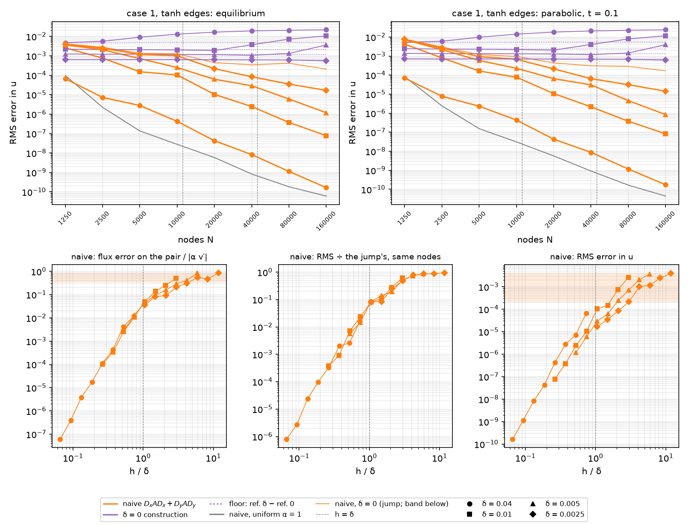

`scripts/heat2d_stiff.py --mode naive` (the default `--mode all` runs it
after §4.1's table: 2 min cold at the default counts 1250–10,000 with the
growing-mode check at 1250 and 2500, under a second cached; the documented
sweep, `--counts 1250 2500 5000 10000 20000 40000 80000 160000`, took 58
min once, 37 of them at 160,000, and its numbers are kept in
`outputs/heat2d_stiff_knee.json`). On case 1's node sets (seed 0; a smooth
domain's set is the jump's) two operators run on `SmoothBand(case1(), δ)`
at δ ∈ {0, 0.04, 0.01, 0.005, 0.0025}: *naive* `Dx A Dx + Dy A Dy` on port
notes §2.2's stencils with α at the nodes (`naive_operator`; the E4.1
breadcrumb on #34, item 1), and *the δ = 0 construction*,
`interface_aware_operator` with E2.4's warp on the same medium (§3.1,
§4.1). Both problems of §4.1: the equilibrium (`c = 0`) and E2.5's
parabolic mode (`c = 1`, BD4 at `dt = h` from the reference's analytic
history to `t = 0.1`), against `case1_reference(δ, c)`. Errors are the RMS
over all nodes, Dirichlet rows included, orders per halving of
`h = 1/round(0.95 √N)` (port notes §2.10). `h = δ` falls near 11,000,
44,000 and 177,000 nodes for δ = 0.01, 0.005 and 0.0025, and δ = 0.04 has
`h < δ` at every count. Beside the two lines are the *floor*, the RMS of
`ref_δ − ref_0` at the nodes (§4.1), and the *uniform* run, the naive
operator on the same nodes with α ≡ 1 against `control_exact`: the
problem without the feature, which is what the companion called its
resolution floor.

*Decision: the naive systems are factored with `solve.PRODUCT_ORDERING =
"MMD_ATA"`.* The product reaches the neighbours of the neighbours (147
nonzeros per row), and SuperLU's default `COLAMD` factor of it takes 11.6 s
at 20,000 nodes and 52 s at 40,000, against 3.7 s and 10.4 s, with the two
solutions agreeing to 5e-12 (δ = 0.01; `MMD_AT_PLUS_A` is no faster than
`COLAMD`: 12 s and 72 s). `solve_equilibrium`, `march_parabolic` and
`heat1d.march.bd4_march` gained a `permc_spec` argument whose default
(`None`) is SuperLU's own, bit for bit (pinned in
`tests/heat2d/test_solve.py` and `test_march.py`), so no earlier table
moves. The construction keeps the default ordering, and its δ = 0 line is
port notes §2.4–2.5's to the digit (1.598e-5 at 1250 … 5.276e-9 at 40,000;
new here, 1.145e-9 at 80,000 and 3.58e-10 at 160,000). A flux-variable
form (`q = A D u` as unknowns, three times the size and 56 nonzeros per
row) was tried in scratch and fills worse: 48 s (`COLAMD`) and 19 s
(`MMD_ATA`) at 20,000.

**The naive knee (H10's first clause: there is one, and it is corrected).**
RMS error (order per halving of h):

| n | h | uniform α ≡ 1 | δ = 0 (jump) | δ = 0.04 | δ = 0.01 | δ = 0.005 | δ = 0.0025 |
| --- | --- | --- | --- | --- | --- | --- | --- |
| *equilibrium* | | | | | | | |
| 1250 | 0.0294 | 9.68e-05 | 4.14e-03 | 6.66e-05 | 2.55e-03 | 3.66e-03 | 3.89e-03 |
| 2500 | 0.0208 | 2.23e-06 (10.94) | 2.78e-03 (1.15) | 7.20e-06 (6.45) | 7.62e-04 (3.51) | 2.05e-03 (1.68) | 2.47e-03 (1.32) |
| 5000 | 0.0149 | 1.35e-07 (8.40) | 1.36e-03 (2.14) | 2.77e-06 (2.87) | 1.51e-04 (4.86) | 7.18e-04 (3.15) | 1.17e-03 (2.24) |
| 10000 | 0.0105 | 2.78e-08 (4.53) | 1.28e-03 (0.19) | 4.22e-07 (5.38) | 1.03e-04 (1.08) | 2.48e-04 (3.05) | 1.00e-03 (0.45) |
| 20000 | 0.0075 | 5.81e-09 (4.55) | 4.42e-04 (3.08) | 4.27e-08 (6.67) | 1.03e-05 (6.70) | 6.20e-05 (4.02) | 2.16e-04 (4.46) |
| 40000 | 0.0053 | 8.24e-10 (5.59) | 3.44e-04 (0.72) | 8.22e-09 (4.72) | 2.45e-06 (4.12) | 2.89e-05 (2.19) | 8.36e-05 (2.72) |
| 80000 | 0.0037 | 1.83e-10 (4.33) | 4.12e-04 (−0.52) | 1.13e-09 (5.72) | 3.71e-07 (5.43) | 5.97e-06 (4.53) | 3.50e-05 (2.51) |
| 160000 | 0.0026 | 6.05e-11 (3.20) | 2.07e-04 (1.99) | 1.64e-10 (5.57) | 7.79e-08 (4.52) | 1.17e-06 (4.71) | 1.68e-05 (2.13) |
| *parabolic, t = 0.1* | | | | | | | |
| 1250 | 0.0294 | 8.30e-05 | 7.79e-03 | 6.97e-05 | 4.24e-03 | 7.17e-03 | 7.55e-03 |
| 2500 | 0.0208 | 2.42e-06 (10.26) | 2.98e-03 (2.79) | 7.74e-06 (6.37) | 8.01e-04 (4.83) | 2.18e-03 (3.45) | 2.63e-03 (3.06) |
| 5000 | 0.0149 | 1.53e-07 (8.27) | 1.19e-03 (2.74) | 2.32e-06 (3.62) | 1.64e-04 (4.76) | 5.86e-04 (3.94) | 9.34e-04 (3.10) |
| 10000 | 0.0105 | 3.10e-08 (4.57) | 9.53e-04 (0.64) | 4.35e-07 (4.79) | 7.73e-05 (2.15) | 2.28e-04 (2.70) | 6.76e-04 (0.93) |
| 20000 | 0.0075 | 5.68e-09 (4.94) | 4.35e-04 (2.28) | 4.30e-08 (6.73) | 1.07e-05 (5.75) | 6.49e-05 (3.65) | 2.11e-04 (3.38) |
| 40000 | 0.0053 | 9.16e-10 (5.23) | 3.09e-04 (0.98) | 8.78e-09 (4.55) | 2.15e-06 (4.59) | 3.09e-05 (2.12) | 6.49e-05 (3.38) |
| 80000 | 0.0037 | 1.67e-10 (4.90) | 2.87e-04 (0.21) | 1.17e-09 (5.81) | 3.78e-07 (5.00) | 4.55e-06 (5.51) | 3.13e-05 (2.10) |
| 160000 | 0.0026 | 4.43e-11 (3.84) | 1.68e-04 (1.55) | 1.74e-10 (5.51) | 8.25e-08 (4.40) | 8.47e-07 (4.87) | 1.42e-05 (2.28) |

- *The jump* is port notes §2.2's line (4.14e-3 … 1.28e-3 at 1250–10,000)
  carried to 2.07e-4 at 160,000: first order with the node set's scatter,
  rates −0.52 to 3.08, a least-squares fit of 1.23 over the eight counts.
- *The rates alone do not show a knee*, because every line carries that
  scatter: seed 0's δ = 0.01 line goes 4.86, 1.08, 6.70 across `h = δ`.
  Dividing by the jump's error on the same node set (the `÷ jump` column
  below) cancels it, and then the knee is plain and nearly a function of
  `h/δ` alone. The naive error is 0.86–0.94 of the jump's while
  `h ≥ 6δ`, 0.74–0.79 at `4.2δ`, 0.49–0.62 at `3δ`, 0.19–0.27 at `2.1δ`,
  0.085–0.14 at `1.5δ`, 0.081–0.084 at `h ≈ δ` for all three δ, and then
  0.014–0.023 at `0.75δ` and 0.006–0.007 at `0.53δ`.
- *It stalls at `h ≈ δ` and drops right after*, 1-D's shape (§2.2, where
  MATLAB δ = 0.0025 went at rate 0.96 into `h = δ` and 6.84 out of it):
  δ = 0.01 at rates 1.08 then 6.70 and δ = 0.005 at 2.19 then 4.53.
- *Its depth.* From `h ≈ 2δ` to `h ≈ δ/2` the naive error falls 311×
  (δ = 0.01, 2500 → 40,000) and 212× (δ = 0.005, 10,000 → 160,000). Over
  the same counts the jump's falls 8.1× and 6.2×, so the knee is 38× and
  34× in the jump's units. 1-D fell 220× (MATLAB medium) and 1000× (eq.
  75) over the same range while its jump fell 4×: 55× and 250× in the
  jump's units. The 2-D knee is the shallower. At `h = 2δ` the 2-D line
  is at 0.19–0.27 of the jump, where 1-D's was at 0.085 (MATLAB medium)
  and 0.27 (eq. 75).
- *Past the knee* (`h ≲ 0.75δ`) the rates are 4.1–5.4: δ = 0.01 at 4.12,
  5.43, 4.52 (fit 4.76 over 20,000–160,000), δ = 0.005 at 4.71, and
  δ = 0.04, resolved at every count, fits 5.31 over 1250–160,000. That is
  the uniform run's order (fit 4.98 from 2500), the order of the 42-node
  degree-5 stencils, not four. The resolved edge is not free: δ = 0.04
  costs 3.2× the uniform medium's error at 2500, 20× at 5000 and 2.7× at
  160,000.
- *δ = 0.0025* reaches `h = δ` only at 160,000 (÷ jump 0.081, the other
  two δ's value there); its rates of 2.1–4.5 from 20,000 on are the upper
  half of its knee.
- *The parabolic table repeats the elliptic one* to 0.67–1.09× from 2500
  nodes on, at every δ, so the knee belongs to the operator, not to the
  problem, as in 1-D. The 1250-node parabolic row is the exception (the
  growing mode, below).

So H10's "first order while `h ≳ δ` and fourth order once `h ≲ δ`" is
corrected. The naive line follows the jump's (first order, with its
scatter) only while `h ≳ 6δ`. The knee spans `4δ ≳ h ≳ 0.75δ`, with a
stall at `h ≈ δ`, and below it the order is the stencils' 5, not 4.

**The δ = 0 construction (H10's second clause: holds).** RMS error
(error / floor):

| n | δ = 0 (E2.4's line) | δ = 0.04 | δ = 0.01 | δ = 0.005 | δ = 0.0025 |
| --- | --- | --- | --- | --- | --- |
| *equilibrium* | | | | | |
| 1250 | 1.598e-05 | 4.697e-03 (1.040) | 2.192e-03 (1.000) | 1.235e-03 (1.000) | 6.315e-04 (1.001) |
| 2500 | 3.795e-06 | 5.622e-03 (1.215) | 2.104e-03 (1.000) | 1.218e-03 (1.000) | 6.323e-04 (1.000) |
| 5000 | 6.108e-07 | 9.058e-03 (1.913) | 2.069e-03 (0.985) | 1.197e-03 (1.000) | 6.355e-04 (1.000) |
| 10000 | 1.453e-07 | 1.294e-02 (2.695) | 1.996e-03 (0.950) | 1.177e-03 (1.000) | 6.319e-04 (1.000) |
| 20000 | 1.923e-08 | 1.655e-02 (3.435) | 1.864e-03 (0.885) | 1.156e-03 (0.985) | 6.251e-04 (1.000) |
| 40000 | 5.276e-09 | 1.902e-02 (3.943) | 3.687e-03 (1.753) | 1.067e-03 (0.912) | 6.183e-04 (0.999) |
| 80000 | 1.145e-09 | 2.074e-02 (4.285) | 7.233e-03 (3.432) | 1.329e-03 (1.135) | 6.072e-04 (0.984) |
| 160000 | 3.575e-10 | 2.184e-02 (4.505) | 1.057e-02 (5.012) | 3.589e-03 (3.068) | 5.568e-04 (0.904) |
| *parabolic, t = 0.1* | | | | | |
| 1250 | 1.764e-05 | 5.252e-03 (1.049) | 2.453e-03 (0.999) | 1.382e-03 (0.999) | 7.067e-04 (0.999) |
| 2500 | 3.988e-06 | 5.989e-03 (1.168) | 2.314e-03 (0.980) | 1.342e-03 (0.982) | 6.968e-04 (0.982) |
| 5000 | 6.007e-07 | 9.764e-03 (1.859) | 2.303e-03 (0.977) | 1.332e-03 (0.991) | 7.064e-04 (0.991) |
| 10000 | 1.538e-07 | 1.411e-02 (2.650) | 2.207e-03 (0.936) | 1.304e-03 (0.987) | 7.004e-04 (0.988) |
| 20000 | 2.126e-08 | 1.811e-02 (3.388) | 2.048e-03 (0.866) | 1.283e-03 (0.975) | 6.940e-04 (0.989) |
| 40000 | 5.508e-09 | 2.086e-02 (3.898) | 4.027e-03 (1.706) | 1.183e-03 (0.901) | 6.865e-04 (0.989) |
| 80000 | 1.224e-09 | 2.276e-02 (4.240) | 7.934e-03 (3.355) | 1.454e-03 (1.107) | 6.743e-04 (0.974) |
| 160000 | 4.179e-10 | 2.399e-02 (4.460) | 1.162e-02 (4.910) | 3.935e-03 (2.997) | 6.161e-04 (0.891) |

- *On the floor, to three digits, while `h ≥ 2.1δ`*: 0.999–1.001 for
  δ = 0.01 at 1250–2500, δ = 0.005 to 10,000 and δ = 0.0025 to 40,000
  (parabolic 0.980–0.999). It is 0.984–0.985 at `1.5δ` and dips below
  the floor at `h ≈ δ` (0.950, 0.912, 0.904 for the three δ) as the
  partly resolved direct rows pull the solution part of the way to the
  truth, as in 1-D. Then it grows: 1.75 and 3.07 at `0.53δ`, 3.43 and
  5.01 at `0.37δ` and `0.26δ` (δ = 0.01). δ = 0.04 goes from 1.04 to 4.51
  at `0.066δ` and is flattening at 2.2e-2 (2.07e-2 and 2.18e-2 at 80,000
  and 160,000), 1-D's "grows to an O(1) constant" (§2.2: 0.127, in its
  relative norm).
- *The floor* is 0.25δ, 0.24δ, 0.21δ and 0.12δ in the RMS for
  δ = 0.0025 … 0.04 (6.2e-4, 1.2e-3, 2.1e-3, 4.5–4.8e-3); §4.1's sup
  norm gave 1.47δ … 0.70δ.
- *It is the better baseline only while `h ≳ 3δ`.* The naive line
  crosses the floor between `h = 4.2δ` and `3δ` for δ = 0.0025 (1.00e-3
  and 2.16e-4 against 6.3e-4) and δ = 0.005 (2.05e-3 and 7.18e-4 against
  1.2e-3), and between `2.9δ` and `2.1δ` for δ = 0.01 (2.55e-3 and
  7.62e-4 against 2.2e-3). Above the crossing the construction is better
  by at most 6× (δ = 0.0025 at 11.8δ). To use it one has to know δ and
  switch it off near `h ≈ 3δ`, before it leaves its floor (§2.2 put the
  1-D switch at `h ≈ 2δ`, where the construction leaves the floor
  there).

**The growing mode at 1250 nodes (the E2.5 breadcrumb's check).** The
interior spectra per δ at 1250 and 2500 nodes (`growing_modes`, dense):

| n | operator | max Re λ | positive | BD4 max \|ζ\| at dt = h | parabolic / elliptic error |
| --- | --- | --- | --- | --- | --- |
| 1250 | naive, δ = 0, 0.01, 0.005, 0.0025 | 17.68, 14.78, 17.46, 17.68 | 1 | 1.55–1.69 | 1.88, 1.66, 1.96, 1.94 |
| 1250 | naive, δ = 0.04 | 25.07 | 1 | 2.12 | 1.05 |
| 1250 | construction, every δ | −7.27 (−7.30 at 0.04) | 0 | 0.807 | 1.10–1.12 |
| 2500 | naive, every δ | −7.33 … −7.73 | 0 | 0.85–0.86 | 1.05–1.08 |
| 2500 | construction, every δ | −7.27 (−7.40 at 0.04) | 0 | 0.857–0.860 | 1.05–1.10 |

The naive operator's coarse-set mode is there at every δ on the 1250-node
set (the jump's +17.7 is port notes §2.5's), BD4 at `dt = h` amplifies it,
and it shows: the parabolic naive errors at 1250 are 1.7–2.0× the
elliptic ones for δ ≤ 0.01, where the construction's ratio is 1.10–1.12
and every ratio at 2500 is 1.05–1.10 (port notes §2.5: 0.98–1.11). So the
1250-node parabolic naive row carries the mode, and the parabolic rates
from 1250 to 2500 (2.8–4.8, against 1.2–3.5 elliptic) are inflated by it;
δ = 0.04's ratio of 1.05 says the mode is present but barely excited when
the edge is resolved. Its eigenvector sits on the free nodes in the band's
middle, `y ≈ 0.70` between the two curves' straddling rows (a quarter of
its mass on five nodes; 27–35 % in `0.6 < y < 0.7`), the twin of port
notes §2.2's `y ≈ 0.67` on the control (scratch). From 2500 nodes on no
operator has a positive eigenvalue at any δ and BD4 damps every mode, so
from there the parabolic table reads as the elliptic one does.

**What separates a resolved edge from an unresolved one (H10's third
clause: holds, with company).** The readings on the straddling rows
(`edge_diagnostics`; the E4.1 breadcrumb's item 3 names the candidates).
The fixed rows of E2.1 are equispaced in `x` over the period, so a row's
`sin 2πx` coefficient, `(2/m) Σ u sin 2πx` (`row_profile`), is
`e^{ct} v(y_row)` exactly for the separable mode, and it averages out the
scattered solution's x-dependence. Each solution gets three readings, all
linear and applied to the error `e = u − u_ref`, so that their own
truncation cancels against the reference's:

- *profile*: the largest `|row_profile(e)|` on the innermost pair of
  either curve (`±h/2` off it), the y-profile error where the edge is,
  absolute like the RMS;
- *flux*: on each side of each curve, the quadratic through that side's
  three rows' profiles (`ROW_OFFSETS`, the staggered middle row included)
  differentiated at the innermost row, times α there (`pair_fluxes`). It
  is the discrete solution's own flux `α ∂_y u` on that side, read without
  crossing the curve. The largest of the four, over the reference's flux
  `|α v′|` at that curve (0.28 at `y = 0.6` and 0.62 at 0.8 on the jump);
- *jump*: the error in the flux jump `q₊ − q₋` across a pair, over the
  same scale (H10's candidate).

Beside them are the max error and `÷ jump`, the naive RMS error over the
jump's naive RMS error on the same node set. `matched_ratios` sets each
reading at `(δ, n)` against `(δ/2, 4n)`: `h` halves to 1.5 % when `n`
quadruples, so the two share `h/δ` to 2 %. A reading that depends on
`h/δ` alone has ratio 1; one that also scales like `h^p` has `2^p`.

The naive equilibrium's readings, ordered by `h/δ` (the construction's
flux reading last):

| h/δ | δ | n | RMS | ÷ jump | profile | flux | jump | construction: flux |
| --- | --- | --- | --- | --- | --- | --- | --- | --- |
| jump | 0 | 1250 … 160000 | 4.14e-03 … 2.07e-04 | 1 | 1.74e-02 … 1.21e-03 | 0.853, 0.493, 0.553, 0.370, 0.351, 0.345, 0.337, 0.364 | 0.55–0.88 | 3.0e-04 … 1.2e-08 |
| 11.76 | 0.0025 | 1250 | 3.89e-03 | 0.938 | 1.39e-02 | 8.58e-01 | 8.64e-01 | 1.80e-02 |
| 8.33 | 0.0025 | 2500 | 2.47e-03 | 0.887 | 1.10e-02 | 4.67e-01 | 8.06e-01 | 1.81e-02 |
| 5.97 | 0.0025 | 5000 | 1.17e-03 | 0.860 | 4.32e-03 | 5.45e-01 | 7.23e-01 | 1.77e-02 |
| 5.88 | 0.005 | 1250 | 3.66e-03 | 0.884 | 1.05e-02 | 8.39e-01 | 8.25e-01 | 3.46e-02 |
| 4.21 | 0.0025 | 10000 | 1.00e-03 | 0.785 | 2.50e-03 | 3.11e-01 | 4.99e-01 | 1.98e-02 |
| 4.17 | 0.005 | 2500 | 2.05e-03 | 0.738 | 7.63e-03 | 4.07e-01 | 6.73e-01 | 3.53e-02 |
| 2.99 | 0.005 | 5000 | 7.18e-04 | 0.527 | 2.04e-03 | 2.92e-01 | 3.77e-01 | 4.32e-02 |
| 2.99 | 0.0025 | 20000 | 2.16e-04 | 0.490 | 5.51e-04 | 2.11e-01 | 2.74e-01 | 4.57e-02 |
| 2.94 | 0.01 | 1250 | 2.55e-03 | 0.616 | 5.15e-03 | 4.99e-01 | 4.30e-01 | 7.00e-02 |
| 2.11 | 0.005 | 10000 | 2.48e-04 | 0.194 | 1.24e-03 | 1.57e-01 | 6.19e-02 | 1.67e-01 |
| 2.11 | 0.0025 | 40000 | 8.36e-05 | 0.243 | 2.61e-04 | 9.11e-02 | 5.72e-02 | 1.90e-01 |
| 2.08 | 0.01 | 2500 | 7.62e-04 | 0.274 | 3.56e-03 | 2.48e-01 | 1.21e-01 | 1.30e-01 |
| 1.49 | 0.01 | 5000 | 1.51e-04 | 0.111 | 8.97e-04 | 1.38e-01 | 9.04e-02 | 4.19e-01 |
| 1.49 | 0.005 | 20000 | 6.20e-05 | 0.140 | 4.19e-04 | 9.51e-02 | 7.41e-02 | 4.67e-01 |
| 1.49 | 0.0025 | 80000 | 3.50e-05 | 0.085 | 1.82e-04 | 8.17e-02 | 7.15e-02 | 4.97e-01 |
| 1.05 | 0.01 | 10000 | 1.03e-04 | 0.081 | 2.95e-04 | 5.02e-02 | 4.85e-02 | 8.05e-01 |
| 1.05 | 0.005 | 40000 | 2.89e-05 | 0.084 | 1.37e-04 | 4.33e-02 | 5.01e-02 | 8.61e-01 |
| 1.05 | 0.0025 | 160000 | 1.68e-05 | 0.081 | 3.71e-05 | 3.51e-02 | 5.25e-02 | 8.88e-01 |
| 0.75 | 0.01 | 20000 | 1.03e-05 | 0.023 | 3.17e-05 | 1.07e-02 | 1.51e-02 | 1.11e+00 |
| 0.74 | 0.005 | 80000 | 5.97e-06 | 0.0145 | 1.03e-05 | 1.32e-02 | 1.80e-02 | 1.15e+00 |
| 0.74 | 0.04 | 1250 | 6.66e-05 | 0.0161 | 2.66e-04 | 1.18e-02 | 1.65e-02 | 8.93e-01 |
| 0.53 | 0.01 | 40000 | 2.45e-06 | 0.0071 | 5.73e-06 | 2.53e-03 | 3.04e-03 | 1.18e+00 |
| 0.53 | 0.005 | 160000 | 1.17e-06 | 0.0057 | 1.92e-06 | 2.68e-03 | 3.31e-03 | 1.21e+00 |
| 0.52 | 0.04 | 2500 | 7.20e-06 | 0.0026 | 2.42e-05 | 4.17e-03 | 3.77e-03 | 1.07e+00 |
| 0.37 | 0.04 | 5000 | 2.77e-06 | 0.0020 | 5.46e-06 | 4.42e-04 | 4.70e-04 | 1.09e+00 |
| 0.37 | 0.01 | 80000 | 3.71e-07 | 0.0009 | 4.59e-07 | 3.41e-04 | 4.11e-04 | 1.08e+00 |
| 0.26 | 0.04 | 10000 | 4.22e-07 | 3.3e-04 | 7.75e-07 | 1.13e-04 | 6.98e-05 | 9.83e-01 |
| 0.26 | 0.01 | 160000 | 7.79e-08 | 3.8e-04 | 1.36e-07 | 1.04e-04 | 5.65e-05 | 9.12e-01 |
| 0.19 | 0.04 | 20000 | 4.27e-08 | 9.7e-05 | 7.68e-08 | 1.76e-05 | 1.48e-05 | 9.09e-01 |
| 0.13 | 0.04 | 40000 | 8.22e-09 | 2.4e-05 | 1.99e-08 | 3.77e-06 | 2.70e-06 | 8.27e-01 |
| 0.09 | 0.04 | 80000 | 1.13e-09 | 2.7e-06 | 3.11e-09 | 3.96e-07 | 4.69e-07 | 7.67e-01 |
| 0.07 | 0.04 | 160000 | 1.64e-10 | 7.9e-07 | 4.32e-10 | 6.10e-08 | 1.06e-07 | 7.23e-01 |

The matched pairs, `Q(δ, n) / Q(δ/2, 4n)`:

| δ → δ/2 | n → 4n | h/δ | RMS | ÷ jump | max | profile | flux | jump |
| --- | --- | --- | --- | --- | --- | --- | --- | --- |
| 0.01 → 0.005 | 1250 → 5000 | 2.94 | 3.56 | 1.17 | 7.94 | 2.52 | 1.71 | 1.14 |
| 0.01 → 0.005 | 2500 → 10000 | 2.08 | 3.08 | 1.41 | 3.40 | 2.87 | 1.58 | 1.96 |
| 0.01 → 0.005 | 5000 → 20000 | 1.49 | 2.43 | 0.79 | 2.38 | 2.14 | 1.46 | 1.22 |
| 0.01 → 0.005 | 10000 → 40000 | 1.05 | 3.58 | 0.96 | 2.12 | 2.15 | 1.16 | 0.97 |
| 0.01 → 0.005 | 20000 → 80000 | 0.75 | 1.73 | 1.61 | 2.14 | 3.09 | 0.81 | 0.84 |
| 0.01 → 0.005 | 40000 → 160000 | 0.53 | 2.09 | 1.26 | 1.77 | 2.98 | 0.94 | 0.92 |
| 0.005 → 0.0025 | 1250 → 5000 | 5.88 | 3.12 | 1.03 | 6.65 | 2.44 | 1.54 | 1.14 |
| 0.005 → 0.0025 | 2500 → 10000 | 4.17 | 2.05 | 0.94 | 3.60 | 3.05 | 1.31 | 1.35 |
| 0.005 → 0.0025 | 5000 → 20000 | 2.99 | 3.32 | 1.08 | 1.61 | 3.71 | 1.38 | 1.37 |
| 0.005 → 0.0025 | 10000 → 40000 | 2.11 | 2.96 | 0.80 | 2.22 | 4.75 | 1.72 | 1.08 |
| 0.005 → 0.0025 | 20000 → 80000 | 1.49 | 1.77 | 1.65 | 2.00 | 2.31 | 1.16 | 1.04 |
| 0.005 → 0.0025 | 40000 → 160000 | 1.05 | 1.72 | 1.04 | 0.72 | 3.70 | 1.24 | 0.95 |

(The parabolic readings repeat these: matched flux 0.81–1.66, ÷ jump
0.81–1.55, RMS 2.08–3.51, profile 2.12–4.75.)

- *The flux on the innermost pair is a function of `h/δ`* to within 1.7×
  on every matched pair (0.81–1.72). It is 0.31–0.86 of the flux while
  `h ≥ 4δ` at every count. On the jump it does not converge at all
  (0.85 at 1250, 0.34–0.37 from 10,000 to 160,000, a fit of 0.32 while
  the RMS falls 20×). It is 0.21–0.50 at `3δ`, 0.09–0.25 at `2.1δ`,
  0.08–0.14 at `1.5δ`, 0.035–0.050 at `h ≈ δ`, 0.011–0.013 at `0.75δ`,
  2.5e-3–4.2e-3 at `0.53δ`, 3.4e-4–4.4e-4 at `0.37δ` and 1.0e-4–1.1e-4 at
  `0.26δ`, then falls as `(h/δ)⁵` (δ = 0.04 fits 5.18 from 5000 on,
  6.1e-8 at `0.066δ`). The flux jump across the pair reads the same
  (matched 0.84–1.96), but it is not monotone (0.057–0.12 at `2.1δ`,
  0.071–0.090 at `1.5δ`), and on the jump it scatters 0.55–0.88.
- *So does `÷ jump`* (matched 0.79–1.65), and at `h ≥ 4δ` it is the
  tighter collapse of the two (0.74–0.94 against 0.31–0.86). It needs the
  jump's solve on the same nodes, and it is a ratio of RMS errors, not a
  statement about the solution at the edge.
- *The RMS, the max and the y-profile error do not collapse.* They carry
  `h` as well: matched 1.72–3.58 (the RMS, `h^0.8 … h^1.8` at fixed
  `h/δ`), 2.14–4.75 (the profile, `h^1.1 … h^2.2`) and 0.72–7.94 (the
  max, which also scatters). On one node set they cannot tell a
  coarse grid on a resolved edge from a fine grid on an unresolved one.
  The profile error is the RMS's local twin and separates no better than
  it.
- *The construction's flux reading is the naive's mirror image*: 1.8e-2
  to 2.0e-2 while `h ≥ 4δ` (δ = 0.0025; 3.5e-2 at δ = 0.005), where its
  RMS is the floor; 0.13–0.19 at `2.1δ`, 0.42–0.50 at `1.5δ`, 0.81–0.89
  at `h ≈ δ` and 0.72–1.21 below. The reading flags the construction's
  failure in the resolved regime as it flags the naive operator's in the
  unresolved one.

*Read without the reference, the flux jump is not an indicator.* The jump
taken from the discrete solution alone, `|q₊ − q₋|` over the mean `|q±|`,
is 0.57–1.8 on the lower curve for the jump and for edges with `h ≥ 6δ`,
against the reference's 0.03–0.12. On the upper curve it is 0.02–0.25
against the reference's 0.12–0.42: below it at 1250 and 5000 nodes and
above it at 20,000 (scratch). The cause is the problem, not the reading:
the flux is continuous at the curve but changes across the pair by
`∫ 4π² α v dy`, which is O(h) with the local `v` (0.04 at `y = 0.6`, 0.44
at 0.8), and on the upper curve that change is as large as the naive
solution's error. So H10's "read from the discrete solution" needs the
reference's same functional subtracted, as `edge_diagnostics` does.

**Node-set scatter** (seeds 1 and 2 at 1250–20,000, `--seed 1`,
`--seed 2`, cached beside seed 0's). Across seeds 0, 1 and 2 at equal
(n, δ), the elliptic naive RMS error spreads 1.03–2.0× (the jump
1.17–1.56×, port notes §2.2's scatter), `÷ jump` 1.05–1.6× and the
profile 1.08–1.9×. From 2500 nodes on the flux spreads 1.07–1.45×. At
1250 it spreads 2.5–3.5× on the jump and the unresolved edges (0.36–1.12
on the jump), and the coarse set's reading is the least stable of all.
The rates in the tables are seed 0's and carry that scatter.

So H10's bet on the flux holds, with two qualifications. First, the flux
reading needs the reference's same functional subtracted. Second, the
RMS measured against the jump's on the same node set separates just as
cleanly, at the price of a second solve. The one-sided flux is the
reading to carry forward: it needs one solve, it is monotone in `h/δ`,
it scatters least across node sets from 2500 on, and it states what is
wrong. While `h ≳ 4δ` the flux on the first rows off the edge is off by
a third to nine-tenths of itself at every count; it is off by 3.5–5 % at
`h = δ` (*4–5 % before E5.3's number check*) and by 1 % at `0.75δ`.

**What the resolution floor hides.** There are three floors here.

- *The companion's floor*, the problem without the feature (the uniform
  α ≡ 1 run): 9.68e-5 at 1250 (the growing mode; port notes §2.2), then
  2.23e-6 to 6.05e-11 from 2500 to 160,000. Every unresolved edge sits
  three to five decades above it (δ = 0.0025: 2.47e-3 against 2.23e-6 at
  2500, 1.68e-5 against 6.05e-11 at 160,000), and from 2500 on the
  resolved δ = 0.04 sits 2.7–20× above it. It hides nothing: the knee is
  plain in `u` itself, as the companion's was not, since its floor stood
  at 1e-2 and hid the knee in `v`.
- *The O(δ) floor* hides the construction's own error. While `h ≥ 2δ` the
  construction's RMS is the floor to three digits, and E2.4's 1.6e-5 …
  3.6e-10 underneath it is invisible: the number says that the
  construction converges to the jump's solution and nothing about how
  well.
- *The RMS itself hides the flux at the edge.* On the jump the naive RMS
  falls 20× from 1250 to 160,000 while the flux on the innermost pair
  stays at 0.34–0.85 of itself, and every edge with `h ≳ 4δ` behaves the
  same: the naive solution converges on average and not at the edge. The
  seeds must remove exactly this, and E4.6's seed line should be read in
  the flux column first.

**H10, ticked.** (1) There is a knee on scattered nodes, and the clause
is corrected: it is not "first order while `h ≳ δ`, fourth once
`h ≲ δ`". The line is jump-like only while `h ≳ 6δ`, the knee spans
`4δ ≳ h ≳ 0.75δ` with a stall at `h ≈ δ`, and the order below it is the
stencils' 5. (2) Holds: the construction sits on the O(δ) floor for
`h ≳ 2δ` to three digits, dips 5–10 % below it at `h ≈ δ`, and then
grows to 3–5× the floor. (3) Holds with the two qualifications above.
The growing mode was checked: it is on every 1250-node naive operator
and on no 2500-node one, and the 1250 parabolic naive row carries it.

**What E4.4–E4.6 inherit.**

- `edge_diagnostics(nodes, medium, ref, u, t)` reads any solution on any
  node set with straddling rows. E4.6's seed line goes through the same
  tables: `OPERATORS` gains `"seeds"`, and since the cache is keyed by
  label the naive and construction entries are reused. Bump
  `KNEE_CACHE_META["version"]` only when an operator, a reading or the
  march changes (§3.8's trap).
- What the seeds must show (H4, H8): no plateau in the flux column. Their
  flux reading should fall with `h` at every δ, from `h ≥ 4δ` down, and
  their RMS should sit far below the jump's (`÷ jump` ≪ 1) already
  where the naive line's is 0.74–0.94.
- `PRODUCT_ORDERING` factors the naive operator; the aware operators keep
  SuperLU's default. A 1250-node parabolic naive number carries the
  growing mode, so quote it with that caveat or start at 2500.
- Single-seed rates at these counts scatter by up to 2× per count in the
  RMS. An order claim needs a fit, or the `÷ jump` or flux columns, not a
  pair of counts.
- The 160,000-node count costs 37 min for the ten naive and construction
  solves and the uniform run. E4.6 should extend this cache rather than
  re-solve the naive line (the E4.1 breadcrumb on #37, item 5, asked for
  re-solving to keep that driver self-contained; this driver is the same
  one).

Tests: `tests/test_heat2d_stiff.py` pins `row_profile` exact on the
separable mode, and blind to `cos 2πx` and `sin 4πx`, on every fixed row;
`curve_level`; `pair_fluxes` one-sided and exact on a profile quadratic on
each side with a kink at either curve; `edge_diagnostics` zero on the
reference and exact on a planted one-sided error; `matched_ratios`
pairing; the cache's round trip and its refusal of another version; and
the driver at 1250 and 2500 nodes. At δ = 0 the driver reproduces port
notes §2.2's naive and uniform lines and §2.4's aware line; the
construction sits on its floor to 2 % while `h ≥ 4δ`; the flux reading
is above 0.3 unresolved and below 0.02 resolved; the 1250-node growing
mode is on every naive operator and on no construction; and a second
run is served from the cache in under 10 s. The E4.2 reference test now
runs `--mode references`. `tests/heat2d/test_solve.py` and
`test_march.py` pin the `permc_spec` pass-through.

### 4.3 The scalar seeds on one stencil (E4.4, #35)

`heat2d/seeds.py` is §3.2–3.4's construction up to the saddle-point solve,
which is E4.5's. `scripts/heat2d_stiff.py --mode stencils` prints every
table below in 21 s (the default `--mode all` runs it after §4.1–4.2). All
numbers are on the 2500-node case-1 set (seed 0, `h = 1/48`, 576 crossing
30 / 4 stencils), 2026-09-22.

**What is built.** `chain(degree)` holds §3.2's bookkeeping: 22 levels
`(a, b, j)` at degree 4, seeds in `polynomial_exponents` order, each seed's
levels from `j = a` down; the right-hand side of the first-order system is
two constant 22 × 22 matrices, `source` (the lower seeds at the same
level, per unit `α_e`) and `lower` (the seed's own level `j + 2`, per unit
`α_n`), so one evaluation is two small matrix-vector products.
`seed_profiles(profile, eta)` marches the 44 states along a
`NormalProfile` to the points `eta`, both ways from the anchor, DOP853 at
`SEED_RTOL`, `SEED_ATOL`, one `solve_ivp` per segment between consecutive
targets (the points, exact, and the profile's stops merged with them by
`heat1d.stiff.march_targets`), alpha on each segment from the profile's
piece for it, and returns `SeedProfiles`: `g`, `ψ` at the points and
`values(ξ)`, the 15 seeds at any `ξ` broadcast against the points (E4.8's
probes read `ψ`). `seed_basis(xy, medium)` makes one stencil's
`SeedBasis`: the frame, the nodes' `(ξ, η)`, the profile, the `(30, 15)`
block `S`, the right-hand side and `warp`, `φ₀₁` at the nodes.
`block_condition` gives `cond S` raw and column-scaled. Decisions:

- *The frame* has its origin at the anchor and E2.3's orientation at the
  foot point of the nearest interface (`nearest_interface`, by signed
  normal distance), built from the profile's normal as `frame_at` builds
  it; `h_s` is the largest distance from the anchor, E2.3's scale. On
  flat lines every choice of interface gives the same frame.
- *`α_e` is the medium's value at the anchor* (the owner's at a jump, as
  E2.3 and the 1-D march take it), not `NormalProfile.alpha_e`: the two
  differ only for an anchor exactly on the upper line at δ = 0, where the
  profile's segment rule reads the piece above. A jump `Band` is marched
  as `SmoothBand(band, 0)`, the same block bit for bit.
- *Alpha is read in floats.* The march evaluates alpha about a thousand
  times per stencil through an edge, and `NormalProfile.alpha` on one
  point costs 60 µs there through the band's array code (4 µs at δ = 0,
  where a segment's piece is a constant), which made a stencil 64 ms. So
  `NormalProfile.alpha_function(k)` returns `η ↦ alpha(η, k)` as a float
  function: a constant piece's value, the band's blend through the new
  `SmoothBand.alpha_at` (the same steps as `_blend`, value only, with the
  new `heat1d.domain.edge_value` for `edge_blend`), any other piece
  through its own `alpha`. It is 0.5 µs a call (2.9 µs with the sine
  piece), a stencil is 7 ms, and it equals the array path bit for bit on
  every point tested (1601 per segment, both pieces, δ = 0 and the three
  study widths; the tests allow 2e-16).
- *`heat1d.stiff._targets` is public* as `march_targets`, the one merge
  rule for both marches; a stop within `MERGE_TOL` of the anchor is not a
  target.
- *The right-hand side* is `2 α_e` on the seeds of `ξ²` and `η²` and
  `h_s α_ξ` on the seed of `ξ`, `α_ξ` the medium's gradient at the anchor
  rotated into the frame (`Frame.rotate_in`); nothing else (§3.8,
  decision 4).

**H1, the march is the chain** (one stencil, anchor `y = 0.5896`, the
edge 0.17 stencil radii above it): `monomials` is `|S − ξᵃηᵇ|` on a band
of equal pieces (α ≡ 0.37), `shift` the identity `g_j^{(a,b)} =
C(a, j) g₀^{(a−j,b)}` relative to the largest `g`, `residual` is
`L φ_e − α_e Σ C φ_e′` on 25 × 801 points of `[−1, 1]²` by twelfth-order
differences in both directions with alpha from `medium.alpha` at the
physical points, relative per seed, `1-D` the seeds of `ηᵇ` against
E3.4's `heat1d.stiff.seed_profiles` on the profile in `y`
(`profile_medium`), relative, and `warp` is `|ψ₀₁ − α_e| / α_e`.

| δ/h | monomials | shift | residual | 1-D | warp | max \|g\| |
| --- | --- | --- | --- | --- | --- | --- |
| 0 | 1.4e-15 | 1.6e-16 | – | 8.3e-16 | 0 | 22.2 |
| 1/8 | 1.4e-15 | 5.0e-16 | 8.5e-11 | 7.4e-14 | 0 | 21.1 |
| 1 | 1.4e-15 | 2.3e-16 | 4.2e-11 | 9.8e-15 | 0 | 7.71 |
| 8 | 1.4e-15 | 6.8e-16 | 4.1e-11 | 6.5e-16 | 0 | 1.22 |

The residual is the differences' floor, not the march's: with the
eighth-order differences of the E4.1 scratch it is 2.5e-8 at h/8 on 801
points (their truncation across an edge 17 grid steps wide) and 2.5e-10
on 1601 points, where the round-off of two differentiations takes over at
every δ and order (1.5–2.5e-10); twelfth order on 801 points is below
both, and
§3.7's "≤ 1e-10 on 25 × 801" holds with it. The 2-D and 1-D marches agree
to 7e-14 through the unresolved edge, not to the bit: the 44 states and
the 1-D march's 5 are different vectors under DOP853's step control.
`ψ₀₁` is `α_e` exactly, since that state's right-hand side is identically
zero, so `α η̃′ ≡ α_e` (the warp's cancellation, §3.4) holds to the bit
along the whole line.

*The right-hand side is the true operator at the anchor.* On a flat band
with the sine piece inside (`α_ξ ≠ 0`), `L φ_e` at the anchor by
twelfth-order differences on a 25 × 25 patch equals `rhs` to below 1e-11
for all 15 seeds at δ ∈ {h/8, h, 8h}, anchors inside and outside the
band; inside, `h_s α_ξ` is 0.009–0.02 (`tests/heat2d/test_seeds.py`).
Away from the anchor the seeds solve the frozen profile's equation, as
§3.5 says.

**H2 at δ = 0, every crossing stencil.** `span` is the sine of the
largest principal angle between the seed block's span and E2.3's
translated block's, `weights` the seed solve with E2.3's plain Gaussian
block against `stencil_weights(warp=False)`, max relative, and `warp` is
`|φ₀₁ − η̃|` at the nodes against E2.4's warped normal coordinate
(`interface_stencil(warp=True).eta`). The thin band is `0.6 ≤ y ≤ 0.62`,
one spacing thick, on the same nodes.

| material | stencils | three-region | span | weights | warp |
| --- | --- | --- | --- | --- | --- |
| case 1 | 576 | 0 | 4.9e-14 | 1.6e-12 | 1.8e-15 |
| thin band | 333 | 240 | 1.7e-14 | 6.0e-13 | 1.3e-15 |

So at δ = 0 the seed rows *are* E2.3's rows, three-region stencils
included (E2.3 translates twice with a frame change between the lines;
the seeds march once through both), and `φ₀₁` is `Warp.apply`: E4.5's
warped seed rows at δ = 0 need nothing more to reproduce port notes
§2.4's line.

**H2 for δ > 0, and H3.** Per anchor (the four innermost-row nodes at
`x = 0.5`: below the band, inside it at each line, above it), the same
two distances and `cond S` raw and column-scaled, beside the monomial
block's on the same nodes and E2.3's translated block's. The anchor below
the band, in full:

| δ/h | span | weights | cond raw | cond scaled |
| --- | --- | --- | --- | --- |
| 8 | 0.782 | 0.549 | 54.6 | 28.8 |
| 1 | 0.301 | 0.752 | 97.9 | 80.9 |
| 1/2 | 0.182 | 0.913 | 162.4 | 106.2 |
| 1/8 | 5.94e-2 | 0.612 | 209.9 | 143.1 |
| 1/64 | 7.47e-3 | 5.99e-2 | 211.9 | 141.9 |
| 1e-3 | 4.76e-4 | 3.65e-3 | 212.3 | 141.7 |
| 1e-4 | 4.76e-5 | 3.64e-4 | 212.3 | 141.7 |
| 1e-5 | 4.76e-6 | 3.64e-5 | 212.3 | 141.7 |
| 0 | 6.1e-15 | 2.9e-13 | 212.3 | 141.7 |

(monomial block 57.5, translated block 175.9). The other three anchors
have the same shape: `span` 4.60e-6 … 7.38e-6 at 1e-5 h, every ladder
exactly ten per decade below h/64, `cond` scaled 28.5–148.7 against the
monomial blocks' 57.5–62.9, and the δ = 0 seed blocks' raw 127.1, 204.4
and 225.8 against the translated 181.4, 275.3 and 180.9.

- *First order in δ/h, no floor.* The span distance falls monotonically
  from 0.78 at 8h and is `0.476 δ/h` below h/64 on this stencil (0.46 to
  0.74 across the four); the weights are first order there too, 3.6 δ/h
  (1.1–3.6 across the four), 1–3.4 times the 1-D ladder's 1.07 δ/h (P4).
  Down to
  1e-5 h there is no march floor in either: §2.3's floor at `δ ≲ h/40`
  was a 1e-12 row residual, far below these distances.
- *The weights are not monotone above h/8* for the anchors outside the
  band: 0.53–0.55 at 8h, 0.74–0.75 at h, 0.89–0.91 at h/2, 0.60–0.61 at
  h/8; inside it they fall from 0.86–0.87 at 8h (with a step of 0.01 up
  from h to h/2 at one anchor). A marginal edge moves the rows outside
  the band furthest from the jump's; the span distance is monotone at
  every anchor and is the one to read.
- *H3 holds*: column-scaled, the seed block stays within 0.46–2.5× of the
  monomial block's condition number on the same nodes at every δ from
  1e-5 h to 8 h. It rises from 28–37 at 8h to 101–111 at h/2; below
  that the anchors inside the band fall back to 86–89 (a peak at h/2, as
  in 1-D) and those outside rise to 142–149, reaching the δ = 0 seed
  block's value by h/8; all four equal that value in the limit. That
  block and E2.3's
  translated block span the same space in different bases (anchored at
  the node, against at the foot point through the continuity matrices),
  and their raw condition numbers are within 0.70–1.25× of each other, so
  "tending to the translated block's" (§3.7) holds as "to the jump's seed
  block, within a factor 1.3 of E2.3's". Raw, the seed block carries the
  contrast (54.6 resolved to 212 unresolved below the band). Cases 2 and
  3 wait for route (a) and the ring (E4.7, E4.8): `normal_profile` is
  flat-only.

**The cost** (#35's acceptance line): `seed_basis` over the 576 crossing
stencils, median and max per stencil, against E2.3's `stencil_weights` on
the same stencils.

| δ/h | median ms | max ms | total s |
| --- | --- | --- | --- |
| 0 | 1.93 | 5.87 | 1.16 |
| 1/8 | 6.94 | 8.06 | 3.96 |
| 1 | 4.66 | 6.75 | 2.76 |
| 8 | 3.33 | 9.74 | 2.09 |

E2.3's rows cost 1.57 ms each. A second run (the default `--mode all`)
gave medians 2.01, 7.31, 4.88 and 3.03 ms against E2.3's 1.47 and maxima
up to 18 ms: the medians move by up to 9 %, the maxima are scheduling
noise. So a seed row costs 1.2–5× a translated one, and §3.3's estimate
holds: every row of a 40,000-node set seeded at
δ/h ≈ 8 is about two minutes of marches. The straddling-row batching of
§3.3 is not needed at these costs and is not built.

**H1 and the δ = 0 half of H2, ticked; H2's δ > 0 half is recorded;
H3, ticked on case 1.** What E4.5 inherits:

- `seed_basis(xy, medium)` is everything a seed row needs but the
  Gaussian part: `block` for `P`, `rhs` for the moment conditions,
  `warp` for the Gaussians' normal coordinate, `scale` for `w = w̃/h_s²`.
  The seed solve with E2.3's plain block is `seed_weights_with` in the
  driver, three lines on `augmented_solve`.
- The Gaussian block in `(ξ, φ₀₁(η))` and its chain-rule right-hand side
  are E4.5's; at δ = 0 they are E2.4's to 2e-15 (the table above).
- The seeded-row rule (reach 20δ on the 30 nodes, the interface group on
  the 42) is E4.5's; `seed_basis` seeds whatever it is given.
- The seeds' distance from E2.3's rows at δ > 0 is first order in δ/h
  and O(1) at δ ≳ h/8, so the δ = 0.0025 and 0.005 lines of E4.6 at
  1250–10,000 nodes (δ/h ≈ 0.09–0.48) are where seeds and construction
  part.

Tests: `tests/heat2d/test_seeds.py` (41) pins the chain's shape and
nilpotence, the monomials on equal pieces at δ = 0, h/8, h and 8h, the
shift identity and `ψ₀₁ ≡ α_e` through the edge from anchors outside and
inside the band, the tensor-grid residual on case 1 and the thin band,
the anchor right-hand side with a tangential gradient, the 2-D march
against the 1-D one on the profile in `y`, the milliseconds (median under
30 ms per stencil), the δ = 0 identity with E2.3 (span, weights, warp) on
four case-1 anchors and three thin-band ones, the first-order ladder to
1e-5 h, the conditioning, and the refusals (too few nodes, coincident
nodes, a curved band). A mutation check on 2026-09-22 (the lower
coupling's `(j + 2)(j + 1)`, the source's `b (b − 1)`, the `α_ξ` entry,
`α_e`, the restarts at the stops, each broken in turn) failed at least
six tests per mutation. `tests/heat2d/test_domain.py` pins `alpha_function` and
`alpha_at` against the array path, `tests/heat1d/test_domain.py`
`edge_value` against `edge_blend`, and `tests/test_heat2d_stiff.py` runs
`--mode stencils` at 1250 nodes (17 s).

### 4.4 The seed rows in the matrix (E4.5, #36)

`seeds.seed_weights` closes E4.4's construction and `operators.seed_operator`
puts its rows in the global matrix; `scripts/heat2d_stiff_eigenvalues.py`
answers §3.7's H5 and H6 with the tables below. The row study runs on the
2500-node case-1 set (seed 0, `h = 1/48`) at δ/h ∈ {8, 1, 1/8, 1/64, 0} and
the spectra at 1600 nodes on the study's widths; both cache under
`outputs/` (97 s and 66 s cold, 3 s and 2 s cached, 2026-09-22).

**What is built.**

- `seed_weights(xy, medium, degree, shape, warp)`, the twin of
  `interface.stencil_weights`: `seed_basis`'s block for `P`, its moment
  conditions for the polynomial right-hand side, and Gaussians in
  `seed_coordinates`'s `(ξ, φ₀₁(η))` with `ε = GA_SHAPE h_s / d` read off the
  *physical* offsets, as E2.3 reads it. `weights_of(sb, shape, warp)` is the
  same solve on a basis already marched, which is what the ablations and the
  cost tables call.
- *The chain-rule right-hand side is assembled, not assumed* (§3.8,
  decision 5): `L G(ξ, η̃(η))` at the anchor is
  `α G_ξξ + α_ξ G_ξ + (α η̃′)′ G_η̃ + α η̃′² G_η̃η̃` with `α η̃′` read from the
  marched `ψ₀₁` and `(α η̃′)′` from the chain's own rate for that state. Both
  collapse, and *structurally*: the state `(0, 1, 0)` has no lower seed and
  no level above it, so the chain's `source` and `lower` rows are empty and
  the derivative is `0.0` for every profile and every η, while `ψ₀₁` is
  `α_e` from the anchor's initial condition. The row therefore equals the one
  assembled from `α_e (G_ξξ + G_η̃η̃) + α_ξ G_ξ` to the saddle-point solve's
  rounding (1e-12 relative, a test at four δ). The two coefficients are read
  rather than written as 1 and 0 so that a chain which acquires a source
  there — a curved feature's anchor correction, E4.7 — carries it instead of
  losing it silently; what actually guards the cancellation is the check on
  the whole line:
  `seed_coordinates` refuses the warp if `ψ₀₁` leaves `α_e` by more than
  `WARP_TOL = 1e-9` anywhere on the marched line, since the cancellation is
  a property of the march and a march that lost it would otherwise pass
  unnoticed.
- `warp=False` writes the Gaussians in the frame's own `(ξ, η)` — the plain
  block of E2.3, since a Gaussian does not see the rotation — and carries the
  true `α_η G_η` that the warp cancels, `∇α` at the anchor being the smooth
  medium's (`SeedBasis.gradient`, the rotated pair in stencil units whose
  first component is already the seeds' `h_s α_ξ`).
- `operators.seeded_rows(nodes, material, index, reach)` is §3.3's rule: a
  stencil sees an edge when the span of its nodes' signed distances to that
  curve meets `[−reach δ, reach δ]`, with `interface_crossings` OR-ed in so
  that a stencil straddling an edge far thinner than the spacing is seeded
  although no node of it is within 20 δ; at δ = 0 the span test is skipped
  and the rule *is* `interface_crossings`, by construction and not by
  arithmetic on a node that might sit on the curve.
  `build_stencils(..., reach=TANH_REACH)` applies it one size up, so no
  42 / 5 stencil sees an unresolved edge, and `seed_operator` seeds the
  members of that group whose own 30 nodes see it. `OPERATOR_MODES` and
  `build_operator(nodes, material, stencils, mode)` are the dispatch,
  `heat1d.stiff.build_operator`'s twin (the plan's `build_operators`).

**H2 at the operator level.** At δ = 0 the seed rows are E2.3's rows with
either Gaussian block: over all 576 crossing stencils of the 2500-node set
the largest relative weight distance is 7.6e-12 warped and 1.6e-12 plain, and
over the thin band's 333 stencils (240 of them three-region) 1.9e-10 and
6.0e-13. The warped numbers are larger because the warped block across a
1 : 5 jump is the worse-conditioned system, not because the bases differ
(E4.4 put the spans at 4.9e-14). Assembled, `seed_operator` and
`interface_aware_operator` agree to 5.1e-13 relative at 1250 nodes and
5.3e-13 at 2500, with the same sparsity, and every reading below — DDR,
condition estimate, iteration counts, spectrum, elliptic error — is the
construction's at δ = 0 to the digits printed. **H2's operator half, ticked.**

**H5: dominance, conditioning and the solvers.** The elliptic problem of
E4.3 (`u = sin 2πx v(y)` against the separable reference), the *reduced*
interior system, 2500 nodes. `rows` is what the method recomputes (the
seeded rows for the seeds, the crossing rows for the rest); the DDR columns
are least and median over those rows, `all` the least over every interior
row, `cond` a one-norm condition estimate of the reduced matrix (a lower
bound, so read it across a table's operators and not against a bound),
`error` the RMS against the reference.

| δ/h | operator | rows | DDR least | median | all least | cond | SuperLU | error |
| --- | --- | --- | --- | --- | --- | --- | --- | --- |
| 8 | naive | 576 | 0.117 | 0.237 | 0.059 | 2.0e4 | 0.13 s | 2.19e-6 |
| 8 | direct | 576 | 0.534 | 0.621 | 0.373 | 8.0e3 | 0.06 s | 4.65e-6 |
| 8 | construction | 576 | 0.239 | 0.675 | 0.239 | 1.3e4 | 0.05 s | 2.85e-2 |
| 8 | **seeds** | 2500 | **0.409** | **0.688** | 0.409 | 7.1e3 | 0.04 s | **2.60e-6** |
| 1 | naive | 576 | 0.103 | 0.227 | 0.059 | 3.5e4 | 0.14 s | 1.38e-4 |
| 1 | direct | 576 | 0.539 | 0.617 | 0.385 | 8.4e3 | 0.06 s | 3.62e-4 |
| 1 | construction | 576 | 0.239 | 0.675 | 0.239 | 1.7e4 | 0.05 s | 3.30e-3 |
| 1 | **seeds** | 2164 | **0.336** | **0.686** | 0.336 | 7.8e3 | 0.05 s | **3.13e-6** |
| 1/8 | naive | 576 | 0.095 | 0.215 | 0.059 | 4.7e4 | 0.13 s | 2.46e-3 |
| 1/8 | direct | 576 | 0.539 | 0.621 | 0.385 | 3.0e4 | 0.05 s | 3.57e-2 |
| 1/8 | construction | 576 | 0.239 | 0.675 | 0.239 | 1.7e4 | 0.05 s | 6.58e-4 |
| 1/8 | **seeds** | 1036 | **0.283** | **0.671** | 0.283 | 1.5e4 | 0.06 s | **3.14e-6** |
| 1/64 | construction | 576 | 0.239 | 0.675 | 0.239 | 1.5e4 | 0.05 s | 8.35e-5 |
| 1/64 | **seeds** | 576 | **0.244** | **0.675** | 0.244 | 1.7e4 | 0.05 s | **3.80e-6** |
| 0 | naive | 576 | 0.095 | 0.215 | 0.059 | 5.5e4 | 0.13 s | 2.78e-3 |
| 0 | direct | 576 | 0.539 | 0.621 | 0.385 | 3.2e4 | 0.05 s | 3.61e-2 |
| 0 | construction | 576 | 0.239 | 0.675 | 0.239 | 1.7e4 | 0.05 s | 3.79e-6 |
| 0 | **seeds** | 576 | **0.239** | **0.675** | 0.239 | 1.5e4 | 0.05 s | **3.79e-6** |

- *Monotone between the two ends, as H5 predicted.* The seed rows' least DDR
  falls from 0.409 at δ = 8h to 0.239 at δ = 0 through 0.336, 0.283 and
  0.244, and the same holds row for row of the whole matrix (the `all`
  column, the one set every operator shares). The two ends are the direct
  rows' 0.373–0.385 and the jump-aware rows' 0.239; the seeds never go below
  the jump's. The median hardly moves (0.671–0.688) and is above both ends'
  at every δ. **No δ/h degrades anything**, so #36's "if direct solves
  degrade, name the δ/h" has nothing to name and the plan stands as written
  for E4.6. *(E4.10's roundtable, §5.3 statement 6: nothing breaks down, but
  the least DDR, the condition estimate and the iteration counts do move
  toward the jump's values as δ → 0, the counts not monotonically; this is
  case 1, and the ring's iterative solves at 20,000 nodes were not run.)*
- *SuperLU does not see δ.* Factor and solve is 0.04–0.06 s at every width
  (the naive product's 0.13 s with `PRODUCT_ORDERING`), the residual is
  1e-14 or below throughout, and the one-norm condition estimate of the seed
  matrix, 7.1e3 at δ = 8h rising to 1.7e4 at δ = h/64, stays at or below the
  construction's (1.3e4–1.7e4) and 3–4 times below the naive product's
  (2.0e4–5.5e4). The δ → 0 limit is the jump's matrix, which E2.7–E2.8
  factored to 160,000 nodes.
- *The iterative solvers.* Inner iterations to `|r| ≤ 1e-8 |b|`,
  unpreconditioned / with Appendix B's `P` / with `spilu`:

| δ/h | operator | gmres | +P | +ilu | bicgstab | +P | +ilu | P's DDR least | median |
| --- | --- | --- | --- | --- | --- | --- | --- | --- | --- |
| 8 | naive | 118 | 114 | 3 | 84 | 83 | 1 | 0.064 | 0.199 |
| 8 | direct | 130 | 60 | 4 | 86 | 40 | 2 | 0.870 | 0.911 |
| 8 | construction | 208 | 64 | 4 | 147 | 41 | 2 | 0.349 | 0.543 |
| 8 | seeds | 134 | 61 | 4 | 97 | 41 | 2 | 0.838 | 0.924 |
| 1 | seeds | 155 | 64 | 4 | 95 | 46 | 2 | 0.706 | 0.920 |
| 1/8 | seeds | 147 | 76 | 4 | 101 | 51 | 2 | 0.438 | 0.813 |
| 1/64 | seeds | 160 | 78 | 4 | 100 | 55 | 2 | 0.360 | 0.550 |
| 0 | seeds | 161 | 78 | 4 | 101 | 56 | 2 | 0.349 | 0.543 |
| 0 | construction | 161 | 78 | 4 | 100 | 56 | 2 | 0.349 | 0.543 |
| 0 | naive | 261 | 135 | 4 | 169 | 98 | 1 | 0.057 | 0.176 |

  Every solve converged (no breakdown at any δ, either method, either
  preconditioner), and the seed rows cost *fewer* iterations than the
  construction's at every width: 134–161 gmres against 161–208, 95–101
  bicgstab against 100–147. Appendix B's three sweeps lift the seed rows'
  DDR further than the jump-aware rows' (to 0.838/0.924 at δ = 8h against
  0.349/0.543) and cut the iterations 2.0–2.6×, at five times the matvec;
  `spilu` with `MMD_AT_PLUS_A` gives 4 gmres and 2 bicgstab iterations at
  every δ, and SuperLU still wins the wall clock at this size, as E2.8 found.
  The naive product is the one line Appendix B cannot help (114 against 118):
  its rows reach the neighbours of the neighbours and the 37-neighbour sweep
  does not cover them.

**The same table at 10,000 nodes** (`h = 0.0105`, H5's own size; 403 s cold,
`--mode rows --n 10000`). The seed rows, with the two ends beside them:

| δ/h | rows | DDR least | median | cond | SuperLU | gmres | bicgstab | error |
| --- | --- | --- | --- | --- | --- | --- | --- | --- |
| 8 | 10000 | 0.404 | 0.691 | 3.2e4 | 0.46 s | 202 | 181 | 1.24e-7 |
| 1 | 6414 | 0.378 | 0.690 | 4.0e4 | 0.46 s | 227 | 201 | 1.59e-7 |
| 1/8 | 2198 | 0.252 | 0.679 | 7.0e4 | 0.54 s | 237 | 211 | 1.06e-7 |
| 1/64 | 1134 | 0.215 | 0.676 | 7.3e4 | 0.61 s | 237 | 209 | 1.44e-7 |
| 0 | 1134 | 0.211 | 0.676 | 6.8e4 | 0.58 s | 238 | 213 | 1.45e-7 |
| — | direct | 0.498–0.507 | 0.615–0.620 | 3.8e4–1.3e5 | 0.57 s | 212–390 | 192–287 | — |
| — | construction | 0.211 | 0.676 | 5.8e4–7.5e4 | 0.56 s | 238–406 | 211–293 | — |
| — | naive | 0.098–0.106 | 0.209–0.225 | 1.4e5–1.7e5 | 1.18 s | 223–468 | 200–407 | — |

Monotone again, from 0.404 to the jump-aware 0.211, the direct rows' 0.403
above it (the `all` column, every interior row); SuperLU 0.46–0.61 s at every
width against the naive product's 1.14–1.21 s; the condition estimate 3.2e4
at δ = 8h to 7.3e4 at δ = h/64, at or below the construction's and half the
naive product's; no breakdown in any of the sixty solves. The elliptic error
is again flat in δ — 1.06e-7 to 1.59e-7 against the construction's 2.36e-2 …
1.45e-7 and the naive's 5.0e-8 … 1.28e-3 — and equals the construction's
1.45e-7 at δ = 0. Seeding every row costs 58 s here (5.8 ms a row), 3.7 s
at δ = 0.

One reading moves with the count: the warp's worth. At 10,000 nodes the
plain rows are 6.7× worse at δ = h/8 and 3.6× worse at δ = 0 but 1.4–2.0×
*better* at δ ≥ h (8.4e-8 against 1.24e-7 at 8h), where the seeds' own error
is near the discretisation floor and `η̃` is a mild stretch; at 2500 nodes
the warp was 2.3–3.4× ahead below h/8 and level above. Two counts do not
make a trend — E4.6's sweep decides — but the warp clearly earns its place
where the edge is *unresolved*, which is the study's subject, and the
spectra below say it is not optional there.

**H6: the spectra.** `interior_eigenvalues` at 1600 nodes (1524 interior
rows, `h = 0.0263`), BD4's largest root modulus at `dt = h`.

| δ | δ/h | operator | complex | max Re | Re > 0 | h² min Re | h² max \|Im\| | BD4 max \|ζ\| |
| --- | --- | --- | --- | --- | --- | --- | --- | --- |
| 0 | 0 | naive | 1318 | +1002.8 | 2 | −6.44 | 0.862 | 1.038 |
| 0 | 0 | direct | 738 | −4.36 | 0 | −13.09 | 0.172 | 0.892 |
| 0 | 0 | construction | 798 | −7.27 | 0 | −13.09 | 0.176 | 0.826 |
| 0 | 0 | **seeds** | 798 | **−7.27** | 0 | −13.09 | 0.176 | 0.826 |
| 0 | 0 | seeds-plain | 882 | −7.27 | 0 | −13.09 | **1.511** | 0.826 |
| 0.0025 | 0.10 | naive | 1318 | +1002.8 | 2 | −6.44 | 0.862 | 1.038 |
| 0.0025 | 0.10 | **seeds** | 748 | **−7.29** | 0 | −13.09 | 0.181 | 0.825 |
| 0.005 | 0.19 | **seeds** | 726 | **−7.32** | 0 | −13.09 | 0.175 | 0.825 |
| 0.01 | 0.38 | **seeds** | 700 | **−7.37** | 0 | −13.09 | 0.178 | 0.824 |
| 0.04 | 1.52 | direct | 712 | −7.73 | 0 | −13.09 | 0.175 | 0.816 |
| 0.04 | 1.52 | **seeds** | 680 | **−7.73** | 0 | −11.96 | 0.227 | 0.816 |

- The seed operator sits where the warped aware operator sits, at every δ:
  no eigenvalue in the right half-plane, `max Re` the physical −7.27 of port
  notes §2.5 moving to the resolved medium's −7.73 as the edge widens (the
  direct operator's value there), `h² min Re` −11.96 to −13.09 and
  `h² max |Im|` ≤ 0.227, well inside §2.5's ≤ 0.4. BD4 at `dt = h` damps
  every mode (0.816–0.826). **H6, ticked.**
- The naive operator keeps the coarse set's growing mode at every δ
  (+1003, one or two eigenvalues in the right half-plane) and BD4 amplifies
  it at δ = 0, 0.0025 and 0.005 (1.03–1.04): E4.3's warning, unchanged by
  the edge's width, and the reason a parabolic naive number at these counts
  is read with the spectrum beside it.
- *With plain Gaussians the complex loop returns, at δ = 0 only*:
  `h² max |Im|` 1.511 against the warped 0.176, port notes §2.5's 1.49 on the
  same operator. At δ > 0 the plain seed rows do not show it (0.159–0.233).
  So E2.9's warning — on the ring the warp decides the *sign* — has a flat
  twin in the imaginary direction, and the seeds run warped.

**At 4900 nodes**, H6's own size (`h = 0.0149`, 128 s, `--mode spectra
--spectrum-n 4900 --deltas 0 0.005`), the seed operator reproduces port
notes §2.5's warped line to the digit: `max Re` −7.27, `h² min Re` −13.19
(§2.5's −13.2), `h² max |Im|` 0.385 (its ≤ 0.4) and BD4's largest root
modulus 0.897 at `dt = h`, which is §3.7's H6 verbatim, and at δ = 0.005 the
same but for `max Re` −7.32. The plain-Gaussian ablation gives
`h² max |Im|` **1.489** at δ = 0 against §2.5's 1.49 on the same operator —
the loop is the 2016 crossing rows' own, and the seeds inherit it exactly
when the warp is off. The naive operator has no eigenvalue in the right
half-plane at this count (E4.3: none from 2500 on), which is why its growing
mode is a *coarse-set* warning and not a property of the discretisation.

**H7's two halves.** The cancellation is asserted, not assumed (above), and
the warp is worth on the seeds what E2.4 measured on the polynomials: the
elliptic error at 2500 nodes is 2.8× lower warped at δ = 0 (3.79e-6 against
1.05e-5), 2.3× at δ = h/64, 3.4× at δ = h/8, and the two coincide once the
edge is resolved (δ ≥ h: 3.13e-6 both; 2.60e-6 against 2.87e-6 at 8h), where
`η̃` is a mild stretch. E2.4's factor was 2.3–6.9× on the jump at
1250–20,000 nodes, so the seeds pay for the warp exactly as the translated
basis does, and there is no width at which the plain rows are better. E4.6's
sweep gives the factor against `n`.

**The rows the rule seeds, and what they cost.** At 2500 nodes the interface
group is 588 rows at δ = 0 (576 of them seeded, the 12 others keeping their
direct rows) and grows to 1036, 2164 and 2500 at δ/h = 1/8, 1 and 8, i.e.
the whole node set once `20 δ` covers the strip (H8's "the rule needs no
δ"). Those 12 are the rule one size up doing its work: their 42-node
stencils see the edge, so they are in the 30 / 4 group, but their own 30
nodes do not, so they keep a direct row — E2.3's arrangement, kept here on
purpose, since it is what makes the δ = 0 operator the construction row for
row. A seed row costs 2.4 ms at δ = 0 (E4.4's cheap jump march), 8.3 ms at
δ = h/64, where the march crosses the steep part in many steps, and about
5 ms at the widths where every row is seeded: the operator builds in 1.4 s
at δ = 0, 4.8 s at h/64, 6.9 s at h/8 and 12.5 s at h and 8h, against 1.0 s
for the construction and 0.1 s for the naive product.

**A preview of E4.6, and one number for H8.** The elliptic error at 2500
nodes is essentially the same at every width — 2.60e-6, 3.13e-6, 3.14e-6,
3.80e-6, 3.79e-6 from δ = 8h down to 0 — where the construction's runs
2.85e-2, 3.30e-3, 6.58e-4, 8.35e-5, 3.79e-6 and the naive's 2.19e-6,
1.38e-4, 2.46e-3, 2.74e-3, 2.78e-3. The seeds are the only line that does
not care about δ/h, they lose nothing at the jump (they *are* the jump's
rows there), and at δ = 8h, every row seeded, they are 1.19× the naive
operator's error and 0.56× the direct operator's — H8's "resolved-edge
penalty ≤ 1.2×", at this width and this count. The sweep over `n` at the
study's widths, with the parabolic problem and the fits, is E4.6 (#37).

**The row distance with the warp on.** E4.4's ladder held E2.3's Gaussian
block fixed and moved the seed block alone; the operator moves both. Per
anchor, the max relative distance from the δ = 0 warped row:

| anchor | 8h | h | h/2 | h/8 | h/64 | h/1000 |
| --- | --- | --- | --- | --- | --- | --- |
| 0.5896 (below) | 0.496 | 0.307 | 0.195 | 5.97e-2 | 6.00e-3 | 3.71e-4 |
| 0.6104 (inside) | 1.53 | 0.510 | 0.387 | 0.123 | 1.20e-2 | 7.57e-4 |
| 0.7896 (inside) | 1.52 | 0.519 | 0.377 | 0.127 | 1.24e-2 | 7.76e-4 |
| 0.8104 (above) | 0.514 | 0.315 | 0.200 | 6.00e-2 | 6.05e-3 | 3.75e-4 |

First order in δ/h below h/2 with constant 0.38 (outside the band) and 0.77
(inside), *monotone at every anchor* — where E4.4's fixed-Gaussian ladder
was 1.1–3.6 δ/h and not monotone above h/8. The warp moves with the block
and takes about four fifths of the change with it, which is why the operator
at δ = h/64 is already within 6e-3 of the construction while its blocks
differ by 7.5e-3 in span. H2's δ > 0 half therefore reads the same at the
row level as at the block level: first order, no floor down to 1e-3 h.

**What E4.6 (#37) inherits.**

- `build_operator(nodes, material, stencils, "seeds", warp=…, reach=…)` on
  `build_stencils(..., interface=BOUNDARY, reach=TANH_REACH)`. Key the
  sweep's cache on δ, n, seed, mode, warp and reach (§3.8's trap) *and on
  every solver or node-set flag its numbers read*: the two caches here carry
  a `CACHE_VERSION`, the node set's repulsion `iterations`, and — for the
  row study, whose preconditioned DDR and iteration counts move with them —
  `rtol`, `maxiter`, Appendix B's `neighbours` and its `sweeps`. A flag that
  moves the numbers and not the key gives the earlier run's answer back in
  silence.
- The cost model: 2.4–8.3 ms a seeded row (the thin edge is the dear one,
  the jump the cheap one), every row seeded once `20 δ` covers the domain.
  A 40,000-node set at δ = 0.04 is about three minutes of marches per
  operator, which is why E4.6's sweep wants its own cache and a
  `--seed-reach` knob if the resolved end is to be cheap (§3.3).
- The δ-independent elliptic error above says the interesting part of the
  sweep is the *order* and the constant, not whether the seeds hold up.
- Resampling at δ > 0 (`interpolation_weights` with the seed block) is still
  unbuilt: `seed_coordinates` and `SeedBasis.block` are what it needs — the
  same system with the identity on the right — and E4.7 (#38) builds it with
  its curved references.

Tests: `tests/heat2d/test_seeds.py` adds the row-level half (E2.3's rows at
δ = 0 warped and plain, on four case-1 anchors, two thin-band anchors and
every eighth crossing stencil; the chain-rule form against the cancelled one
at four δ with both blocks; the warp's flux guard; the row as the operator
on a function outside the seed span, at a resolved edge with a tangentially
varying piece; the ladder away from the jump's row).
`tests/heat2d/test_operators.py` adds the rule (the crossing test at δ = 0,
its growth with δ, a straddled thin edge, every row at δ = 0.04), the reach
group, the operator against `interface_aware_operator` at δ = 0, the rows it
replaces, and the dispatch. `tests/test_heat2d_stiff_eigenvalues.py` runs
the driver at 1250 and 900 nodes and pins the δ = 0 identity, the ordering
of the errors, the absence of breakdowns and the plain block's loop.

### 4.5 The flat δ sweep: the seeds against the baselines (E4.6, #37)

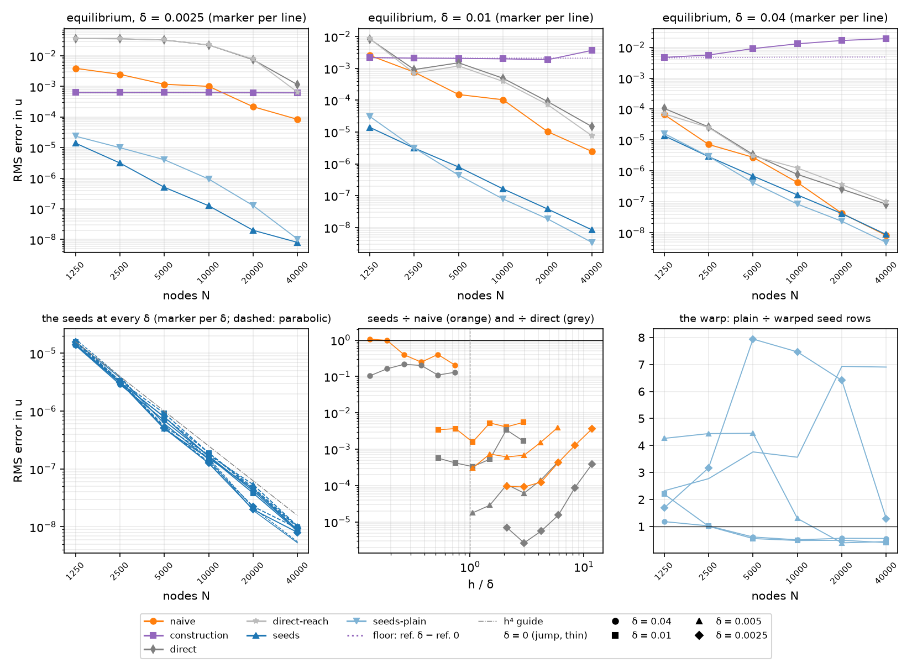

`scripts/heat2d_stiff.py --mode seeds` puts the seed operator on §4.2's
sweep: the same node sets (case 1, seed 0, 100 repulsion steps), the same
media `SmoothBand(case1().material, δ)` at δ ∈ {0, 0.04, 0.01, 0.005,
0.0025}, the same references `case1_reference(δ, c)`, the same two problems
(the equilibrium; E2.5's `e^t` mode by BD4 at `dt = h` from the analytic
history to `t = 0.1`) and the same norm — the RMS over all nodes, Dirichlet
rows included, orders per halving of `h = 1/round(0.95 √N)` (port notes
§2.10). Six lines run at every (n, δ):

| line | what it is |
| --- | --- |
| `naive` | `Dx A Dx + Dy A Dy` on 42 / 5 stencils with α at the nodes (§4.2) |
| `construction` | `interface_aware_operator`, the edge read as a jump at its centre (§4.2) |
| `direct` | `α ∇² + ∇α · ∇` on 42 / 5 stencils: the blind smooth operator, the method one reaches for once the grid resolves the edge |
| `direct-reach` | the same operator on the *seeds' own* stencil groups (30 / 4 wherever the rule seeds, 42 / 5 elsewhere): the seed matrix with the marched rows taken out |
| `seeds` | `seed_operator` (§4.4), warped, on the rows whose 30 nodes see an edge within 20 δ |
| `seeds-plain` | the same rows with plain Gaussians (H7's ablation) |

E4.3's `naive` and `construction` entries are reread from
`outputs/heat2d_stiff_knee.json`, never re-solved. Times (2026-09-22): the
default counts 1250–10,000 cost 5.7 min cold and under a second cached; the
documented sweep `--counts 1250 2500 5000 10000 20000 40000` 28 min once, 16
of them at 40,000, plus 1.4 min for the `direct-reach` line, which needs no
marches; the δ = 0 column to 160,000 (`--deltas 0 --operators naive
construction seeds`) a further 3 min.

**Five decisions, none of them re-derivable from the tables.**

- *The seed options ride in the cache label* — `seeds`, `seeds-plain`, and a
  `-r<reach>` suffix when `--seed-reach` is not 20 δ — so `KNEE_CACHE_META`
  is untouched and E4.3's 58 minutes to 160,000 nodes stand. §3.8's trap
  asks for a key on δ, n, seed, mode, warp and reach: the first three and
  the node set's repulsion `iterations` are `knee_key`'s, the rest are the
  label's.
- *One operator per (n, δ), for both problems.* The marches are the whole
  cost (167 s at 40,000 nodes and δ = 0.04), so the sweep builds the matrix
  once and both solves it and marches BD4 on it; E4.3's loop, which was
  problem-first, would have paid twice.
- *Both warps come off one march.* `seed_operators` calls `seed_basis` once
  a row and `weights_of` once a warp, so H7's second line costs the weight
  solves and not a second sweep; a test pins each of the two against
  `seed_operator` with that warp.
- *`direct-reach` is the control H8 needs.* The seeded rows are 30 / 4 and
  the bulk is 42 / 5 (§3.8, decision 6), so a bare seeds-against-`direct`
  ratio mixes the seeds with a stencil one degree smaller. `direct-reach`
  has the seed operator's groups exactly, with plain direct rows where the
  seeds are marched.
- *The cache is written after every count*, so a sweep interrupted at 40,000
  keeps the hours below it.

**H4's δ = 0 half: the seed line is the construction's, to 160,000 nodes.**
RMS error, and the distance between the two lines:

| n | h | seeds (elliptic) | construction | distance | seeds (parabolic) | construction | distance |
| --- | --- | --- | --- | --- | --- | --- | --- |
| 1250 | 0.0294 | 1.5976e-05 | 1.5976e-05 | 1.7e-09 | 1.7639e-05 | 1.7639e-05 | 6.0e-11 |
| 2500 | 0.0208 | 3.7950e-06 | 3.7950e-06 | 2.0e-10 | 3.9879e-06 | 3.9879e-06 | 1.6e-10 |
| 5000 | 0.0149 | 6.1079e-07 | 6.1079e-07 | 2.1e-07 | 6.0071e-07 | 6.0071e-07 | 5.3e-10 |
| 10000 | 0.0105 | 1.4528e-07 | 1.4528e-07 | 7.2e-08 | 1.5381e-07 | 1.5381e-07 | 2.4e-09 |
| 20000 | 0.0075 | 1.9233e-08 | 1.9233e-08 | 1.4e-05 | 2.1255e-08 | 2.1255e-08 | 7.1e-10 |
| 40000 | 0.0053 | 5.2757e-09 | 5.2757e-09 | 4.0e-06 | 5.5084e-09 | 5.5084e-09 | 1.6e-07 |
| 80000 | 0.0037 | 1.1466e-09 | 1.1453e-09 | 1.1e-03 | 1.2242e-09 | 1.2242e-09 | 8.1e-09 |
| 160000 | 0.0026 | 3.5830e-10 | 3.5753e-10 | 2.1e-03 | 4.1786e-10 | 4.1786e-10 | 5.9e-06 |
| fit | | **4.54** | 4.54 | | **4.52** | 4.52 | |

port notes §2.4–2.5's warped line is 1.598e-5 → 5.276e-9 over 1250–40,000
with fit 4.77, and E4.3 added 1.145e-9 and 3.58e-10 at 80,000 and 160,000:
the seed operator reproduces every one of them. (The fit over the eight
counts is 4.54; over the six the earlier sections quote, 4.77.) The distance
is the solve's, not the rows': §4.4 measured the two matrices 5.3e-13 apart
and here the two *errors* differ by 7.7e-13 in absolute terms at 160,000,
where the error itself is 3.6e-10 — the elliptic solve at that size
amplifies the last digits, the parabolic march does not. **H4's δ = 0 half,
ticked, and with it the regression check the E4.1 breadcrumb asked for
first.**

**H4's δ > 0 half: one line at every width, fourth order, δ-independent.**
RMS error (order per halving of h), the fit over the six counts beneath:

| n | h | δ = 0 (jump) | δ = 0.04 | δ = 0.01 | δ = 0.005 | δ = 0.0025 |
| --- | --- | --- | --- | --- | --- | --- |
| *equilibrium* | | | | | | |
| 1250 | 0.0294 | 1.60e-05 | 1.37e-05 | 1.40e-05 | 1.44e-05 | 1.40e-05 |
| 2500 | 0.0208 | 3.79e-06 (4.17) | 2.91e-06 (4.51) | 3.13e-06 (4.35) | 3.16e-06 (4.41) | 3.14e-06 (4.34) |
| 5000 | 0.0149 | 6.11e-07 (5.48) | 6.85e-07 (4.33) | 7.95e-07 (4.11) | 4.91e-07 (5.58) | 5.06e-07 (5.47) |
| 10000 | 0.0105 | 1.45e-07 (4.11) | 1.67e-07 (4.04) | 1.63e-07 (4.54) | 1.52e-07 (3.35) | 1.26e-07 (3.99) |
| 20000 | 0.0075 | 1.92e-08 (5.88) | 4.18e-08 (4.03) | 3.82e-08 (4.22) | 4.58e-08 (3.49) | 1.99e-08 (5.36) |
| 40000 | 0.0053 | 5.28e-09 (3.70) | 8.78e-09 (4.47) | 8.42e-09 (4.33) | 8.82e-09 (4.72) | 7.99e-09 (2.61) |
| fit | | 4.77 | 4.23 | 4.31 | 4.23 | 4.48 |
| *parabolic, t = 0.1* | | | | | | |
| 1250 | 0.0294 | 1.76e-05 | 1.55e-05 | 1.58e-05 | 1.63e-05 | 1.57e-05 |
| 2500 | 0.0208 | 3.99e-06 (4.31) | 3.21e-06 (4.58) | 3.35e-06 (4.49) | 3.34e-06 (4.60) | 3.33e-06 (4.49) |
| 5000 | 0.0149 | 6.01e-07 (5.68) | 7.87e-07 (4.21) | 9.17e-07 (3.88) | 5.44e-07 (5.44) | 5.22e-07 (5.55) |
| 10000 | 0.0105 | 1.54e-07 (3.90) | 1.90e-07 (4.07) | 1.90e-07 (4.51) | 1.75e-07 (3.25) | 1.32e-07 (3.95) |
| 20000 | 0.0075 | 2.13e-08 (5.75) | 4.77e-08 (4.02) | 4.43e-08 (4.23) | 5.37e-08 (3.44) | 2.25e-08 (5.14) |
| 40000 | 0.0053 | 5.51e-09 (3.87) | 1.01e-08 (4.46) | 9.80e-09 (4.32) | 1.03e-08 (4.74) | 9.37e-09 (2.51) |
| fit | | 4.77 | 4.22 | 4.28 | 4.18 | 4.44 |

- *One line.* Across the five widths the seeds span 1.17× at 1250 nodes
  (1.37e-5 … 1.60e-5) and 1.66× at 40,000 (5.28e-9 … 8.78e-9), with the
  jump the *lowest* of the five at the fine end and the widest edge the
  highest — the opposite of every other method here, and the same picture
  §2.3 drew in 1-D ("one line for every δ", 0.3 %, 1.5 %, 5 % there, a
  little looser on scattered nodes). *(E4.10's roundtable: those are the
  sweep's two ends; at 20,000 nodes the widths spread 2.38×, 2.53×
  parabolic, §5.3 statement 4.)*
- *Fourth order, δ-independent constant*: fits 4.77, 4.23, 4.31, 4.23, 4.48
  (elliptic) and 4.77, 4.22, 4.28, 4.18, 4.44 (parabolic). The per-halving
  rates wander between 2.6 and 5.9 — the node sets are independent draws, so
  a single pair of counts is not a rate — and the fit is what the line says.
- *The two problems coincide*: parabolic over elliptic is 1.04–1.17 at
  40,000 and 1.10–1.13 at 1250, so BD4 at `dt = h` adds nothing to the
  operator's error, exactly as port notes §2.5's lines do, and a knee in
  either is the operator's.
- *The elliptic line is a real test* (plan §3.2, the E4.1 breadcrumb item
  2): in 1-D the seeds are exact at equilibrium at any δ (§2.5 statement 4),
  and here they are not — `sin 2πx v(y)` is outside the 1-D seed span, the
  error is 1.6e-5 → 5.3e-9 and fourth order. The 2-D equilibrium therefore
  ranks the methods, which is what E4.6 was for. **H4, ticked in both
  halves.**

**Every line's fit, per δ** (elliptic above, parabolic below; the naive
line's 1250-node parabolic row carries E4.3's coarse-set growing mode, so
its fit from 2500 up is in brackets):

| δ | naive | construction | direct | direct-reach | seeds | seeds-plain |
| --- | --- | --- | --- | --- | --- | --- |
| 0 | 1.50 / 1.84 [1.61] | 4.77 / 4.77 | −0.01 / 0.01 | −0.01 / 0.01 | **4.77 / 4.77** | 4.09 / 4.07 |
| 0.04 | 5.18 / 5.17 [5.10] | −0.88 / −0.88 | 4.24 / 4.27 | 3.85 / 3.83 | **4.23 / 4.22** | 4.71 / 4.71 |
| 0.01 | 3.99 / 4.29 [4.23] | −0.18 / −0.17 | 3.31 / 3.31 | 3.58 / 3.60 | **4.31 / 4.28** | 5.21 / 5.24 |
| 0.005 | 2.97 / 3.22 [3.11] | 0.08 / 0.08 | 2.55 / 2.57 | 2.77 / 2.78 | **4.23 / 4.18** | 5.88 / 5.91 |
| 0.0025 | 2.22 / 2.63 [2.58] | 0.01 / 0.01 | 1.87 / 1.86 | 2.09 / 2.09 | **4.48 / 4.44** | 4.43 / 4.34 |

The seeds are the only line whose order does not move with δ. The naive
line walks H10's knee from 1.5 at the jump to 5.2 at δ = 0.04 (the 42 / 5
stencils' own order, E4.3's fifth); the construction is flat at the small
widths and *negative* at δ = 0.04, where its rebuilt rows enforce a kink the
solution does not have (§2.5 statement 1's 2-D twin, and the reason it needs
δ to be switched off); the blind direct operator is first to second order
while the edge is unresolved and fourth once it is.

**At 40,000 nodes** (`h = 0.0053`), every line, equilibrium:

| δ | h/δ | naive | construction | direct | direct-reach | seeds | seeds-plain |
| --- | --- | --- | --- | --- | --- | --- | --- |
| 0 | jump | 3.44e-04 | 5.28e-09 | 3.63e-02 | 3.63e-02 | **5.28e-09** | 3.64e-08 |
| 0.04 | 0.13 | 8.22e-09 | 1.90e-02 | 8.43e-08 | 1.02e-07 | **8.78e-09** | 4.88e-09 |
| 0.01 | 0.53 | 2.45e-06 | 3.69e-03 | 1.48e-05 | 7.65e-06 | **8.42e-09** | 3.40e-09 |
| 0.005 | 1.05 | 2.89e-05 | 1.07e-03 | 4.96e-04 | 4.02e-04 | **8.82e-09** | 3.89e-09 |
| 0.0025 | 2.11 | 8.36e-05 | 6.18e-04 | 1.14e-03 | 6.47e-04 | **7.99e-09** | 1.03e-08 |

Four orders below the naive product at δ = 0.0025, five below the
construction, and level with the naive product only at δ = 0.04, where the
grid resolves the edge seven times over.

**H8, the resolved-edge penalty.** Where `h ≤ δ` the seed rows are supposed
to tend to the standard ones and cost at most 1.2× the direct operator's
error. At δ = 0.04 every row is seeded (`20 δ = 0.8` covers the strip), so
this is the whole matrix marched:

| δ | n | δ/h | seeds | direct | direct-reach | naive | ÷ direct | ÷ direct-reach | ÷ naive |
| --- | --- | --- | --- | --- | --- | --- | --- | --- | --- |
| 0.04 | 1250 | 1.36 | 1.37e-05 | 1.05e-04 | 7.00e-05 | 6.66e-05 | 0.130 | 0.196 | 0.206 |
| 0.04 | 2500 | 1.92 | 2.91e-06 | 2.65e-05 | 2.55e-05 | 7.20e-06 | 0.110 | 0.114 | 0.404 |
| 0.04 | 5000 | 2.68 | 6.85e-07 | 3.41e-06 | 3.05e-06 | 2.77e-06 | 0.201 | 0.224 | 0.248 |
| 0.04 | 10000 | 3.80 | 1.67e-07 | 7.73e-07 | 1.24e-06 | 4.22e-07 | 0.216 | 0.135 | 0.396 |
| 0.04 | 20000 | 5.36 | 4.18e-08 | 2.57e-07 | 3.60e-07 | 4.27e-08 | 0.163 | 0.116 | 0.981 |
| 0.04 | 40000 | 7.60 | 8.78e-09 | 8.43e-08 | 1.02e-07 | 8.22e-09 | 0.104 | 0.086 | **1.068** |

- *There is no penalty against either direct operator*: the seeds are
  0.10–0.22 of the blind operator's error and 0.086–0.22 of the
  same-stencil control's at every count, so H8's ≤ 1.2× is met with a 5–10×
  margin and the sign is the other way round. Marching a row whose edge the
  grid resolves is not a waste: the seed row carries the profile of α
  through the stencil, where the direct row carries α and ∇α at the anchor
  and pays `h^k α^{(k)}` for the rest.
- *The one line that catches them is the naive product*, and only at the
  finest counts: 0.21 at 1250, 0.98 at 20,000, 1.07 at 40,000 (1.15 on the
  parabolic problem). That is the stencil, not the seeds — `naive` runs
  42 / 5 and fits 5.18 here against the seed rows' 30 / 4 and 4.23 — and it
  costs at most 15 % at δ/h = 7.6. The parabolic column of the same table:
  0.223, 0.414, 0.340, 0.437, 1.109, 1.145.
- The other resolved column in the sweep, δ = 0.01 at 20,000 and 40,000
  (δ/h 1.34 and 1.90, 62 % of the rows seeded), has the seeds at 4e-4 and
  6e-4 of `direct` and 0.004 and 0.003 of `naive`: at a width the grid only
  just resolves, the seeds are two and a half orders below the naive product
  and three below the direct operator. **H8, ticked, with the
  caveat that "≤ 1.2×" should be read against the 42 / 5 naive product and
  not against the direct operator, which the seeds beat everywhere.**

**The rule, restated for diffusion.** *Seed every row whose 30 nodes see an
edge within 20 δ; there is no δ threshold and no crossover to manage.*
*(E4.10's roundtable, §5.3 statement 4: no switch, but the 42 / 5 naive
product, converging at 5.2 against the seeds' 4.2 on a resolved edge, passes
them as n grows: a crossover of the stencils' degree, measured by the 30 / 4
naive control of §5.6.)* The
evidence is the ratio table at every (δ, n): the seeds are at or below the
construction's error everywhere (equal at δ = 0, where they are its rows),
and below the naive product's everywhere except δ = 0.04 at 20,000 and
40,000, where they are 0.98 and 1.07 of it. The contrast is exactly 1-D's
(§2.5 statements 1–2): the construction has to know δ — at δ = 0.04 its
error *grows* with n, 4.70e-3 → 1.90e-2 — and the naive operator has to know
nothing but is three to five orders behind until `h ≲ δ`, while the seeds
need neither a threshold nor an estimate of δ beyond the one the medium
already carries.

**H7, the warp, as two lines of the sweep.** The plain-Gaussian rows' RMS
error over the warped rows' (above 1: the warp wins):

| δ | 1250 | 2500 | 5000 | 10000 | 20000 | 40000 |
| --- | --- | --- | --- | --- | --- | --- |
| *equilibrium* | | | | | | |
| 0 | 2.32 | 2.77 | 3.76 | 3.56 | 6.93 | 6.90 |
| 0.04 | 1.18 | 1.02 | 0.61 | 0.51 | 0.56 | 0.56 |
| 0.01 | 2.20 | 1.01 | 0.55 | 0.48 | 0.49 | 0.40 |
| 0.005 | 4.26 | 4.44 | 4.45 | 1.30 | 0.39 | 0.44 |
| 0.0025 | 1.69 | 3.17 | 7.94 | 7.47 | 6.41 | 1.28 |
| *parabolic, t = 0.1* | | | | | | |
| 0 | 2.81 | 3.09 | 4.96 | 4.43 | 8.12 | 8.66 |
| 0.04 | 1.17 | 1.00 | 0.60 | 0.49 | 0.55 | 0.54 |
| 0.01 | 2.36 | 1.02 | 0.53 | 0.46 | 0.47 | 0.38 |
| 0.005 | 4.48 | 4.69 | 4.63 | 1.27 | 0.38 | 0.41 |
| 0.0025 | 1.59 | 3.09 | 8.43 | 8.16 | 6.61 | 1.32 |

- *At δ = 0 the warp is worth E2.4's factor and it grows with n*: 2.3× at
  1250 to 6.9× at 40,000 (2.8× to 8.7× parabolic), against E2.4's 2.3–6.9×
  on the jump at 1250–20,000. The seeds pay for the warp exactly as the
  translated basis does, which is H7's claim.
- *At δ > 0 the factor turns with `h/δ`, and turns in a different place for
  the widest edge.* The warp wins while the edge is unresolved — 1.7–7.9× at
  δ = 0.0025 down to h/δ = 3, 4.3–4.5× at δ = 0.005 down to h/δ = 3, 2.2× at
  δ = 0.01 at h/δ = 2.9 — and loses by up to 2.6× once the grid resolves it.
  The crossing is at `h ≈ 2δ` for δ = 0.0025, 0.005 and 0.01 but at
  `h ≈ δ/2` for δ = 0.04, where α varies over the whole stencil and not over
  part of it, so the factor is not a function of `h/δ` alone. Read the sign
  of these numbers rather than their size: they wander by 2–4× between
  neighbouring counts (1.69, 3.17, 7.94 at δ = 0.0025), which is the node
  sets' own scatter. E4.5's two-count preview ("1.4–2.0× better at δ ≥ h at
  10,000 nodes") was the resolved side of the same turn.
- *The seeds stay warped.* Where the warp loses, both rows are already at
  1e-8 and the loss is at most 2.6× *(E4.10's roundtable: not "at 1e-8" — at
  δ = 0.01 on 5000 nodes the warp loses at 7.95e-7 against plain's 4.39e-7,
  errors of 1e-7 to 1e-6 on the intermediate grids, §5.3 statement 7)*;
  where it wins, the problem is the one
  the study is about, and at δ = 0 the plain rows bring back port notes
  §2.5's complex loop in the spectrum (E4.5's H6: `h² max |Im|` 1.51
  against 0.18). The ablation stays in the driver as a line of the sweep,
  which is what E4.5 asked for.

**What the seeded solution says on the straddling rows.** E4.3's readings on
the innermost pair, the naive operator's beside (flux and jump relative to
the reference's `α v′` at the curve):

| δ | n | h/δ | seeds: flux | jump | profile | naive: flux | jump |
| --- | --- | --- | --- | --- | --- | --- | --- |
| 0 | 1250 | jump | 3.03e-04 | 2.82e-04 | 1.41e-05 | 8.53e-01 | 8.78e-01 |
| 0 | 40000 | jump | 1.49e-07 | 1.34e-07 | 1.15e-08 | 3.45e-01 | 5.54e-01 |
| 0.0025 | 1250 | 11.76 | 2.34e-04 | 2.16e-04 | 7.54e-06 | 8.58e-01 | 8.64e-01 |
| 0.0025 | 40000 | 2.11 | 3.48e-07 | 4.20e-07 | 3.27e-08 | 9.11e-02 | 5.72e-02 |
| 0.005 | 40000 | 1.05 | 3.66e-07 | 4.32e-07 | 3.59e-08 | 4.33e-02 | 5.01e-02 |
| 0.01 | 40000 | 0.53 | 2.53e-07 | 1.26e-07 | 3.29e-08 | 2.53e-03 | 3.04e-03 |
| 0.04 | 40000 | 0.13 | 9.22e-08 | 3.95e-08 | 3.27e-08 | 3.77e-06 | 2.70e-06 |

The plateau E4.3 found — the naive flux a function of `h/δ` alone, 0.31–0.86
of the flux while `h ≥ 4δ`, never converging — is absent from every seed
column: the flux error falls 2000× from 1250 to 40,000 nodes at δ = 0
(order 4.4) and 670× at δ = 0.0025, and the flux *jump* across the pair,
which the naive rows never get right, converges with it. This is the
diagnostic E4.3 named as the sharpest separator of a resolved edge from an
unresolved one, and the seeds do not see the difference.

**What the rule costs.** Seeded rows, their share of N, the march per row
and the operator's build (one march per row, both warps):

| δ | 1250 | 2500 | 5000 | 10000 | 20000 | 40000 |
| --- | --- | --- | --- | --- | --- | --- |
| 0 | 408 (33 %) | 576 (23 %) | 792 (16 %) | 1134 (11 %) | 1601 (8 %) | 2278 (6 %) |
| 0.0025 | 566 (45 %) | 1036 (41 %) | 1821 (36 %) | 3050 (31 %) | 5578 (28 %) | 10166 (25 %) |
| 0.005 | 716 (57 %) | 1237 (49 %) | 2367 (47 %) | 4540 (45 %) | 8808 (44 %) | 17090 (43 %) |
| 0.01 | 839 (67 %) | 1627 (65 %) | 3192 (64 %) | 6300 (63 %) | 12444 (62 %) | 24595 (62 %) |
| 0.04 | 1250 (100 %) | 2500 (100 %) | 5000 (100 %) | 10000 (100 %) | 20000 (100 %) | 40000 (100 %) |

1.3–4.4 ms a row (the jump march is the cheap one; the cost per row grows
slowly with n and hardly at all with δ), so the 40,000-node operators take
7.3 s at δ = 0, 45 s at δ = 0.0025, 73 s at 0.005, 104 s at 0.01 and 167 s
at δ = 0.04 — against 2.6 s for the naive product and 7.8 s for the
construction on the same node set, whose own build is 2.8 s. At fixed
δ > 0 the seeded share settles at a constant fraction of N (the strip within
20 δ of a curve), so the operator is `O(N)` marches; only the jump's share
falls, with its `O(√N)` crossing rows. The sweep's 28 minutes are almost
entirely the δ = 0.04 and δ = 0.01 columns at 20,000 and 40,000.

**What E4.7 (#38) inherits.**

- *The flat numbers to compare the curved ones against, at equal δ*: the
  seeds' table above (H9's "route (a) reproduces the flat numbers at
  δ ≥ 0.005 for n ≥ 5000" is read against 4.91e-7, 1.52e-7, 4.58e-8 and
  8.82e-9 at δ = 0.005, and the fits 4.23 / 4.18).
- *The driver's shape*: `--mode seeds` with `--operators` and
  `--seed-reach`; a curved run adds `--amplitude` and the product-grid
  reference, and everything else — the cache label, the one-operator-per-
  (n, δ) loop, the tables — carries over. The `direct-reach` control is
  worth keeping on the curved sweep: on case 2 the seeds carry a tangential
  α term the direct rows do not, and the stencil-degree difference is the
  same.
- *The δ = 0 regression is the first thing to run after any change to the
  marcher* (`--deltas 0 --operators construction seeds`, 3 min to 160,000):
  it is the one column with an independent answer, and §4.4's 5e-13 rows
  turn into 2e-3 in the elliptic error at 160,000, so read the distance
  against the error's own size and not as a relative tolerance.
- *The warp's crossover at `h ≈ 2δ`* is a flat-geometry measurement. On a
  curved feature the warp also carries the foot-point geometry, so H9's
  ablation should be run again rather than inherited.
- Resampling at δ > 0 (`interpolation_weights` with the seed block) is still
  unbuilt, and E4.7's references need it (§4.4's last item).

Tests: `tests/test_heat2d_stiff.py` adds the label rule, `seed_operators`
against `seed_operator` at both warps on a 900-node set, and the sweep at
900 and 1250 nodes with three widths — H4's δ = 0 identity (the seed line is
the construction's to 1e-7 relative and port notes' 4.937e-5 / 1.598e-5),
the δ-independence (every width within a factor 2 of the jump's error), the
rule's row counts (every row at δ = 0.04, the crossing rows at δ = 0), H8's
penalty (`÷ direct` below 1.2 with every row seeded), H7's sign, and the
cache's round trip.

### 4.6 The curved feature: route (a), the product grid, and what a frozen profile cannot carry (E4.7, #38)

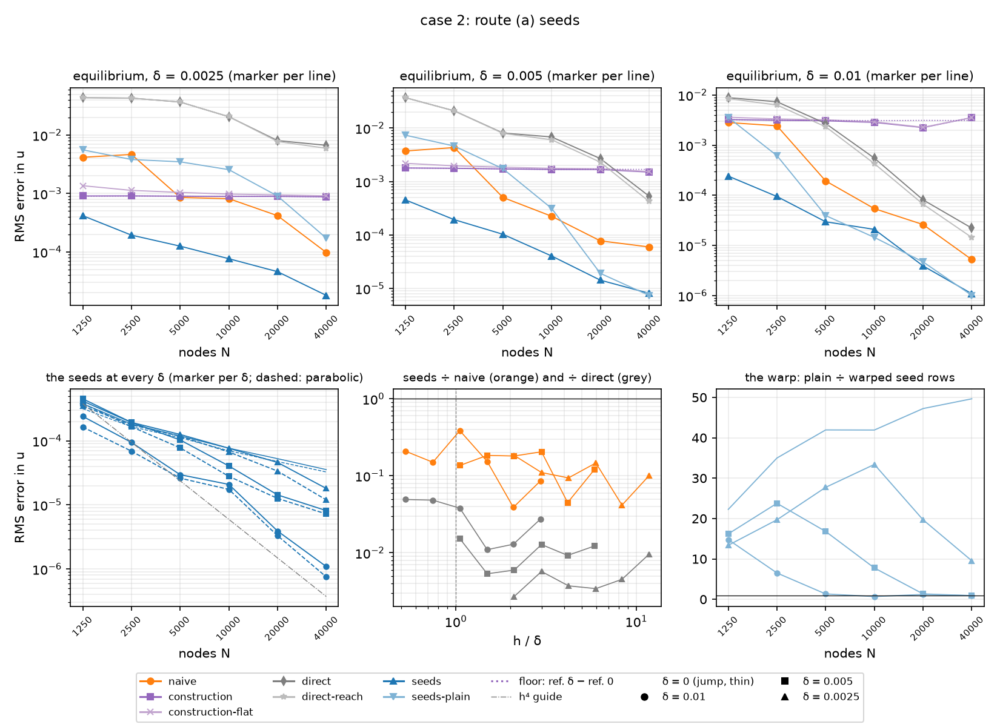

`scripts/heat2d_stiff.py --mode seeds --amplitude 0.02` puts §4.5's sweep on
case 2: the sine pair `0.6, 0.8 + 0.02 sin 2πx` with its inside piece
`0.2 + 0.1 sin 2πx sin 2πy` (EABE eq. 35), each curve a tanh edge of width δ
in its signed normal distance (`SmoothBand`, which blended curved bands since
E4.2), case 2's own node sets (seed 0, 100 repulsion steps, E2.6's), the six
lines at δ ∈ {0, 0.01, 0.005, 0.0025} (`CURVED_DELTAS`, the plan's), the two
problems, the RMS over all nodes. What changes is the seeds (route (a)), the
reference (a product grid), and two tables (a truncation probe and the curved
numbers over the flat ones). `--inside constant` on the curves and `--amplitude
0 --inside sine` on flat lines split case 2's two departures from case 1, the
curvature and the tangential variation of alpha; they are what locates the
error below.

**What is built.**

- *Route (a), as §3.5 specified it.* `SmoothBand.normal_profile` crosses a sine
  graph by Newton on its level along the line (`domain._line_crossing`,
  quadratic from the flat estimate; a case-2 normal is within 7.2° of vertical
  and meets each graph once); a flat line keeps E4.2's formula, so case 1 is
  untouched. The flanks are `± EDGE_STOP δ` in each curve's own normal
  distance, exact for the curve the line is normal to and to first order (its
  cosine with the other curve's normal) for the other, which is all a restart
  point needs. Along the foot curve's normal the distance to it is
  `d_e + h_s η` exactly (the foot point does not move inside the radius of
  curvature), so `NormalProfile.foot` hands it to `SmoothBand.alpha_at` and
  the march pays a foot-point Newton only for the other curve; the curves
  have float `signed_distance_at` (`closest` and `signed_distance` step for
  step, 1.1e-16 from the array path, 3 µs a call) and `SineProduct` a float
  `alpha_at`. The frame stays `nearest_interface`, the E4.4 breadcrumb's open
  decision taken on purpose: on case 2's 0.2-thick band a 30-node stencil
  crosses one curve at most, and on every crossing stencil of the 2500-node
  set (over 400, at δ = 0 and 0.0025) it picks the curve E2.3 frames on. A
  line that would reach toward the curve's focal distance is refused before
  anything is marched (`FOOT_CURVATURE`: `κ_max (|d_e| + 2 h_s) < 0.8`, which
  case 2 meets at 0.37 on its widths and 0.68 at δ = 0.04 on 1250 nodes), the
  crossing's Newton iteration raises rather than return an unconverged root,
  and `--amplitude` is validated at 0.02 only (the /spar review's MEDIUM).
  The circles of case 3 are still refused, naming E4.8.
- *The product-grid reference* (plan D4, revised: Brad chose it for every δ,
  the jump included, with E2.6's run as its check). `exact.ShearMap`,
  `y = η + a sin(kx) β(η)` with the cubic `β(0) = β(1) = 0`,
  `β(0.6) = β(0.8) = 1`, makes both curves the lines `η = 0.6, 0.8` and keeps
  the Dirichlet rows at `η = 0, 1`; a signed distance to either curve vanishes
  on its line exactly, so a tanh edge is centred on E3.2's element cuts at
  every x and only its width moves with x, by ±5 % through the metric.
  `ProductGridReference` collocates `∇·(α∇U) − cU = 0` in the flux form,
  `(1/J)[∂_x F_x + ∂_η F_η]`, on 49 Fourier points in x times the separable
  reference's Chebyshev elements in η (20 nodes, cuts at `c ± {1, 3, 9, 27} δ`,
  elements ≤ 0.1), matches `U` and the flux through `η = const` — the normal
  flux through the curve on its line — at every shared element end with each
  element's own α (one-sided at a jump, so δ = 0 is the same solver), and
  solves the banded system with SuperLU's `NATURAL` ordering after scaling each
  row by its largest entry. Unscaled, the rows span seven decades, and in a
  scratch check on a flat band, where the exact answer is the single mode
  `sin 2πx`, partial pivoting left 2e-7 of other Fourier modes at
  δ = 0.0025; scaled, 2e-12. `e^{ct} U` solves
  the parabolic problem with the top row `e^{ct} sin 2πx` exactly in t, so
  E2.5's `c = 1` mode needs no time integrator and BD4 keeps its analytic
  history, as on case 1. It is read at any point spectrally (η by Newton on
  the cubic, barycentric Lagrange in the element, the trigonometric
  interpolant in x), which is why E4.7 needs no seed-aware resampling; that
  stays E4.8's, for a fine seed run on the ring.
- *The probe* (H9's "the seed rows' residual on the true curved solution").
  Every operator the sweep builds is applied to the equilibrium reference at
  the nodes; since `L u = 0` each row's value is its local truncation error.
  Three row sets per (n, δ): `seeded` (the rows the seed rule marches — for
  the other lines, the rows the seeds would rebuild), `crossing` (E2.3's rows,
  whose 30 nodes straddle a curve) and `bulk` (the reach stencils' interior
  42 / 5 group: rows that neither see an edge nor sit in the boundary zone,
  the same kind of row at every (n, δ)). It rides in the elliptic cache entry
  (`probe_seeded`, `probe_crossing`, `probe_bulk`).
- *The driver.* `Geometry(amplitude, inside)` carries the band, its reference
  and its cache: case 1 keeps `heat2d_stiff_knee.json` and its keys to the
  byte, every other geometry goes to `heat2d_stiff_curved.json` under its tag
  (`a0.02 sine`), so nothing here can move E4.3's and E4.6's numbers. The
  straddling-row readings are dropped off case 1 (they read the separable
  mode's `sin 2πx` profile and its flux); `construction-flat`, E2.3 with the
  interface expansion off, is an extra line `--operators` offers.

**The reference.** `--mode references --amplitude 0.02` (67 s), max
differences over 4000 random points of the strip:

| δ | c | elements | unknowns | build | vs 65 points in x | vs 24 nodes on 0.05 | distance from δ = 0 |
| --- | --- | --- | --- | --- | --- | --- | --- |
| 0 | 0 | 10 | 10,290 | 0.84 s | 9.9e-14 | 2.9e-13 | — |
| 0.01 | 0 | 21 | 21,609 | 1.75 s | 5.3e-13 | 2.3e-12 | 2.51e-02 |
| 0.005 | 0 | 21 | 21,609 | 1.75 s | 1.8e-12 | 3.2e-12 | 1.45e-02 |
| 0.0025 | 0 | 23 | 23,667 | 1.90 s | 5.4e-12 | 5.6e-12 | 7.73e-03 |
| 0 | 1 | 10 | 10,290 | 0.84 s | 1.2e-13 | 5.7e-13 | — |
| 0.01 | 1 | 21 | 21,609 | 1.76 s | 1.3e-12 | 2.2e-12 | 2.58e-02 |
| 0.005 | 1 | 21 | 21,609 | 1.76 s | 1.5e-12 | 2.1e-12 | 1.50e-02 |
| 0.0025 | 1 | 23 | 23,667 | 1.90 s | 5.9e-12 | 6.6e-12 | 7.99e-03 |

So the reference is good to 1e-11 at every width, three decades below the
finest error the sweep resolves, in two seconds, and it is not cached. On
flat lines with constant pieces it is `SeparableReference` to 3.5e-13
(δ = 0), 5.8e-12 (δ = 0.0025) and 3.0e-12 (δ = 0.01), both problems (a
test). **E2.6's 160,000-node jump-aware run**, read at its own nodes, is
4.32e-9 RMS and 3.46e-8 max from the δ = 0 grid: port notes §2.6's
Richardson estimate (about 3e-9) had the size right, and E2.6's curved line
against the grid is 3.06e-5, 1.25e-5, 6.25e-6, 7.03e-7, 1.79e-7, 5.29e-8 at
1250–40,000 nodes, the 40,000-node point 9 % above the 4.87e-8 E2.6 read
against the fine run (the pointer is now in port notes §2.6).

**At the jump, route (a) is the flat-interface construction.** Case 2 at
δ = 0, elliptic, RMS error against the product grid (E2.3's two lines are the
port's own, E2.6's `curved` and `flat`, now read against an exact reference):

| n | E2.3 curved | E2.3 flat | route (a) | route (a) ÷ curved |
| --- | --- | --- | --- | --- |
| 1250 | 3.06e-05 | 6.97e-04 | 3.80e-04 | 12 |
| 2500 | 1.25e-05 | 3.89e-04 | 1.82e-04 | 15 |
| 5000 | 6.25e-06 | 2.62e-04 | 1.19e-04 | 19 |
| 10000 | 7.03e-07 | 1.77e-04 | 7.69e-05 | 109 |
| 20000 | 1.79e-07 | 1.22e-04 | 5.27e-05 | 294 |
| 40000 | 5.29e-08 | 8.18e-05 | 3.56e-05 | 673 |
| fit | 3.89 | 1.21 | 1.33 | |

(Parabolic, `t = 0.1`: 3.12e-5 → 5.63e-8, fit 3.80; 5.07e-4 → 5.16e-5, 1.29;
3.18e-4 → 3.27e-5, 1.30.) Route (a) is first order and sits at 0.4–0.55 of
the flat construction, the line EABE Fig. 10 drew to show what the
curvature terms are worth; the curved construction is 12× below it at 1250
nodes and 670× at 40,000.

**The two departures, split.** The same sweep on the sine pair with the
constant piece (*A*, `--inside constant`: the curvature alone) and on flat
lines with case 2's piece (*B*, `--amplitude 0 --inside sine`: the
tangential variation alone), at δ = 0 and 0.0025, elliptic:

| n | A: curved | A: flat | A: route (a) | B: E2.3 | B: route (a) | A: route (a), δ = 0.0025 | B: route (a), δ = 0.0025 |
| --- | --- | --- | --- | --- | --- | --- | --- |
| 1250 | 2.17e-05 | 7.62e-04 | 7.62e-04 | 1.77e-05 | 4.20e-04 | 7.91e-04 | 4.30e-04 |
| 2500 | 4.54e-06 | 4.10e-04 | 4.10e-04 | 4.05e-06 | 3.02e-04 | 4.22e-04 | 3.25e-04 |
| 5000 | 2.55e-06 | 2.86e-04 | 2.86e-04 | 8.66e-07 | 2.15e-04 | 2.97e-04 | 2.34e-04 |
| 10000 | 3.30e-07 | 1.95e-04 | 1.95e-04 | 2.70e-07 | 1.52e-04 | 1.94e-04 | 1.50e-04 |
| 20000 | 7.83e-08 | 1.37e-04 | 1.37e-04 | 6.09e-08 | 1.08e-04 | 1.08e-04 | 7.08e-05 |
| 40000 | 2.21e-08 | 9.31e-05 | 9.31e-05 | 1.20e-08 | 7.57e-05 | 2.57e-05 | 8.34e-06 |
| fit | 4.05 | 1.18 | 1.18 | 4.17 | 1.00 | 1.80 | 2.06 |

- *Each departure alone is enough.* With constant pieces (A) route (a) *is*
  E2.3's flat construction: the two errors agree to 2e-10 … 2e-8 relative at
  every count (the elliptic solves' rounding; ≤ 5e-12 parabolic), the H2
  identity of §4.3 in the tangent frame, since both put the kink on the
  tangent line with the same polynomials either side of it. On flat lines
  (B), where the curvature is zero, route (a) is first order to the second
  digit (fit 1.00) against E2.3's 4.17: the foot point's flux ratio alone
  costs what the curvature costs.
- *A resolved edge forgives both.* At δ = 0.0025 the route (a) lines are
  within 10 % of their δ = 0 values while `h ≳ 4δ`, fall 20–35 % below them at
  `h ≈ 3δ` and drop 4.2× (A) and 8.5× (B) from 20,000 to 40,000 nodes, where
  `h/δ` reaches 2.1: once the edge is smooth on the stencil the misplacement
  and the ratio's variation are smooth perturbations and §1.4's argument
  holds.

**Why the frozen profile fails, twice.** §3.2's ansatz is exact where α
depends on the normal coordinate alone within a stencil, and §3.5 predicted
two departures on case 2 with a size read against δ. Both are larger, and
neither is a matter of δ.

- *Curvature.* A node at tangential offset `x′` sits `Δ = κ x′²/2` from the
  curve in the direction the seeds do not see, so the seeds put the edge on
  the tangent line and the true edge is `Δ` beyond it. Moving an edge by `Δ`
  changes a flux-carrying profile beyond it by `Δ` times the jump in its
  slope (`φ₀₁` by `Δ (1 − α_e/α_far)`, whatever the width of the edge), so
  the seed values are wrong by `O(κ h²)` in value at the outer nodes of every
  stencil that straddles the edge, and a row with `O(h⁻²)` weights carries an
  `O(κ)` truncation error that does not converge. On constant pieces at
  δ = 0 route (a) and E2.3 with its interface expansion off (the "linear
  interface" line of EABE Fig. 10, which E2.6 measured at first order, fit
  1.18) both put the kink on the tangent line, and (A) above measures them
  together.
- *The tangential variation of α.* Case 2's piece varies by 25 % along a
  1250-node stencil. The seeds' far-side profile uses the flux ratio of the
  foot point at every node, where the true solution's changes with the
  tangential position: across the jump its slope ratio is
  `α_e / α_far(ξ) = r₀ + r₁ ξ + …`. The missing term `r₁ ξ (η − η_c)₊` is a
  slope on the far side alone, while every seed profile at that level of `ξ`
  (`1` and `φ₀₁`, in `φ₁₀` and `φ₁₁`) carries the foot point's ratio `r₀`
  between its two sides, so no combination of seeds contains it. §1.4's
  argument absorbs a *smooth* perturbation of the space into the lower
  seeds; this one is kinked, and the row error is again `O(1)`. Once the
  grid resolves the edge (`h ≲ 2δ`) the variation is smooth on the stencil
  and the argument holds again, which is (B)'s drop at 40,000 nodes on the
  0.0025 edge.

**Through a smooth edge: still the best line on case 2, and far behind the
flat one.** The documented sweep, elliptic RMS error at 40,000 nodes with
each line's fit over 1250–40,000 in brackets (§4.5's layout; route (a)'s
parabolic errors are 0.66–0.92 of these at every δ and count):

| δ | h/δ at 40,000 | naive | construction | direct | direct-reach | route (a) | route (a), plain |
| --- | --- | --- | --- | --- | --- | --- | --- |
| 0 | jump | 6.26e-04 (1.32) | **5.29e-08 (3.89)** | 4.32e-02 (0.00) | 4.32e-02 (0.00) | 3.56e-05 (1.33) | 1.77e-03 (0.92) |
| 0.01 | 0.53 | 5.23e-06 (3.85) | 3.54e-03 (0.05) | 2.22e-05 (3.75) | 1.44e-05 (3.93) | **1.09e-06 (3.07)** | 1.01e-06 (4.69) |
| 0.005 | 1.05 | 5.99e-05 (2.78) | 1.50e-03 (0.09) | 5.34e-04 (2.29) | 4.25e-04 (2.43) | **8.15e-06 (2.40)** | 7.44e-06 (4.38) |
| 0.0025 | 2.11 | 9.80e-05 (2.16) | 8.78e-04 (0.02) | 6.68e-03 (1.25) | 5.95e-03 (1.30) | **1.81e-05 (1.71)** | 1.73e-04 (1.83) |

and the curved lines over case 1's at equal (δ, n) (§4.5's numbers from
`heat2d_stiff_knee.json`):

| δ | line | 1250 | 2500 | 5000 | 10000 | 20000 | 40000 |
| --- | --- | --- | --- | --- | --- | --- | --- |
| 0 | route (a) ÷ flat seeds | 24 | 48 | 195 | 529 | 2741 | 6742 |
| 0 | curved ÷ flat construction | 1.9 | 3.3 | 10 | 4.8 | 9.3 | 10 |
| 0.01 | route (a) ÷ flat seeds | 17 | 30 | 37 | 128 | 102 | 130 |
| 0.005 | route (a) ÷ flat seeds | 31 | 61 | 210 | 266 | 313 | 924 |
| 0.0025 | route (a) ÷ flat seeds | 30 | 62 | 248 | 610 | 2314 | 2262 |

- *Route (a) beats every other line on case 2 at every δ > 0 and every
  count but its own plain-Gaussian twin* (which edges it by up to 1.45× at
  the resolved counts): 0.04–0.39 of the naive product, 0.0003–0.46 of the
  δ = 0 construction, 0.003–0.05 of the direct operator. The construction, which
  wins at δ = 0 by 12–670×, reads a smooth edge as a jump and sits on its
  O(δ) floor (fits 0.02–0.09) exactly as on case 1. So the seeds keep their
  ranking where the edge is smooth and lose it where it is a jump.
- *But the order follows the resolution of the edge, not the seeds.* The
  fits fall from 3.07 (δ = 0.01, resolved from 5000 nodes on) through 2.40 to
  1.71 (δ = 0.0025, `h/δ` never below 2.1), and on the narrowest edge the
  line is δ = 0's first-order one to within 10 % up to 10,000 nodes (4.18e-4,
  1.94e-4, 1.26e-4, 7.66e-5 against 3.80e-4, 1.82e-4, 1.19e-4, 7.69e-5), as
  the split geometries showed. Even resolved (δ = 0.01 at 40,000,
  `h = 0.53 δ`) route (a) is 130× the flat seeds: the misplacement and the
  ratio's variation are then smooth, the order comes back (4.87 and 3.66 per
  halving over the last two counts), and the constant does not.
- *What the curvature costs a method that carries it.* At δ = 0 E2.3's
  curved construction sits 1.9–10× above its case-1 line with no trend in
  n, the gap EABE Fig. 7 and 10 show between the two cases; route (a)'s gap
  grows from 24 to 6742, like `h^{-3.3}`, the difference between its order
  and the flat seeds'.

*H8 on case 2* (the one resolved column, δ = 0.01 at 20,000 and 40,000,
`δ/h` = 1.34 and 1.90, 62 % of the rows seeded): route (a) is 0.048 and 0.049
of the direct operator, 0.059 and 0.076 of `direct-reach`, and 0.150 and
0.209 of the naive product. *H7 on case 2*, rerun as the E4.6 breadcrumb
asked: the plain rows are 22–50× the warped ones at δ = 0 (case 1: 2.3–6.9×)
and 13–33× at δ = 0.0025 to 20,000 nodes (9.6 at 40,000), and the factor
turns where the grid resolves the edge, between `h ≈ 1.5 δ` and `h ≈ δ` for
both δ = 0.005 (1.34 → 0.91) and δ = 0.01 (1.33 → 0.69), where case 1
turned at `h ≈ 2δ`; past the turn the two are within 0.7–1.2× of each
other. The warp is worth more on the wrong seeds than on the right ones;
the sweep does not say why, and a first-order method's ablation is not
worth a theory.

**H9's probe: the crossing rows on the true solution.** RMS of `L u` over
E2.3's crossing rows, `u` the equilibrium reference at the nodes (the
separable one on case 1, the product grid elsewhere), with the fit over the
counts shown; case 1's are the rows E4.7 rebuilt, to 10,000 nodes:

| geometry | δ | rows | 1250 | 2500 | 5000 | 10000 | 20000 | 40000 | fit |
| --- | --- | --- | --- | --- | --- | --- | --- | --- | --- |
| case 1 | 0 | seeds (= E2.3) | 5.17e-03 | 1.40e-03 | 4.77e-04 | 1.70e-04 | | | 3.31 |
| case 1 | 0.0025 | seeds | 4.69e-03 | 1.20e-03 | 3.78e-04 | 1.25e-04 | | | 3.52 |
| case 2 | 0 | E2.3 curved | 1.10e-02 | 5.64e-03 | 2.06e-03 | 6.69e-04 | 2.43e-04 | 9.24e-05 | 2.86 |
| case 2 | 0 | route (a) | 6.44e-02 | 5.23e-02 | 4.53e-02 | 3.91e-02 | 3.58e-02 | 3.33e-02 | **0.38** |
| case 2 | 0.0025 | route (a) | 6.58e-02 | 5.47e-02 | 4.92e-02 | 4.13e-02 | 3.08e-02 | 2.24e-02 | 0.61 |
| case 2 | 0.01 | route (a) | 5.68e-02 | 3.16e-02 | 2.01e-02 | 9.71e-03 | 4.40e-03 | 1.81e-03 | 1.99 |
| A | 0 | E2.3 curved | 6.45e-03 | 2.52e-03 | 8.51e-04 | 3.18e-04 | 1.02e-04 | 4.03e-05 | 2.99 |
| A | 0 | route (a) (= E2.3 flat) | 4.54e-02 | 3.48e-02 | 3.06e-02 | 2.74e-02 | 2.54e-02 | 2.36e-02 | **0.36** |
| B | 0 | E2.3 | 8.43e-03 | 1.38e-03 | 8.33e-04 | 2.91e-04 | 1.09e-04 | 3.48e-05 | 3.00 |
| B | 0 | route (a) | 4.17e-02 | 3.73e-02 | 3.48e-02 | 3.27e-02 | 3.13e-02 | 3.03e-02 | **0.18** |

The bulk rows (the reach stencils' interior 42 / 5 group, the same kind of
row at every (n, δ)) converge at 3.7–3.8 from 5000 nodes on in both cases
(δ = 0: case 1 3.96e-5 → 1.09e-5, case 2 1.10e-4 → 2.10e-6); below 5000 the
narrow widths' interior group gains the band's middle rows as the stencils
shrink, on case 1 as on case 2, which is the one −4 to −5 rate each table
prints at 2500 nodes. So H9's statement is read on the crossing rows against
the bulk rate:

- *On flat edges the seeded rows converge at the bulk rows' rate* (3.3 and
  3.5 against 3.7), the local `O(h³)` of §1.6 with the scattered set's
  scatter, at the jump and through the edge alike: what H9 expected on the
  curve.
- *On case 2 they stall*: route (a)'s crossing rows fall by 1.9× over a
  32-fold increase in N at δ = 0 (fit 0.38), where E2.3's fall by 120× (2.86)
  on the same rows. At δ = 0.0025 the same stall to 10,000 nodes, and at
  δ = 0.01, the edge resolved on the finer sets, order two. Each split
  geometry stalls alone at δ = 0 (0.36 with the curvature, 0.18 with the
  tangential α), each with an E2.3 row that converges at 3.0 beside it.
- *Three kinds of row, told apart without the error.* E2.3's crossing rows
  converge, route (a)'s stall at 0.02–0.07 on every geometry where α varies
  along the edge, and the naive product's rows on the same set grow (from
  4.3–5.3 at 1250 nodes to 20–21 at 40,000 on case 2, A and B). The probe
  needs only a reference solution at the nodes, which is why E4.11 can use
  it as its acceptance test.

**H9, answered: it fails, and the error is located.** Route (a) does not
reproduce the flat numbers at any δ or count on these node sets (17–6742×
the flat seeds); the probe's crossing rows stall at every width the grid does
not resolve, where §3.5 expected them to converge at the bulk rows' rate; and
the tangential variation of α changes the order, not the constant. The error
is not route (a)'s `κ r²/2` read against δ: it is two `O(1)` truncation
terms, one from the curvature (the kink on the tangent line; route (a) at
δ = 0 on constant pieces *is* EABE Fig. 10's flat-interface construction)
and one from any tangential variation of α at an unresolved edge (the foot
point's flux ratio at every node), each enough alone to make the line first
order, and both forgiven only once `h ≲ 2δ`. §3.5 and H9 are corrected in
place. What the ticket's done-when asked is met — the curved numbers against
the flat ones at equal δ, the geometry's error located — and the seeds are
not yet the method for a curved feature: that is E4.11 (#81, plan R7).

**What E4.11 inherits.**

- *The fix is §3.5's last paragraph, both halves, in the curve's own
  coordinates*: the seeds evaluated at each node's (arclength, normal
  distance) from the foot point, the metric `1 − κ d` inside the chain, and
  α's and the metric's variation along the curve expanded in ξ with the
  levels coupled. A scratch run on 2026-09-22 (two concentric circles, radii
  0.25 and 0.35, constant pieces 0.2 | 1, `RingMode` exact; the script is on
  #81) measured the rungs on the crossing rows' truncation: route (a) 4.9e-1
  → 2.4e-1 at 2500–40,000 nodes (E2.3's flat construction again); the
  companion's route (a′) as §3.5 described it, the same march evaluated at
  the curvilinear coordinates with the metric in the right-hand sides only,
  9.2e-2 → 2.4e-2, first order; the osculating-circle chain, the metric
  inside the march (`g′ = ψ/(α m)`, `ψ′ = m α_e S g − (α/m) Λ g`), 3.6e-3 →
  3.3e-5, order 3.4 and 5–6.5× *below* E2.3's 1.8e-2 → 2.1e-4. On case 2's
  sine pair the osculating chain alone is first order (the curvature varies
  along the curve), and with case 2's piece it does not converge: the
  ξ-expansion is the rest. At degree 4 the coupled chain is about 55 levels
  (110 states), not 44, since the expansion couples the parities (E4.11
  settled on 75 levels, every seed to level 4, §3.10).
- *The instruments*: the probe (the acceptance test H9 asked for, now
  measured), the two split geometries (A isolates the curvature, B the
  tangential α, each with an exact δ = 0 comparator in E2.3), the product
  grid for all three, and the cached curved sweep, to which the new line is
  one label.
- *For E4.8 (#39)*: case 3's ring has both terms (κ = 2.86 and a sine
  product inside the ring), so the plan now puts E4.11 first; its circles are
  concentric, so the curvature half is the osculating chain, exact there.

**Cost.** A seeded row of case 2 costs 1.7–2× a flat one: on a quiet machine
at 10,000 nodes, 400 rows timed per width, the median `seed_basis` is 4.1,
9.4 and 9.0 ms at δ = 0, 0.0025 and 0.01 against case 1's 2.0, 5.4 and
5.2 ms. Every α sample on the line pays one foot-point Newton for the other
curve (3 µs in floats); the foot curve's distance is the linear formula. The
documented sweep took 34 min once (18 min of it at 40,000 nodes) and the two
split geometries 9.6 and 7.5 min, all with three other runs on the machine;
`--mode references` 67 s; everything is seconds cached.

**Tests.** `tests/heat2d/test_domain.py`: `signed_distance_at` against
`signed_distance` on the five test curves (a flat line bit for bit), the
pieces' `alpha_at`, the curved normal profile at δ = 0 and three widths with
both pieces (each curve crossed once, the foot curve at the foot point, the
flanks in each curve's own distance, α along the line the medium's to
2e-13, one-sided at δ = 0), the flat foot line carrying no foot distance, and
the ring's refusal, the focal-distance guard on a sine ten times as curved,
and the crossing's refusal of an unconverged root. `tests/heat2d/test_seeds.py`: the curved seeds equal the
flat seeds of the same local stencil to 1e-12 on a stencil tilted 7°, and
`nearest_interface` picks E2.3's curve on every crossing stencil of case 2 at
δ = 0 and 0.0025. `tests/heat2d/test_exact.py`: the Fourier derivative exact
on its trigonometric polynomials, the shear straightening the pair, the
product grid equal to the separable reference on a flat band (three widths,
both problems, 2e-11), resolved on case 2 (3e-11 under both refinements),
E2.3's 2500-node error against it within 1 % of E2.6's 1.247e-5, the
refusals, and the shear's inverse refusing an unconverged point. `tests/test_heat2d_stiff.py`: the geometries' keys and caches,
the curved sweep at 900 and 1250 nodes (route (a) 3.804e-4 and the
construction 3.059e-5 at 1250, the probe stalling on the seeds' crossing
rows and falling on E2.3's, the cache round trip), the curved reference
table, and the modes a curved geometry refuses. The case-1 regression the
E4.6 breadcrumb asked for is a rebuild, not a cached reread: 1250–10,000
nodes at δ ∈ {0, 0.0025, 0.04}, the construction and both seed lines, both
problems, rebuilt from scratch with E4.7's code equal E4.6's cached errors
and readings in all 368 values, bit for bit.

### 4.7 The tangential chain: the order back where α varies along the edge (E4.11, #81)

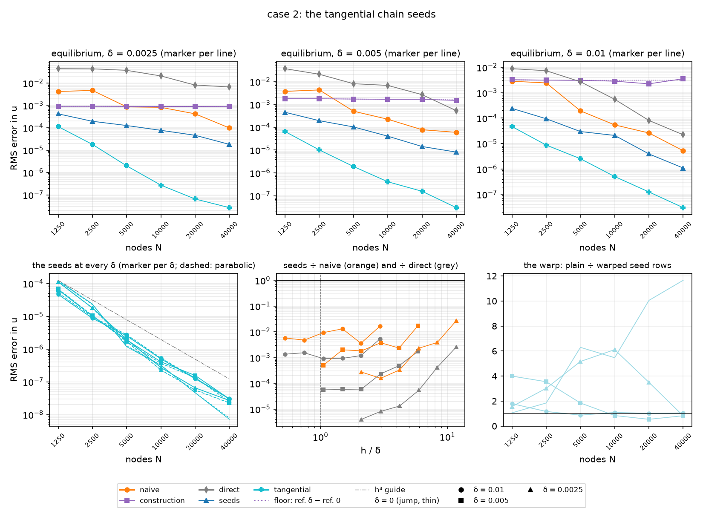

§3.10's chain, built and put on E4.7's curved sweep as two more lines. `seed_basis(…,
tangential=True)` marches the 75 levels in the foot curve's normal coordinates,
`seed_operator(…, tangential=True)` puts the rows in the matrix on the rows the reach
rule already seeds, and `--operators … tangential tangential-plain` adds the lines to
`--mode seeds`, where the tangential line becomes the sweep's main one (the ratios,
the warp, H8, the δ = 0 comparison with E2.3, the probe, the figure). E4.7's lines
are reread from `heat2d_stiff_curved.json`, not rebuilt; the new entries are keyed
`tangential` and `tangential-plain`. `--mode tangential` prints the chain's own
tables: H14 on concentric circles, H15's span distance, and H6's twin on case 2.

**What is built** (§3.10's decisions, as implemented).

- *The chain.* `seeds.coupled_chain` (every seed to level 4, 75 levels at degree 4,
  §3.10's revised cutoff; the shift, source and ξ-coupling matrices stacked over the
  series' five coefficients),
  `FootCoordinates` / `foot_coordinates` (each node's foot point and distance, one
  Newton each; the 11 sample lines' foot points and normals formed once per
  stencil; the metric's series; a constant sampled on the lines is its own series
  exactly, so a flat line couples nothing), `tangential_profiles` (§3.3's march,
  factored out of `seed_profiles` as `_march`, the flat chain's arithmetic
  unchanged), and `TangentialBasis` behind `tangential=True` (the block, `2 α_e` on
  the two quadratics only, the Gaussians' `A_1(0)` and `B_η(0)`, the warp's flux at
  the anchor read from the march and the rate).
- *The far edge.* Where the other curve is beyond `TANH_REACH δ` of every sample,
  its blend is linear in the two pieces with one weight per line and the pieces'
  series are blended (`_edge_series`); otherwise its signed distance along each
  straight sample line is a 17-point Chebyshev interpolant (`FAR_POINTS`), the float
  Newton's to 1e-15 (a test), which took a band row at δ = 0.01 from 66 to 47 ms.
- *The medium and the curves.* `Curve.speed`; `SmoothBand.alpha_given`, the blend
  with both distances supplied (`alpha` bit for bit); concentric circles in
  `normal_profile` (radial line, crossings and flanks exact), read from the stored
  radii — §3.6's widths rule stays E4.8's.
- *Refusals.* At δ = 0, a stencil that crosses both curves where the other is not a
  coordinate line of the foot curve's frame (`NotImplementedError`); `FOOT_CURVATURE`
  as before, which the 0.25 circle trips at 1250 nodes (0.81), so H14 starts at
  2500.

**H13, the chain is the curvilinear chain: holds.** On case 1 every coupling is
exactly zero (a constant sampled on the lines is its own series) and the 150 states
march §3.2's 44, the other 106 staying zero: on two stencils at δ ∈ {0, h/8, h, 8h}
the tangential blocks equal §3.2's to 1e-12 and the weights, both warps, to 1e-10,
and at the operator level (1250 nodes, δ = 0 and h/8, every seeded row) the two
operators agree to 1e-10 relative. The independent residual (the true curvilinear
operator by twelfth-order differences on the marched seeds, the sine pair with the
sine product on both sides, `h_s = 0.05`) is below 1e-10 on `ξ = 0` for all 15 seeds
and grows off it like `|ξ|⁵` (fitted 4.9–5.1), the first dropped level, except
φ₁₀'s `|ξ|⁴` (4.2), the dropped `A_5`; the moment right-hand side is `2 α_e` on the two quadratics only and the warp's
flux at the anchor is `(α_e, 0)`, both read from the march. The coupled rate with
constant series is §3.2's rate on its 44 states and zero on the rest (a test).

**H14, the concentric circles: holds.** `--mode tangential`, the 0.25 and 0.35 circles
with 0.2 between and 1 outside, `RingMode` exact through both; RMS of `L u` over E2.3's
crossing rows (the circles' coupling is zero, so this is the osculating rung of #81's
scratch, reproduced within 2 % from 5000 nodes and 6 % at 2500: the scratch's ξ was the
foot circle's arc length, not the anchor's parallel curve's):

| n | rows | E2.3 curved | route (a) | tangential | ms a tangential row (quiet) |
| --- | --- | --- | --- | --- | --- |
| 2500 | 1013 | 1.77e-02 | 4.86e-01 | 3.81e-03 | 10.5 |
| 5000 | 1505 | 5.17e-03 | 3.84e-01 | 1.04e-03 | 10.2 |
| 10000 | 2136 | 1.90e-03 | 2.94e-01 | 2.59e-04 | 10.1 |
| 20000 | 3030 | 6.21e-04 | 2.55e-01 | 9.47e-05 | 9.8 |
| 40000 | 4291 | 2.14e-04 | 2.39e-01 | 3.32e-05 | 9.8 |
| fit | | 3.18 | 0.53 | 3.45 | |

The tangential rows converge at 3.45, 4.6–7.3× below E2.3's; route (a)'s stall (it is
E2.3 with the interface expansion off, §4.6). At 1250 nodes the inner circle's
curvature 4 takes a stencil's normal line to 0.81 of its focal distance and the seeds
refuse it (`CIRCLES_FROM`).

**The split geometries: each closes alone.** `--inside constant` on the sine pair (A,
the curvature) and `--amplitude 0 --inside sine` (B, the tangential α), δ = 0 and
0.0025, elliptic RMS error against the product grid, with the tangential line over
case 1's flat seeds at equal (δ, n):

| n | A: E2.3 curved | A: route (a) | A: tangential | ÷ flat | A, 0.0025: route (a) | tangential | ÷ flat |
| --- | --- | --- | --- | --- | --- | --- | --- |
| 1250 | 2.17e-05 | 7.62e-04 | 3.65e-05 | 2.29 | 7.91e-04 | 3.59e-05 | 2.56 |
| 2500 | 4.54e-06 | 4.10e-04 | 5.85e-06 | 1.54 | 4.22e-04 | 5.04e-06 | 1.60 |
| 5000 | 2.55e-06 | 2.86e-04 | 1.21e-06 | 1.99 | 2.97e-04 | 8.77e-07 | 1.73 |
| 10000 | 3.30e-07 | 1.95e-04 | 2.02e-07 | 1.39 | 1.94e-04 | 1.38e-07 | 1.10 |
| 20000 | 7.83e-08 | 1.37e-04 | 6.85e-08 | 3.56 | 1.08e-04 | 3.69e-08 | 1.86 |
| 40000 | 2.21e-08 | 9.31e-05 | 1.01e-08 | 1.92 | 2.57e-05 | 1.49e-08 | 1.87 |
| fit | 4.05 | 1.18 | 4.66 | | 1.80 | 4.61 | |

| n | B: E2.3 | B: route (a) | B: tangential | ÷ flat | B, 0.0025: route (a) | tangential | ÷ flat |
| --- | --- | --- | --- | --- | --- | --- | --- |
| 1250 | 1.77e-05 | 4.20e-04 | 6.21e-05 | 3.89 | 4.30e-04 | 5.78e-05 | 4.13 |
| 2500 | 4.05e-06 | 3.02e-04 | 8.09e-06 | 2.13 | 3.25e-04 | 6.23e-06 | 1.98 |
| 5000 | 8.66e-07 | 2.15e-04 | 2.01e-06 | 3.29 | 2.34e-04 | 8.02e-07 | 1.58 |
| 10000 | 2.70e-07 | 1.52e-04 | 4.94e-07 | 3.40 | 1.50e-04 | 1.83e-07 | 1.45 |
| 20000 | 6.09e-08 | 1.08e-04 | 8.49e-08 | 4.41 | 7.08e-05 | 8.55e-08 | 4.30 |
| 40000 | 1.20e-08 | 7.57e-05 | 1.72e-08 | 3.26 | 8.34e-06 | 3.03e-08 | 3.79 |
| 80000 | 3.06e-09 | 5.31e-05 | 3.45e-09 | 3.00 | | | |
| 160000 | 6.26e-10 | 3.75e-05 | 1.31e-09 | 3.66 | | | |
| fit | 4.21 | 1.00 | 4.49 | | 2.06 | 4.33 | |

(Parabolic, `t = 0.1`, the same picture: the tangential line fits 4.74 at δ = 0 and
4.62 at 0.0025 on A, 4.68 and 4.33 on B to 40,000, is 0.83–1.11 of its elliptic error at
every δ and count, and 1.2–3.5× case 1's flat seeds from 10,000 nodes on.)

**Case 2: H15 and H16.** `--mode seeds --amplitude 0.02` with E4.7's six lines reread
and the two tangential lines built, 1250–40,000 nodes, the four widths, both problems,
against the product grid. Elliptic RMS error at 40,000 nodes with each line's fit over
1250–40,000 in brackets (§4.6's layout), and the tangential line over case 1's flat seeds
at equal (δ, n):

| δ | h/δ at 40,000 | naive | construction | route (a) | tangential | tangential, plain | ÷ flat seeds |
| --- | --- | --- | --- | --- | --- | --- | --- |
| 0 | jump | 6.26e-04 (1.32) | 5.29e-08 (3.89) | 3.56e-05 (1.33) | **7.18e-09 (5.72)** | 8.37e-08 (4.32) | 1.36 |
| 0.01 | 0.53 | 5.23e-06 (3.85) | 3.54e-03 (0.05) | 1.09e-06 (3.07) | **3.01e-08 (4.24)** | 3.18e-08 (4.48) | 3.58 |
| 0.005 | 1.05 | 5.99e-05 (2.78) | 1.50e-03 (0.09) | 8.15e-06 (2.40) | **3.00e-08 (4.36)** | 2.48e-08 (5.54) | 3.40 |
| 0.0025 | 2.11 | 9.80e-05 (2.16) | 8.78e-04 (0.02) | 1.81e-05 (1.71) | **2.69e-08 (5.03)** | 2.21e-08 (5.25) | 3.37 |

| δ | tangential ÷ flat seeds: 1250 | 2500 | 5000 | 10000 | 20000 | 40000 |
| --- | --- | --- | --- | --- | --- | --- |
| 0 | 7.84 | 6.24 | 1.93 | 2.18 | 2.40 | 1.36 |
| 0.01 | 3.32 | 2.79 | 3.18 | 3.09 | 3.27 | 3.58 |
| 0.005 | 4.48 | 3.21 | 3.87 | 2.68 | 3.42 | 3.40 |
| 0.0025 | 8.05 | 5.74 | 3.93 | 2.17 | 3.30 | 3.37 |

(Parabolic, `t = 0.1`: 0.83–1.11 of these errors at every δ and count, fits 5.65, 4.30,
4.50, 5.13, and 1.43–3.13× the flat seeds at 40,000.)

- *H16 holds: fourth order within a small factor of the flat numbers.* From 5000
  nodes on the tangential line is 1.4–3.9× case 1's flat seeds at every δ and count
  (fits over 5000–40,000: 4.96, 4.23, 3.86, 4.13), where route (a) was 17–6742×
  (§4.6); route (a) is 36–5000× it at 40,000 nodes; it is 0.001–0.006 of the direct,
  `direct-reach` and naive operators on the resolved column (H8 below); and the
  steep full fits come from the two coarsest counts, 2.8–8.0× the flat seeds
  (8.05 at δ = 0.0025 and 1250, *8.1 before E5.3's number check*).
- *H15's error half holds, and better than asked.* At δ = 0 the tangential line is
  below E2.3-curved from 5000 nodes on, 0.19, 0.45, 0.26 and 0.14× at 5000–40,000,
  where route (a) was 19–673× above it; at 1250 and 2500 it is 4.1 and 1.9× above,
  the coarse sets' constant (the rows above the upper curve, §3.10).
- *The first cutoff, for the record.* The same sweep with `j ≤ 4 − b` (commits
  82cf2f5–3251c61, run once and not merged into the cache) gave 3.55e-8, 3.09e-8,
  2.75e-8 and 1.81e-8 at 40,000 nodes (6.7, 3.7, 3.1 and 2.3× the flat seeds) and
  2.83e-4 at 1250 at δ = 0 (17.7×): fourth order already, with the η-seeds'
  constant of §3.10 at δ = 0 and on the coarse sets. Every seed to level 4 divided
  δ = 0's error at 40,000 nodes by 4.9 and the coarse counts' by 2–4, and moved
  δ > 0's at 40,000 by 0.97× (0.01), 1.09× and 1.49× (the two narrow widths, a
  little worse).
- *The warp (H7 on case 2).* Plain Gaussians over warped: 1.1–11.7× at δ = 0 (5.5–11.7×
  from 5000 on), and at δ > 0 above 1 while the edge is unresolved and 0.55–1.1 once
  `h ≲ 2δ` (δ = 0.005 from 10,000 nodes, 0.01 from 5000, 0.0025 at 40,000), the turn
  E4.6 and E4.7 saw. The warped line is kept.
- *H8 on case 2* (δ = 0.01 at 20,000 and 40,000, `δ/h` = 1.34 and 1.90, 62 % of the
  rows seeded): the tangential line is 0.001–0.002 of the direct operator and of
  `direct-reach`, 0.005–0.006 of the naive product; route (a) was 0.05–0.21 (§4.6).

**The probe (H15's first half, H16's last): the crossing rows converge at every δ.**
RMS of `L u` over E2.3's crossing rows on the equilibrium reference, fit over
1250–40,000:

| geometry | δ | tangential | route (a) | E2.3 curved | fit: tangential / route (a) / E2.3 |
| --- | --- | --- | --- | --- | --- |
| case 2 | 0 | 1.51e-02 → 6.35e-05 | 6.44e-02 → 3.33e-02 | 1.10e-02 → 9.24e-05 | 3.22 / 0.38 / 2.86 |
| case 2 | 0.01 | 1.13e-02 → 2.81e-05 | 5.68e-02 → 1.81e-03 | — | 3.58 / 1.99 / — |
| case 2 | 0.005 | 1.23e-02 → 4.43e-05 | 6.71e-02 → 9.60e-03 | — | 3.19 / 1.09 / — |
| case 2 | 0.0025 | 1.44e-02 → 6.50e-05 | 6.58e-02 → 2.24e-02 | — | 3.24 / 0.61 / — |
| A | 0 | 9.48e-03 → 3.85e-05 | 4.54e-02 → 2.36e-02 | 6.45e-03 → 4.03e-05 | 3.23 / 0.36 / 2.99 |
| A | 0.0025 | 8.92e-03 → 4.01e-05 | 4.69e-02 → 1.37e-02 | — | 3.25 / 0.64 / — |
| B | 0 | 9.19e-03 → 3.75e-05 | 4.17e-02 → 3.03e-02 | 8.43e-03 → 3.48e-05 | 3.07 / 0.18 / 3.00 |
| B | 0.0025 | 8.50e-03 → 7.03e-05 | 4.25e-02 → 2.14e-02 | — | 2.71 / 0.38 / — |

(E2.3's rows read a smooth edge as a jump and diverge at δ > 0, as §4.6 found.) The
tangential rows converge at 2.7–3.6, E2.3's rate or better, on every geometry and width
where route (a)'s stall at 0.2–0.6 (1.1–2.0 once the edge is resolved), and at δ = 0
they end within 0.7–1.1× of E2.3's rows; on B to 160,000 nodes they are 4.78e-6 against
E2.3's 4.34e-6. One thing slows: at δ = 0.0025 the tangential probe falls at only
1.7–2.3 between 20,000 and 40,000 nodes on all three geometries, where `h/δ` passes
from 3 to 2.1, the resolution transition of §4.5; the errors keep falling there, at
2.5–3.0 per halving over that step (case 2, A, B), and the transition is where the flat
seeds' warp turned too.

**B to 160,000 nodes, the constant at δ = 0.** The δ = 0 column of the flat lines with
case 2's piece was run to 160,000 nodes (`--deltas 0 … --counts … 80000 160000`, 23 min),
because under the first cutoff it was the one place the tangential line looked slow:
3.53e-7, 1.40e-7, 6.63e-8, 1.89e-8, 3.08e-9 at 10,000–160,000 nodes (rates 2.7, 2.1,
3.6, 5.3; 13–16× the flat seeds at 40,000–80,000), with the worst rows' truncation on
the innermost straddling row above `y = 0.8` at `x ≈ 0.13–0.36` 4× E2.3's at every
count. Every seed to level 4: 4.94e-7, 8.49e-8, 1.72e-8, 3.45e-9, 1.31e-9, fit 4.49
over 1250–160,000 (E2.3 4.21), 2.1–4.4× the flat seeds at every count from 2500 on,
1.1–2.1× E2.3's at 20,000–160,000, and the probe 1.1× E2.3's at 160,000.

**H15's span half: holds.** The sine of the largest principal angle between the
tangential span and E2.3's translated basis on every crossing stencil of case 2 at
δ = 0 (`--mode tangential`):

| n | 1250 | 2500 | 5000 | 10000 | 20000 | 40000 |
| --- | --- | --- | --- | --- | --- | --- |
| median | 2.02e-01 | 1.44e-01 | 1.11e-01 | 7.87e-02 | 5.56e-02 | 3.86e-02 |
| max | 7.89e-01 | 6.05e-01 | 5.42e-01 | 3.92e-01 | 2.76e-01 | 1.96e-01 |

First order (0.98, 0.80, 0.98, 1.01, 1.04 per halving of h): two approximations of one
space, where on case 1 they are one space to rounding (H2).

**H6 on case 2: no eigenvalue right of the axis.** The interior spectra at 1600 nodes
(`--mode tangential`): at every δ the tangential operator's rightmost eigenvalue is
route (a)'s and E2.3's to 0.001 (−7.176 at δ = 0, −7.283 at 0.01), `h² min Re` −12.70
for all, `h² max |Im|` 0.15–0.21 warped against 0.24–1.06 plain, and none positive, so
the parabolic line's BD4 at `dt = h` has nothing to amplify.

**H17, cost: holds, barely.** On a quiet machine (`--mode tangential`, 400 seeded rows
per width at 10,000 nodes of case 2, the median `seed_basis`):

| δ | route (a) | tangential | ratio |
| --- | --- | --- | --- |
| 0 | 3.8 ms | 14.5 ms | 3.8 |
| 0.01 | 8.8 ms | 21.8 ms | 2.5 |
| 0.005 | 8.8 ms | 24.5 ms | 2.8 |
| 0.0025 | 9.7 ms | 24.3 ms | 2.5 |

A tangential row is 2.5–3.8× route (a)'s (whose 3.8 and 8.8–9.7 ms are §4.6's 4.1 and
9.0–9.4 again) and 4.2–7.3× case 1's flat rows (§4.6's 2.0, 5.4, 5.2 ms): the 150 states against 44, the tangential
series at 11 samples per rate evaluation, and the far edge's interpolant where it is not
saturated (a band row at δ = 0.01 took 66 ms with a Newton per sample and 47 ms with the
interpolant, under load). The documented case-2 sweep took 58 min with three other runs
on the machine (68 min under the first cutoff), the two split geometries 13 min each, B's
δ = 0 column to 160,000 a further 23 min, and `--mode tangential` 8 min quiet;
everything is seconds cached.

**H13–H17, answered.** The tangential chain is the curvilinear chain (H13: the flat
limit, the residual by differences, the right-hand side); it is the osculating rung
on concentric circles and converges there at 3.45, 4.6–7.3× below E2.3's rows (H14);
at the jump it converges at E2.3's rate on case 2 and both split geometries, lands
below E2.3-curved from 5000 nodes on case 2 and A and within 1.1–2.1× of it on B from
20,000, and its span tends to E2.3's at first order (H15); through every width it is
fourth order within 1.4–3.9× of the flat seeds from 5000 nodes on, A and B each close,
and the probe converges at every δ (H16). What does not: the coarsest two counts,
2.8–8.0× the flat seeds, the space's constant where case 2's band piece is 0.1 against
1 and varies by half itself across a stencil; the probe's slowdown at δ = 0.0025 through
`h ≈ 2–3 δ`; and H17's cost, above. H9's question — can the seeds carry a curved,
tangentially varying edge — is answered yes, and plan R7's fallback (scoping the 2-D
seeds to normal-only α) is not needed.

**What E4.8, E4.9 and E4.10 inherit.**

- *E4.8 (#39)*: `tangential=True` on the ring, since case 3 has both terms (κ = 2.86 and
  a sine product inside the ring); concentric circles are admitted by `normal_profile`
  from the stored radii, and §3.6's widths-from-the-outer-radius rule is still E4.8's;
  the ring's other circle is a coordinate line, so no stencil is refused; its edge is
  never saturated on a ring 0.001 wide, so every sample takes the Chebyshev path; the
  1500 : 1 contrast is the regime where §3.10's η-seed levels matter most and is
  untested.
- *E4.9 (#40)*: the treatments' curved comparison is against the tangential line, not
  route (a).
- *E4.10 (#41)*: the figure `docs/figures/heat2d_stiff_tangential_a0.02_sine.png`, the
  cache entries `tangential` / `tangential-plain` in `heat2d_stiff_curved.json` (the
  first cutoff's are not in it), and the regeneration commands in the driver's
  docstring. The labels do not say which level cutoff built an entry, so the curved
  cache's version moved to 2 with the chain (the /spar review's MEDIUM): a version-1
  file is refused whole. The local file was re-stamped from 1 to 2 rather than
  rebuilt, after checking that it held no tangential entry before the level-4 runs
  were merged; its E4.7 entries do not involve the chain. Bump the version again
  after any change to either chain, the tangential series or their sampling.

**Tests.** `tests/heat2d/test_seeds.py`: the coupled chain's 75 levels and its rate
with constant series equal to §3.2's; the flat limit on case 1 (blocks to 1e-12,
weights to 1e-10, both warps, four widths); the residual by differences on the smooth
sine medium (1e-10 on the line, slopes ≥ 4.8 off it, φ₁₀ ≥ 3.8); the right-hand side
and the warp's anchor flux; the circles' zero coupling and metric; the saturated
far edge and the Chebyshev far edge against a per-sample Newton; a case-2 row set
against route (a) and E2.3; the refusals; the cost. `tests/heat2d/test_domain.py`:
the concentric profile at δ = 0 and δ > 0, the mixed and eccentric refusals, `speed`
against the curve's own chord, `alpha_given` bit for bit. `tests/heat2d/test_operators.py`:
the tangential operator equals the seed operator on case 1 to 1e-10.
`tests/test_heat2d_stiff.py`: the labels and `flat_twin`, the curved sweep with the
tangential lines at 900 and 1250 nodes (the probe converging where route (a)'s stalls,
the figure its own, the cache round trip), and `--mode tangential`'s tables.

### 4.8 EABE eq. 40's ring with seeds: the Fig. 19–20 twins and the smooth ring (E4.8, #39)

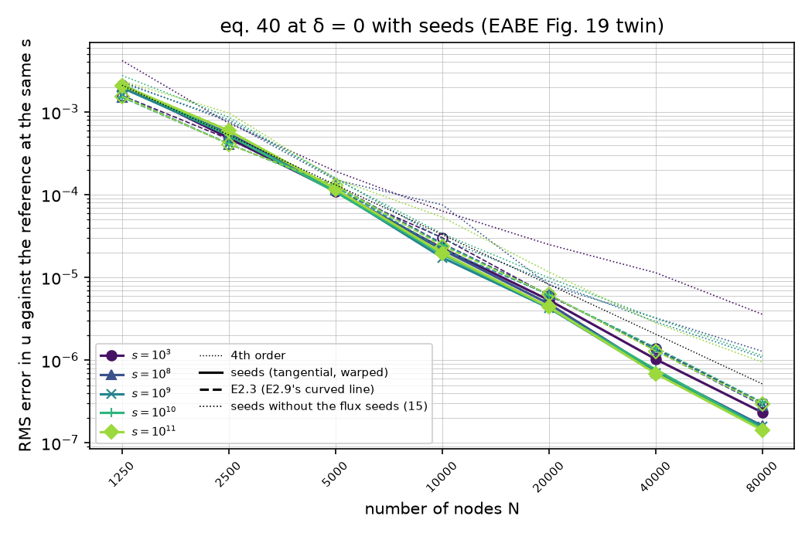

§3.6's design on §3.10's chain, with what §3.11 found the ring needs: its exact
width, its own tangential series, the flux seeds (20 on the 30 nodes), and the
Gaussians on `φ₀₁`'s level 0 with `ε` from the warped spacing. The driver is
`scripts/heat2d_ring.py`, four parts over one cache (`heat2d_ring.json`,
version 4): Fig. 19's twin at δ = 0 against E2.9's cached 160,000-node
references; Fig. 20's twin, the matched radial profile and the conditioning at
every (s, δ); the spectrum and the DDR; and the smooth ring, the probe on its
exact radial mode and a far-field self-convergence line. E2.3 is the papers'
operator (E2.9's "curved"); "seeds (15)" is the chain without the flux seeds,
the ablation. At δ > 0 the seeds line is E4.12's (§3.11, §4.10): a row
anchored in an edge keeps the warped or the plain Gaussians, whichever has the
stronger diagonal; at δ = 0 that is the warp on every row, bit for bit. E4.8's
own δ > 0 lines, the warp on every row, are kept as `seeds-warp` beside plain
Gaussians, all three from one march per row. Seed 0, 100 repulsion iterations;
the runs of 2026-09-23 went as up to 16 concurrent processes on the M4 Pro, so
their times are inflated.

**H11, Fig. 20's twin: the seeds are exact on the matched profile at every s.**
10,000 nodes, the 1254 rows the seeds rebuild, the ring at its constant part
(the matched profile `u = ∫ 2r/α dr` is in every construction's span); the worst
relative residual of the weights, and mean 2-norm condition numbers:

| s | seeds | median | seeds (15) | seeds, stored radii | E2.3 | median | seed block raw / scaled | seed system | E2.3 P | E2.3 system |
| --- | --- | --- | --- | --- | --- | --- | --- | --- | --- | --- |
| 10³ | 1.55e-15 | 8.1e-17 | 1.54e-15 | 3.02e-16 | 2.10e-14 | 1.3e-16 | 2.8e4 / 1.3e4 | 4.8e6 | 2.1e3 | 1.4e6 |
| 10⁴ | 1.71e-15 | 7.1e-17 | 1.64e-15 | 3.16e-16 | 3.83e-14 | 1.2e-16 | 8.5e3 / 5.6e3 | 1.3e6 | 4.9e3 | 2.8e6 |
| 10⁵ | 1.27e-15 | 7.7e-17 | 1.31e-15 | 2.89e-16 | 1.73e-13 | 4.3e-16 | 7.2e3 / 5.1e3 | 1.1e6 | 4.6e4 | 2.7e7 |
| 10⁶ | 1.40e-15 | 7.3e-17 | 1.48e-15 | 1.42e-15 | 1.53e-12 | 3.7e-15 | 7.1e3 / 5.1e3 | 1.0e6 | 4.6e5 | 2.7e8 |
| 10⁷ | 1.75e-15 | 7.4e-17 | 1.58e-15 | 1.51e-14 | 1.30e-11 | 4.2e-14 | 7.1e3 / 5.1e3 | 1.0e6 | 4.6e6 | 2.7e9 |
| 10⁸ | 1.82e-15 | 7.5e-17 | 1.81e-15 | 1.58e-13 | 1.17e-10 | 4.2e-13 | 7.1e3 / 5.0e3 | 1.1e6 | 4.6e7 | 2.7e10 |
| 10⁹ | 1.84e-15 | 7.3e-17 | 1.87e-15 | 1.90e-12 | 1.56e-09 | 4.1e-12 | 7.1e3 / 5.0e3 | 1.0e6 | 4.6e8 | 2.7e11 |
| 10¹⁰ | 1.92e-15 | 6.9e-17 | 1.93e-15 | 1.22e-11 | 2.24e-08 | 4.4e-11 | 7.1e3 / 5.0e3 | 1.0e6 | 4.6e9 | 2.7e12 |
| 10¹¹ | 2.14e-15 | 7.4e-17 | 1.97e-15 | 1.16e-10 | 1.36e-07 | 4.4e-10 | 7.1e3 / 5.0e3 | 1.0e6 | 4.6e10 | 2.7e13 |

- *The seeds are at rounding at every s*: worst 1.3–2.1e-15, median 7e-17, from
  s = 10³ to 10¹¹, eight orders below E2.3's 1.36e-7 at 10¹¹. E2.3 is E2.9's line
  again (2.10e-14 to 1.36e-7, growing like s from 10⁵; port notes §2.9's fit
  `1.5e-18 s`), the far side's translated basis losing its digits to the
  curvature. H11's "no `O(s κ² scale)` term" holds with room.
- *On the stored radii the seeds lose digits like s too*, 3e-16 to 1.16e-10 from
  10⁶, for another reason: the march's stops, two O(1) numbers in stencil units,
  carry the ring's width to `ulp(1)/(w/h_s)` whatever the radii (§3.11). That is
  what H11 called "the stored width, the second floor"; with `Band.gap` and the
  march in the offset from the outer circle, it is not a floor at all.
- *The seeds' conditioning does not see s*: block 7.1e3 raw and 5.0e3
  column-scaled, system 1.0e6 (per stencil: the mean 2-norm condition numbers
  of the seed block and of each row's saddle-point system; the global matrix's
  was not measured), the same from 10⁵ to 10¹¹, where E2.3's
  polynomial block and system grow like s (4.6e10 and 2.7e13 at 10¹¹). §3.6
  predicted `s w/h_s`, about 2e9, from case 3's `w = 0.001`; eq. 40 has
  `s w = 1`, and the ring's resistance, which is what the seeds carry, is the
  same at every s (§3.6 corrected). At 10³ the block is 2.8e4, the ring being 0.1
  stencil radii wide there. The five flux seeds raise the block's number (1.6e3
  for the 15) and leave the system's (1.4e6).
- *No march floor either*: §3.3's floor at δ ≲ h/40 does not show at δ = 0 in the
  offset coordinate, and at δ > 0 the residual is the march's tolerance (below).

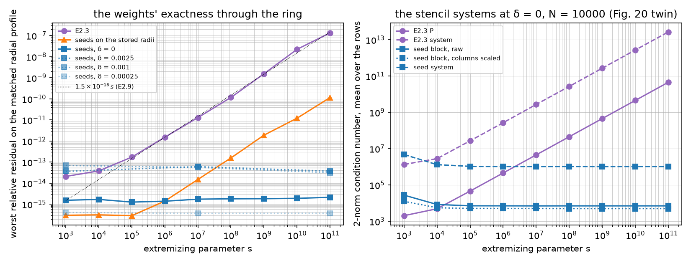

**Fig. 19's twin: fourth order at every s, at or below E2.3 from 5000 nodes.**
The papers' problem at δ = 0, RMS error over all nodes against E2.9's 160,000-node
reference at the same s, read through its stencils (EABE Fig. 19's markers are
E2.9's table; E2.3's line here is E2.9's to the digit):

| n | s = 10³: E2.3 | seeds | seeds (15) | s = 10¹¹: E2.3 | seeds | seeds (15) |
| --- | --- | --- | --- | --- | --- | --- |
| 1250 | 1.580e-03 | 2.106e-03 | 4.176e-03 | 1.544e-03 | 2.094e-03 | 2.379e-03 |
| 2500 | 4.695e-04 | 4.839e-04 | 7.294e-04 | 4.072e-04 | 5.953e-04 | 9.738e-04 |
| 5000 | 1.128e-04 | 1.098e-04 | 1.918e-04 | 1.303e-04 | 1.168e-04 | 1.553e-04 |
| 10000 | 3.018e-05 | 2.249e-05 | 6.355e-05 | 2.396e-05 | 1.971e-05 | 5.343e-05 |
| 20000 | 6.025e-06 | 5.314e-06 | 2.493e-05 | 6.236e-06 | 4.386e-06 | 1.157e-05 |
| 40000 | 1.388e-06 | 1.025e-06 | 1.138e-05 | 1.285e-06 | 6.877e-07 | 2.809e-06 |
| 80000 | 3.019e-07 | 2.323e-07 | 3.576e-06 | 2.956e-07 | 1.421e-07 | 9.435e-07 |
| fit | 4.17 | 4.42 | 3.27 | 4.17 | 4.73 | 3.92 |

| seeds ÷ E2.3 | 1250 | 2500 | 5000 | 10000 | 20000 | 40000 | 80000 | fit (E2.3, seeds) |
| --- | --- | --- | --- | --- | --- | --- | --- | --- |
| s = 10³ | 1.33 | 1.03 | 0.97 | 0.75 | 0.88 | 0.74 | 0.77 | 4.17, 4.42 |
| 10⁸ | 1.34 | 1.34 | 0.88 | 0.84 | 0.77 | 0.56 | 0.57 | 4.18, 4.64 |
| 10⁹ | 1.24 | 1.27 | 0.89 | 0.79 | 0.69 | 0.52 | 0.54 | 4.17, 4.64 |
| 10¹⁰ | 1.43 | 1.27 | 0.87 | 0.76 | 0.70 | 0.54 | 0.48 | 4.13, 4.66 |
| 10¹¹ | 1.36 | 1.46 | 0.90 | 0.82 | 0.70 | 0.54 | 0.48 | 4.17, 4.73 |

- *Fourth order at every s, at or below E2.3 from 5000 nodes*: 0.74–0.97× at
  s = 10³ and 0.48–0.90× at s ≥ 10⁸, fits 4.42 and 4.64–4.73 against E2.3's
  4.13–4.18. The coarsest two counts sit 1.03–1.46× E2.3, §4.7's
  coarse-set constant of the tangential chain.
- *The s ≥ 10⁸ lines are one line*: each within 0.88–1.13× of the s = 10¹¹ line
  at every count, the thin-layer limit (E2.9 found the same of E2.3). The
  s = 10³ line is 0.81–1.63× that line, its 0.001-wide ring a different problem
  by `O(w)`, as E2.9's references are 5.3e-6 apart.
- *Without the flux seeds the line stalls*: seeds (15) fall at 2.25–3.33 per
  halving at s = 10³ from 10,000 nodes and end 8.2 and 11.8× E2.3 at 40,000 and
  80,000 nodes (2.2 and 3.2× at s = 10¹¹); §3.11's mechanism. The first run of this
  sweep, with the flux seeds but `φ₀₁`'s every level as the warp, fell back from
  1.37e-6 at 40,000 to 3.30e-6 at 80,000 at s = 10³, with a 160,000-node seed run
  3.0e-6 from E2.9's reference and every seed count about 3e-6 from every other;
  level 0 alone removed it (§3.11).
- *The far read is the full read here*: away from the ring, where the
  reference's own stencils are standard, the seeds' error is 0.90–1.01 of the
  full error at every (s, n) (0.96–1.00 of the nodes read), which is what the
  smooth ring's self-convergence line leans on below.
- *Fig. 19's breakdown stays unreproduced*, now with seeds: every s is fourth
  order to the reference's floor (E2.9's "about 1e-7" at 160,000 nodes; the
  seeds' 1.4–1.6e-7 at 80,000 is within a factor of two of it at s ≥ 10⁸).

**The probe at δ = 0.** Each row applied to the exact mode `R(r) cos 2θ` through
the ring at its constant part (`RingMode` with the gap), RMS over the rows the
seeds rebuild (the crossing rows at δ = 0), fits over 2500–40,000:

| n | s = 10³: E2.3 | seeds | seeds (15) | s = 10¹¹: E2.3 | seeds | seeds (15) |
| --- | --- | --- | --- | --- | --- | --- |
| 2500 | 3.20e-02 | 5.99e-04 | 1.45e-02 | 3.03e-02 | 6.32e-04 | 1.36e-02 |
| 5000 | 1.38e-02 | 2.20e-04 | 6.25e-03 | 1.35e-02 | 3.14e-04 | 6.11e-03 |
| 10000 | 5.31e-03 | 6.63e-05 | 2.65e-03 | 5.45e-03 | 6.69e-05 | 2.64e-03 |
| 20000 | 2.06e-03 | 2.45e-05 | 1.26e-03 | 2.23e-03 | 2.07e-05 | 1.24e-03 |
| 40000 | 7.21e-04 | 9.90e-06 | 8.35e-04 | 9.42e-04 | 6.52e-06 | 5.72e-04 |
| fit | 2.75 | 3.02 | 2.12 | 2.54 | 3.45 | 2.30 |

The seeds' rows are 43–144× below E2.3's and converge at 3.0–3.5, the crossing
rows' rate for fourth order globally (§4.6); without the flux seeds they slow to
1.2–2.2 at 20,000–40,000. The naive and direct rows, which see no ring at δ = 0,
diverge like `h⁻²` (5.3e2 to 7.6e3 and 1.0e3 to 1.6e4), the jump across the
ring read as a derivative.

**The spectrum and the DDR.** Interior eigenvalues of the seed operator on eq. 40
at 5000 nodes, warped (φ₀₁'s level 0) and plain; the reduced system's diagonal
dominance, least and median over the seeded rows (the median over all rows is
0.608–0.623 throughout):

| s | δ | operator | positive | max Re | h² min Re | h² max \|Im\| | DDR least / median |
| --- | --- | --- | --- | --- | --- | --- | --- |
| 10³ | 0 | seeds | 0 | −14.316 | −13.58 | 0.434 | 0.093 / 0.660 |
| 10³ | 0 | plain | 0 | −14.316 | −13.58 | 0.854 | 0.121 / 0.666 |
| 10⁸–10¹¹ | 0 | seeds | 0 | −14.301 | −13.48 … −13.71 | 0.27–0.44 | 0.069–0.084 / 0.674–0.678 |
| 10⁸–10¹¹ | 0 | plain | 0 | −14.301 | −13.48 … −13.71 | 0.74–0.99 | 0.090–0.099 / 0.681–0.684 |
| 10³, 10¹¹ | 0.0025 | seeds | 0 | −14.158, −14.140 | −25.5, −26.5 | 1.49, 0.93 | 0.067, 0.057 / 0.676, 0.675 |
| 10³, 10¹¹ | 0.0025 | warp | 0 | −14.158, −14.140 | −13.62, −13.50 | 0.28, 0.38 | 0.052, 0.044 / 0.676, 0.675 |
| 10³, 10¹¹ | 0.0025 | plain | 0 | −14.158, −14.140 | −25.5, −26.5 | 2.06, 1.86 | 0.040, 0.012 / 0.674, 0.675 |
| 10³, 10¹¹ | 0.001 | seeds = warp | 0 | −14.251, −14.232 | −13.60, −13.52 | 0.78, 0.74 | 0.088, 0.071 / 0.667, 0.644 |
| 10³, 10¹¹ | 0.001 | plain | 0 | −14.252, −14.233 | −18.7, −18.0 | 0.76, 0.68 | 0.142, 0.090 / 0.669, 0.647 |
| 10³, 10¹¹ | 0.00025 | seeds = warp | 0 | −14.299, −14.281 | −13.58, −13.57 | 0.57, 0.50 | 0.093, 0.072 / 0.653, 0.661 |
| 10³, 10¹¹ | 0.00025 | plain | 0 | −14.299, −14.282 | −13.58, −13.58 | 1.32, 0.72 | 0.150, 0.094 / 0.659, 0.665 |

No eigenvalue right of the axis at any (s, δ), for the seeds, the warp or plain;
the slowest mode is the physical −14.1 to −14.3 (E2.9's −14.3 for E2.3); the
warped operator's spectrum is the jump-aware one's to the digit at every s.
E2.9 found the *plain* E2.3 operator with 53–60 positive eigenvalues on the
ring; the plain seeds have none, but at δ = 0.0025 they carry a mode twice as
stiff (`h² min Re` −26) and a wider imaginary spread (2.1), where the warp stays
at E2.3's −13.6 and 0.3. At 5000 nodes the seeds keep 231–238 rows plain at
δ = 0.0025 and none at δ ≤ 0.001, so they inherit plain's stiff mode at the
first and are the warp at the others (§4.10). The seeded rows' least DDR,
0.04–0.09 for the seeds and the warp, is E2.8's 0.08 on case 3; it does not see
s.

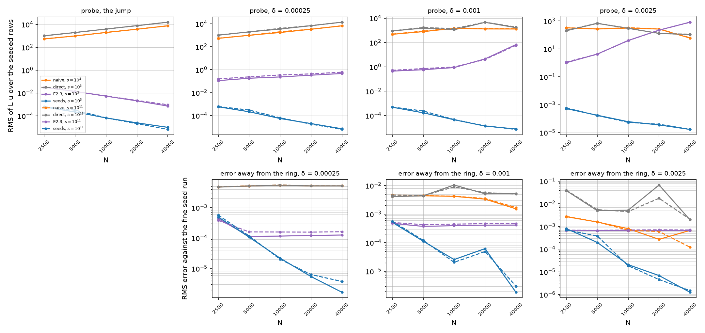

**The smooth ring.** `SmoothBand(…, "resistance")` at δ = 0.0025, 0.001 and
0.00025 (2.5, 1 and 1/4 of case 3's ring), s = 10³ and 10¹¹, 2500–40,000 nodes.
Its contact resistance is the jump's 1.5 at every (s, δ) (§3.11; a test checks
it by quadrature). The probe is each row on the exact radial mode through the
ring at its constant part (`SmoothRingMode`); the error is the RMS on eq. 40
itself against a 160,000-node seed run at the same (s, δ), read at the 75–96 %
of the nodes whose nearest fine node's stencil is unseeded (`far_read`; at
δ = 0 that read is the full one to 0.90–1.01, above).

| δ | s | n | seeds: probe | error | E2.3: error | naive: error | direct: error |
| --- | --- | --- | --- | --- | --- | --- | --- |
| 0.0025 | 10³ | 2500 | 1.30e-03 | 4.76e-04 | 6.62e-04 | 2.71e-03 | 3.83e-02 |
| | | 5000 | 2.66e-04 | 1.14e-04 | 6.55e-04 | 1.58e-03 | 5.01e-03 |
| | | 10000 | 5.90e-05 | 2.04e-05 | 6.55e-04 | 8.07e-04 | 5.24e-03 |
| | | 20000 | 1.08e-04 | 8.54e-06 | 6.71e-04 | 2.71e-04 | 6.77e-02 |
| | | 40000 | 2.20e-05 | 8.24e-07 | 6.67e-04 | 6.75e-04 | 1.97e-03 |
| 0.0025 | 10¹¹ | 40000 | 2.05e-05 | 1.49e-06 | 7.03e-04 | 1.22e-04 | 2.08e-03 |
| 0.001 | 10³ | 2500 | 4.86e-04 | 5.15e-04 | 4.76e-04 | 4.12e-03 | 4.08e-03 |
| | | 5000 | 1.69e-04 | 1.13e-04 | 3.71e-04 | 4.38e-03 | 4.35e-03 |
| | | 10000 | 1.16e-04 | 2.35e-05 | 3.94e-04 | 4.17e-03 | 1.04e-02 |
| | | 20000 | 4.70e-05 | 7.93e-06 | 4.11e-04 | 3.33e-03 | 5.12e-03 |
| | | 40000 | 7.10e-06 | 7.10e-07 | 4.13e-04 | 1.53e-03 | 5.18e-03 |
| 0.001 | 10¹¹ | 40000 | 6.38e-06 | **3.64e-06** | 4.65e-04 | 1.69e-03 | 5.03e-03 |
| 0.00025 | 10³ | 2500 | 5.87e-04 | 4.90e-04 | 4.34e-04 | 4.71e-03 | 4.68e-03 |
| | | 5000 | 2.16e-04 | 1.07e-04 | 1.14e-04 | 5.12e-03 | 5.11e-03 |
| | | 10000 | 5.60e-05 | 2.21e-05 | 1.16e-04 | 5.39e-03 | 5.39e-03 |
| | | 20000 | 2.02e-05 | 5.54e-06 | 1.22e-04 | 5.16e-03 | 5.15e-03 |
| | | 40000 | 7.14e-06 | 1.02e-06 | 1.26e-04 | 5.13e-03 | 5.13e-03 |
| 0.00025 | 10¹¹ | 40000 | 6.25e-06 | 7.37e-07 | 1.61e-04 | 5.16e-03 | 5.16e-03 |

(Every count at both s is in `heat2d_ring_results.json`, and §4.10 tabulates
the seeds, the warp and plain at every count; the bold entry is the one line
that stops on its fine run's floor, §4.10.)

- *The seeds are fourth order through a sub-grid smooth resistive layer.* Error
  fits over 2500–40,000 (s = 10³, 10¹¹): 4.45 and 4.36 at δ = 0.0025, 4.60 and
  3.79 at 0.001, 4.44 and 4.81 at 0.00025. Five of the six lines reach
  7.1e-7 to 1.5e-6 at 40,000 nodes. The sixth, s = 10¹¹ at δ = 0.001, stops at
  3.6e-6, and so do the warp and plain there (3.7e-6): its 160,000-node run keeps
  some tail rows warped, and against a fine run built with plain Gaussians
  every line reaches 7.7–8.7e-7, the seeds' at a fit of 4.77 (§4.10).
- *The fine runs are the seeds' own*, rebuilt with E4.12's rule (version 4).
  E4.8's, the warp on every row, differ from them by 1.3–3.9e-6 on the nodes the
  far read uses at δ ≤ 0.001 (1.74e-6 and 2.37e-6 at δ = 0.001, 1.34e-6 and
  3.92e-6 at 0.00025, for s = 10³ and 10¹¹) and by 6e-9 at 0.0025: that was
  E4.8's floor of "1.5–2.2e-6", the tail rows' failure inside the fine warp runs
  (§4.10). At δ = 0.00025 every coarse count has the same seeds line in both
  versions (no anchor in the tail); against the new fine runs it ends at 1.02e-6
  and 7.4e-7 where against E4.8's it ended at 1.67e-6 and 3.76e-6.
- *The probe agrees, reference-free*: the seeds' rows converge at every (s, δ)
  (fits 2.62–3.48), with one step back at δ = 0.0025 between 10,000 and 20,000
  (5.9e-5 to 1.1e-4), where the grid passes `h ≈ 4δ` to `3δ`, the transition
  §4.5–§4.7 saw at 5 : 1, and the rows the seeds keep plain on the probe's
  constant ring go from about 150 to 900. Where rows are kept plain the probe is up to 3.4× the warp's (§4.10),
  the price of their stronger diagonal.
- *E2.3 reads the smooth ring as a jump* and sits on an O(1) floor: its error is
  1.1–7.2e-4 at every count, the difference between the smooth ring and its jump
  (larger at the wider δ), and its rows diverge on the probe (0.1 to 830, fits
  −1 to −5), inconsistent at O(1) and worse as h shrinks against δ.
- *The naive and direct stencils do not see the ring* until the grid samples it:
  about 5e-3, FD4's no-ring floor of §2.7, at δ = 0.00025 (both) and 0.001 (the
  direct stencil), their probe 10²–10⁴. The naive product starts to move at
  δ = 0.001 (1.5–1.7e-3 at 40,000) and at 0.0025 (1.2–6.8e-4 at 40,000,
  erratic), where its `Dx A Dx` reaches the layer's samples; the direct stencil
  does not (2e-3 to 7e-2).
- *E4.8's warp on every row had two outliers*: δ = 0.001 at 20,000 nodes, 6.2e-5
  and 4.9e-5 between 2.6e-5 and 7e-7 at both s while the probe kept falling,
  and s = 10¹¹, δ = 0.0025 at 5000 nodes, 3.8e-4 against plain's 1.05e-4. Both
  are the warp on rows anchored in the ring's resistivity tail, which it
  leaves stable only where the anchor sits on its piece; §4.10 diagnoses it,
  and E4.12's rule (the seeds line above) removes both (7.9e-6, 6.0e-6 and
  1.08e-4). E4.6's warp turned at `h ≈ 2δ` at 5 : 1; at 1500 : 1 the
  resistivity tail reaches several δ further.

**Cost.** One tangential row with the flux seeds: 24–42 ms at δ = 0 and 40–233 ms
at δ > 0 (slowest at δ = 0.00025, where the edges are narrowest against the
stencil), under up to 16 concurrent runs; about 15 ms at δ = 0 on a quiet
machine (12 without the flux seeds; the degree-5 chain marches 252 states). The
160,000-node seed runs seeded 8,163–40,265 rows and took 19–28 min each as
E4.12 rebuilt them (under about 11 concurrent runs), of which the solve
31–46 s; the Fig. 19 sweep 10–12 min per s, Fig. 20 at 10,000
nodes 5 min for three s at δ = 0 and 25 min per s over the three widths, the
spectra 2–4 min per (s, δ), each smooth (s, δ) sweep with its fine run about
70 min; everything is seconds from `heat2d_ring.json`. Four rounds of the sweep
were run (the 15 seeds, the full warp, the level-0 warp on every row, E4.12's
rule); the first three rounds' fine runs are kept under
`outputs/heat2d_ring_seeds15/`, `outputs/heat2d_ring_fullwarp/` and
`outputs/heat2d_ring_v3/` (with the version-3 cache).

**H11 and where each construction fails, and why.**

- *E2.3* is exact on the matched profile only to `1.5e-18 s` (seven digits at
  s = 10¹¹): its far side's translated basis carries `O(s κ² scale)` through the
  curvature (E2.9). It stays fourth order on Fig. 19 because that loss is below
  the discretisation error at every count run. On a smooth ring it is
  O(1)-inconsistent (it reads the edges as jumps) and floors at 1–7e-4.
- *The naive product and the direct stencil* never see an unresolved ring: their
  rows are O(h⁻²) on the probe and their error is the no-ring floor.
- *The seeds* are exact on the matched profile to rounding at every s (1.3–2.1e-15)
  and condition independently of s, because they carry the ring's resistance,
  which eq. 40 holds fixed. They needed four things E4.4–E4.11 did not
  (§3.11): the width as `gap` (on the stored radii and absolute stops they lose
  digits like s, 1.2e-10 at 10¹¹); the ring's own series (without it the march
  took up to 150,000 steps a row); the flux seeds (without them the case-3 line
  stalls at 2.3–3.3 and ends 12× E2.3's); and, on a ring, `φ₀₁`'s level 0 as the
  warp (with every level, a 3e-6 floor at s = 10³). With them they are fourth
  order at every s, 0.48–0.97× E2.3 from 5000 nodes, and fourth order through a
  smooth resistive layer once E4.12's rule picks the Gaussians of the rows
  anchored inside it (§4.10). What limits them is not s and not the march: it
  is `FOOT_CURVATURE` on the coarsest sets at δ > 0 and, inside a smooth
  resistive layer, the choice between a consistent row (the warp) and a stable
  one (plain Gaussians), which the rule makes row by row.
- *Fig. 19's breakdown near s = 10¹¹* is not reproduced by either construction;
  the seeds do not move it, because it is not there to move (port notes §2.9).

**What E4.9, E4.10 and E4.12 inherit.**

- *E4.9 (#40)*: the smooth ring is a natural home for the treatments, the
  resistance composition being a harmonic blend already; `heat2d_ring.py`'s part
  4 gives any operator a probe and a far-field line on it.
- *E4.10 (#41)*: the ring has its own driver (`scripts/heat2d_ring.py`, not a
  `--ring` flag on `heat2d_stiff.py`), its cache `heat2d_ring.json` (version 4
  since E4.12; bump it after any change to the chains, their series, the ring's
  switches or the composition), its results file `heat2d_ring_results.json` (with
  `--data-dir`), and the figures `heat2d_ring_convergence.png`,
  `heat2d_ring_conditioning.png` and `heat2d_ring_smooth.png`. The regeneration
  commands are in the driver's docstring.
- *E4.12 (#84)*: the δ = 0.001 outlier above, the diagnosis and the cached lines
  to rerun. Done: §4.10.

**Tests.** `tests/heat2d/test_ring.py`: the gap's validation and `case3(s)`'s;
the stops as exact offsets from the outer circle; `layer_share` against the tanh
difference and at a width of 1e-8; the resistance composition's contact
resistance by quadrature against the fold's; its paths (`alpha`, `alpha_at`
with and without a known distance, `alpha_given`) and its gradient by
differences; the seeds exact on the matched profile at s = 10³ and 10¹¹, with the
stored radii and E2.3 losing digits; the march from the outer circle equal to
the absolute one at s = 10³; the seed block's conditioning flat in s;
`saddle_system`; the ring's series cost and interpolant; the far edge `d ∓ gap`;
`RingMode(widths=)`; `SmoothRingMode` against itself and without a ring;
`matched_radial`; `radial_elements`; the flux seeds' exponents, default and
block; the flux seeds' O(h⁵) fit against the 15's O(h⁴); the warped ε; the
level-0 warp on the ring and every level on case 2. `tests/test_heat2d_ring.py`:
the ring domains, the far read, the four parts and the cache round trip at small
counts, and the refusals.

### 4.9 The coefficient treatments on scattered nodes (E4.9, #40)

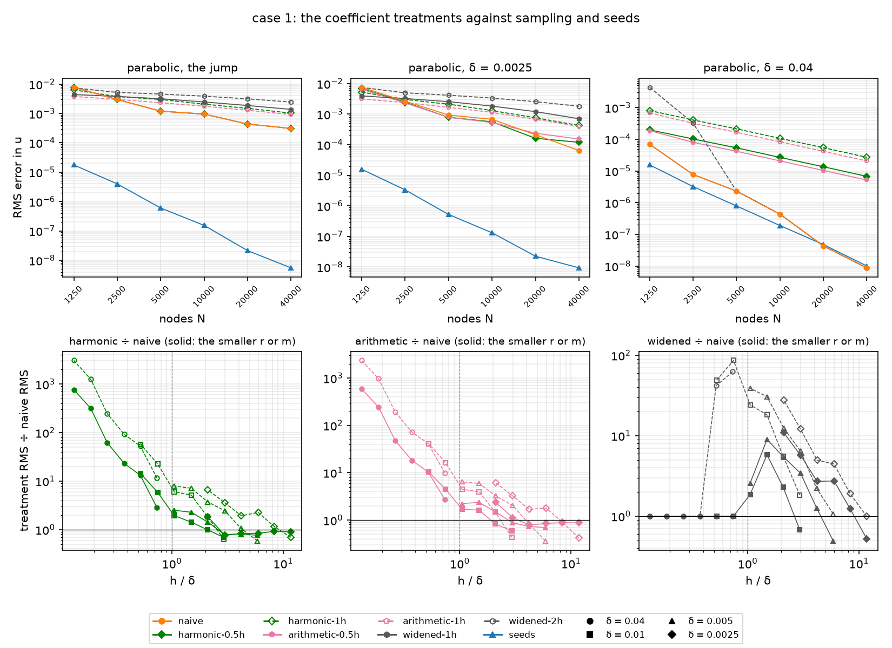

`heat2d/treatments.py` and `scripts/heat2d_stiff.py --mode treatments`: plan
§3.4's "change the medium, keep the scheme" comparators, on E4.6's flat sweep
(case 1, δ ∈ {0, 0.04, 0.01, 0.005, 0.0025}) and E4.11's curved one (case 2,
δ ∈ {0, 0.01, 0.005, 0.0025}), 1250–40,000 nodes, both problems, the same
references, and the same norm (the RMS over all nodes, with the max norm
beside it, as H12 asks). There are six lines:

- **T1**: the harmonic mean `area / ∫ dA/α` over a disc of radius h/2 and of
  radius h about every node (`harmonic-0.5h`, `harmonic-1h`).
- **T2**: the arithmetic mean `∫ α dA / area` over the same two discs
  (`arithmetic-0.5h`, `arithmetic-1h`).
- **T0**: the band at `max(δ, m h)` for m = 1, 2 (`widened-1h`,
  `widened-2h`).

Each is the naive product `Dx A Dx + Dy A Dy` on the treated alpha. The
columns they are read against are all reread from the geometry's cache,
never re-solved: sampling (`naive`), the δ = 0 construction, and the seeds
(case 1's `seeds`, and the tangential chain on case 2, as the E4.11
breadcrumb asks).

Times (2026-09-23): each geometry's documented sweep took 21 min, the two run
side by side, so both times are inflated; 800 s of each was the 40,000-node
count. The default counts 1250–10,000 took 2.6 min cold on case 1 and 3.4
min on case 2, and everything reprints from the caches in about a second.
The builds are cheap (the disc quadrature is 0.2–13 s per (δ, radius) at
40,000 nodes); the time is the solves, about 30 s per line at 40,000.

**Decisions, none of them re-derivable from the tables.**

- *A treatment is a medium the naive product samples*, as in 1-D (§2.4).
  `NodalAlpha2D(nodes, values)` answers `alpha` at its own node set and
  refuses any other point. A reference or a diagnostic that reached for it
  would read the treatment where it should read the true medium; the
  straddling-row readings take the true band. Its `repr` hashes the whole
  table (E3.5's MEDIUM finding, fixed before it could bite). T0 is
  `SmoothBand(band, max(δ, m h))`. Every node is treated, as in 1-D: a
  treatment is a uniform rule, not an edge detector.
- *The disc means are exact to rounding* (`disc_integrals`). The integral is
  an iterated Gauss–Legendre in the product grid's `ShearMap` coordinates
  `(x, η)`, `dA = y_η dx dη`. There both curves of a flat or case-2 band are
  the lines `η = c_k` and the rows `y = 0, 1` are `η = 0, 1`, so a line of
  constant η crosses no edge:
  - *outer*, in η over the disc's preimage: substituted
    `η = m + w sin θ`, so the chord's square root at the top and bottom is
    analytic, and cut at `c_k ± EDGE_CUTS δ` (E3.2's elements, 24 points
    each);
  - *inner*, along each chord: its ends are found by Newton from outside the
    disc, which is monotone because the chord function is convex.

  The checks (`tests/heat2d/test_treatments.py`):
  - the area is πr² inside the strip and πr² minus the circular segments at
    the rows, both to 1e-13;
  - across the flat jump the two integrals are the segment-area closed forms
    to 1e-13;
  - on case 2 they match an independent polar rule to 1e-13, at δ = 0 (cut at
    the ray–curve crossings and at the angles where the curve meets the
    circle) and at δ = 0.0025 (40 panels a direction); at the jump the polar
    rule itself needed 64 points, and at 32 it was 2e-11 off;
  - 24 against 36 points agree to 1e-13;
  - the small-disc expansions `AM = α + (r²/8) Δα + O(r⁴)` and
    `HM = α + (r²/8)(Δα − 2|∇α|²/α) + O(r⁴)` hold, with remainders falling
    16× a halving of r;
  - as δ → 0, `∫ dA/α` loses `c δ` per unit of the edge's chord, with c 1-D's
    `edge_resistance_deficit`, while `∫ α dA` has no first-order term (the
    fold's tanh is odd about the centre) and approaches the jump at O(δ²).
- *The radii are h/2 and h, with h the node set's `h`*. The discs are clipped
  at y = 0 and y = 1 and periodic in x.
- *Nothing else is built.* There is no twin of T1-FV: a conservative scheme
  with exact face conductances needs faces, which a scattered node set does
  not have. T3 is dropped (E5.2, #43, `LITERATURE.md` §1d). The smooth ring (the E4.8 breadcrumb) is
  left out by Brad's call (2026-09-23): it is not in the ticket, and E4.12
  (#84) reruns the ring's δ > 0 lines first. If it is taken up,
  `disc_integrals` needs one more frame (polar about the ring's centre,
  where the circles are `ρ = const`, Jacobian ρ), and `heat2d_ring.py`'s
  part 4 needs the labels.
- *The treatments are opt-in labels* (`TREATMENT_LABELS`) in
  `sweep_operators`, cached beside the other lines in `heat2d_stiff_knee.json`
  and `heat2d_stiff_curved.json`; neither cache's meta moves. T0's entries
  carry `own_floor`, the widened band's reference against the true one at the
  nodes.

**At the jump the h/2 disc does nothing, by the node layout.** E2.1's
straddling rows sit 0.5h, 1.37h and 2.23h off each curve, and the free nodes
are further out, so a disc of radius h/2 at most touches the edge. At δ = 0
both h/2 means change no node on case 1 (their `rows` reading is 0 at every
count) and are the naive line to 1e-9 relative: 1-D's one-cell window ending
on the jump (§2.4), now forced by the layout rather than by a placement. The
radius-h disc reaches the innermost pair only (268 nodes at 5000). A node
half a spacing off the edge gets `1/α = 0.8045/α_own + 0.1955/α_other`,
0.561 beside the band and 0.237 in it; the table matches that by hand to
four digits. On case 2 the inside piece varies, so the h/2 means move every
node in the band by `(r²/8)(…)`, about 1e-6 of alpha. That is below naive's
error at every count (0.997–1.002 of it from 5000 nodes), so the second-order
cap the smooth piece implies never shows in this range.

**Case 1, every line's fitted order** (RMS / max). The parabolic fits start
at 2500: every treatment is the naive product on another alpha, and it
inherits that product's 1250-node growing mode (one eigenvalue at +12.5 to
+33.5, BD4's root 1.44–2.82 at `dt = h`; none at 2500 and none on case 2),
so the driver prints the parabolic fits again from `GROWING_BELOW`.

| δ | naive | harmonic h/2 | harmonic h | arithmetic h/2 | arithmetic h | widened h | widened 2h | construction | seeds |
| --- | --- | --- | --- | --- | --- | --- | --- | --- | --- |
| *equilibrium* | | | | | | | | | |
| 0 | 1.50 / 1.50 | 1.50 / 1.50 | 1.02 / 1.13 | 1.50 / 1.50 | 0.83 / 0.71 | 0.68 / 0.54 | 0.60 / 0.48 | 4.77 / 4.82 | 4.77 / 4.82 |
| 0.04 | 5.18 / 4.96 | 1.97 / 1.95 | 1.97 / 1.96 | 2.05 / 2.02 | 2.00 / 1.99 | 5.18 / 4.96 | 7.79 / 7.47 | −0.88 / −0.82 | 4.23 / 4.61 |
| 0.01 | 3.99 / 4.16 | 2.40 / 2.86 | 1.77 / 1.75 | 2.59 / 2.77 | 1.81 / 1.81 | 4.32 / 3.89 | 2.22 / 2.24 | −0.18 / −0.19 | 4.31 / 4.64 |
| 0.005 | 2.97 / 3.02 | 2.20 / 2.60 | 1.60 / 1.56 | 2.23 / 2.36 | 1.51 / 1.48 | 2.01 / 1.73 | 1.01 / 0.91 | 0.08 / 0.07 | 4.23 / 4.54 |
| 0.0025 | 2.22 / 2.24 | 2.08 / 2.15 | 1.41 / 1.44 | 1.95 / 2.06 | 1.21 / 1.10 | 0.99 / 0.82 | 0.78 / 0.65 | 0.01 / −0.02 | 4.48 / 4.74 |
| *parabolic, 2500–40,000* | | | | | | | | | |
| 0 | 1.61 / 1.35 | 1.61 / 1.35 | 0.96 / 0.94 | 1.61 / 1.35 | 0.86 / 0.75 | 0.74 / 0.63 | 0.55 / 0.39 | 4.79 / 4.76 | 4.79 / 4.76 |
| 0.04 | 5.10 / 4.94 | 1.98 / 2.00 | 1.97 / 1.98 | 1.99 / 2.00 | 1.99 / 1.98 | 5.10 / 4.94 | 7.25 / 6.94 | −0.90 / −0.74 | 4.16 / 4.51 |
| 0.01 | 4.23 / 4.11 | 2.28 / 2.58 | 1.82 / 1.81 | 2.47 / 2.54 | 1.89 / 1.88 | 5.23 / 4.72 | 2.51 / 2.53 | −0.29 / −0.23 | 4.27 / 4.53 |
| 0.005 | 3.11 / 2.91 | 2.15 / 2.45 | 1.64 / 1.62 | 2.17 / 2.16 | 1.62 / 1.64 | 2.42 / 2.18 | 0.99 / 0.83 | 0.08 / 0.08 | 4.03 / 4.38 |
| 0.0025 | 2.58 / 2.16 | 2.20 / 2.07 | 1.44 / 1.41 | 1.93 / 1.91 | 1.30 / 1.21 | 1.10 / 0.97 | 0.73 / 0.57 | 0.01 / −0.01 | 4.32 / 4.62 |

T0's 7.8 at δ = 0.04 is not an order. At 5000 nodes 2h drops below δ, T0
becomes the naive line, and the fit spans the step off its floor.

**Case 1 at 40,000 nodes**, equilibrium, RMS error, each treatment over the
naive line in brackets:

| δ | h/δ | naive | harmonic h/2 | harmonic h | arithmetic h/2 | arithmetic h | widened h | widened 2h | construction | seeds |
| --- | --- | --- | --- | --- | --- | --- | --- | --- | --- | --- |
| 0 | jump | 3.44e-04 | 3.44e-04 (1.00) | 9.98e-04 (2.90) | 3.44e-04 (1.00) | 8.33e-04 (2.42) | 1.24e-03 (3.60) | 2.19e-03 (6.37) | 5.28e-09 | 5.28e-09 |
| 0.04 | 0.13 | 8.22e-09 | 6.37e-06 (775) | 2.55e-05 (3100) | 4.80e-06 (584) | 1.92e-05 (2330) | 8.22e-09 (1) | 8.22e-09 (1) | 1.90e-02 | 8.78e-09 |
| 0.01 | 0.53 | 2.45e-06 | 2.96e-05 (12.1) | 1.18e-04 (48.1) | 2.00e-05 (8.15) | 7.91e-05 (32.3) | 2.45e-06 (1) | 9.50e-05 (38.8) | 3.69e-03 | 8.42e-09 |
| 0.005 | 1.05 | 2.89e-05 | 7.44e-05 (2.58) | 2.37e-04 (8.22) | 6.22e-05 (2.16) | 1.79e-04 (6.19) | 7.18e-05 (2.49) | 1.08e-03 (37.5) | 1.07e-03 | 8.82e-09 |
| 0.0025 | 2.11 | 8.36e-05 | 1.24e-04 (1.48) | 4.13e-04 (4.94) | 1.41e-04 (1.69) | 3.58e-04 (4.28) | 6.36e-04 (7.60) | 1.62e-03 (19.4) | 6.18e-04 | 7.99e-09 |

**No treatment beats sampling by more than 1.75×, and at the jump none
beats it at all past the coarsest sets.** Over the whole sweep (case 1's
parabolic 1250-node set aside, for its growing mode), the best each treatment
does against the naive line on the same nodes is:

- case 1: 0.62 (arithmetic h/2) and 0.74 (harmonic h/2), both at δ = 0.0025
  on 10,000 nodes (h/δ = 4.2), and on the parabolic problem 0.73 and 0.77;
  the radius-h means gain only on the coarsest sets (elliptic at 1250 nodes:
  0.66 arithmetic, 0.96 harmonic; parabolic at 2500: 0.85 arithmetic);
- case 2: 0.57 (arithmetic h, δ = 0.005, 2500 nodes), 0.65 (arithmetic h/2)
  and 0.73 (harmonic h/2, δ = 0.0025, 10,000 nodes).

At the jump, from 5000 nodes on, the h/2 means are the naive line, and every
treatment that changes alpha there is worse than sampling:

| treatment | case 1, elliptic | case 1, parabolic | case 2, elliptic | case 2, parabolic |
| --- | --- | --- | --- | --- |
| harmonic h | 1.58–3.28× | 2.18–3.42× | 1.88–3.07× | 2.68–2.85× |
| arithmetic h | 1.28–2.60× | 1.85–3.00× | 1.76–2.82× | 2.68–2.91× |
| widened h | 1.74–3.79× | 2.59–4.45× | 2.80–4.06× | 3.93–4.53× |
| widened 2h | 2.73–6.40× | 3.83–7.88× | 5.15–6.19× | 5.75–8.24× |

**The crossover against sampling** (the h/δ at which a treatment's error
over the naive line's passes 1, log-linear between counts). The h/2 means
cross at a fixed `h/δ` of 1.8–3.5, at every width and on both cases:

| crossover h/δ | δ = 0.01 | δ = 0.005 | δ = 0.0025 |
| --- | --- | --- | --- |
| case 1, elliptic: harmonic h/2 / arithmetic h/2 | 2.12 / 1.89 | 2.47 / 2.43 | 2.59 / 3.00 |
| case 1, parabolic | 2.07 / 1.89 | 2.59 / 2.73 | 2.68 / 3.34 |
| case 2, elliptic | 1.92 / 1.83 | 2.68 / 3.40 | 2.49 / 2.66 |
| case 2, parabolic | 1.90 / 1.87 | 2.64 / 3.52 | 2.75 / 3.27 |

So a disc of half a spacing helps, a little, only while the edge is at
least two to three spacings narrower than the grid, and hurts from there
on, exactly 1-D's "they help only while h ≳ δ and must know δ to be switched
off". The radius-h means and T0 have no such crossover. Where they cross at
all (case 1, elliptic: arithmetic h at h/δ = 2.44, 3.74 and 7.43 for
δ = 0.01, 0.005 and 0.0025; widened h at 5.09 and 10.42), the crossing falls
between 1250 and 5000 nodes at every width. That is a count, not an h/δ: at
the jump the same lines turn at the same counts (arithmetic h goes 0.84,
0.98, 1.53 of naive over 1250, 2500 and 5000 nodes). Their early wins belong
to the coarsest node sets, not to the edge. On case 2 several of them cross
twice around 2500 nodes, where the naive line itself is an outlier (4.77e-3
at 2500 against 4.73e-3 at 1250). At δ = 0.04 every disc mean hurts at every
count. T0 there is the naive line at every count for m = 1 and from 5000
nodes for m = 2, so it cannot hurt; before that the m = 2 line is 42–63×
worse.

**What the treatments do at the edge: nothing that converges.** Case 1's
straddling-row readings (§4.2's flux on the innermost pair, relative to
`α v′` at the curve) at δ = 0 and 40,000 nodes give one-sided flux errors of:

- naive 0.34, and the h/2 means the same;
- harmonic h 0.36 (its jump across the pair 0.39, against naive's 0.55);
- arithmetic h 0.30, widened h 0.47, widened 2h 0.59.

None of these converges with n, and neither does the naive one (E4.3's
plateau). At δ = 0.0025 the h/2 means take naive's 0.31 to 0.18 at 10,000
nodes and 0.21 to 0.10 at 20,000: the part of the sweep where they help.

In 1-D the two-cell harmonic mean worked by turning the jump's O(1) flux
defect into an O(h) one on the two nodes beside it (§2.4). Here no treatment
does. Our reading, not a proof: a treatment changes alpha only where its
disc meets the edge (the innermost pair, at radius h), while the product's
rows reach two stencil radii, about 7h, and every row within that reach sees
the kink in u. And the bar is higher than in 1-D: the sampled product is
already order 1.5 at the jump in both norms (E4.3), where 1-D's naive line
was first order. The radius-h means are first order in both norms (harmonic
1.02 / 1.13, arithmetic 0.83 / 0.71), so they fall behind from about 2500
nodes.

**T0 on its floor.** The widened edge solves another problem exactly, and
its error is that problem's distance from the true one, as in 1-D:

| error ÷ own floor | case 1, elliptic | case 1, parabolic | case 2, elliptic | case 2, parabolic |
| --- | --- | --- | --- | --- |
| widened 2h | 0.996–1.000 | 0.977–1.052 | 0.989–1.000 | 0.86–0.96 |
| widened h, h ≥ 1.4δ | 1.008–1.027 | 1.000–1.022 | 0.986–1.017 | 0.93–0.96 |

At the knee (h/δ = 1.05, where `m h − δ` is a sliver) the m = 1 ratio rises
to 1.51 and 1.26 on case 1, elliptic, at δ = 0.01 and 0.005. From 2500
nodes on, T0 at m = 2 is the worst treatment at every unresolved (δ, n), in
both norms, on both problems and both cases. At 1250 an h/2 mean (case 1) or
the arithmetic h mean (case 2) is sometimes worse in the max norm, as is an
h/2 mean on case 1's parabolic growing-mode set. Where `δ ≥ m h` T0
is the naive line bit for bit: of the six, it is the one treatment that
switches itself off, since `max(δ, m h)` knows δ.

**H12, clause by clause.**

- *"Cap the naive operator at second order once h ≲ δ/4"*: **holds for the
  disc means, not for T0.** At δ = 0.04 the four disc means fit 1.95–2.06 in
  both norms and both problems, sit 584–3100× above the naive line at 40,000
  nodes, and the radius-h line is 4.00× the h/2 one (3.996 harmonic, 3.998
  arithmetic): the `r²/8` term of the mean-value expansion, measured. T0 is
  the naive line there, fifth order (5.18), as 1-D found ("naive = T0"
  resolved, §2.4).
- *"First order while the edge is unresolved"*: **holds for the radius-h
  means and T0**. At the jump they fit 0.55–1.02 in the RMS norm on both
  cases and problems, T0 still pre-asymptotic on its `c (m h − δ)` floor.
  **Not for the h/2 means**: they are the naive line at the jump (1.50) and
  fit 1.93–2.59 at δ > 0 on case 1.
- *"T0 is the worst, on the widened floor"*: **holds** (the table above).
- *"There is no conservative scheme on scattered nodes, so T1-FV has no twin
  and the strongest low-order comparator is the two-cell disc harmonic
  mean"*: **the first half holds, the second is wrong.** *(E4.10's
  roundtable: the first half holds as "none was built"; control volumes on
  a point cloud are possible, so it is not an impossibility, §5.3 statement
  10.)* The radius-h
  harmonic mean is 1.6–3.4× *above* sampling at the jump from 5000 nodes.
  The best treatment anywhere is a half-spacing mean, which is sampling
  itself at the jump and gains at most 1.6× (case 1) or 1.75× (case 2)
  elsewhere while h ≳ 2–3δ. On scattered nodes the strongest low-order
  comparator is the naive product itself.
- *"The seeds 3–4 orders below every treatment at δ ≤ h/4, parabolic"*:
  **holds from 5000 nodes, and the gap grows.** The best treatment over the
  seed line at the jump is 2.3, 2.9, 3.3, 3.8, 4.3 and 4.7 orders at 1250 …
  40,000 nodes on case 1, and 1.6, 2.3, 3.0, 3.4, 4.1 and 4.7 on case 2
  (tangential). At δ = 0.0025, while h ≥ 4δ (to 10,000 nodes), it is 2.3,
  2.8, 3.2 and 3.6 on case 1. The order gap (about 4.8 against at most 1.6)
  makes
  it grow roughly like h⁻³.
- *"The RMS norm with the max norm beside"*: **done, and it does not change
  the verdict.** In 1-D the max norm called the two-cell mean first order
  where the RMS said 1.5 (a local defect). Here the radius-h means' two fits
  at the jump differ by only 0.02–0.13, so the max norm does not reorder
  them. It moves the coarse counts' ranking (at 1250 nodes on case 1 the
  widened h line is the best treatment in the max norm and the arithmetic h
  one in the RMS) and T0's fits (0.65 / 0.21 at m = 2 on case 2).

**What the manuscript says, and what E4.10 inherits.**

- *The comparator paragraph.* In 1-D the finite-volume scheme with exact face
  conductances is the strongest low-order comparator, exact at equilibrium
  and second order at every δ (§2.4). On scattered nodes it has no twin, and
  the nodal treatments that stand in for it do not beat plain sampling: at
  most 1.75× anywhere in the sweep, worse than sampling at the jump from 5000
  nodes, and capped at second order once the edge is resolved, 580–3100×
  behind at 40,000 nodes. The honest 2-D comparators are therefore the naive
  product (which needs nothing) and the δ = 0 construction (which needs δ to
  be switched off). The treatments earn one sentence, this section's figure
  and the crossover (h/δ ≈ 2–3 for the half-spacing disc). The sentence must
  keep one caveat: at the jump the half-spacing disc is sampling *by
  construction* on this node layout (E2.1's innermost rows sit exactly h/2
  off the curve, so the disc is tangent to it), so "worse than sampling at
  the jump" is a statement about the radius-h means and T0, not about
  averaging α as such (the E4.9 spar's second finding).
- *E4.10 (#41)*: the figures `docs/figures/heat2d_stiff_treatments.png` and
  `heat2d_stiff_treatments_a0.02_sine.png` (top: the parabolic lines at the
  jump, the narrowest and the widest δ; bottom: each family over the naive
  line against h/δ, every width with its own marker); the run commands in
  the driver's docstring; `--data-dir` and the results file are not added
  here.
- *E5.2 (#43)*: pin the scattered-node form of the conductance rule to a
  source before the manuscript names it, and decide T3. *Done: no source
  averages α over a disc about each node, so the manuscript calls it the
  natural scattered-node analogue of the harmonic-mean conductance; T3 is
  dropped (`LITERATURE.md` §1a K10, §1d).*
- *The ring*: see the decisions above.

**Tests.** `tests/heat2d/test_treatments.py`:

- a constant alpha left alone by every mean;
- the area inside and clipped at the rows;
- the flat jump's segment-area closed forms;
- case 2 against the unsheared polar rule at δ = 0 and 0.0025;
- more Gauss points changing nothing;
- the two small-disc expansions;
- AM ≥ HM;
- ∫1/α's first-order approach with 1-D's constant and ∫α's second-order one;
- the ring refused;
- the nodal table read at its nodes only, and its hash seeing the middle of
  the table;
- the naive operator reading a table as it reads the medium, bit for bit;
- the widened edge's width, its δ-independence below `m h`, and its kept
  composition.

`tests/test_heat2d_stiff.py`:

- the labels' kinds and factors, and the seed line per geometry;
- a treatment built by `sweep_operators` equal to `naive_operator` on the
  treated medium bit for bit, the two means at one radius from one
  quadrature;
- the treatment sweep at 900 and 1250 nodes: the h/2 means equal to naive at
  the jump with no node changed, T0 equal to naive where δ ≥ h, T0 on its
  floor to 1 %, the seeds two orders below every treatment at 1250, every
  disc mean above naive at δ = 0.04, and the cache's round trip;
- the case-2 sweep at the jump: its own cache and figure, the curved-over-flat
  table, and the tangential line below every treatment.

### 4.10 The Gaussians on rows anchored in a smooth resistive layer (E4.12, #84)

§4.8's outlier and its fix. The design is §3.11's last paragraph: a seed row
anchored off its piece (`|ln(α_e/α_piece)| > 0.05`) is solved with both
Gaussian blocks on its one march and keeps the weights with the stronger
signed diagonal share `−w_e / Σ_{j≠e} |w_j|` (`seeds.gaussian_choice`); a row
on its piece keeps the warp. The switch is on only on a band with a `gap`, so
it changes the ring and nothing E4.4–E4.11 built. The driver is
`scripts/heat2d_ring.py` (cache version 4): at δ > 0 its part 4 carries the
seeds (the rule), `seeds-warp` (E4.8's warp on every row) and `seeds-plain`
from one march per row, and `--plain-fine s:δ` adds a second fine run built
with plain Gaussians. Off the ring the rule is an ablation line of
`scripts/heat2d_stiff.py` (`seeds-edge`, `tangential-edge`).

**The outlier, diagnosed** (one-off ablations of 2026-09-23 on the 20,000-node
set at s = 10³, δ = 0.001, far error against E4.8's fine run; they call
`gaussian_choice` and `weights_of(…, edge_rule=False)` row by row and are not
committed as a driver):

- *It is the rows anchored in the tail.* 588 of the 3,403 seeded rows are
  anchored where `α_e/α_piece` is 0.20–0.43: the resistance composition's tail
  `(1.5/δ) e^{−2z}` reaches several δ out. On the other 2,815 rows the warped
  and plain weights differ by a median 0.9 %. The far error with the warp on
  every row is 6.19e-5, with plain Gaussians on every row 8.12e-6, with plain on
  the 588 alone 8.16e-6, and with the rule 7.98e-6.
- *It is stability, not consistency.* The probe on those rows keeps falling
  (the warp's rows are the more consistent, below). The warp squeezes the
  anchor's side by `α_e/α_piece`, and the anchor's signed share of its row falls
  to 0.08–0.13, against plain's 0.25–0.27 (a test pins both ranges on this
  set). A ring of such rows is amplified by the inverse.
- *Neither ε nor a warp that does not squeeze repairs it.* ε from the physical
  spacing: 5.6e-2. The warp normalised to the anchor's piece instead of to
  `α_e`, so that it leaves the anchor's side unsqueezed: 4.9e-3.
- *Plain fails the other way where the edge is nearly resolved.* At
  δ = 0.0025 and 20,000 nodes some tail rows get an anchor weight of the wrong
  sign under plain Gaussians (a test pins two), and there the warp wins
  (6.85e-6 against 1.22e-5).
- *The rejected rules.* A threshold on `α_e/α_piece`: at τ = 0.25 it blows up
  16× at s = 10¹¹, δ = 0.0025, 20,000 nodes. A floor on plain's diagonal
  share: erratic, up to 62× worse. The diagonal comparison on every row, not
  only off the piece: it moves the δ = 0 lines, where the warp is right.

**The rerun.** Far error against each (s, δ)'s 160,000-node fine run (itself
built with the rule), and the probe over the seeded rows, 2500–40,000 nodes.
The error is on eq. 40 and the probe on the ring at its constant part, one node
set for both, so the seeded rows are the same but the rows the rule keeps plain
are not: eq. 40's ring has `α = 1/(1.5s) + (1/(3s)) sin 2πx sin 2πy`, three to
one around the ring, where the probe's is `1/(1.5s)` throughout, and the tail's
`α_e/α_piece` moves with it. The two counts differ by up to 26 % (231 and 290 at
s = 10¹¹, δ = 0.0025, 5000 nodes); rebuilt fresh, each is reproduced to the row
(238 and 276 at s = 10³, δ = 0.0025, 5000 nodes, the E4.12 spar's first finding):

| δ | s | n | seeded | kept plain: eq. 40 | constant ring | seeds (rule) | warp | plain | probe: rule | warp | plain |
| --- | --- | --- | --- | --- | --- | --- | --- | --- | --- | --- | --- |
| 0.0025 | 10³ | 2500 | 1211 | 210 | 210 | 4.76e-04 | 8.16e-04 | 4.75e-04 | 1.30e-03 | 5.21e-04 | 1.29e-03 |
| | | 5000 | 1984 | 238 | 276 | 1.14e-04 | 1.98e-04 | 1.25e-04 | 2.66e-04 | 1.75e-04 | 3.47e-04 |
| | | 10000 | 3363 | 162 | 162 | 2.04e-05 | 2.07e-05 | 2.31e-05 | 5.90e-05 | 6.04e-05 | 1.31e-04 |
| | | 20000 | 6099 | 846 | 903 | 8.54e-06 | 6.85e-06 | 1.22e-05 | 1.08e-04 | 3.53e-05 | 1.21e-04 |
| | | 40000 | 11252 | 1590 | 1670 | 8.24e-07 | 1.26e-06 | 8.78e-07 | 2.20e-05 | 1.68e-05 | 2.29e-05 |
| 0.0025 | 10¹¹ | 2500 | 1211 | 211 | 212 | 6.09e-04 | 7.07e-04 | 6.10e-04 | 1.27e-03 | 5.84e-04 | 1.24e-03 |
| | | 5000 | 1983 | 231 | 290 | 1.08e-04 | 3.83e-04 | 1.05e-04 | 3.34e-04 | 1.69e-04 | 3.73e-04 |
| | | 10000 | 3325 | 148 | 149 | 1.81e-05 | 1.86e-05 | 2.12e-05 | 5.71e-05 | 5.41e-05 | 1.21e-04 |
| | | 20000 | 6083 | 818 | 868 | 5.45e-06 | 4.57e-06 | 6.25e-06 | 1.12e-04 | 3.94e-05 | 1.22e-04 |
| | | 40000 | 11177 | 1621 | 1663 | 1.49e-06 | 1.49e-06 | 5.02e-06 | 2.05e-05 | 1.72e-05 | 2.19e-05 |
| 0.001 | 10³ | 2500 | 828 | 0 | 0 | 5.15e-04 | 5.15e-04 | 5.89e-04 | 4.86e-04 | 4.86e-04 | 1.64e-03 |
| | | 5000 | 1432 | 0 | 0 | 1.13e-04 | 1.13e-04 | 1.65e-04 | 1.69e-04 | 1.69e-04 | 5.08e-04 |
| | | 10000 | 2029 | 418 | 418 | 2.35e-05 | 2.58e-05 | 2.35e-05 | 1.16e-04 | 4.54e-05 | 1.17e-04 |
| | | 20000 | 3403 | 577 | 578 | 7.93e-06 | 6.24e-05 | 7.98e-06 | 4.70e-05 | 1.38e-05 | 5.61e-05 |
| | | 40000 | 5834 | 579 | 575 | 7.10e-07 | 6.95e-07 | 7.52e-07 | 7.10e-06 | 7.91e-06 | 1.90e-05 |
| 0.001 | 10¹¹ | 2500 | 832 | 0 | 0 | 5.61e-04 | 5.61e-04 | 4.07e-04 | 4.99e-04 | 4.99e-04 | 1.46e-03 |
| | | 5000 | 1159 | 0 | 0 | 1.21e-04 | 1.21e-04 | 2.05e-04 | 2.37e-04 | 2.37e-04 | 5.82e-04 |
| | | 10000 | 2035 | 399 | 417 | 1.72e-05 | 1.98e-05 | 1.78e-05 | 1.14e-04 | 4.69e-05 | 1.14e-04 |
| | | 20000 | 3418 | 578 | 578 | 6.04e-06 | 4.91e-05 | 6.20e-06 | 4.86e-05 | 1.45e-05 | 5.50e-05 |
| | | 40000 | 5730 | 627 | 786 | 3.64e-06 | 3.69e-06 | 3.73e-06 | 6.38e-06 | 7.28e-06 | 1.42e-05 |
| 0.00025 | 10³ | 2500 | 627 | 0 | 0 | 4.90e-04 | 4.90e-04 | 5.02e-04 | 5.87e-04 | 5.87e-04 | 2.35e-03 |
| | | 5000 | 877 | 0 | 0 | 1.07e-04 | 1.07e-04 | 1.80e-04 | 2.16e-04 | 2.16e-04 | 1.01e-03 |
| | | 10000 | 1647 | 0 | 0 | 2.21e-05 | 2.21e-05 | 3.46e-05 | 5.60e-05 | 5.60e-05 | 2.35e-04 |
| | | 20000 | 2324 | 0 | 0 | 5.54e-06 | 5.54e-06 | 6.62e-06 | 2.02e-05 | 2.02e-05 | 6.06e-05 |
| | | 40000 | 3305 | 0 | 0 | 1.02e-06 | 1.02e-06 | 2.09e-06 | 7.14e-06 | 7.14e-06 | 1.37e-05 |
| 0.00025 | 10¹¹ | 2500 | 634 | 0 | 0 | 5.63e-04 | 5.63e-04 | 3.87e-04 | 6.17e-04 | 6.17e-04 | 2.07e-03 |
| | | 5000 | 878 | 0 | 0 | 1.18e-04 | 1.18e-04 | 2.11e-04 | 3.03e-04 | 3.03e-04 | 1.04e-03 |
| | | 10000 | 1254 | 0 | 0 | 2.00e-05 | 2.00e-05 | 2.29e-05 | 6.39e-05 | 6.39e-05 | 2.78e-04 |
| | | 20000 | 2335 | 0 | 0 | 4.39e-06 | 4.39e-06 | 8.91e-06 | 1.82e-05 | 1.82e-05 | 8.01e-05 |
| | | 40000 | 3312 | 0 | 0 | 7.37e-07 | 7.37e-07 | 8.61e-07 | 6.25e-06 | 6.25e-06 | 1.79e-05 |

Error fits over 2500–40,000, s = 10³ / 10¹¹: the rule 4.45 / 4.36, 4.60 / 3.79
and 4.44 / 4.81 at δ = 0.0025, 0.001 and 0.00025; the warp 4.74 / 4.87,
4.01 / 3.18 and 4.44 / 4.81; plain 4.33 / 3.60, 4.75 / 3.74 and 4.14 / 4.47.

- *Both outliers are gone*: at δ = 0.001 and 20,000 nodes the rule gives 7.9e-6
  and 6.0e-6 where the warp gave 6.2e-5 and 4.9e-5, and at s = 10¹¹,
  δ = 0.0025, 5000 nodes 1.08e-4 where it gave 3.83e-4 (bold).
- *Where no row is anchored in the tail, the rule is the warp, and the warp
  helps.* That is every count at δ = 0.00025 and 2500–5000 nodes at
  δ = 0.001, 14 of the 30 (s, δ, n); the rule is the warp there bit for bit.
  There plain is 1.02–2.05× the warp's error, except at 2500 nodes and
  s = 10¹¹ (0.72 and 0.69), and its probe is 1.9–4.7× the warp's. That is the
  ticket's last question answered for the ring: on a smooth resistive layer
  the warp helps wherever no row is anchored in the tail, and where rows are,
  it is the more consistent and the less stable choice (below). On the flat
  band E4.6 found it turning at `h ≈ 2δ` (H7, §4.5), a different question.
- *Where rows are anchored in the tail, the rule is within 0.91–1.25× of the
  better of the warp and plain* at each of the 16 (s, δ, n) and the best of the
  three at 10. It loses to the warp only at δ = 0.0025 and 20,000 nodes (1.25×
  and 1.19×), where it keeps 820–850 rows plain that the warp would have kept
  stable. Plain alone would have been 3.4× the warp at s = 10¹¹, δ = 0.0025,
  40,000 nodes, the warp alone 8× plain at δ = 0.001, 20,000.
- *The trade-off is visible on the probe*: where the rule keeps rows plain, its
  probe over the seeded rows is 0.88–3.4× the warp's, 2.2–3.4× where it keeps
  the most (δ = 0.001 at 10,000–20,000 nodes, δ = 0.0025 at 2500 and 20,000),
  while its error is the lower one. The warped tail rows are the more consistent
  and the less stable: the rule gives up at most a factor 3.4 on the probe
  where the warp lost a factor 8 in the error.
- *The spectrum* (§4.8's table, 5000 nodes): no positive eigenvalue at any
  (s, δ) for any of the three. At δ = 0.0025 the rule keeps 231–238 rows plain
  and inherits plain's stiffer mode (`h² min Re` −25.5 and −26.5 against the
  warp's −13.6 and −13.5, max `|Im|` 1.49 and 0.93 against 0.28 and 0.38); its
  seeded rows' least DDR, 0.067 and 0.057, is between the warp's (0.052,
  0.044) and plain's (0.040, 0.012).
- *The fine runs move where E4.8's floor was*: rebuilt with the rule, they
  differ from E4.8's by 1.74e-6 and 2.37e-6 at δ = 0.001 and 1.34e-6 and
  3.92e-6 at δ = 0.00025 (s = 10³, 10¹¹) on the nodes the far read uses, and by
  5.6e-9 and 6.1e-9 at 0.0025. E4.8's floor at δ ≤ 0.001 was the same failure
  inside the 160,000-node warp runs (h = 0.0026 is 10δ at δ = 0.00025: the
  fine runs have tail anchors where no coarse count does).

**The one floor left: s = 10¹¹, δ = 0.001.**

At 160,000 nodes (h = 0.0026) the rule keeps some tail rows warped in the fine
run itself where plain's diagonal is weaker still (a one-off count: 483 of its
3,344 tail rows), and those rows carry the warp's failure into the reference.
Against it every coarse line stops at 3.6–3.7e-6 at 40,000 nodes, the seeds,
the warp and plain alike (the table above). `--plain-fine 1e11:0.001` builds a
second fine run on the same nodes with plain Gaussians on all 18,790 seeded
rows (17 min alone, 2026-09-23) and reads every line against it too:

| n | seeds (rule): against the seeds' run | against the plain-built run | warp | | plain | | E2.3 | |
| --- | --- | --- | --- | --- | --- | --- | --- | --- |
| 2500 | 5.61e-04 | 5.62e-04 | 5.61e-04 | 5.62e-04 | 4.07e-04 | 4.07e-04 | 5.07e-04 | 5.08e-04 |
| 5000 | 1.21e-04 | 1.22e-04 | 1.21e-04 | 1.22e-04 | 2.05e-04 | 2.05e-04 | 4.27e-04 | 4.28e-04 |
| 10000 | 1.72e-05 | 1.76e-05 | 1.98e-05 | 2.07e-05 | 1.78e-05 | 1.80e-05 | 4.44e-04 | 4.45e-04 |
| 20000 | 6.04e-06 | 4.42e-06 | 4.91e-05 | 4.87e-05 | 6.20e-06 | 4.55e-06 | 4.61e-04 | 4.61e-04 |
| 40000 | 3.64e-06 | **8.03e-07** | 3.69e-06 | 7.73e-07 | 3.73e-06 | 8.69e-07 | 4.65e-04 | 4.65e-04 |
| fit | 3.79 | **4.77** | 3.18 | 4.09 | 3.74 | 4.68 | 0.03 | 0.03 |

(Each pair of columns is one line read against the two fine runs.)

- *The two fine runs differ by 3.55e-6 RMS* (4.1e-5 max) on the 88 % of their
  nodes the far read uses. That is the stall: against the plain-built run
  every seed line reaches 7.7–8.7e-7 at 40,000 nodes, the level of the other
  five (s, δ), and the rule's fit is 4.77.
- *The floor is the rows the rule keeps warped.* A one-off fine run with
  plain on every tail row and the warp elsewhere (option B, below) agrees with
  the plain-built one to 4.8e-8. On those 483 rows plain's diagonal share is
  lower still than the warp's (a median 0.02, some negative), which is why the
  rule keeps the warp; plain is nevertheless what the two other fine runs
  agree on. At 160,000 nodes the diagonal share misjudges them. It is a proxy
  for stability, and the coarse counts, where the rule is within 0.91–1.25× of
  the better line, never showed it wrong.
- *The plain-built run is the better reference here, not a better method*: on
  the coarse sets at this (s, δ) plain is 0.73–1.69× the rule, and at
  δ = 0.0025 up to 3.4× the warp. *(E4.10's roundtable: which makes the rule's
  own 160,000-node solution the discrepant one at this (s, δ), 3.55e-6 from a
  run every coarse line converges toward; the rule's convergence here past
  40,000 nodes is unresolved, §5.3 statement 9.)*
- *The other five (s, δ) show no floor this large*: their lines reach
  7.1e-7 to 1.5e-6 at 40,000 nodes against the rule-built runs; no
  plain-built run was made for them. §4.8 quotes the rule-built fine runs and,
  for s = 10¹¹, δ = 0.001, both.

**Off the ring, as an ablation.** The rule forced on (`seeds-edge` on case 1's
flat band, `tangential-edge` on case 2's sine pair), its RMS error over the
warped line's (E4.6's and E4.11's lines), 1250–40,000 nodes, equilibrium
(parabolic in brackets where it differs by more than 0.03):

| case | δ | 1250 | 2500 | 5000 | 10000 | 20000 | 40000 |
| --- | --- | --- | --- | --- | --- | --- | --- |
| 1 | 0 | 1.00 | 1.00 | 1.00 | 1.00 | 1.00 | 1.00 |
| | 0.04 | 1.06 | 0.92 | 0.76 | 0.69 | 0.78 | 0.85 |
| | 0.01 | 1.00 | 0.97 | 0.56 | 0.50 | 0.58 | 0.62 |
| | 0.005 | 1.00 | 1.00 | 1.00 | 0.91 (0.80) | 0.43 (0.39) | 0.41 |
| | 0.0025 | 1.00 | 1.00 | 1.00 | 1.00 | 1.00 | 0.54 (0.48) |
| 2 | 0 | 1.00 | 1.00 | 1.00 | 1.00 | 1.00 | 1.00 |
| | 0.01 | 1.00 | 1.42 (1.21) | 0.82 | 1.02 | 0.95 | 1.01 |
| | 0.005 | 1.00 | 1.00 | 1.00 | 1.41 (1.37) | 0.70 | 0.83 (0.91) |
| | 0.0025 | 1.00 | 1.00 | 1.00 | 1.00 | 1.00 | 1.04 (0.99) |

- *It fires where the ring's does*: rows are kept plain from `h ≈ 2δ` on (at
  δ = 0.04 at every count), 92–5957 of them; the ratio is 1.00 exactly where
  none is (δ = 0 and the unresolved coarse counts).
- *On the flat band it helps wherever it fires*: 0.41–0.97, up to 2.4× better
  at δ = 0.005 and 40,000 nodes. The one loss is 1.06 at δ = 0.04 on 1250
  nodes.
- *On case 2 it is mixed*: 0.70–1.04 at most counts where it fires, but 1.42
  (δ = 0.01, 2500 nodes) and 1.41 (δ = 0.005, 10,000), both at the first count
  where it fires; not explained here.
- So the rule stays a ring's switch (Brad's decision on #84, §3.11); making it
  a default off the ring would need case 2's two losses explained first. That
  is E4.10's call (#41), which regenerates the lines the manuscript quotes.
  *E4.10 explained them and kept the rule the ring's (§5.2).*

**Cost.** The δ > 0 rerun on the ring: three lines from one march per row,
35–190 s per line and count (a third of the shared march, under up to 11
concurrent runs); the six 160,000-node fine runs 19–28 min each (operator
18–27 min, solve 31–46 s). The rule costs a second Gaussian solve on the rows
off their piece only. Off the ring, the case-1 ablation sweep took about 25 min
and the case-2 one 61 min, cold. Everything reprints in seconds from the
caches.

**Tests.** `tests/heat2d/test_ring.py`: the diagonal share keeps the anchor's
sign; at δ = 0 on the ring every anchor is on its piece and the rule is the warp
bit for bit; on the 20,000-node set at δ = 0.001 the tail rows' warped share is
0.08–0.13 against plain's 0.25–0.27 and the rule keeps plain (and
`saddle_system` follows it); at δ = 0.0025 two rows where plain's anchor weight
has the wrong sign keep the warp; the rule is on by default on a ring only.
`tests/test_heat2d_ring.py`: the three seed lines are `seed_operator`'s rows
from one march; the plain-built fine run read as a second reference (its file,
its keys beside E4.8's, the gap, the cache round trip) and its refusals.
`tests/test_heat2d_stiff.py`: the `-edge` labels and their cache.

**Decision (E4.12, Brad on #84, 2026-09-23).** Keep the diagonal rule on the
ring (option A) and document the one floor it leaves, rather than plain
Gaussians on every tail row (option B, 1.35–1.93× the warp at δ = 0.0025 and
20,000 nodes); read s = 10¹¹, δ = 0.001 against a second, plain-built fine run
as well, reproducibly (`--plain-fine`).

**What E4.10 inherits.** The ring's documented command now carries
`--plain-fine 1e11:0.001`; the smooth ring figure draws the seeds against the
plain-built run as open squares in that panel. Whether the rule becomes the
default off the ring is E4.10's decision (above; it does not, §5.2). This
section is E4.12's though it is numbered 4.10, as §4.7 is E4.11's.

## 5. Closing the 2-D study (E4.10, #41)

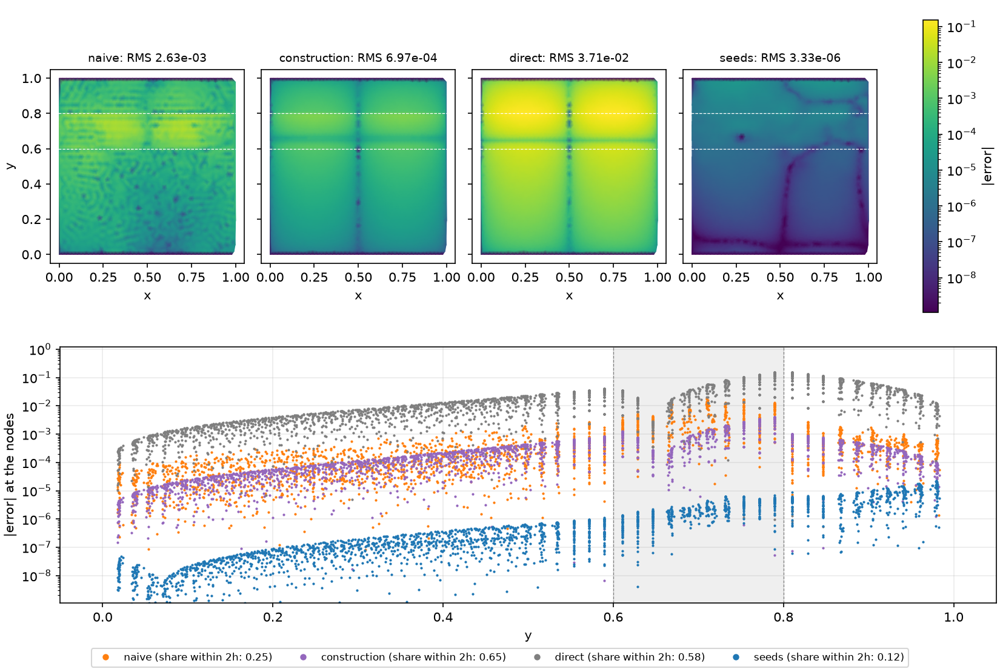

E4.10 adds what §2.5 added to the 1-D study: the snapshot above, the seed
line on §4.2's knee figure, a results file for every documented run, and this
section, which states what §4 has established, with the numbers and the
subsection each traces to (§5.3), ticks the hypotheses (§5.4) and lists the
limitations the manuscript carries (§5.5). §5.2 records the decision #41 owed
E4.12: the diagonal rule stays a ring's switch. §5.6 records the review of
§5's claims by two referees from different vendors (GPT-6 Astra and Fable 5.1,
2026-09-23), the checks run for it, and what it corrected here, in §2.5 and in
§4; the statements below are the corrected ones. Every number below is quoted
from its subsection or from those checks, and the snapshot's are the sweep's
own. The ring keeps its own driver, `scripts/heat2d_ring.py` (§4.8), not the
plan's `--ring` flag on `heat2d_stiff.py`.

### 5.1 The figures, the results files and the documented runs

**The snapshot** (`--mode snapshot`, 10 s, nothing cached; the default
`--mode all` runs it after the stencils). §2.5's figure on scattered nodes:
case 1 at 2500 nodes and δ = 0.0025 (`h = 1/48 = 8.3 δ`, 1-D's `h = 8δ`,
`SNAPSHOT`), the parabolic problem at `t = 0.1`, four operators built as the
sweep builds them. Their RMS errors are the sweep's to every digit printed
(§4.5, a test pins three). Top: `|e|` over the strip on one colour scale;
bottom: `|e|` at every node against `y`, the band shaded.

| operator | RMS | max \|e\| | at (x, y) | share of Σe² within 2h of a curve |
| --- | --- | --- | --- | --- |
| naive `Dx A Dx + Dy A Dy` | 2.63e-3 | 1.82e-2 | (0.708, 0.710) | 0.25 |
| δ = 0 construction | 6.97e-4 | 4.05e-3 | (0.750, 0.790) | 0.65 |
| direct `α ∇² + ∇α · ∇` | 3.71e-2 | 1.52e-1 | (0.250, 0.790) | 0.58 |
| seeds | 3.33e-6 | 2.27e-5 | (0.259, 0.980) | 0.12 |

- *The naive error is the band's, not the edge's.* It is speckled over the
  whole strip at the node spacing and largest in the band's middle (the max at
  `y = 0.71`); a quarter of its energy is within `2h` of a curve, where 15 % of
  the nodes are, so it leans on the edges only 1.6× and three quarters of it is
  elsewhere: the O(1) flux defect of §4.2 at the edge, spread by the product's
  two-radius reach into everything the band's rows couple to. 1-D's snapshot
  put 84 % of the naive energy away from the edge too (§2.5).
- *The construction's error is a smooth shift* with the `sin 2πx` shape of the
  solution (its zero lines at `x = 0, ½`), largest next to the upper curve,
  where the resistance deficit of §4.1's floor enters: 65 % of its energy is
  within `2h`, four times the nodes' share. It is the floor, 0.98 of it at this
  `h/δ` on the parabolic problem (§4.2).
- *The blind direct stencil is the worst line* while the edge is unresolved,
  3.71e-2, fourteen times the naive product: it carries α and ∇α at the anchor
  and meets the edge as an `h^k α^{(k)}` series that does not converge (§4.5).
- *The seeds' error does not see the edge.* 3.33e-6, 790× below the naive
  product and 210× below the construction, with 12 % of its energy within
  `2h` of a curve, below the 15 % of the nodes there; its max sits by the top
  Dirichlet row (`y = 0.98`), in the boundary zone, not at the band.

The grid is chosen as 1-D's was: it is the row of the sweep at which the lines
are ordered and apart (naive 3.8× the construction, the seeds 210× below
that). At 5000 nodes (`h = 6δ`) naive and construction are 1.3× apart, and at
10,000 they cross (§4.2).

**The seed line on the knee** (`--mode naive`, §4.2's figure). The knee
figure now draws the seed operator's RMS error in blue beside the naive and
construction lines, wherever `heat2d_stiff_knee.json` holds it (`cached_line`:
nothing is solved for it): every width to 40,000 nodes and δ = 0 to 160,000.
It is §2.5's knee figure's twin, the four regimes of the study in one panel
per problem.

**The committed figures** (`docs/figures/`), each with the section it
belongs to and the documented run that writes it:

| figure | section | written by |
| --- | --- | --- |
| `heat2d_stiff_knee.png` | §4.2 | `heat2d_stiff.py --mode naive` to 160,000 (with the seeds' cache from `--mode seeds`) |
| `heat2d_stiff_spectra.png`, `heat2d_stiff_dominance.png` | §4.4 | `heat2d_stiff_eigenvalues.py` (default: 1600 and 2500 nodes) |
| `heat2d_stiff_seeds.png` | §4.5 | `heat2d_stiff.py --mode seeds` (case 1) |
| `heat2d_stiff_seeds_a0.02_sine.png` | §4.6 | `--mode seeds --amplitude 0.02`, route (a)'s lines |
| `heat2d_stiff_tangential_a0.02_sine.png` | §4.7 | `--mode seeds --amplitude 0.02` with the tangential lines |
| `heat2d_ring_convergence.png`, `heat2d_ring_conditioning.png`, `heat2d_ring_smooth.png` | §4.8, §4.10 | `heat2d_ring.py`, the documented command |
| `heat2d_stiff_treatments.png`, `heat2d_stiff_treatments_a0.02_sine.png` | §4.9 | `--mode treatments`, both geometries |
| `heat2d_stiff_snapshot.png` | §5.1 | `--mode snapshot` |

Rerun from the caches on 2026-09-23, every figure committed before E4.10 but
the knee (which gained the seed line) is byte-identical to its copy under
`docs/figures/`. Getting there took three fixes to the driver, none of
which moves a number:

- *The δ = 0 columns had overwritten the full sweeps' figures.* The
  documented run `--deltas 0 … --counts … 160000` (H4 to the end, §4.5) wrote
  a one-panel `heat2d_stiff_seeds.png` over the six-panel one, and B's column
  to 160,000 (§4.7) did the same to B's figure. A sweep of δ = 0 alone now
  writes `…_jump.png` (`figure_name`).
- *E4.12's `-edge` lines drew in the main line's style* (`_style` matched
  `seeds-edge` as `seeds`). They are now `STYLE`'s own, and they are left out
  of the seed figures altogether: the rule is a ring's switch (§5.2), so off
  the ring it is a column of the tables, and E4.6's and E4.11's figures stay
  as §4.5 and §4.7 show them.
- *The eigenvalue driver's figures carry the count off its defaults*
  (`heat2d_stiff_spectra_n4900.png`, `heat2d_stiff_dominance_n10000.png`), so
  that §4.4's two larger runs no longer overwrite the default figures.

**The results files** (plan D1; E5.3, #44). `heat2d_stiff.py` and
`heat2d_stiff_eigenvalues.py` now write every run's tables and phase times
through `results_cache.ResultsCache` (schema 1: driver, date, git SHA and
dirty flag, args, timings, tables), under `--outputs` and, with `--data-dir
paper/data`, there too, as `heat1d_stiff.py` (§2.5) and `heat2d_ring.py`
(§4.8) already did. One file per documented run, named by `results_name`: the
mode, `tangential` for a seed sweep with the tangential line, the geometry's
tag off case 1, `seed<k>` off node set 0 and `jump` for δ = 0 alone. The
printed tables use `inf` for the jump's `h/δ` and `nan` for δ = 0's chain
residual (no edge to difference across); strict JSON holds neither. The
residual is None where it is made; the `h/δ` is written as null
(`NOT_APPLICABLE`, found by running every documented command), which is safe
because it is `h` over δ and never a solve's output; and any other non-finite
value stops the write (`results_cache.finite`), which is what the schema asked
of a failed solve. The eigenvalue driver nulls nothing: an empty row group's
DDR, which no documented run has, would stop its write too. The sweeps' files hold the whole `sweep` table (every line's readings
at every (δ, n): RMS, max, probe, rows, seconds and, for `-edge`, the rows
kept plain), from which every ratio §4 prints is computed.

| documented run (`uv run python scripts/…`) | results file | tables | cached |
| --- | --- | --- | --- |
| `heat2d_stiff.py --mode references --deltas 0 0.04 0.01 0.005 0.0025 0.002 0.001 0.0005` | `heat2d_stiff_references.json` | `references` | 0.2 s |
| `heat2d_stiff.py --mode naive --counts 1250 … 160000` | `heat2d_stiff_naive.json` | `knee`, `matched/<problem>`, `spectra` | 0.6 s |
| `heat2d_stiff.py --mode naive --seed 1` (and `2`) `--counts 1250 … 20000 --spectrum-counts` | `heat2d_stiff_naive_seed1.json`, `…_seed2.json` | `knee`, `matched/<problem>` | 0.5 s |
| `heat2d_stiff.py --mode stencils` | `heat2d_stiff_stencils.json` | `stencils` | 17 s |
| `heat2d_stiff.py --mode snapshot` | `heat2d_stiff_snapshot.json` | `snapshot` | 8 s |
| `heat2d_stiff.py --mode seeds --operators naive construction direct direct-reach seeds seeds-plain seeds-edge --counts 1250 … 40000` | `heat2d_stiff_seeds.json` | `sweep`, `ratios/<problem>`, `resolved/<problem>` | 0.5 s |
| `heat2d_stiff.py --mode seeds --deltas 0 --operators naive construction seeds --counts 1250 … 160000` | `heat2d_stiff_seeds_jump.json` | the same | 0.2 s |
| `heat2d_stiff.py --mode references --amplitude 0.02` | `heat2d_stiff_references_a0.02_sine.json` | `references` | 63 s |
| `heat2d_stiff.py --mode seeds --amplitude 0.02 --operators naive construction construction-flat direct direct-reach seeds seeds-plain --counts 1250 … 40000` | `heat2d_stiff_seeds_a0.02_sine.json` | the same and `flat` | 0.4 s |
| the same with `… seeds seeds-plain tangential tangential-plain tangential-edge` (no `construction-flat`) | `heat2d_stiff_seeds_tangential_a0.02_sine.json` | the same | 0.5 s |
| A: `--amplitude 0.02 --inside constant --deltas 0 0.0025 --operators naive construction seeds tangential tangential-plain` | `heat2d_stiff_seeds_tangential_a0.02_constant.json` | the same | 0.3 s |
| B: `--inside sine --deltas 0 0.0025`, the same lines | `heat2d_stiff_seeds_tangential_a0_sine.json` | the same | 0.3 s |
| B's δ = 0 to 160,000: `--inside sine --deltas 0`, the same lines | `heat2d_stiff_seeds_tangential_a0_sine_jump.json` | the same | 0.2 s |
| `heat2d_stiff.py --mode tangential --counts 1250 … 40000` | `heat2d_stiff_tangential.json` | `tangential` (circles, span, spectra, timing) | 8.7 min, not cached |
| `heat2d_stiff.py --mode treatments --counts 1250 … 40000` (and `--amplitude 0.02`) | `heat2d_stiff_treatments.json`, `…_a0.02_sine.json` | `sweep`, `ratios/…`, `crossovers/…`, `h12/<problem>/<norm>` (and `flat`) | 0.5 s |
| `heat2d_stiff_eigenvalues.py` | `heat2d_stiff_eigenvalues.json` | `rows`, `spectra` | 0.5 s |
| `heat2d_stiff_eigenvalues.py --mode rows --n 10000` | `heat2d_stiff_eigenvalues_rows_n10000.json` | `rows` | 0.2 s |
| `heat2d_stiff_eigenvalues.py --mode spectra --spectrum-n 4900 --deltas 0 0.005` | `heat2d_stiff_eigenvalues_spectra_n4900.json` | `spectra` | 0.4 s |
| `heat2d_ring.py`, the documented command (§4.8) | `heat2d_ring_results.json` | `convergence`, `conditioning`, `spectrum`, `smooth`, `fine-gap` | 2.2 s (wall) |

The full commands are in the drivers' docstrings. Their timings column is the
file's own `total`; wall clock adds 0.7 s of interpreter start, and the whole
list reprints in under two minutes, `--mode tangential` aside. The default
`heat2d_stiff.py` (`--mode all`: references, the naive knee at 1250–10,000,
the stencils and the snapshot, 26 s cached, about 2.7 min cold) writes
`heat2d_stiff.json` and a four-count knee figure; it is the quick check, not
one of the documented runs, and after it the knee figure is regenerated by
the documented `--mode naive`. Cold, the runs cost what §4 recorded: 58 min
for the naive knee to 160,000 (§4.2), 28 min for the flat seed sweep (1.4 more
for `direct-reach`) and 25 for its `-edge` line (§4.5, §4.10), 3 min for the
δ = 0 column to 160,000 (§4.5), 34 + 58 + 61 min for case 2's route (a),
tangential and `-edge` lines (§4.6, §4.7, §4.10), 21 min per treatment sweep
(§4.9), 2.7 min, 6.7 min and 2.1 min for the three eigenvalue runs (§4.4), and
some 20 CPU-hours for the ring, run as concurrent processes over its one cache
in about 75 min on 14 cores (§4.8; `heat2d_ring.py`'s docstring), most of them
under other load.

Three caveats, the 1-D ones and one more. The working caches
(`heat2d_stiff_knee.json`, `heat2d_stiff_curved.json`, `heat2d_stiff_rows.json`,
`heat2d_ring.json`) key on labels and versions, not on the operators' code:
bump their versions after any change to an operator, a chain or the march
(§3.8's trap). A results file is never read back by a driver, only by E5.3's
scripts, and carries `dirty: true` when the tree had uncommitted changes, which
`paper_numbers.py` should refuse. And a results file holds the *last* run of
its name: a documented command run with fewer counts overwrites the manuscript's
file with a shorter one (its `args` say so, and `write` warns, naming the
arguments that differ), and rerunning the documented command restores it in
seconds. *E5.3 (#44): `scripts/paper_data.py` lists these runs and reruns them
into `paper/data/` (613 s from the caches on 2026-09-24, 496 of them `--mode
tangential`); its `--verify` refuses a dirty file and a near-miss's (the
command line is schema 2's `argv`), and the 2-D working caches still key on
versions: `paper_data.stale()` lists a file whose driver or package changed
since its commit, for the reader to judge.*

### 5.2 E4.12's rule off the ring: why it stays a ring's switch

E4.12 left one question to this ticket (§4.10, §3.3 of the plan): should the
diagonal rule, which on the ring picks warped or plain Gaussians per row by the
stronger signed diagonal share, be the default on every geometry? Off the ring
it is the ablation `seeds-edge` / `tangential-edge`, and §4.10's table had it
helping on the flat band (0.41–0.97 of the warped line where it fires, one loss
of 1.06) and mixed on case 2, with two unexplained losses of 1.42 and 1.41 at the
first count where it fires. Scratch runs on 2026-09-23 (a script that solves
every seeded row with both Gaussian blocks on one march, assembles the warp,
plain and the rule, and flips the rule's plain rows back one at a time; not
committed, as §4.10's one-offs are not) reproduce the cached ratios to three
digits and explain the losses. Elliptic RMS error over the warped line's, node
sets 0, 1, 2:

| geometry | δ | n | h/δ | rows kept plain | rule | plain on every row | rule, margin 0.05 |
| --- | --- | --- | --- | --- | --- | --- | --- |
| case 2 | 0.01 | 2500 | 2.08 | 92, 72, 83 | 1.42, 1.40, 0.75 | 1.17, 1.34, 1.04 | 0.90, 0.97, 0.80 |
| case 2 | 0.005 | 10,000 | 2.11 | 154, 154, 149 | 1.41, 2.03, 1.39 | 0.84, 0.78, 0.91 | 0.78, 0.87, 0.77 |
| case 2 | 0.01 | 5000 | 1.49 | 235 | 0.82 | 0.88 | 0.93 |
| case 2 | 0.005 | 20,000 | 1.49 | 505 | 0.70 | 0.55 | 0.72 |
| case 1 | 0.04 | 1250 | 0.74 | 231 | 1.06 | 1.18 | 1.06 |
| case 1 | 0.01 | 5000 | 1.49 | 164 | 0.56 | 0.55 | 0.56 |
| case 1 | 0.005 | 20,000 | 1.49 | 349 | 0.43 | 0.40 | 0.42 |

(Only node set 0 is cached; sets 1 and 2 are the scratch's. "Margin 0.05": plain
kept only where its share beats the warp's by more than 0.05.)

- *The selection can do worse than either uniform choice.* At δ = 0.005 on
  10,000 nodes the rule loses on all three node sets while plain Gaussians on
  every row *gain* (0.78–0.91). At δ = 0.01 on 2500 nodes plain on every row
  loses too on two sets (1.17, 1.34, against the rule's 1.42, 1.40), so there
  the loss is mostly plain's own at the first firing count, and the third set
  gains under both (0.75, 1.04). Only node set 0 is in the cache; sets 1 and 2
  are the scratch's.
- *Where the loss sits.* The eight rows per losing grid whose revert to the
  warp lowers the error most (by 2–15 % each) are straddling rows at the upper
  curve's crest, `y ≈ 0.80–0.83` at `x ≈ 0.10–0.42` (the curve is
  `0.8 + 0.02 sin 2πx`, 0.82 at `x = ¼`). On 36 of those 40 rows the two
  diagonal shares are within 0.05 of each other (as close as 6e-5), and on 34
  plain's truncation on the true solution is the larger, by up to 126×. So the
  rule's near-ties pick rows that are often less consistent. Whether the loss
  is those rows' own truncation or the mix of warped and plain rows around them
  (a patchwork) the scratch does not separate: no clustered-against-dispersed
  replacement and no error-response `A⁻¹τ` per variant were run. §4.7 found
  the tangential chain's coarse-set constant on the rows above the upper curve
  too.
- *A tie margin repairs these grids and costs elsewhere.* Plain kept only where
  its share wins by more than 0.05 takes the five losing grids to 0.78–0.97, but
  case 2's gain at δ = 0.01, 5000 nodes goes from 0.82 to 0.93 (to 1.06 at a
  margin of 0.1), and case 1's lone loss (1.06 at δ = 0.04, 1250 nodes) is
  untouched. A constant tuned on seven grids is not a rule to ship before the
  manuscript.
- *Off the ring the rule mostly tracks H7's turn.* Where it helps, plain on every
  row helps as much (case 1: 0.55 against 0.56, 0.40 against 0.43; case 2 at
  20,000: 0.55 against 0.70): it fires from `h ≈ 2δ`, where §4.5 found the warp
  losing by up to 2.6× once the edge is resolved. The failure it was built for,
  the warp squeezing an anchor in a resistivity tail (§4.10), has no twin on the
  flat band or the sine pair.

**Decision (E4.10, Brad on #41, 2026-09-23).** The rule stays a ring's switch.
The manuscript describes it as the ring's safeguard for rows anchored in a
resistive layer, quotes E4.6's and E4.11's warped lines as the flat and curved
seeds, and gives the off-ring ablation one sentence: it helps on the flat band
where it fires and is mixed on case 2, where the row-by-row choice at near-ties
can do worse than either uniform choice. No line §4 quotes moves.

### 5.3 What §4 states

The statements the manuscript's 2-D results (E5.8, #49) draw on, each with its
numbers and the subsection that measured them, as the roundtable of §5.6 left
them. Every error is the RMS over all nodes, Dirichlet rows included (the
smooth ring's excepted, statement 9), `h = 1/round(0.95 √N)`, orders per
halving of `h` from least-squares fits over the counts named (port notes
§2.10), on node set 0 with 100 repulsion steps unless a scatter is quoted.

1. **The references are exact to 1e-11 or better, except the smooth ring's
   (§4.1, §4.6, §4.8).** On case 1 the separable Chebyshev reference in `y`
   agrees with a finer one to 7e-13 … 2e-11 and at δ = 0 with the analytic
   solution to 3.8e-13; on case 2 the sheared Fourier × Chebyshev product grid
   agrees with finer grids in both directions to 1e-11 at every width, solves
   in two seconds, and at δ = 0 puts E2.6's 160,000-node jump-aware run 4.3e-9
   RMS away (E2.6's Richardson estimate: about 3e-9). The ring at δ = 0 is read
   against E2.9's 160,000-node runs, whose own error is about 1e-7; at δ > 0 it
   has only self-convergence against a 160,000-node seed run, on the far field
   (statement 9). The smooth band's distance from the jump is first order in δ,
   `sup |v_δ − v₀| / δ` rising to about 1.6.
2. **The naive knee (§4.2; H10, corrected).** `Dx A Dx + Dy A Dy` with α at the
   nodes follows the jump's first-order line (fit 1.23 to 160,000 nodes) only
   while `h ≳ 6δ` (0.86–0.94 of the jump's error on the same nodes, elliptic;
   0.78–0.97 parabolic); its knee spans `4δ ≳ h ≳ 0.75δ`, stalls at `h ≈ δ`
   (0.081–0.084 of the jump for all three widths) and drops to 0.006–0.007 at
   `0.53δ` (δ = 0.01, 0.005; 0.0026 for δ = 0.04 at `0.52δ`); below it the order
   is the 42 / 5 stencils' 5, not 4 (δ = 0.04, resolved at every count, fits
   5.31). The knee is 34–38× deep in the jump's units, shallower than 1-D's
   55–250×. The flux on the first rows off the edge is a function of `h/δ`
   alone to 1.7×: off by 0.31–0.86 of itself while `h ≥ 4δ` at every count
   (on the jump it never converges, 0.34–0.37 from 10,000 to 160,000 nodes
   while the RMS falls 20×), 3.5–5 % at `h = δ`, 1 % at `0.75δ`. The parabolic
   table repeats the elliptic one (0.67–1.09×) from 2500 nodes; the 1250-node
   parabolic naive row carries the coarse set's growing mode (+14.8 to +25.1).
3. **The δ = 0 construction on its floor (§4.2; H10).** E2.3's warped rows
   reading the pieces as if δ were 0 sit on the O(δ) floor (the two references'
   difference at the nodes, 0.12–0.25 δ in the RMS) to three digits while
   `h ≥ 2.1δ`, dip 5–10 % below it at `h ≈ δ`, then grow to 3–5× it (δ = 0.01:
   5.0× at 160,000; δ = 0.04's error grows from 4.7e-3 to 2.2e-2 with n, a
   negative fit). It beats the naive product only while `h ≳ 3δ`, by at most 6×,
   so using it means knowing δ and switching it off near `h ≈ 3δ`.
4. **The seeds are the jump's rows at δ = 0 and need no switch (§4.3–§4.5;
   H1–H4, H8).** At δ = 0 the seed span equals E2.3's translated basis to
   4.9e-14 and the rows to 7.6e-12 on case 1's 576 crossing stencils (1.9e-10
   on a band one spacing thick, three-region stencils included), and the seed
   line is port notes §2.4–2.5's to every count run, 1.598e-5 → 3.58e-10 at
   1250 → 160,000 nodes (fit 4.54 over eight counts, 4.77 over the six the port
   quotes). At δ > 0 they are one fourth-order line: elliptic fits 4.23, 4.31,
   4.23, 4.48 at δ = 0.04 … 0.0025 over 1250–40,000 nodes (parabolic 4.22, 4.28,
   4.18, 4.44), and 3.8–4.3 over the windows from 5000 or from 10,000 nodes (4.6–4.8
   at the jump; *3.8–4.8 before E5.3's number check, which folded δ = 0 in*); the
   five widths lie within 1.2–2.4× of one another at every count (1.16× at 1250,
   2.38× at 20,000, 1.67× at 40,000; parabolic up to 2.53×), the jump the lowest
   at the finest counts. That is no deterioration as δ → 0 on these grids, not a
   proven δ-uniform constant: one node set per count, and each line holds δ fixed
   while h falls, so none holds `h/δ` fixed. The rule is *seed every row whose 30
   nodes see an edge within 20 δ*: no δ threshold and no switch-off (the reach
   itself was never varied, §5.5). At 40,000 nodes the seeds are four orders
   below the naive product at δ = 0.0025 (7.99e-9 against 8.36e-5) and five below
   the construction (6.18e-4); where the grid resolves the edge they are
   0.10–0.22 of the direct operator and 0.086–0.22 of the same-stencil control.
   The 42 / 5 naive product catches them at δ = 0.04 on 20,000–40,000 nodes
   (0.98, 1.07; 1.15 parabolic) and, converging at 5.2 against their 4.2, will
   pass them on finer sets: that is the stencils' degree, not the seeds, since
   the naive product on the seeds' own 30 / 4 groups is 1.30e-6, 8.40e-6 and
   1.76e-7 at 10,000–40,000 nodes and δ = 0.04, 8–200× the seeds (§5.6). So
   H8's "≤ 1.2×" holds against the naive product through 40,000 nodes and not
   asymptotically, and against the direct operator with a 5–10× margin the other
   way. The seed block conditions like the polynomial block, within 0.46–2.5× of
   it column-scaled from δ = 1e-5 h to 8h (H3).
5. **The 2-D elliptic problem ranks the methods; the 1-D one does only off
   constant pieces (§2.5, §4.5).** On the MATLAB medium's constant pieces the 1-D
   equilibrium is in the seeds' kernel, and the seeds and T1-FV are exact at
   every δ and h (§2.5 statement 4); on eq. 75 only the seeded rows are, and the
   seed operator's equilibrium error is 9.7e-5 → 1.2e-8 at δ = 0 over 101–1601
   nodes, where T1-FV's is 3e-14 → 1.4e-11. In 2-D `sin 2πx v(y)` is outside the
   normal seed span, and the seeds' elliptic error is 1.6e-5 → 5.3e-9 and fourth
   order. The parabolic error at `dt = h` is 1.04–1.17× the elliptic one at
   40,000 nodes, but the parabolic problem is a weak second test: 3–19 BD4 steps
   of one separable mode from its analytic history, which checks the operator's
   spectrum under BD4 (it caught the growing mode, statement 2) more than a
   transient through the edge (§5.5). The flux reading that stalls for the naive
   product falls 2000× for the seeds from 1250 to 40,000 nodes at δ = 0 and 670×
   at δ = 0.0025.
6. **Solvability and spectra stay bounded as δ → 0 (§4.4; H5 on case 1, H6).**
   The seed rows' least diagonal dominance falls from the direct rows' end toward
   the jump-aware rows' as δ → 0 (0.409 → 0.239 at 2500 nodes, 0.404 → 0.211 at
   10,000) and never below the jump's; the condition estimate rises from 7.1e3 to
   1.7e4 (1.5e4 at δ = 0) and the unpreconditioned gmres count runs 134, 155, 147, 160, 161 from
   δ = 8h to 0 (not monotone), all between the two ends and below the
   construction's (161–208). SuperLU takes 0.04–0.06 s at every width at 2500
   nodes, with residuals of 1e-14 or below, and every `gmres` and `bicgstab`
   solve converged, preconditioned or not. That is case 1: the ring's iterative
   solves at 20,000 nodes, which H5 also asked for, were not run (the ring has
   its DDR and spectra at 5000 nodes, §4.8). The seed operator's spectrum is the
   warped aware operator's at every δ: no eigenvalue in the right half-plane,
   `max Re` −7.27 (the physical mode) moving to −7.73 as the edge widens,
   `h² max |Im|` ≤ 0.23 at 1600 nodes, and at 4900 port notes §2.5's warped line
   to the digit (−7.27, `h² min Re` −13.19, 0.385, BD4's largest root 0.897 at
   `dt = h`). Plain Gaussians bring back the crossing rows' complex loop at δ = 0
   (`h² max |Im|` 1.49 against 0.385 at 4900 nodes): a wider spectrum, not an
   instability, since no eigenvalue crosses the axis and BD4's largest root stays
   0.826 at 1600 nodes. Case 2 has no eigenvalue right of the axis either
   (§4.7).
7. **The warp (§4.5–§4.7; H7, corrected).** At δ = 0 the warp's factor on the
   seeds is E2.4's by H2, since the seed rows are E2.3's with either Gaussian
   block (2.3× at 1250 nodes to 6.9× at 40,000 on case 1; 5.5–11.7× on case 2
   from 5000 nodes): a regression check, not a measurement. At δ > 0 it wins
   while the edge is unresolved (1.7–7.9× at δ = 0.0025) and loses by up to 2.6×
   once it is resolved, turning at `h ≈ 2δ` on case 1 (`h ≈ δ/2` at δ = 0.04)
   and once `h ≲ 2δ` for the tangential chain on case 2 (0.55–1.1 there). Where
   it loses the errors are 1e-7 to 1e-6 on the intermediate grids (δ = 0.01 at
   5000 nodes: 7.95e-7 warped, 4.39e-7 plain), not negligible. The seeds stay
   warped for the unresolved regime the study is about, and pay up to 2.6× once
   the grid resolves the edge.
8. **A curved or tangentially varying edge needs the tangential chain
   (§4.6–§4.7; H9 failed, H13–H17 hold).** Route (a), the flat seeds along the
   foot point's normal, is not consistent at a jump or while a smooth edge is
   unresolved: at δ = 0 on case 2 its crossing rows' truncation stalls (fit
   0.38) and its line is 24–6742× the flat seeds (17–6742× over every width and
   count, §4.6), from two terms each enough
   alone (the curvature puts the kink on the tangent line: at δ = 0 on constant
   pieces route (a) *is* EABE Fig. 10's flat-interface construction; the
   tangential variation of α imposes the foot point's flux ratio at every node:
   fit 1.00 on flat lines). Once the grid resolves a fixed δ both terms are
   smooth and the order returns (δ = 0.01: 4.87 and 3.66 over the last two
   counts), but not the constant (130× the flat seeds). The tangential chain, in
   the foot curve's own coordinates with α's and the metric's variation along the
   curve carried by 75 coupled levels, is fourth order within 1.4–3.9× of the
   flat seeds from 5000 nodes at every δ on case 2 in the RMS (1.9–4.8× in the
   max norm, where at δ = 0 its error localizes above the upper curve), and
   within 1.1–4.4× on the split geometries A and B; at 40,000 nodes on case 2 it
   is 7.18e-9, 3.01e-8, 3.00e-8, 2.69e-8 at δ = 0, 0.01, 0.005, 0.0025, below
   E2.3's curved construction at δ = 0 from 5000 nodes (0.14–0.45×), with its
   crossing rows converging at 2.7–3.6 on every geometry and width. What does
   not: the coarsest two counts (2.8–8.0× the flat seeds), the probe's slowdown
   through `h ≈ 2–3δ` at δ = 0.0025, and the cost (a row 2.5–3.8× route (a)'s,
   4.2–7.3× case 1's). On concentric circles the chain's rows converge at 3.45,
   4.6–7.3× below E2.3's (H14).
9. **The ring (§4.8, §4.10; H11).** On EABE eq. 40's ring the seeds are exact on
   the matched radial profile to rounding at every s (1.3–2.1e-15 from 10³ to
   10¹¹, where E2.3's rows lose digits like s, 1.36e-7 at 10¹¹), and their
   per-stencil blocks and saddle-point systems condition independently of s
   (mean 2-norm condition numbers 7.1–7.2e3 / 5.0–5.1e3 and 1.0–1.1e6 from 10⁵ to
   10¹¹, *the ranges E5.3's number check put in for single values*;
   E2.3's 4.6e10 and 2.7e13 at 10¹¹; the global matrix's conditioning was not
   measured), because they carry the ring's resistance, which eq. 40 holds fixed
   (`s w = 1`). This needed four things §3.2–§3.10 did not: the width as the
   band's `gap`, the ring's own series, 20 flux seeds on the 30 nodes, and
   `φ₀₁`'s level 0 as the warp. With them Fig. 19's twin is fourth order at
   every s, 0.52–0.97× E2.3 from 5000 to 40,000 nodes (fits over 1250–40,000:
   4.43–4.71 against E2.3's 4.08–4.13); the 80,000-node point (1.4–1.6e-7 at
   s ≥ 10⁸) sits at the reference's own floor and is not quoted as a ratio.
   Without the flux seeds the line stalls (8.2 and 11.8× E2.3 at 40,000 and
   80,000 nodes at s = 10³, 2.2 and 3.2× at 10¹¹). Fig. 19's breakdown near
   s = 10¹¹ is not reproduced by either construction. Through a *smooth* ring
   whose width and edges are both below h (δ = 0.0025, 0.001, 0.00025) the
   seeds converge at fourth order on the far field, the 74–96 % of the nodes
   away from the ring (fits 4.0–4.8 over 2500–20,000 nodes at every (s, δ), and
   4.4–4.8 to 40,000 on the five lines that do not floor), where E2.3 reads the
   edges as jumps and floors at 1–7e-4, and the naive and direct stencils do not
   see the ring until the grid samples it (at δ = 0.00025 both sit on the
   no-ring floor, about 5e-3). The error near the ring is not scored at δ > 0,
   and no ring line has a max-norm error. The 40,000-node values at δ ≤ 0.001
   (7.1e-7 to 1.0e-6) are the size of the differences between fine-run rebuilds
   at those widths (1.3–3.9e-6, §4.8), and the steep last rates at s = 10³ (6.7
   and 6.9) may be cancellation against a fine run's own error; only one (s, δ)
   was read against a second fine run. Rows anchored in the layer's resistivity
   tail need E4.12's rule (warped or plain Gaussians by the stronger diagonal):
   the warp on every row gave two outliers (6.2e-5 at δ = 0.001, 20,000 nodes),
   and the rule removes both and is within 0.91–1.25× of the better uniform
   choice at every (s, δ, n) where it fires, through 40,000 nodes. At s = 10¹¹,
   δ = 0.001 the rule's own 160,000-node solution is the discrepant one: 3.55e-6
   from a plain-built run toward which every coarse line converges (the seeds
   8.0e-7 at 40,000, fit 4.77), so the rule's convergence at that (s, δ) past
   40,000 nodes is unresolved.
10. **The six coefficient treatments tested do not help (§4.9; H12,
    corrected).** Harmonic and arithmetic means of α over discs of radius h/2
    and h, and the edge widened to `max(δ, m h)` for m = 1, 2: in the RMS norm
    none beats plain sampling by more than 1.75× anywhere in either sweep, case
    1's parabolic 1250-node set aside (its growing mode, which every treatment
    carries, §4.9; *the caveat added by E5.3's number check*). In the
    max norm the coarsest sets differ, up to 3.1× on case 1 at 1250 nodes (the
    widened edge) and 2.4× on case 2 at 2500 (the radius-h harmonic mean, where
    the sampled line is itself an outlier); from 5000 nodes on no treatment beats
    sampling by more than 1.6× in the RMS norm (1.60: case 1's half-spacing
    arithmetic mean at δ = 0.0025 and 10,000 nodes) or 1.55× in the max norm. The
    radius-h harmonic mean is 1.6–3.4× and the arithmetic one 1.3–3.0× *worse*
    than sampling at the jump from 5000 nodes (*E5.3's number check: this had read
    1.55× "in either norm", and 1.6–3.4× for both means*); the disc means cap the
    naive product at second order once the edge is resolved (584–3100× behind it
    at 40,000 nodes, the `r²/8` term measured); the half-spacing disc helps only
    while `h ≳ 2–3δ` (crossovers at `h/δ` = 1.8–3.5). No conservative
    scattered-node scheme (control volumes with face conductances, 1-D's T1-FV
    in 2-D) was built, so the 2-D comparators are the naive product and the
    δ = 0 construction, and "the strongest low-order comparator" is a statement
    about these six. The seeds' lead over the best of them grows from 2.3 to 4.7
    orders over 1250–40,000 nodes. At the jump the half-spacing disc is sampling
    by construction on this node layout (E2.1's innermost rows sit exactly h/2
    off the curve), so "worse than sampling" there is a statement about the
    radius-h means and T0, not about averaging α as such.
11. **The snapshot (§5.1).** At `h = 8.3δ` on 2500 nodes the four regimes are in
    one picture: naive 2.63e-3 with three quarters of its error away from the
    edge, the construction on its floor at 6.97e-4, the direct stencil at
    3.71e-2, the seeds at 3.33e-6 with their error where the nodes are, not
    where the edge is.

### 5.4 The hypotheses of §3.7 and §3.10, as they stand

| | Section | Status |
| --- | --- | --- |
| H1 the march is the chain | §4.3 | holds: monomials to 1.4e-15, the shift identity to 7e-16, the residual by twelfth-order differences 4e-11 to 9e-11 (the differences' floor), the 2-D march = the 1-D one to 7e-14, `ψ₀₁ ≡ α_e` to the bit; a stencil 2–7 ms |
| H2 the jump limit is E2.3 | §4.3, §4.4 | holds at δ = 0 (spans 4.9e-14, weights 1.6e-12, rows 7.6e-12, the operator 5.3e-13); at δ > 0 first order in δ/h to 1e-5 h (0.476 δ/h in span on one stencil; rows 0.38 δ/h outside the band, 0.77 inside) |
| H3 seed blocks condition like polynomial blocks | §4.3 | holds on case 1: 0.46–2.5× the monomial block's column-scaled, within 1.3× of E2.3's raw at δ = 0 |
| H4 seeds = aware at δ = 0, fourth order with one constant at δ > 0 | §4.5 | holds on these grids: port notes' line to 160,000 nodes; fits 4.2–4.5 (3.8–4.3 over the later windows, 4.6–4.8 at δ = 0), the widths within 2.4× of one another at every count; a δ-uniform constant is not proven (one node set, δ fixed along each line) |
| H5 solvability does not degrade as δ → 0 | §4.4 | holds on case 1: the DDR between the ends, no breakdown in any solve, SuperLU blind to δ, the iteration counts bounded but not monotone; the ring's 20,000-node iterative sweep was not run |
| H6 spectra | §4.4, §4.7 | holds on cases 1 and 2: no positive eigenvalue, port notes §2.5's line at 4900 nodes; plain rows widen the spectrum at δ = 0 (the loop) without crossing the axis |
| H7 the warp is worth on seeds what it is on polynomials | §4.4, §4.5 | at δ = 0 an identity through H2 (2.3–6.9×); corrected at δ > 0: wins while unresolved, loses ≤ 2.6× once resolved (at errors of 1e-7 to 1e-6), turning at `h ≈ 2δ` |
| H8 the rule needs no δ; resolved penalty ≤ 1.2× direct | §4.5, §5.6 | holds: no threshold, and 5–10× better than the direct operator, not ≤ 1.2× worse; the ≤ 1.2× is against the 42 / 5 naive product (≤ 1.15× through 40,000 nodes; its higher order passes the seeds further on), the stencils' degree, as the 30 / 4 naive control measures |
| H9 route (a) reproduces the flat numbers | §4.6 | fails at a jump and while the edge is unresolved (curvature and tangential α, each alone); answered by the tangential chain (H13–H17) |
| H10 the 2-D knee | §4.2 | corrected: jump-like only while `h ≳ 6δ`, knee over `4δ ≳ h ≳ 0.75δ`, order 5 below; the construction's floor holds; the flux reading holds with the reference subtracted |
| H11 the ring | §4.8, §4.10 | holds as answered: exact on the matched profile at every s, per-stencil conditioning flat in s, Fig. 19's twin fourth order at every s to 40,000 nodes; needed the gap, the ring's series, the flux seeds and level 0's warp; the smooth ring fourth order on the far field with E4.12's rule, one fine-run cross-check, at which the rule's own 160,000-node solution is the discrepant one |
| H12 the comparators | §4.9 | corrected: the disc means cap at second order and T0 is the worst, but no treatment beats sampling by more than 1.75× in the RMS norm (in the max norm up to 3.1× on the coarsest sets, 1.55× from 5000 nodes); the strongest low-order comparator tested is the naive product itself; no conservative scheme was built |
| H13 the chain is the curvilinear chain | §4.7 | holds: the flat limit to 1e-12, the residual 1e-10 on the line and growing like the fifth power of \|ξ\| off it |
| H14 concentric circles are the osculating rung | §4.7 | holds: rows converge at 3.45, 4.6–7.3× below E2.3's |
| H15 the jump limit on a curved or tangentially varying edge | §4.7 | holds: E2.3's rate on the probe, below E2.3-curved from 5000 nodes, spans first order |
| H16 H9 again | §4.7 | holds from 5000 nodes (1.4–3.9× the flat seeds on case 2 in the RMS, 1.9–4.8× in the max norm; A and B 1.1–4.4×); the coarsest two counts 2.8–8.0× |
| H17 cost | §4.7 | holds, barely: a row 2.5–3.8× route (a)'s, the case-2 sweep 58 min |

### 5.5 Limitations to carry into the manuscript

- *The norms.* Every 2-D error is the RMS over all nodes, Dirichlet rows
  included; the 1-D study's is `‖e‖₂/‖u‖₂`. No table mixes them, and every
  caption says which (§3.8). The smooth ring's errors are the far field's only
  (74–96 % of the nodes), and no ring line has a max-norm error: the ring
  driver's `max` is `max |u|`, a sanity reading (§4.8, `heat2d_ring.py`).
- *One node set per count, with fixed rows at the edges.* The sweeps are node
  set 0; sets 1 and 2 spread the naive product by up to 2× per count (§4.2) and
  moved §5.2's rule ratios from 0.75 to 2.03. Orders are fits, never a single
  pair of counts. Every set keeps E2.1's prescribed rows beside each curve
  (0.5h, 1.37h and 2.23h off it) and scatters the rest, and changing the seed
  does not move those rows, so robustness to arbitrary node placement near an
  edge is untested.
- *Tuned and fixed choices.* The reach of 20 δ was never varied (no
  `--seed-reach` run); every smooth edge is one tanh blend (the ring's the
  resistance composition), no other profile; the contrast is 5 : 1 on cases 1
  and 2 (9 : 1 in 1-D), and the ring's contrast is large only at fixed `s w`,
  so E4.12's tail-row instability, seen at `α_e/α_piece` = 0.2–0.43, was looked
  for off the ring at 5 : 1 alone; the seeded rows are 30 / 4 in a 42 / 5 bulk,
  whose higher degree passes the seeds on a resolved edge (statement 4).
- *The parabolic test is short.* 3–19 BD4 steps (`t = 0.1`, `dt = h`) of one
  separable mode from its analytic history: it tests the operator's spectrum
  under BD4 and the time error's smallness, not a transient through the edge,
  as 1-D's ramp to `t = 2` did. The 1-D ramp line at `dt = h` is itself part
  BD4 error: about half of it at 100 nodes and a quarter from 200, the spatial
  line alone fourth order (§5.6).
- *What the seeds need as input.* The march samples α along each stencil's
  normal line at arbitrary points, so it needs a continuous description of the
  medium; the tangential chain also needs the curve's foot points and
  curvature, and the ring its `gap`. The naive product needs α at the nodes
  only.
- *The coarse sets and the geometry the chain refuses.* The 1250-node naive
  product (and every treatment, which is the naive product on another α) has a
  growing mode that BD4 at `dt = h` amplifies, so its parabolic numbers start at
  2500 (§4.2, §4.9); the tangential chain's constant is 2.8–8.0× the flat
  seeds' on the two coarsest counts (§4.7); `FOOT_CURVATURE` refuses the
  tightest curves' coarsest sets (the 0.25 circle below 2500 nodes, §4.7; some
  ring rows at 1250, §3.11); and at δ = 0 a stencil that crosses both curves
  where the other is not a coordinate line of the foot curve's frame is refused
  (§4.7), so two close, non-concentric curved interfaces are outside what was
  run.
- *The ring's reference at δ > 0 is self-convergence* against a 160,000-node
  seed run read on the far field (§4.8). At one (s, δ) a plain-built second
  fine run was made, and there the rule's own fine solution is 3.55e-6 away
  from it (§4.10); at the other five the 40,000-node errors are the size of the
  fine-run rebuild differences, and no second fine run was made.
- *E4.12's rule is a proxy.* The diagonal share stands in for stability: it
  misjudges near-ties off the ring (§5.2) and 483 tail rows of one 160,000-node
  fine run (§4.10). It is on for a ring only.
- *The march floor.* 1-D's (§2.3, a 1e-12 row residual at `δ ≲ h/40`) was not
  seen in 2-D, but the 2-D tests could not have seen it: §4.3's ladder measures
  distances to the jump's rows (5e-6 at 1e-5 h) and its residual by
  differences floors at 4e-11 (§4.3), and the ring's residuals are the march
  tolerance's (§4.8).
- *Cost.* A flat seeded row costs 1.3–4.4 ms (§4.5), a tangential one 15–25 ms
  (§4.7, quiet), a ring row with the flux seeds up to 233 ms at δ > 0 under load
  (§4.8); a 40,000-node operator at δ = 0.04, every row seeded, is 167 s of
  marches against 2.6 s for the naive product. The seeded share settles at a
  fixed fraction of N at fixed δ > 0 (the strip within 20 δ of a curve), so the
  operator is O(N) marches.
- *What is not covered*: corners and triple junctions (E2.10, a separate repo),
  three dimensions, edges that meet a Dirichlet boundary (every edge here is
  x-periodic), and time-dependent media.

### 5.6 The roundtable: what two outside referees changed

Before E5 drafts from this section, its pivotal claims (C1–C11: the seeds'
order and constant, no threshold, the knee, the comparators, curved edges, the
ring, solvability, the warp, §5.2's decision, the elliptic problems, and the
limitations) went to two referees from different vendors on 2026-09-23, beside
the /spar review of the code: **GPT-6 Astra** (OpenAI, through the API, a 256 KB
dossier of §5, §2.5, §3.7, §3.10's hypotheses and §4, no filesystem; verdict
HOLD, 13 findings) and **Fable 5.1** (Anthropic, with the repository and the
results files, running its own probes; verdict REVISE, 12 findings). Brad took
the rewording and the two code fixes and left the new runs they proposed as the
limitations above. Every finding was checked against the results files before
it was taken; the checks, all in scratch and not committed as drivers:

- *The 1-D time error (Astra's first HIGH finding).* The MATLAB ramp's seed
  line at `dt = h, h/2, h/4, h/8` on 100–800 nodes. The spatial error alone
  (`dt → h/8`) is 1.47e-8, 1.05e-9, 7.40e-11, 4.5e-12 at δ = 0 (rates 3.8, 3.8,
  4.0), δ = 0.0025 on it to 0.3 % and δ = 0.01 to 1.8 %; at `dt = h` the time
  error is about half the total at 100 nodes and a quarter from 200. So the 1-D
  seeds are fourth order in space with one line for every δ, as §2.5 said; §2.5's
  sentence calling the snapshot's 2.95e-8 "the BD4 time error" was wrong and is
  corrected there.
- *The 30 / 4 naive control (Fable, `naive30.py`).* The naive product on the
  seeds' own stencil groups (30 / 4 wherever the rule seeds), case 1, node set
  0, equilibrium: 1.30e-6, 8.40e-6, 1.76e-7 at 10,000, 20,000, 40,000 nodes at
  δ = 0.04, and 1.62e-5, 2.40e-5 at 20,000, 40,000 at δ = 0.01, against the
  seeds' 1.67e-7, 4.19e-8, 8.78e-9 and 3.82e-8, 8.42e-9 (the 42 / 5 product
  rebuilt beside it matched the cache to four digits). At equal degree the seeds
  win by 8–2850×, so H8's catch is the stencils' degree (statement 4).
- *Refits from the results files.* The flat seeds' spread across widths at every
  count and their fits over the later windows (statement 4); Fig. 19's twin
  without its 80,000-node point (fits 4.43–4.71, seeds over E2.3 0.52–0.97 from
  5000 to 40,000); the smooth ring over 2500–20,000 (fits 4.0–4.8) and its
  far-read shares (0.74–0.96); the treatments in the max norm (statement 10);
  eq. 75's 1-D equilibrium (statement 5).

What changed, besides §5.2–§5.5 as they now read: in §2.5, statement 2 carries
the time-space split and δ = 0.04's 2e-11 floor, statement 4 is scoped to the
constant-piece medium, and the snapshot bullet is corrected; in §4.4 and §4.5,
"no δ/h degrades anything", "no crossover to manage", the widths' spread and
the warp's "both rows are already at 1e-8" carry corrections in place; in §4.8,
§4.9 and §4.10, the per-stencil conditioning, the conservative scheme that was
not built, and the rule's discrepant fine solution. In the code, following the
/spar review: δ = 0's chain residual is None where it is made and
`chain_residual` takes its max over the differences' valid interior, where
`nanmax` and `max(0, nan)` had dropped any NaN (the residuals are unchanged to
the bit); only the jump's `h/δ` stays a placeholder in `heat2d_stiff.py` and
none in the eigenvalue driver, so any other non-finite value stops a results
file; and `ResultsCache.write` warns when it overwrites a file from a run with
other arguments (where it writes, `--outputs` and `--data-dir`, aside). What the
referees proposed and Brad left for later, each now a limitation: second fine
runs at the other five (s, δ), the rule at 80,000 and 320,000 nodes at
s = 10¹¹, δ = 0.001, the δ = 0.04 seed column to 160,000, node sets 1 and 2 at
20,000, reach and contrast sweeps, a shifted-row layout, the ring's iterative
solves, and a ring max norm.

### 5.7 What this changes downstream

E4 (#6) is complete with this section: §4 is the canonical 2-D account, and
every 2-D number the manuscript will quote is in it with a subsection to trace
to, the statements above point at those subsections, and each subsection's
tables are a results file of §5.1. For E5:

- *E5.3 (#44)* copies the results files of §5.1's table into `paper/data/`
  with `--data-dir paper/data` (each documented command reruns in seconds but
  for the three uncached ones), and asserts against them; the working caches
  are not the manuscript's data. `use_print_style()` is E5.3's, for the
  manuscript's copies of these figures. *Done: `paper/data/README.md`,
  `paper/figures/README.md`; the snapshot's field and the spectra's
  eigenvalues at the figure's δ are now in their results files, so every
  manuscript figure is drawn from `paper/data/` alone.*
- *E5.7 (#48)*, the 2-D construction: §3.2–§3.4 (the straight feature), §3.10
  (the tangential chain), §3.11 (the ring's gap, series, flux seeds and level-0
  warp), §4.10 and §5.2 (the rule, and why it is the ring's).
- *E5.8 (#49)*, the 2-D results, in the plan's order: test problems and
  references (§4.1, §4.6, §4.8; statement 1), the naive baseline (§4.2; 2–3),
  solvability and spectra (§4.4; 6), the flat sweep and the rule (§4.5; 4, 5,
  7), the curved feature (§4.6–§4.7; 8), the ring and the s-sweep (§4.8, §4.10;
  9), the treatments (§4.9; 10), the snapshot (§5.1; 11).
- *E5.9 (#50)*: §5.5's limitations, and §5.6's list of what the referees
  proposed and was left for later.
- *E5.2 (#43)*: the scattered-node form of the conductance rule and T3 (§4.9),
  and the contact-resistance literature for the ring's `s w = 1` (§4.8).
  *Done: `LITERATURE.md` §1a K9–K10 and §1d; the flux seeds meet Lombard &
  Piraux's order loss across imperfect contacts for elastic waves (SISC
  2006), which the manuscript cites.*

Tests: `tests/test_results_cache.py` (`finite` nulling the named placeholders,
refusing any other non-finite value and naming its key; `write` warning when it
overwrites another run's file, and not for a run that differs only in where it
writes); `tests/test_heat2d_stiff.py` (the results file and `--data-dir` on the
reference table; the jump's `h/δ` and δ = 0's residual as null; `results_name`
and `figure_name` for every documented run; the δ = 0 column writing `…_jump`
and leaving the full figure alone; `cached_line` reading only the cache; the
snapshot's errors equal to the sweep's and ordered, its shares and its files; a
NaN in the medium reaching `chain_residual`'s result);
`tests/test_heat2d_stiff_eigenvalues.py` (the results files and figure names by
mode and count).
